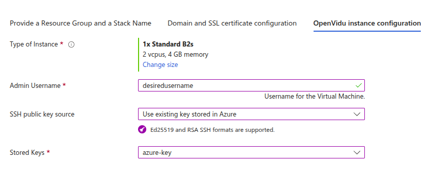

# OpenVidu Single Node COMMUNITY installation: Azure

This section contains the instructions to deploy a production-ready OpenVidu Single Node deployment in Azure. Deployed services are the same as the [On Premises Single Node installation](../on-premises/install.md) but they will be resources in Azure and you can automate the process with the Template Spec of ARM.

To import the template into Azure you just need to click the button below (you will be redirected to Azure).

{:target=_blank}

=== "Architecture overview"

    This is how the architecture of the deployment looks like:

    <figure markdown>
    { .svg-img .dark-img }
    <figcaption>OpenVidu Single Node Azure Architecture</figcaption>
    </figure>

## Template Parameters

To deploy the template you need to fill the following parameters.

--8<-- "shared/self-hosting/azure-resource-group-stack-name.md"

--8<-- "shared/self-hosting/azure-ssl-domain.md"

--8<-- "shared/self-hosting/azure-meet.md"

### Azure Instance Configuration

Specify properties for the Azure instance that will host Openvidu.

=== "Azure Instance configuration"

    Parameters in this section look like this:

    <figure markdown>
    { .svg-img .dark-img }
    </figure>

    Simply select the type of instance you want to deploy at **Type of Instance**. Fill in the parameter **Admin Username** that will be set as admin username in the instance. Select the SSH key you've created previously in **SSH public key source** (or you can create a new one in the drop down) to allow you to SSH into the instance.

--8<-- "shared/self-hosting/azure-storageaccount.md"

--8<-- "shared/self-hosting/azure-additional-flags.md"

--8<-- "shared/self-hosting/azure-turn-domain.md"

## Deploying the stack

Whenever you are satisfied with your Template paremeters, just click on _"Next"_ to trigger the validation process. If correct, click on _"Create"_ to start the deployment process (which will take about 5 to 10 minutes).

!!! warning

    In case of failure, it might be that some role failed to create. In this case redeploy in a new resource group and change the **Stack Name**. To remove a role in a resource group visit [Remove Azure role assignments :fontawesome-solid-external-link:{.external-link-icon}](https://learn.microsoft.com/en-us/azure/role-based-access-control/role-assignments-remove){:target="_blank"}.

When everything is ready, you can check the output secrets on the Key Vault or by connecting through SSH to the instance:

=== "Check deployment outputs in Azure Key Vault"

    1. Go to the Key Vault created called **yourstackname-keyvault** in the Resource Group that you deployed. You can access it from the [Azure Portal Dashboard :fontawesome-solid-external-link:{.external-link-icon}](https://portal.azure.com/#home){:target="_blank"}.

    2. Once you are in the Key Vault on the left panel click on _"Objects"_ 🡒 _"Secrets"_.

        <figure markdown>
        { .svg-img .dark-img }
        </figure>

    3. Here click on the secret of your choice or whatever you need to check and click again in the current version of that secret

        <figure markdown>
        { .svg-img .dark-img }
        </figure>

    4. Now you will see a lot of properties but the one you are searching for is located at the bottom and it will be revealed by clicking in _"Show Secret Value"_.

        <figure markdown>
        { .svg-img .dark-img }
        </figure>

=== "Check deployment outputs in the instance"

    SSH to the instance and navigate to the config folder `/opt/openvidu/config`. Files with the deployment outputs are:

    - `openvidu.env`
    - `meet.env`

## Configure your application to use the deployment 

You need your Azure deployment outputs to configure your OpenVidu application. If you have permissions to access the Key Vault you will be able to check there all the outputs ([Check deployment outputs in Azure Key Vault](#check-deployment-outputs-in-azure-key-vault)). If you don't have permissions to access the Key Vault you can still check the outputs directly in the instance through SSH ([Check deployment outputs in the instance](#check-deployment-outputs-in-the-instance)).

Your authentication credentials and URL to point your applications would be:

--8<-- "shared/self-hosting/azure-credentials-general.md"

## Troubleshooting initial Azure stack creation

--8<-- "shared/self-hosting/azure-troubleshooting.md"

3. If everything seems fine, check the [status](../on-premises/admin.md#checking-the-status-of-services) and the [logs](../on-premises/admin.md#checking-logs) of the installed OpenVidu services.

## Configuration and administration

When your Azure stack reaches the **`Succeeded`** status, it means that all the resources have been created. You will need to wait about 5 to 10 minutes to let the instance install OpenVidu as we mentioned before. When this time has elapsed, try connecting to the deployment URL. If it doesn't work, we recommend checking the previous section. Once finished you can check the [Administration](./admin.md) section to learn how to manage your deployment.
