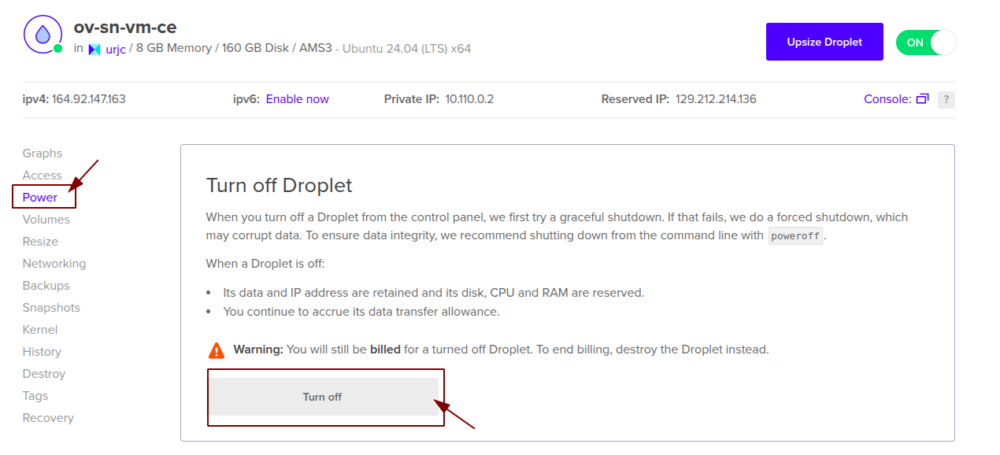
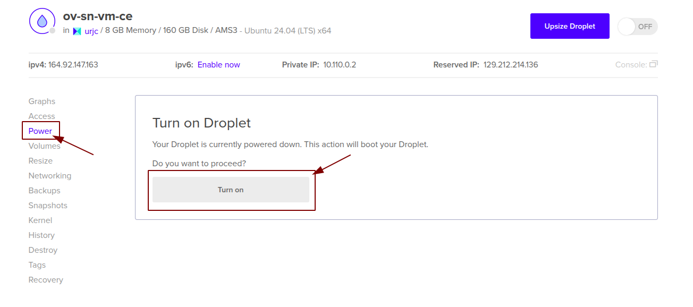
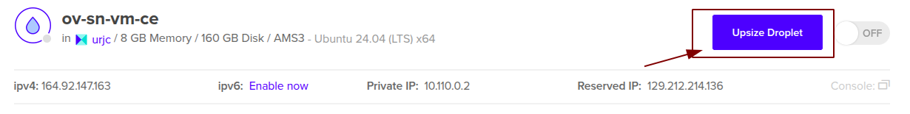

# OpenVidu Single Node COMMUNITY administration: Digital Ocean

Digital Ocean OpenVidu Single Node deployments are internally identical to On Premises Single Node deployments, so you can follow the same instructions from [On Premises Single Node](../on-premises/admin.md) documentation for administration and configuration. The only difference is that the deployment is automated with terraform.

However, there are certain things worth mentioning:

## Start and stop OpenVidu through Digital Ocean web

You can start and stop all services as explained in the [On Premises Single Node](../on-premises/admin.md#starting-stopping-and-restarting-openvidu) section. But you can also start and stop the Droplet directly from Digital Ocean web. This will stop all services running in the droplet and reduce Digital Ocean costs.

=== "Stop OpenVidu Single Node"

    1. Go to [Digital Ocean Droplets :fontawesome-solid-external-link:{.external-link-icon}](https://cloud.digitalocean.com/droplets){:target="_blank"}.
    2. There, you will find the Droplet that runs OpenVidu. Its name should be something like `<STACK_NAME>-vm-ce`.
    3. In the section of the Droplet click on _"Power"_ and then _"Turn Off"_ to stop the Droplet (and therefore OpenVidu).

    <figure markdown>
    { .svg-img .dark-img }
    </figure>

=== "Start OpenVidu Single Node"

    1. Go to [Digital Ocean Droplets :fontawesome-solid-external-link:{.external-link-icon}](https://cloud.digitalocean.com/droplets){:target="_blank"}.
    2. There, you will find the Droplet that runs OpenVidu. Its name should be something like `<STACK_NAME>-vm-ce`.
    3. In the section of the Droplet click on _"Power"_ and the _"Turn On"_ to start the Droplet (and therefore OpenVidu).

    <figure markdown>
    { .svg-img .dark-img }
    </figure>

## Change the droplet size

You can change the droplet size of the OpenVidu Single Node to adapt it to your needs. To do this, follow these steps:

1. Go to [Digital Ocean Droplets :fontawesome-solid-external-link:{.external-link-icon}](https://cloud.digitalocean.com/droplets){:target="_blank"}.
2. There, you will find the Droplet that runs OpenVidu. Its name should be something like `<STACK_NAME>-vm-ce`.
3. [Stop](#stop-openvidu-single-node) the droplet if is not stopped.
4. Click on _"Upsize Droplet"_ and change the size, then click on _"Resize"_.

    === "Change droplet size"

        <figure markdown>
        { .svg-img .dark-img }
        </figure>

## Administration and configuration

Regarding the administration of your deployment, you can follow the instructions in section [On Premises Single Node Administration](../on-premises/admin.md).

Regarding the configuration of your deployment, you can follow the instructions in section [Changing Configuration](../../configuration/changing-config.md). Additionally, the [How to Guides](../../how-to-guides/index.md) offer multiple resources to assist with specific configuration changes.

## Backup and Restore

Review the [Backup and restore OpenVidu deployments](../../how-to-guides/backup-and-restore.md) guide for recommended backup workflows.