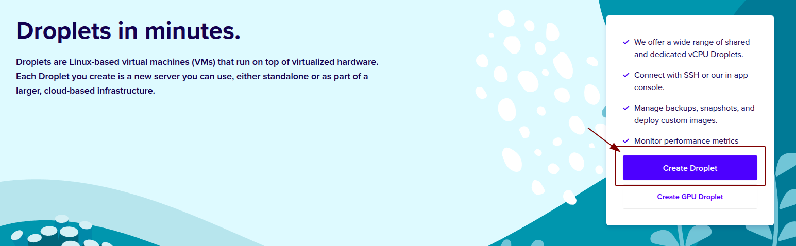
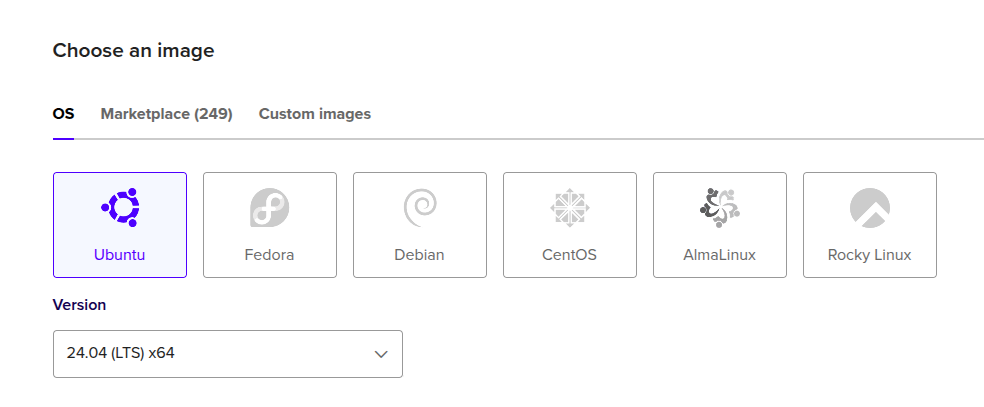
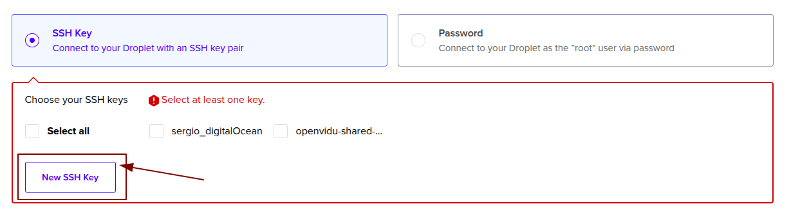
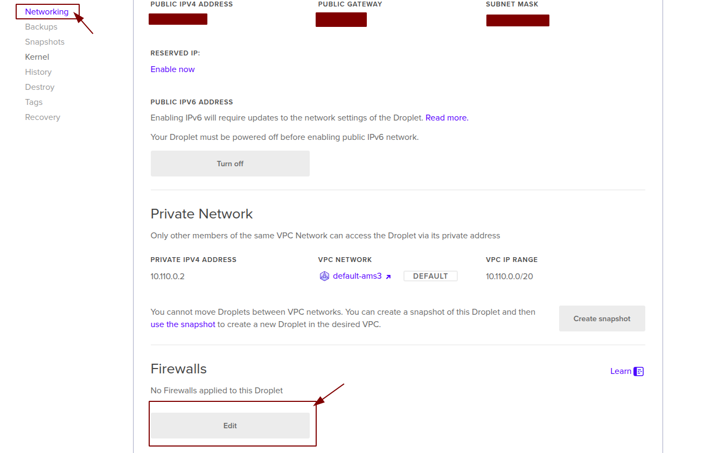
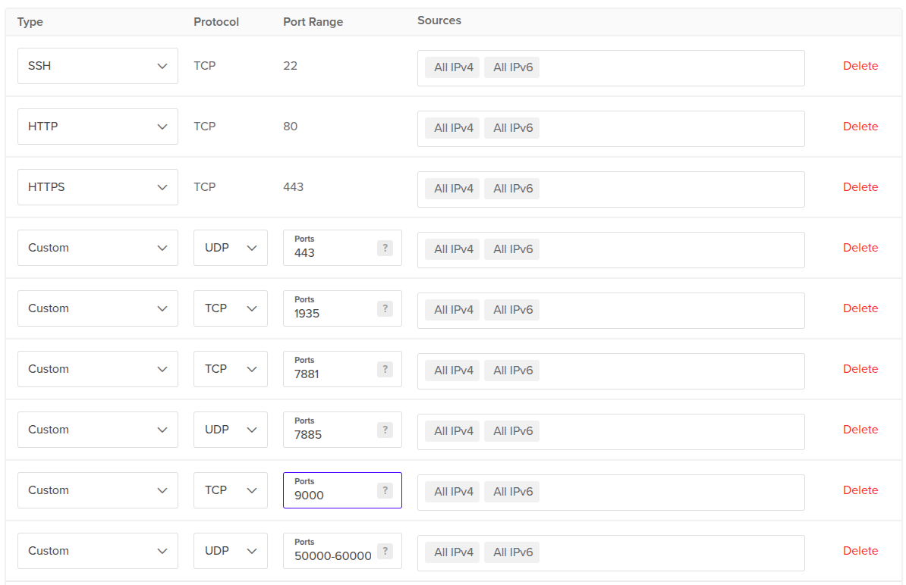
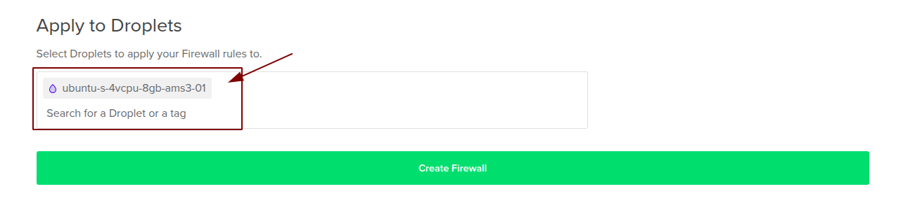

# OpenVidu Single Node <span class="openvidu-tag openvidu-community-tag" style="font-size: .6em; vertical-align: text-bottom">COMMUNITY</span> installation: Digital Ocean
This section describes two ways of installing OpenVidu Single Node in Digital Ocean:

* **Web Console**: More friendly option but with some differences. You will have MinIO s3 storage by default. 
* **Terraform**: More controled option but you need Terraform CLI. You will have Digital Ocean s3 storage by default.


## **Web Console**

This page explains how to create a Droplet (VM) in Digital Ocean, configure networking, and prepare it for OpenVidu Single Node On Premises. Installing, administrating, and upgrading OpenVidu Single Node itself is covered in the On-Premises documentation.

### Prerequisites

- Digital Ocean account with permission to create Droplets and networking resources.

---

### 1. Create the Droplet

1. Log in to your [**Digital Ocean** :fontawesome-solid-external-link:{.external-link-icon}](https://cloud.digitalocean.com/) account.
2. Search for **Droplets** and click it, then click _"Create Droplet"_.
    <figure markdown>
    { .svg-img .dark-img }
    </figure>
3. Choose a region and then change the image to Ubuntu _"24.04 (LTS) x64"_ in case that is not selected yet.
    <figure markdown>
    { .svg-img .dark-img }
    </figure>
4. Select the size for your OpenVidu server. We recommend **4 CPUs or more and at least 4 GB of RAM** for OpenVidu to run correctly.
5. Go down to the Authentication Method and choose the one you prefer. This will be used to connect via Terminal to the instance. If you want to use SSH Key follow the instructions that appear when clicking New SSH Key.
    <figure markdown>
    { .svg-img .dark-img }
    </figure>
6. Review the configuration and click _"Create Droplet"_, you can change the hostname of the droplet if you want (for example, `openvidu-singlenode`).

---

### 2. Port rules in the network security lists

OpenVidu and WebRTC require specific inbound rules on the Firewall network security for it to work.

The [minimum inbound ports to allow](../on-premises/install.md#port-rules) must be included in the Firewall rules.

1. Click the droplet, then go to _"Networking"_, go down and click on _"Edit"_ in **Firewall** section.
    <figure markdown>
    { .svg-img .dark-img }
    </figure>
2. Now click on _"Create Firewall"_ and in **Inbound Rules** add the following rules.
    <figure markdown>
    { .svg-img .dark-img }
    </figure>

    !!! warning
        It is important that you make sure the protocol is the one that is shown in the image.

3. Put it a name on the top and then go to the bottom and search for the name of the droplet. Then add it to apply the firewall rules to it.
    <figure markdown>
    { .svg-img .dark-img }
    </figure>
---

### 3. SSH access and OpenVidu installation

!!! warning
    Open the required ports before installing OpenVidu to avoid connectivity issues.

1. SSH into the instance:

    ```bash
    ssh -i private_key_downloaded.key root@PUBLIC_IP
    sudo apt update && sudo apt upgrade -y
    ```

2. Follow the [On-Premises install instructions](../on-premises/install.md/#guided-installation) to install OpenVidu on the instance.

---

### 4. Administration and upgrade

- For administration of this OpenVidu Single Node deployment, see the [On-Premises administration section](../on-premises/admin.md).
- To upgrade OpenVidu, see the [On-Premises upgrade section](../on-premises/upgrade.md).

## **Terraform**

This section contains the instructions of how to deploy a production-ready OpenVidu Single Node deployment in Digital Ocean. Deployed services are almost the same as the [On Premises Single Node installation](../on-premises/install.md) but they will be resources in Digital Ocean and you can automate the process with the Terraform CLI.

### Prerequisites
* You need to have a Digital Ocean account with a [Personal Access Token :fontawesome-solid-external-link:{.external-link-icon}](https://docs.digitalocean.com/reference/api/create-personal-access-token/){:target=_blank}.
* You need to have installed [Terraform CLI :fontawesome-solid-external-link:{.external-link-icon}](https://developer.hashicorp.com/terraform/tutorials/aws-get-started/install-cli){:target=_blank}.
* You need to have installed Git.

=== "Architecture overview"

    This is how the architecture of the deployment looks like:

    <figure markdown>
    { .svg-img .dark-img }
    <figcaption>OpenVidu Single Node Digital Ocean Architecture</figcaption>
    </figure>

### Deployment details

1. To deploy OpenVidu, first you need clone the repository that lodges the terraform files. You can do that with the following command in a terminal:
    ```
    git clone https://github.com/OpenVidu/openvidu-digitalocean.git \
    && cd openvidu-digitalocean/community/singlenode
    ```
2. Copy **terraform.tfvars.example** to **terraform.tfvars**, update the required parameters with your values, and optionally adjust defaults, then proceed to the next step.
  <details>
    <summary>Information about parameters</summary>

    <h4>Mandatory Parameters</h4>

    <div align="center">
    <table>
    <thead>
    <tr>
    <th>Input Value</th>
    <th>Description</th>
    </tr>
    </thead>
    <tbody>
    <tr>
    <td style="white-space: nowrap;"><code>do_token</code></td>
    <td>Digital Ocean Personal Access Token for API authentication.</td>
    </tr>
    <tr>
    <td style="white-space: nowrap;"><code>stackName</code></td>
    <td>Stack name for OpenVidu deployment.</td>
    </tr>
    </tbody>
    </table>
    </div>

    <h4>Optional Parameters</h4>

    <div align="center">
    <table>
    <thead>
    <tr>
    <th>Input Value</th>
    <th>Default Value</th>
    <th>Description</th>
    </tr>
    </thead>
    <tbody>
    <tr>
    <td style="white-space: nowrap;"><code>region</code></td>
    <td style="white-space: nowrap;"><code>"ams3"</code></td>
    <td>Digital Ocean region where resources will be created.</td>
    </tr>
    <tr>
    <td style="white-space: nowrap;"><code>instanceType</code></td>
    <td style="white-space: nowrap;"><code>"s-2vcpu-4gb"</code></td>
    <td>Specifies the Digital Ocean Droplet size for your OpenVidu instance.</td>
    </tr>
    <tr>
    <td style="white-space: nowrap;"><code>certificateType</code></td>
    <td style="white-space: nowrap;"><code>"letsencrypt"</code></td>
    <td>Certificate type for OpenVidu deployment. Options: <ul><li><code>selfsigned</code> - Not recommended for production use. Just for testing purposes or development environments. You don't need a FQDN to use this option.</li><li><code>owncert</code> - Valid for production environments. Use your own certificate. You need a FQDN to use this option.</li><li><code>letsencrypt</code> - Valid for production environments. Can be used with or without a FQDN (if no FQDN is provided, a random sslip.io domain will be used).</li></ul></td>
    </tr>
    <tr>
    <td style="white-space: nowrap;"><code>domainName</code></td>
    <td style="white-space: nowrap;"><code>(none)</code></td>
    <td>Domain name for the OpenVidu Deployment.</td>
    </tr>
    <tr>
    <td style="white-space: nowrap;"><code>ownPublicCertificate</code></td>
    <td style="white-space: nowrap;"><code>(none)</code></td>
    <td>If certificate type is 'owncert', this parameter will be used to specify your public certificate in base64.</td>
    </tr>
    <tr>
    <td style="white-space: nowrap;"><code>ownPrivateCertificate</code></td>
    <td style="white-space: nowrap;"><code>(none)</code></td>
    <td>If certificate type is 'owncert', this parameter will be used to specify your private certificate in base64.</td>
    </tr>
    <tr>
    <td style="white-space: nowrap;"><code>initialMeetAdminPassword</code></td>
    <td style="white-space: nowrap;"><code>(none)</code></td>
    <td>Initial password for the 'admin' user in OpenVidu Meet. If not provided, a random password will be generated.</td>
    </tr>
    <tr>
    <td style="white-space: nowrap;"><code>initialMeetApiKey</code></td>
    <td style="white-space: nowrap;"><code>(none)</code></td>
    <td>Initial API key for OpenVidu Meet. If not provided, no API key will be set and the user can set it later from Meet Console.</td>
    </tr>
    <tr>
    <td style="white-space: nowrap;"><code>spaceName</code></td>
    <td style="white-space: nowrap;"><code>(none)</code></td>
    <td>Name for the DigitalOcean Space (S3-compatible bucket). If not provided, no Space will be created.</td>
    </tr>
    <tr>
    <td style="white-space: nowrap;"><code>spaceRegion</code></td>
    <td style="white-space: nowrap;"><code>"ams3"</code></td>
    <td>Digital Ocean Spaces region where the bucket will be created.</td>
    </tr>
    <tr>
    <td style="white-space: nowrap;"><code>additionalInstallFlags</code></td>
    <td style="white-space: nowrap;"><code>(none)</code></td>
    <td>Additional optional flags to pass to the OpenVidu installer (comma-separated, e.g., '--flag1=value, --flag2').</td>
    </tr>
    </tbody>
    </table>
    </div>

    </details>
3. Use the following commands to deploy with terraform.
  ```
  terraform init && terraform apply
  ```
4. Wait until in the Space Object Storage bucket that you've configurated appears the SSH Key.

    !!! warning
        Once you've downloaded that SSH Key please **DELETE IT** from the bucket. This SSH Key is the private key used to connect to the droplet so if someone gets it, they could be capable of entering the instance.

5. Go to where you downloaded your SSH Key and run the following command:
  ```
  chmod 600 your_private_key.pem
  ```

### Checking credentials

After waiting about 5 to 10 minutes to let the droplet run the installation of OpenVidu you can check the credentials in the instance.

=== "Check deployment outputs in the instance"

    SSH to the instance by running this command in the path where you have the SSH Key:
    ```
    ssh -i your_private_key.pem root@PUBLIC_DROPLET_IP
    ```

    Then navigate to /opt/openvidu/ and you will find all credentials needed in the `secrets.env`


### Configure your application to use the deployment 

You may need your Digital Ocean credentials to configure your OpenVidu application. You can check these secrets following these steps ([Check deployment outputs in the instance](#check-deployment-outputs-in-the-instance)).

Your authentication credentials and URL to point your applications would be:

--8<-- "shared/self-hosting/do-credentials-general.md"

### Troubleshooting initial Digital Ocean deployment creation

--8<-- "shared/self-hosting/do-troubleshooting.md"

3. If everything seems fine, check the [status](../on-premises/admin.md#checking-the-status-of-services) and the [logs](../on-premises/admin.md#checking-logs) of the installed OpenVidu services.

### Configuration and administration

When your **OPENVIDU_URL** is reachable, it means that everything has gone well. Now you can check the [Administration](./admin.md) section to learn how to manage your deployment.
