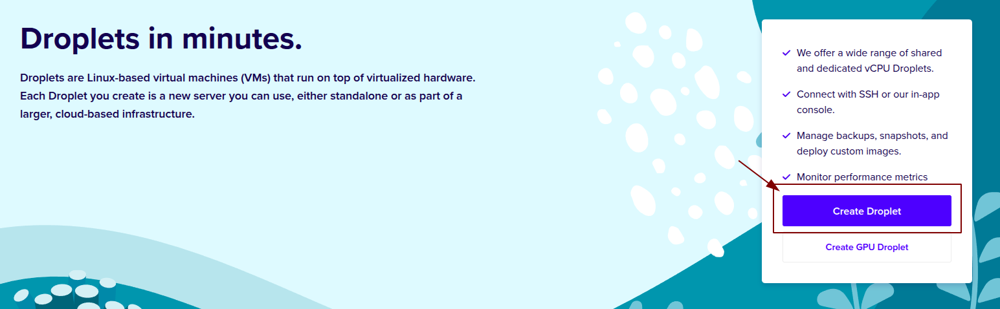
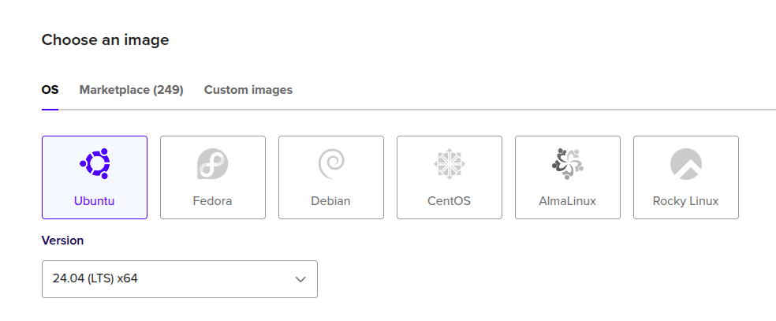
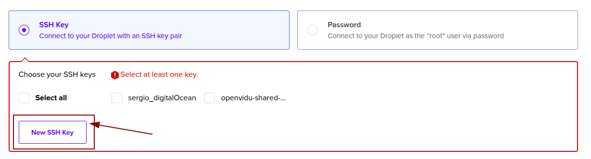
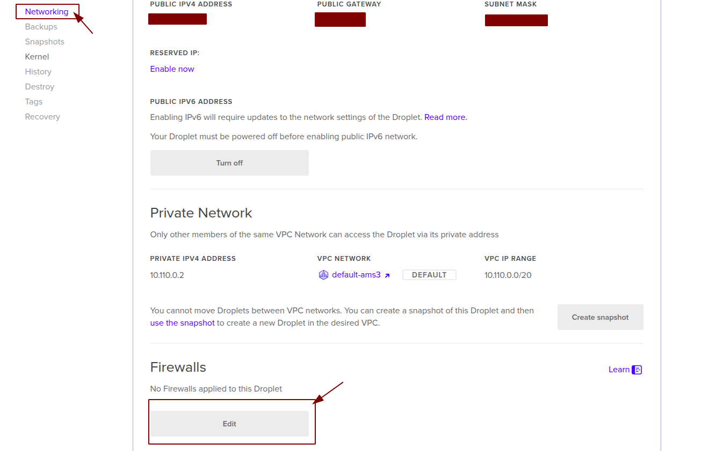
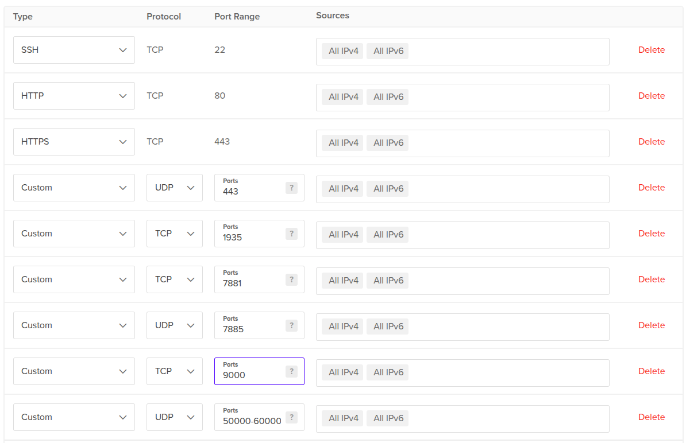
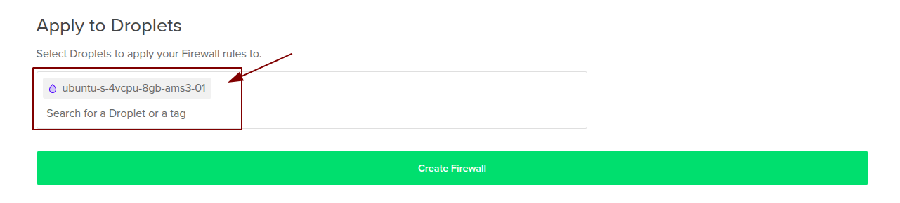
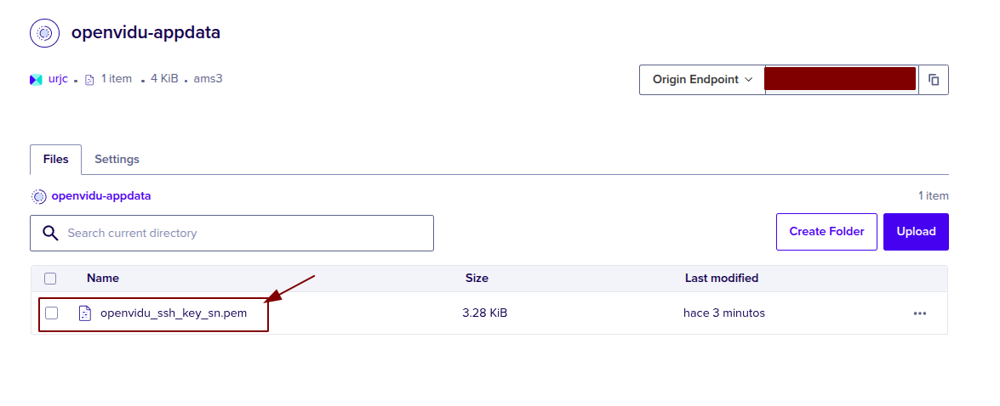
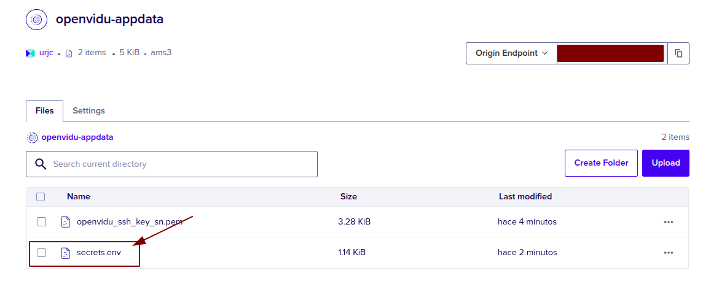

# OpenVidu Single Node <span class="openvidu-tag openvidu-community-tag" style="font-size: .6em; vertical-align: text-bottom">COMMUNITY</span> installation: DigitalOcean

<div class="provider-chip" markdown>

:material-digital-ocean:{ .provider-chip-icon } DigitalOcean

</div>

This section describes two ways to install OpenVidu Single Node on DigitalOcean:

* [**Web Console**](#web-console): Can be deployed without installing anything in your machine, but it requires more manual steps and has some limitations. For example, recordings are stored in the machine (instead of Digital Ocean Spaces Object Storage). 
* [**Terraform**](#terraform): More powerfull and automated, but it requires to install Terraform CLI on your machine.


## **Web Console**

This page explains how to create a Droplet (VM) in DigitalOcean, configure networking, and prepare it for OpenVidu Single Node On Premises. Installing, administrating, and upgrading OpenVidu Single Node itself is covered in the On-Premises documentation.

### Prerequisites

- DigitalOcean account with permission to create Droplets and networking resources.

---

### 1. Create the Droplet

1. Log in to your [**DigitalOcean** :fontawesome-solid-external-link:{.external-link-icon}](https://cloud.digitalocean.com/) account.
2. Search for **Droplets**, click it, and then click _"Create Droplet"_.
    <figure markdown>
    { .svg-img .dark-img }
    </figure>
3. Choose a region and then change the image to Ubuntu _"24.04 (LTS) x64"_ if it is not selected yet.
    <figure markdown>
    { .svg-img .dark-img }
    </figure>
4. Select the size for your OpenVidu server. We recommend **4 CPUs or more and at least 4 GB of RAM** for OpenVidu to run correctly.
5. Scroll down to Authentication Method and choose the one you prefer. This will be used to connect to the instance via terminal. If you want to use an SSH key, follow the instructions shown when you click New SSH Key.
    <figure markdown>
    { .svg-img .dark-img }
    </figure>
6. Review the configuration and click _"Create Droplet"_, you can change the hostname of the droplet if you want (for example, `openvidu-singlenode`).

---

### 2. Port rules in the network security lists

OpenVidu and WebRTC require specific inbound rules on the Firewall network security for it to work.

The [minimum inbound ports to allow](../on-premises/install.md#port-rules) must be included in the Firewall rules.

1. Click the droplet, then go to _"Networking"_, go down and click on _"Edit"_ in **Firewall** section.
    <figure markdown>
    { .svg-img .dark-img }
    </figure>
2. Now click on _"Create Firewall"_ and in **Inbound Rules** add the following rules.
    <figure markdown>
    { .svg-img .dark-img }
    </figure>

    !!! warning
        It is important that you make sure the protocol is the one that is shown in the image.

3. Name the firewall, then scroll to the bottom and search for your Droplet by name. Select it to apply the firewall rules to it.
    <figure markdown>
    { .svg-img .dark-img }
    </figure>
---

### 3. SSH access and OpenVidu installation

1. SSH into the instance:

    ```bash
    ssh -i private_key_downloaded.key root@PUBLIC_IP
    sudo apt update && sudo apt upgrade -y
    ```

2. Follow the [On-Premises install instructions](../on-premises/install.md/#guided-installation) to install OpenVidu on the instance.

---

### 4. Administration and upgrade

- For administration of this OpenVidu Single Node deployment, see the [On-Premises administration section](../on-premises/admin.md).
- To upgrade OpenVidu, see the [On-Premises upgrade section](../on-premises/upgrade.md).

## **Terraform**

This section contains instructions for deploying a production-ready OpenVidu Single Node <span class="openvidu-tag openvidu-community-tag" style="font-size: 12px">COMMUNITY</span> deployment on DigitalOcean. The deployed services are the same as in the [On Premises Single Node installation](../on-premises/install.md), but the process is automated through the Terraform CLI. Additionally, DigitalOcean Spaces (S3-compatible storage) is used to store recordings and other persistent data.

### Prerequisites
* You need to have a DigitalOcean account with a [Personal Access Token :fontawesome-solid-external-link:{.external-link-icon}](https://docs.digitalocean.com/reference/api/create-personal-access-token/){:target=_blank}.
* You need to have installed [Terraform CLI :fontawesome-solid-external-link:{.external-link-icon}](https://developer.hashicorp.com/terraform/tutorials/aws-get-started/install-cli){:target=_blank}.
* You need to have installed Git.

=== "Architecture overview"

    This is what the deployment architecture looks like:

    <figure markdown>
    { .svg-img .dark-img }
    <figcaption>OpenVidu Single Node DigitalOcean Architecture</figcaption>
    </figure>

### Deployment details

1. To deploy OpenVidu, first you need clone the repository that has the terraform files. You can do that with the following command in a terminal:
    ```
    git clone https://github.com/OpenVidu/openvidu-digitalocean.git \
    && cd openvidu-digitalocean/community/singlenode
    ```
2. Copy **terraform.tfvars.example** to **terraform.tfvars**, update the required parameters with your values, and optionally adjust defaults, then proceed to the next step.
  <details>
    <summary>Information about parameters</summary>

    <h4>Mandatory Parameters</h4>

    <div align="center">
    <table>
    <thead>
    <tr>
    <th>Input Value</th>
    <th>Description</th>
    </tr>
    </thead>
    <tbody>
    <tr>
    <td style="white-space: nowrap;"><code>do_token</code></td>
    <td>DigitalOcean Personal Access Token for API authentication.</td>
    </tr>
    <tr>
    <td style="white-space: nowrap;"><code>stackName</code></td>
    <td>Stack name for OpenVidu deployment.</td>
    </tr>
    </tbody>
    </table>
    </div>

    <h4>Optional Parameters</h4>

    <div align="center">
    <table>
    <thead>
    <tr>
    <th>Input Value</th>
    <th>Default Value</th>
    <th>Description</th>
    </tr>
    </thead>
    <tbody>
    <tr>
    <td style="white-space: nowrap;"><code>region</code></td>
    <td style="white-space: nowrap;"><code>"ams3"</code></td>
    <td>DigitalOcean region where resources will be created.</td>
    </tr>
    <tr>
    <td style="white-space: nowrap;"><code>instanceType</code></td>
    <td style="white-space: nowrap;"><code>"s-2vcpu-4gb"</code></td>
    <td>Specifies the DigitalOcean Droplet size for your OpenVidu instance.</td>
    </tr>
    <tr>
    <td style="white-space: nowrap;"><code>certificateType</code></td>
    <td style="white-space: nowrap;"><code>"letsencrypt"</code></td>
    <td>Certificate type for OpenVidu deployment. Options: <ul><li><code>selfsigned</code> - Not recommended for production use. Just for testing purposes or development environments. You don't need a FQDN to use this option.</li><li><code>owncert</code> - Valid for production environments. Use your own certificate. You need a FQDN to use this option.</li><li><code>letsencrypt</code> - Valid for production environments. Can be used with or without a FQDN (if no FQDN is provided, a random sslip.io domain will be used).</li></ul>
    <!-- TODO: Remove this warning when sslip.io rate limiting issue is resolved. Track at https://openvidu.discourse.group/t/deployment-without-domain/5474 -->
    <p><strong>Warning:</strong> sslip.io is currently experiencing Let's Encrypt rate limiting issues, which may prevent SSL certificates from being generated. It is recommended to use your own domain name. Check <a href="https://openvidu.discourse.group/t/deployment-without-domain/5474" target="_blank">this community thread</a> for troubleshooting and updates.</p>
    </td>
    </tr>
    <tr>
    <td style="white-space: nowrap;"><code>domainName</code></td>
    <td style="white-space: nowrap;"><code>(none)</code></td>
    <td>Domain name for the OpenVidu Deployment. Not mandatory; if not provided, a sslip.io domain will be used instead.</td>
    </tr>
    <tr>
    <td style="white-space: nowrap;"><code>ownPublicCertificate</code></td>
    <td style="white-space: nowrap;"><code>(none)</code></td>
    <td>If certificate type is 'owncert', this parameter will be used to specify your public certificate in base64.</td>
    </tr>
    <tr>
    <td style="white-space: nowrap;"><code>ownPrivateCertificate</code></td>
    <td style="white-space: nowrap;"><code>(none)</code></td>
    <td>If certificate type is 'owncert', this parameter will be used to specify your private certificate in base64.</td>
    </tr>
    <tr>
    <td style="white-space: nowrap;"><code>initialMeetAdminPassword</code></td>
    <td style="white-space: nowrap;"><code>(none)</code></td>
    <td>Initial password for the 'admin' user in OpenVidu Meet. If not provided, a random password will be generated.</td>
    </tr>
    <tr>
    <td style="white-space: nowrap;"><code>initialMeetApiKey</code></td>
    <td style="white-space: nowrap;"><code>(none)</code></td>
    <td>Initial API key for OpenVidu Meet. If not provided, no API key will be set and the user can set it later from Meet Console.</td>
    </tr>
    <tr>
    <td style="white-space: nowrap;"><code>spaceName</code></td>
    <td style="white-space: nowrap;"><code>(none)</code></td>
    <td>Name of the DigitalOcean Space (S3-compatible bucket) to store application data and recordings. If empty, a bucket will be created with default name.</td>
    </tr>
    <tr>
    <td style="white-space: nowrap;"><code>spaceRegion</code></td>
    <td style="white-space: nowrap;"><code>"ams3"</code></td>
    <td>DigitalOcean Spaces region where the bucket will be created.</td>
    </tr>
    <tr>
    <td style="white-space: nowrap;"><code>additionalInstallFlags</code></td>
    <td style="white-space: nowrap;"><code>(none)</code></td>
    <td>Additional optional flags to pass to the OpenVidu installer (comma-separated, e.g., '--flag1=value, --flag2'). Currently we only have one flag that is `--force-utc-timezone` to force UTC as the timezone for OpenVidu. By default, OpenVidu uses the timezone configured in the host machine where it is installed. Note that in general it is recommended to use UTC, and DigitalOcean Droplets already default to UTC, so this flag is not usually necessary.</td>
    </tr>
    </tbody>
    </table>
    </div>

    </details>
3. Use the following commands to deploy with terraform.
  ```
  terraform init && terraform apply
  ```
4. You will see logs appear in the terraform apply execution console. Wait for it to finish and display `Apply Complete!`. Now go to [Space Object Storage](https://cloud.digitalocean.com/spaces){:target=_blank} and wait for the ssh key to appear in the bucket you have configured.   

    !!! warning
        Once you've downloaded that SSH Key please **DELETE IT** from the bucket. This SSH Key is the private key used to connect to the droplet so if someone gets it, they could be capable of entering the instance.
    <figure markdown>
    { .svg-img .dark-img }
    </figure>

5. Give the SSH Key the necessary permissions for it to work.

    === "Linux"
        Command in linux:
        ```
        chmod 600 <PATH_TO_THE_KEY>/openvidu_ssh_key_sn.pem
        ```
    === "Powershell"
        Command in powershell:
        ```
        $KeyPath = "<PATH_TO_THE_KEY>" &&
        icacls $KeyPath /inheritance:r &&
        icacls $KeyPath /grant:r "$($env:USERNAME):(R)"
        ```

### Access OpenVidu

To verify that your OpenVidu deployment works correctly wait for the `secrets.env` to appear in the bucket that you've configured and open it to view the credentials of OpenVidu.

=== "View OpenVidu credentials in the Web"
    - Go to the Space Object Storage bucket that you've configurated and download the `secrets.env` file.
    <figure markdown>
    { .svg-img .dark-img }
    </figure>

=== "View OpenVidu credentials in the instance"

    SSH to the instance by running this command from the directory where your SSH key is located:
    ```
    ssh -i openvidu_ssh_key_sn.pem root@PUBLIC_DROPLET_IP
    ```

    Then navigate to /opt/openvidu/ and you will find all credentials needed in the `secrets.env`.
    
Then open **OPENVIDU_URL** and you will see the OpenVidu Meet interface. Log in with **MEET_INITIAL_ADMIN_PASSWORD** and you will be able to enjoy the features of OpenVidu Meet.

### Configure your application to use the deployment 

You may need your Digital Ocean credentials to configure your OpenVidu application. You can check these secrets following these steps ([View OpenVidu credentials in the Web](#view-openvidu-credentials-in-the-web)) or ([View OpenVidu credentials in the instance](#view-openvidu-credentials-in-the-instance)).

Your authentication credentials and the URL to point your applications to are:

--8<-- "shared/self-hosting/do-credentials-general.md"

### Troubleshooting initial DigitalOcean deployment creation

--8<-- "shared/self-hosting/do-troubleshooting.md"

3. If everything seems fine, check the [status](../on-premises/admin.md#checking-the-status-of-services) and the [logs](../on-premises/admin.md#checking-logs) of the installed OpenVidu services.

### Configuration and administration

When your **OPENVIDU_URL** is reachable, it means that everything has gone well. Now you can check the [Administration](./admin.md) section to learn how to manage your deployment.
