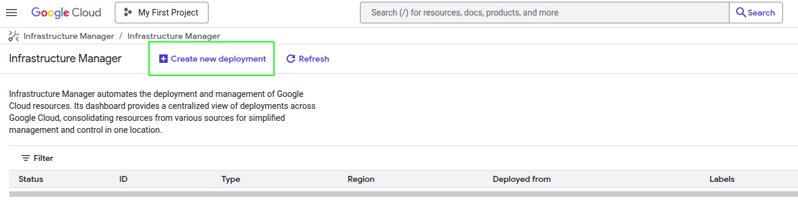
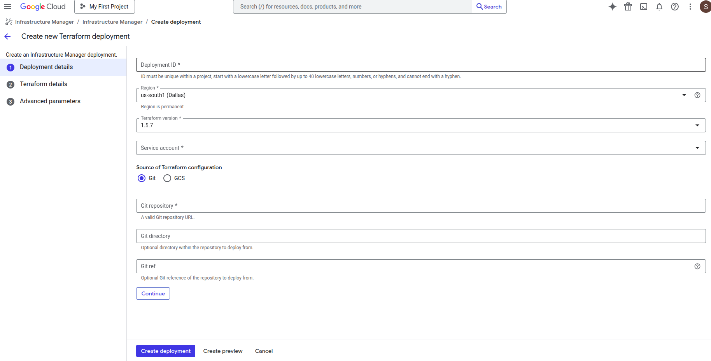
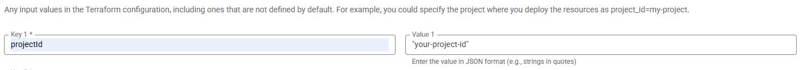
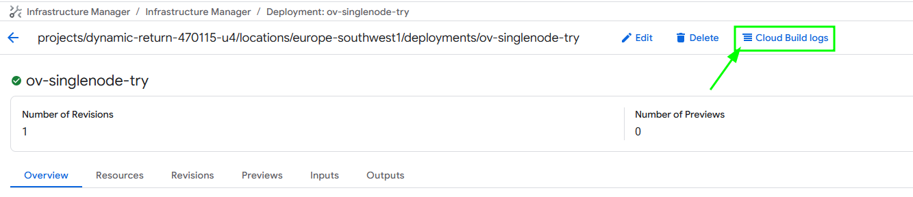
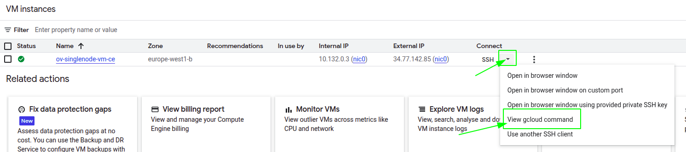

# OpenVidu Single Node COMMUNITY installation: Google Cloud Platform

!!! warning

    Google Cloud Platform deployments are considered in Beta in version 3.3.0 of OpenVidu.

--8<-- "shared/self-hosting/single-node/v2compat-warning.md"

This section contains the instructions of how to deploy a production-ready OpenVidu Single Node deployment in Google Cloud Platform. Deployed services are the same as the [On Premises Single Node installation](../on-premises/install.md) but they will be resources in Google Cloud Platform and you can automate the process in the Google Cloud Console.

To deploy OpenVidu into Google Cloud Platform you just need to log into your [infrastructure manager](https://console.cloud.google.com/infra-manager/deployments) in the GCP console. Then follow the next steps to fill the parameters of your choice.

=== "Architecture overview"

    This is how the architecture of the deployment looks like:

    <figure markdown>
    { .svg-img .dark-img }
    <figcaption>OpenVidu Single Node Google Cloud Platform Architecture</figcaption>
    </figure>

## Deployment details

To deploy OpenVidu, first you need to create a new deployment in the top left button as you can see in the image.

<figure markdown>
{ .svg-img .dark-img }
</figure>

Once you click the button you will see this window.

<figure markdown>
{ .svg-img .dark-img }
</figure>

Fill **Deployment ID** with any name that you desire like openvidu-singlenode-deployment, next choose the **Region** that you prefer, leave **Terraform version** in the 1.5.7 and for **Service Account** you will need to create a new one with _"Owner"_ permissions.   
For the **Git repository** put this link `https://github.com/OpenVidu/openvidu.git` that corresponds to our git repository where are allocated the terraform files to deploy openvidu. In the **Git directory** introduce the following path `openvidu-deployment/community/singlenode/gcp` and then click on continue.

## Input Values

In Google Cloud Platform there is no such thing like template with parameters, you will need to introduce by yourself in the console the parameters that are declared in our terraform files, so there is a detailed table of all the optional and non-optional parameters.

| Input                     | Optional | Default          | Description                                                                                                                                          |
| ------------------------- | -------- | ---------------- | ---------------------------------------------------------------------------------------------------------------------------------------------------- |
| projectId                 | No       | No default       | GCP project id where the resourw es will be created.                                                                                                 |
| region                    | Yes      | "europe-west1"   | GCP region where resources will be created.                                                                                                          |
| zone                      | Yes      | "europe-west1-b" | GCP zone that some resources will use.                                                                                                               |
| stackName                 | No       | No default       | Stack name for OpenVidu deployment.                                                                                                                  |
| certificateType           | No       | "letsEncrypt"    | [selfsigned] Not recommended for production use. Just for testing purposes or development environments. You don't need a FQDN to use this option. [owncert] Valid for production environments. Use your own certificate. You need a FQDN to use this option. [letsencrypt] Valid for production environments. Can be used with or without a FQDN (if no FQDN is provided, a random sslip.io domain will be used).                                            |
| publicIpAddress           | Yes      | No default       | Previously created Public IP address for the OpenVidu Deployment. Blank will generate a public IP.                                                   |
| domainName                | Yes      | No default       | Domain name for the OpenVidu Deployment.                                                                                                             |
| ownPublicCertificate      | Yes      | No default       | If certificate type is 'owncert', this parameter will be used to specify the public certificate                                                      |
| ownPrivateCertificate     | Yes      | No default       | If certificate type is 'owncert', this parameter will be used to specify the private certificate                                                     |
| initialMeetAdminPassword  | Yes      | No default       | Initial password for the 'admin' user in OpenVidu Meet. If not provided, a random password will be generated.                                        |
| initialMeetApiKey         | Yes      | No default       | Initial API key for OpenVidu Meet. If not provided, no API key will be set and the user can set it later from Meet Console.                          |
| instanceType              | No       | "e2-standard-8"  | Specifies the GCE machine type for your OpenVidu instance                                                                                            |
| bucketName                | Yes      | No default       | Name of the S3 bucket to store data and recordings. If empty, a bucket will be created                                                               |
| additionalInstallFlags    | Yes      | No default       | Additional optional flags to pass to the OpenVidu installer (comma-separated, e.g.,'--flag1=value, --flag2').                                        |
| turnDomainName            | Yes      | No default       | (Optional) Domain name for the TURN server with TLS. Only needed if your users are behind restrictive firewalls                                      |
| turnOwnPublicCertificate  | Yes      | No default       | (Optional) This setting is applicable if the certificate type is set to 'owncert' and the TurnDomainName is specified.                               |
| turnOwnPrivateCertificate | Yes      | No default       | (Optional) This setting is applicable if the certificate type is set to 'owncert' and the TurnDomainName is specified.                               |   

For more detail you can check the [variables.tf](https://github.com/OpenVidu/openvidu/blob/master/openvidu-deployment/community/singlenode/gcp/variables.tf) file to see more information about the inputs.   

!!! warning
    It's important that you put the input variables with the same name as they appear in the table like in the next image.

    <figure markdown>
    { .svg-img .dark-img }
    </figure>

## Deploying the stack

Whenever you are satisfied with your input values, just click on _"Continue"_ and then in _"Create deployment"_. Now it will validate the deployment and create all the resources. Wait about 5 to 10 minutes to let the instance install OpenVidu.

!!! warning

    In case of failure, check the cloud build logs that appears on the top of the screen and redeploy with the changes that are causing the deployment to fail, if it keeps failing contact us.
    
    <figure markdown>
    { .svg-img .dark-img }
    </figure>

When everything is ready, you can check the secrets on the [Secret Manager](https://console.cloud.google.com/security/secret-manager) or by connecting through SSH to the instance:

=== "Check deployment outputs in Google Cloud Platform Secret Manager"

    1. Go to the [Secret Manager](https://console.cloud.google.com/security/secret-manager).

    2. Once you are in the Secret Manager you will see all the secrets by their name.

        <figure markdown>
        { .svg-img .dark-img }
        </figure>

    3. Here click on the secret of your choice or whatever you need to check and click again in the last version of that secret.

        <figure markdown>
        { .svg-img .dark-img }
        </figure>

=== "Check deployment outputs in the instance"

    SSH to the instance by gcloud command generated in the web console and navigate to the config folder `/opt/openvidu/config`. Files with the deployment outputs are:

    - `openvidu.env`
    - `meet.env`

    To find out the command go to [Compute Engine Instances](https://console.cloud.google.com/compute/instances) and click on the arrow close to the SSH letters and then _"View gcloud command"_.
    <figure markdown>
    { .svg-img .dark-img }
    </figure>   

    To install gcloud in your shell follow the [instructions](https://cloud.google.com/sdk/docs/install?hl=en#linux)

## Configure your application to use the deployment 

You need your Google Cloud Platform secret outputs to configure your OpenVidu application. You can check these secrets by searching in the Secrets Manager ([Check deployment outputs in Google Cloud Platform Secret Manager](#check-deployment-outputs-in-google-cloud-platform-secret-manager)) or ([Check deployment outputs in the instance](#check-deployment-outputs-in-the-instance)).

Your authentication credentials and URL to point your applications would be:

- **URL**: The value in the Secret Manager of `OPENVIDU_URL`. In the instance in `openvidu.env` find `DOMAIN_NAME` and build it into a URL. The URL would be `https://DOMAIN_NAME/`. If you want the `LIVEKIT_URL` find the value in the Secret Manager of `LIVEKIT_URL` or build the URL with the `DOMAIN_NAME`as `wss://DOMAIN_NAME/`.
- **API Key**: The value in the Secret Manager of `LIVEKIT_API_KEY` or in the instance in `openvidu.env`.
- **API Secret**: The value in the Secret Manager of `LIVEKIT-API-SECRET` or in the instance in `openvidu.env`.

## Troubleshooting initial Google Cloud Platform deployment creation

--8<-- "shared/self-hosting/gcp-troubleshooting.md"

3. If everything seems fine, check the [status](../on-premises/admin.md#checking-the-status-of-services) and the [logs](../on-premises/admin.md#checking-logs) of the installed OpenVidu services.

## Configuration and administration

When your Google Cloud Platform deployment reaches the **`Active`** state, it means that all the resources have been created. You will need to wait about 5 to 10 minutes to let the instance install OpenVidu as we mentioned before. When this time has elapsed, try connecting to the deployment URL. If it doesn't work, we recommend checking the previous section. Once finished you can check the [Administration](./admin.md) section to learn how to manage your deployment.
