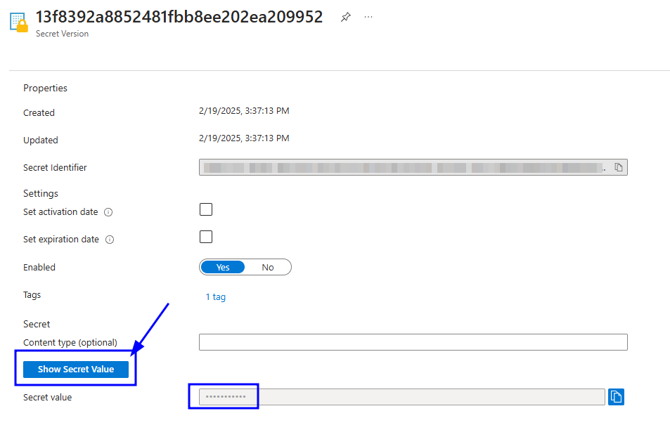

# OpenVidu Single Node COMMUNITY installation: Google Cloud Platform

!!! warning

    Google Cloud Platform deployments are considered in Beta in version 3.3.0 of OpenVidu.

--8<-- "shared/self-hosting/single-node/v2compat-warning.md"

This section contains the instructions of how to deploy a production-ready OpenVidu Single Node deployment in Google Cloud Platform. Deployed services are the same as the [On Premises Single Node installation](../on-premises/install.md) but they will be resources in Google Cloud Platform and you can automate the process in the Google Cloud Console.

To deploy OpenVidu into Google Cloud Platform you just need to log into your [infrastructure manager](https://console.cloud.google.com/infra-manager/deployments) in the GCP console. Then follow the next steps to fill the parameters of your choice.

=== "Architecture overview"

    This is how the architecture of the deployment looks like:

    <figure markdown>
    { .svg-img .dark-img }
    <figcaption>OpenVidu Single Node Google Cloud Platform Architecture</figcaption>
    </figure>

## Deployment details

To deploy OpenVidu, first you need to create a new deployment in the top left button as you can see in the image.

<figure markdown>
{ .svg-img .dark-img }
</figure>

Once you click the button you will see this window.

<figure markdown>
{ .svg-img .dark-img }
</figure>

Fill **Deployment ID** with any name that you desire like openvidu-singlenode-deployment, next choose the **Region** that you prefer, leave **Terraform version** in the 1.5.7 and for **Service Account** you will need to create a new one with `Owner` permissions.   
For the **Git repository** put this link `https://github.com/OpenVidu/openvidu.git` that corresponds to our git repository where are allocated the terraform files to deploy openvidu. In the **Git directory** introduce the following path `openvidu-deployment/community/singlenode/gcp` and then click on continue.

## Input Values

In Google Cloud Platform there is no such thing as a template with parameters, you will need to introduce by yourself in the console the parameters that are declarated in our terraform files, so there is a detailed guide of all the optional and non-optional parameters in the following sections.

### Google Cloud Platform Instance Configuration

Specify properties for the Google Cloud Platform instance that will host Openvidu.

=== "Google Cloud Platform Instance configuration"

    Parameters in this section look like this:

    <figure markdown>
    { .svg-img .dark-img }
    </figure>

    Simply select the type of instance you want to deploy at **Type of Instance**. Fill in the parameter **Admin Username** that will be set as admin username in the instance. Select the SSH key you've created previously in **SSH public key source** (or you can create a new one in the drop down) to allow you to SSH into the instance.

--8<-- "shared/self-hosting/azure-storageaccount.md"

--8<-- "shared/self-hosting/azure-turn-domain.md"

## Deploying the stack

Whenever you are satisfied with your Template paremeters, just click on _"Next"_ to trigger the validation process. If correct, click on _"Create"_ to start the deployment process (which will take about 5 to 10 minutes).

!!! warning

    In case of failure, it might be that some role failed to create. In this case redeploy in a new resource group and change the **Stack Name**. To remove a role in a resource group visit [Remove Google Cloud Platform role assignments :fontawesome-solid-external-link:{.external-link-icon}](https://learn.microsoft.com/en-us/azure/role-based-access-control/role-assignments-remove){:target="_blank"}.

When everything is ready, you can check the output secrets on the Key Vault or by connecting through SSH to the instance:

=== "Check deployment outputs in Google Cloud Platform Key Vault"

    1. Go to the Key Vault created called **yourstackname-keyvault** in the Resource Group that you deployed. You can access it from the [Google Cloud Platform Portal Dashboard :fontawesome-solid-external-link:{.external-link-icon}](https://portal.azure.com/#home){:target="_blank"}.

    2. Once you are in the Key Vault on the left panel click on _"Objects"_ 🡒 _"Secrets"_.

        <figure markdown>
        { .svg-img .dark-img }
        </figure>

    3. Here click on the secret of your choice or whatever you need to check and click again in the current version of that secret

        <figure markdown>
        { .svg-img .dark-img }
        </figure>

    4. Now you will see a lot of properties but the one you are searching for is located at the bottom and it will be revealed by clicking in _"Show Secret Value"_.

        <figure markdown>
        { .svg-img .dark-img }
        </figure>

=== "Check deployment outputs in the instance"

    SSH to the instance and navigate to the config folder `/opt/openvidu/config`. Files with the deployment outputs are:

    - `openvidu.env`
    - `meet.env`

## Configure your application to use the deployment 

You need your Google Cloud Platform deployment outputs to configure your OpenVidu application. If you have permissions to access the Key Vault you will be able to check there all the outputs ([Check deployment outputs in Google Cloud Platform Key Vault](#check-deployment-outputs-in-azure-key-vault)). If you don't have permissions to access the Key Vault you can still check the outputs directly in the instance through SSH ([Check deployment outputs in the instance](#check-deployment-outputs-in-the-instance)).

Your authentication credentials and URL to point your applications would be:

- **URL**: The value in the Key Vault Secret of `DOMAIN-NAME` or in the instance in `openvidu.env` as a URL. It could be `wss://openvidu.example.io/` or `https://openvidu.example.io/` depending on the SDK you are using.
- **API Key**: The value in the Key Vault Secret of `LIVEKIT-API-KEY` or in the instance in `openvidu.env`.
- **API Secret**: The value in the Key Vault Secret of `LIVEKIT-API-SECRET` or in the instance in `openvidu.env`.

## Troubleshooting initial Google Cloud Platform stack creation

--8<-- "shared/self-hosting/azure-troubleshooting.md"

3. If everything seems fine, check the [status](../on-premises/admin.md#checking-the-status-of-services) and the [logs](../on-premises/admin.md#checking-logs) of the installed OpenVidu services.

## Configuration and administration

When your Google Cloud Platform stack reaches the **`Succeeded`** status, it means that all the resources have been created. You will need to wait about 5 to 10 minutes to let the instance install OpenVidu as we mentioned before. When this time has elapsed, try connecting to the deployment URL. If it doesn't work, we recommend checking the previous section. Once finished you can check the [Administration](./admin.md) section to learn how to manage your deployment.
