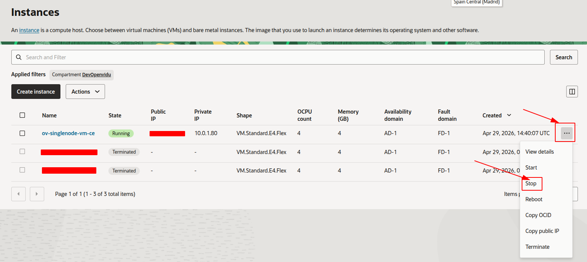
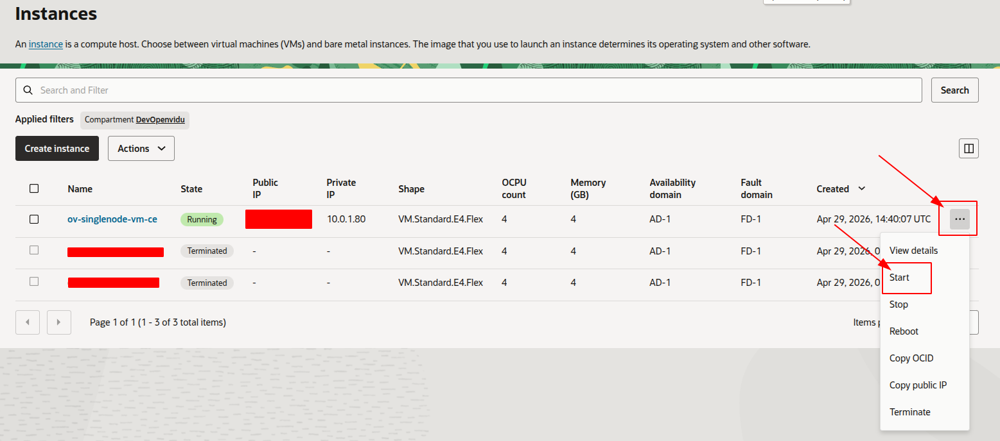
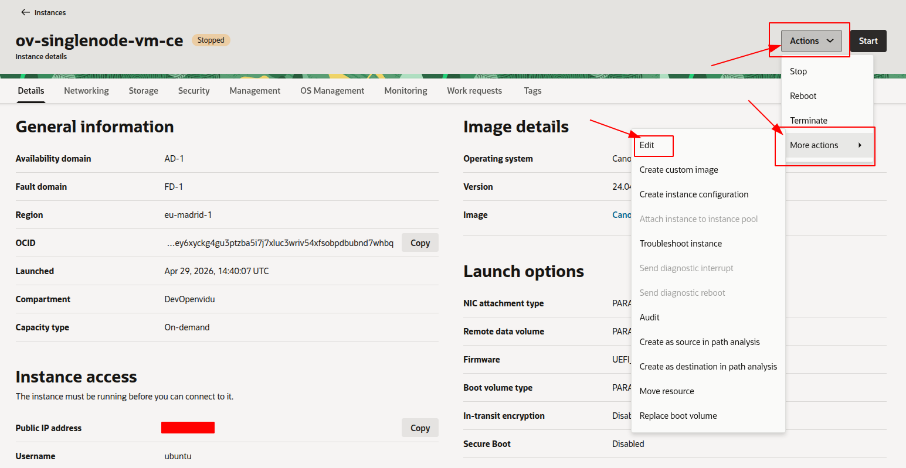
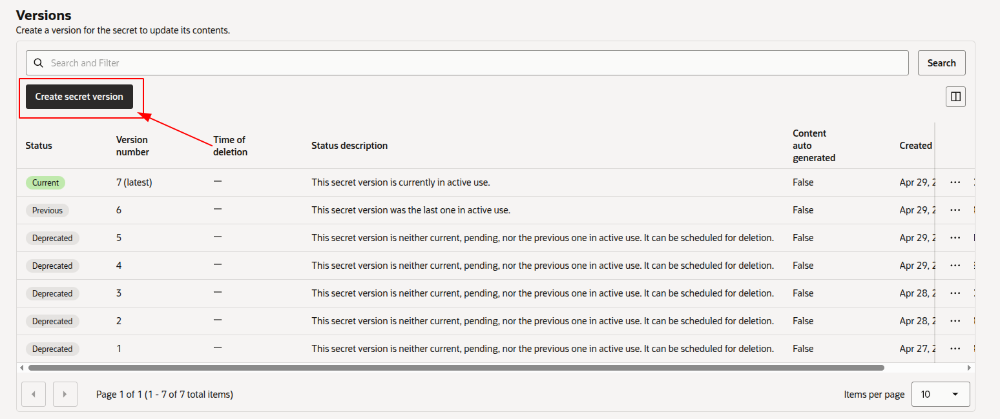
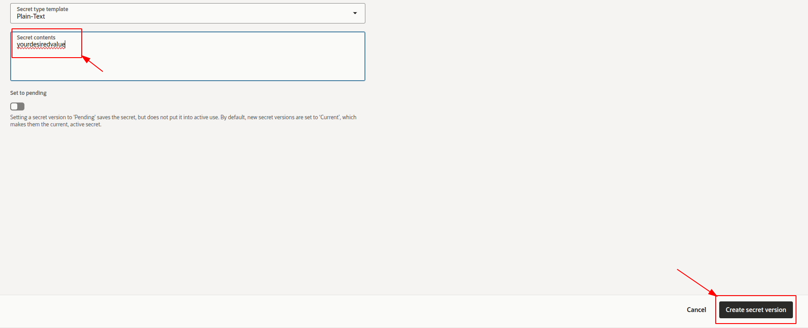

# OpenVidu Single Node COMMUNITY administration: Oracle Cloud Infrastructure

:material-cloud:{ .provider-chip-icon } Oracle Cloud Infrastructure

Oracle Cloud Infrastructure OpenVidu Single Node deployments are internally identical to On Premises Single Node deployments, so you can follow the same instructions from [On Premises Single Node](../on-premises/admin.md) documentation for administration and configuration. The only difference is the underlying cloud infrastructure.

However, there are certain things worth mentioning:

## Start and stop OpenVidu through the OCI Console

You can start and stop all services as explained in the [On Premises Single Node](../on-premises/admin.md#starting-stopping-and-restarting-openvidu) section. But you can also start and stop the Compute instance directly from the OCI Console. This will stop all services running in the instance and reduce Oracle Cloud Infrastructure costs.

=== "Stop OpenVidu Single Node"

    1. Go to [OCI Compute Instances :fontawesome-solid-external-link:{.external-link-icon}](https://cloud.oracle.com/compute/instances){:target="_blank"}.
    2. There, you will find the Compute instance that runs OpenVidu.
    3. Click the three-dots action menu next to the instance and select _"Stop"_ to stop the instance (and therefore OpenVidu).

    <figure markdown>
    { .svg-img .dark-img }
    </figure>

=== "Start OpenVidu Single Node"

    1. Go to [OCI Compute Instances :fontawesome-solid-external-link:{.external-link-icon}](https://cloud.oracle.com/compute/instances){:target="_blank"}.
    2. There, you will find the Compute instance that runs OpenVidu.
    3. Click the three-dots action menu next to the instance and select _"Start"_ to start the instance (and therefore OpenVidu).

    <figure markdown>
    { .svg-img .dark-img }
    </figure>

## Change the instance shape

You can change the shape (instance type) of the OpenVidu Single Node instance to adapt it to your needs. To do this, follow these steps:

1. Go to [OCI Compute Instances :fontawesome-solid-external-link:{.external-link-icon}](https://cloud.oracle.com/compute/instances){:target="_blank"}.
2. There, you will find the Compute instance that runs OpenVidu.
3. [Stop](#stop-openvidu-single-node) the instance if it is not already stopped. Wait for it to reach the **Stopped** state.
4. Click on the instance name to open its details, then click _"Edit"_ next to the **Shape** field and select the new shape.

    === "Change instance shape"

        <figure markdown>
        { .svg-img .dark-img }
        </figure>

5. Confirm the new shape and [start](#start-openvidu-single-node) the instance again.

## Administration and configuration

Regarding the administration of your deployment, you can follow the instructions in section [On Premises Single Node Administration](../on-premises/admin.md).

Regarding the configuration of your deployment, you can follow the instructions in section [Changing Configuration](../../configuration/changing-config.md). Additionally, the [How to Guides](../../how-to-guides/index.md) offer multiple resources to assist with specific configuration changes.

In addition to these, an Oracle Cloud Infrastructure deployment provides the capability to manage global configurations via the OCI Console using the Secrets via Secret Manager:

=== "Changing configuration through OCI Secret Manager"

    1. Navigate to the [OCI Secrets Manager :fontawesome-solid-external-link:{.external-link-icon}](https://cloud.oracle.com/security/secrets){:target="_blank"} in the OCI Console.
    2. Click on the desired secret you want to change.
    3. Go down to _"Versions"_ and click on _"Create secret version"_ to add a new version with the updated value.
            <figure markdown>
            { .svg-img .dark-img }
            </figure>
    4. Enter the new secret value and click on _"Create secret version"_.
            <figure markdown>
            { .svg-img .dark-img }
            </figure>
    5. Go to the [OCI Compute Instances :fontawesome-solid-external-link:{.external-link-icon}](https://cloud.oracle.com/compute/instances){:target=_blank} and click on [_Stop_](#stop-openvidu-single-node) → [_Start_](#start-openvidu-single-node) to apply the changes to the OpenVidu Single Node deployment.

    Changes will be applied automatically.

## Backup and Restore

Review the [Backup and restore OpenVidu deployments](../../how-to-guides/backup-and-restore.md) guide for recommended backup workflows.
