# OpenVidu Single Node on Oracle Cloud Infrastructure — Step-by-step Guide

This page explains how to create a VM in Oracle Cloud Infrastructure (OCI), configure networking, and prepare it for OpenVidu Single Node. Installing, administering, and upgrading OpenVidu Single Node itself is covered in the On-Premises documentation.

## Overview / prerequisites
- OCI account with permission to create compute instances and networking resources.

---

## 1. Create the VM (compute instance)
1. Log in to your [**Oracle Cloud Infrastructure** :fontawesome-solid-external-link:{.external-link-icon}](https://cloud.oracle.com/) account.
2. Search for **Instances** and open it, then click _"Create instance"_.
    <figure markdown>
    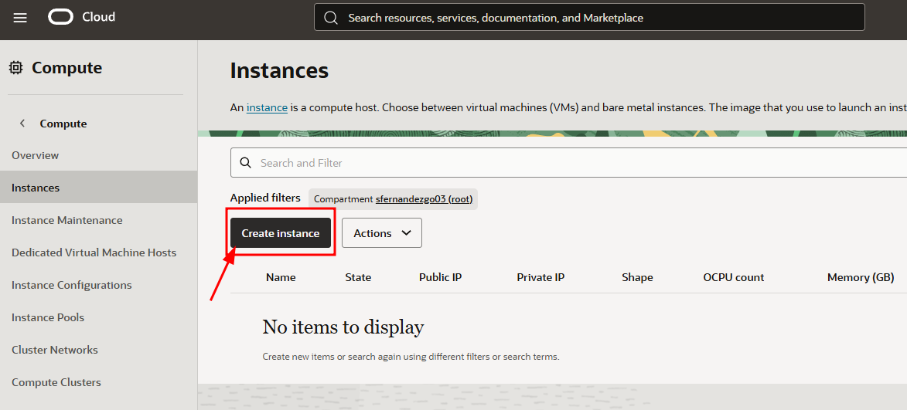{ .svg-img .dark-img }
    </figure>
3. Set a name for the instance (for example, `openvidu-singlenode`), or keep the default name.
4. Change the image to Ubuntu _"Canonical Ubuntu 24.04"_.
    <figure markdown>
    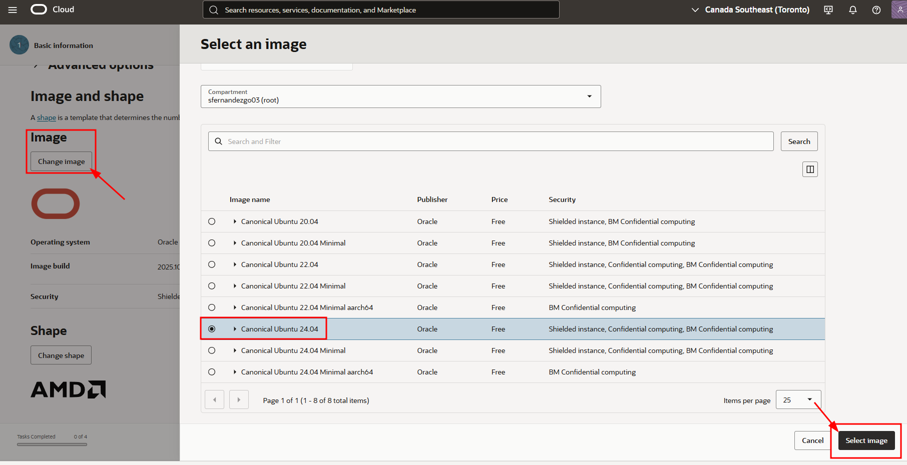{ .svg-img .dark-img }
    </figure>
5. Select the shape for your OpenVidu server. We recommend **1 OCPU or more and at least 4 GB of RAM** for OpenVidu to run correctly. Then click _"Next"_.
6. In the **Security** tab, keep the default options and click _"Next"_.
7. Create a new `VNIC` with a new `virtual cloud network` and a new `public subnet`.
    <figure markdown>
    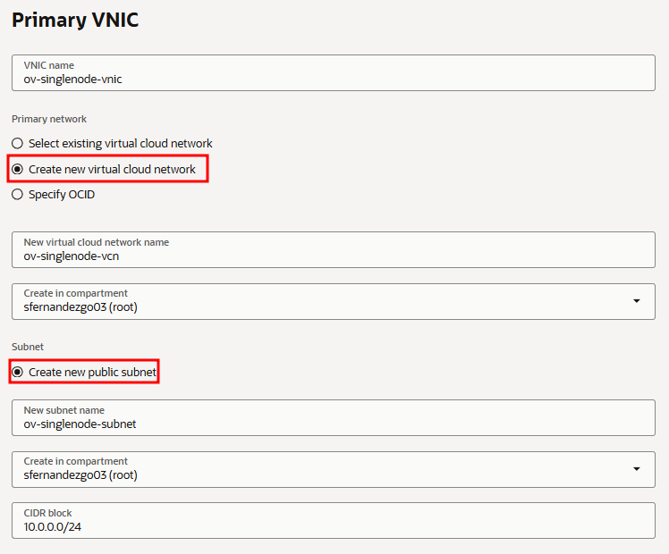{ .svg-img .dark-img }
    </figure>
8. Scroll down and download the private key for the new instance so that you can connect via SSH. Then click _"Next"_.
    <figure markdown>
    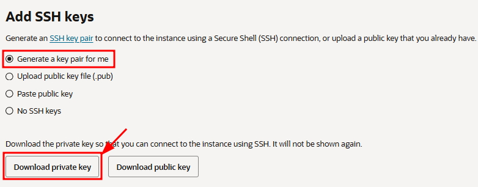{ .svg-img .dark-img }
    </figure>
9. In the **Storage** tab, select _"Specify a custom boot volume size"_ and set it to **100 GB** instead of 50 GB. You can keep 50 GB, but OpenVidu may fail due to insufficient disk space. Then click _"Next"_.
    <figure markdown>
    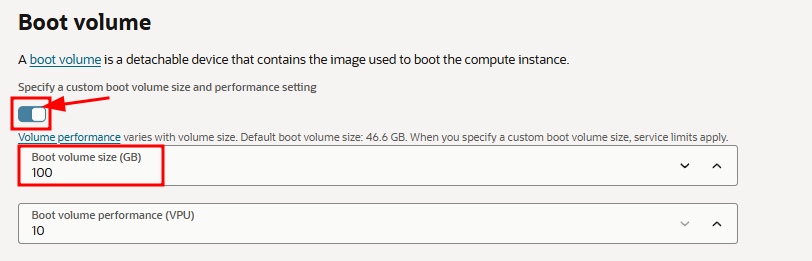{ .svg-img .dark-img }
    </figure>
10. Review the configuration and click _"Create"_.

---

## 2. Attach a public IP address to the instance
1. Open the instance details and go to the **VNIC** resource, then to the _"Networking"_ tab.
    <figure markdown>
    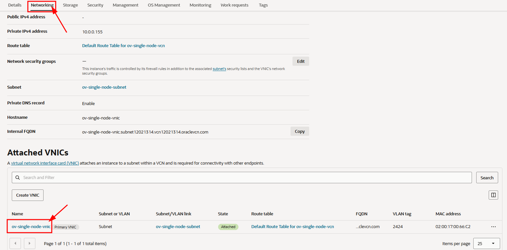{ .svg-img .dark-img }
    </figure>
2. Open the _"IP administration"_ tab. In the row of the existing IPv4 address, click the three dots menu and select _"Edit"_.
    <figure markdown>
    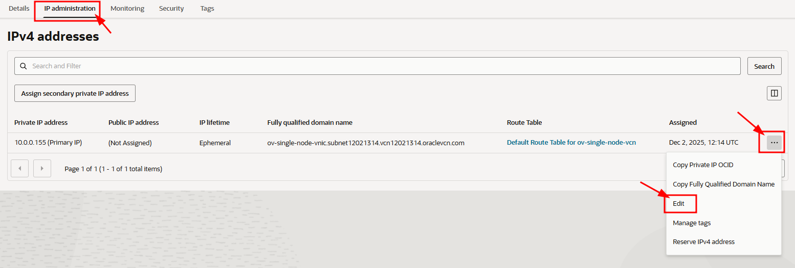{ .svg-img .dark-img }
    </figure>
3. Select _"Ephemeral public IP"_ and click _"Update"_.
    <figure markdown>
    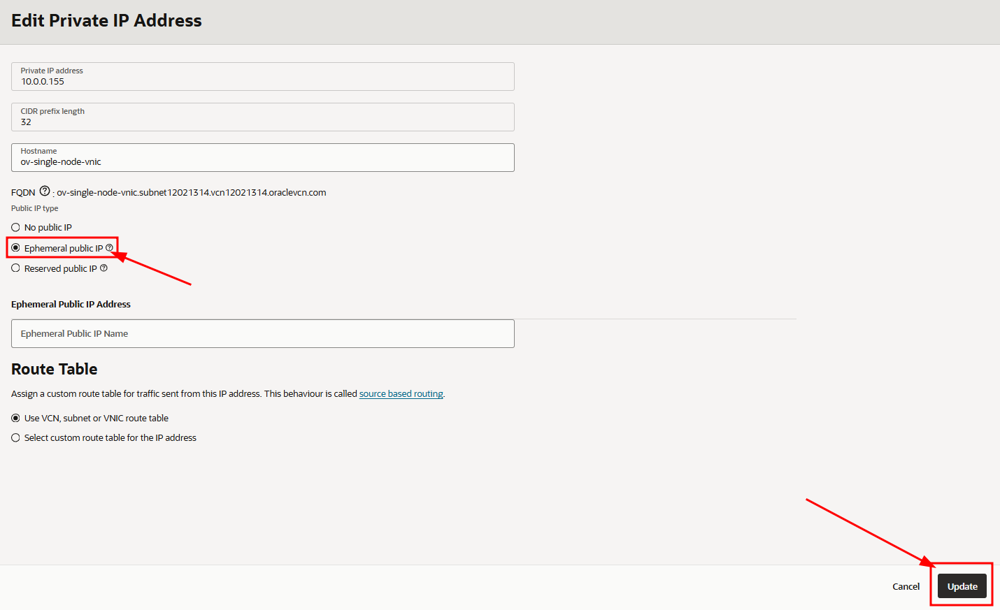{ .svg-img .dark-img }
    </figure>

---

## 3. Port rules in the network security lists
OpenVidu and WebRTC require specific inbound rules on the instance network security (OCI NSG or subnet security list) and on the instance firewall (configured later).

The [minimum inbound ports to allow](../on-premises/install.md#port-rules) must be included in the NSG rules.

1. From the instance _"Details"_ page, click the _"Virtual cloud network"_ resource.
    <figure markdown>
    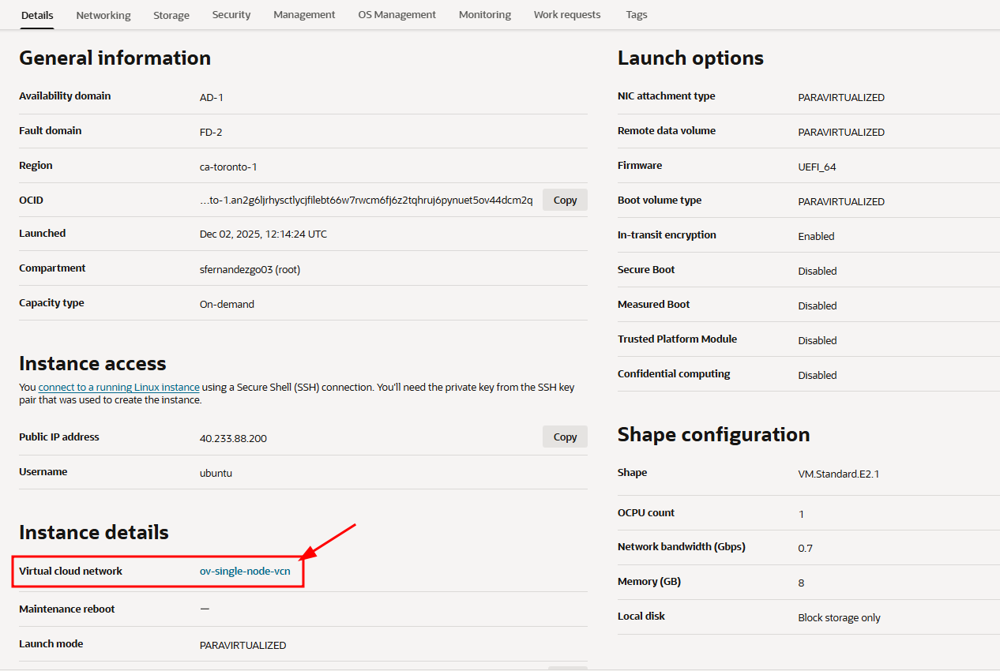{ .svg-img .dark-img }
    </figure>
2. Go to the _"Security"_ tab and click the default security list.
    <figure markdown>
    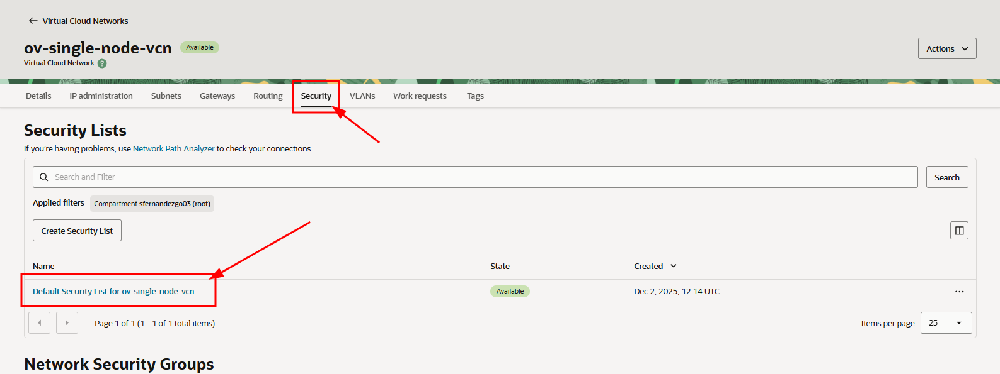{ .svg-img .dark-img }
    </figure>
3. In the _"Security Rules"_ tab, add the following **Ingress rules**.

??? "Ingress Rules"
    <figure markdown>
    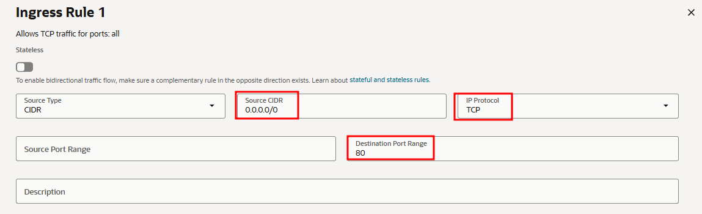{ .svg-img .dark-img }
    </figure>
    <figure markdown>
    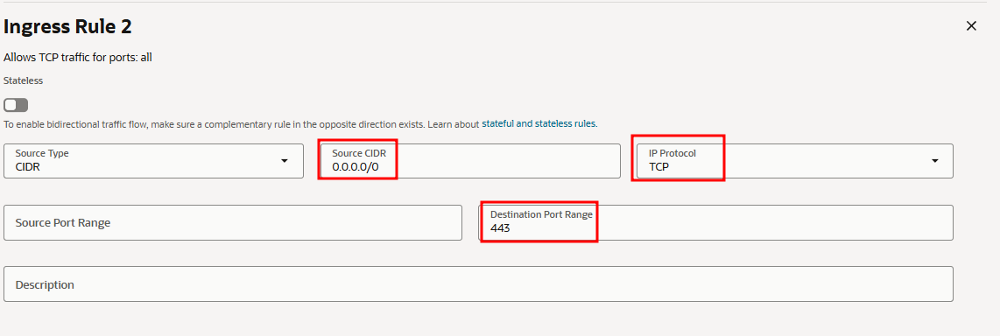{ .svg-img .dark-img }
    </figure>
    <figure markdown>
    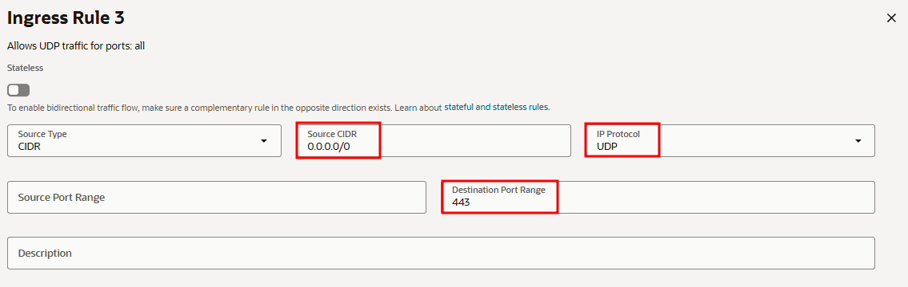{ .svg-img .dark-img }
    </figure>
    <figure markdown>
    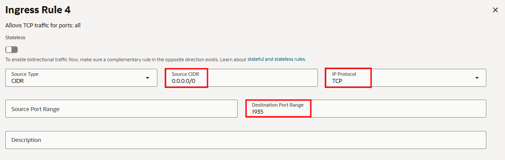{ .svg-img .dark-img }
    </figure>
    <figure markdown>
    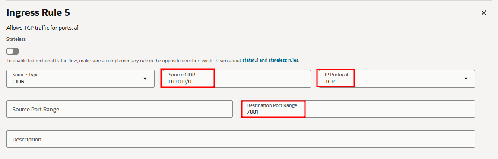{ .svg-img .dark-img }
    </figure>
    <figure markdown>
    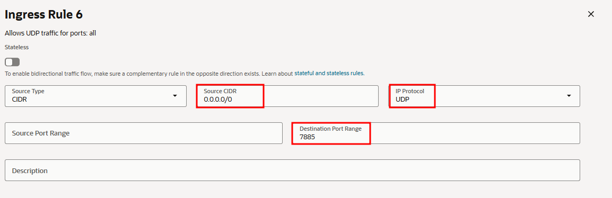{ .svg-img .dark-img }
    </figure>
    <figure markdown>
    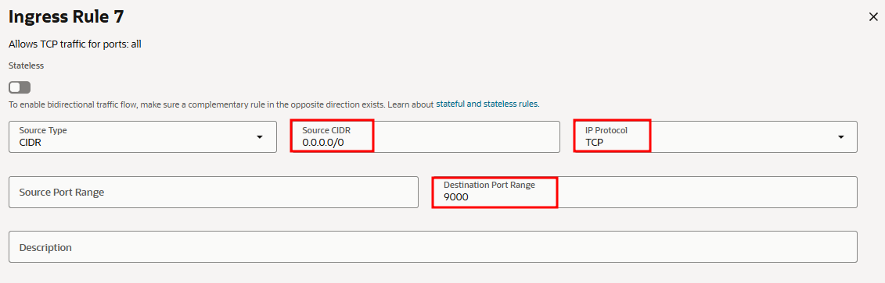{ .svg-img .dark-img }
    </figure>
    <figure markdown>
    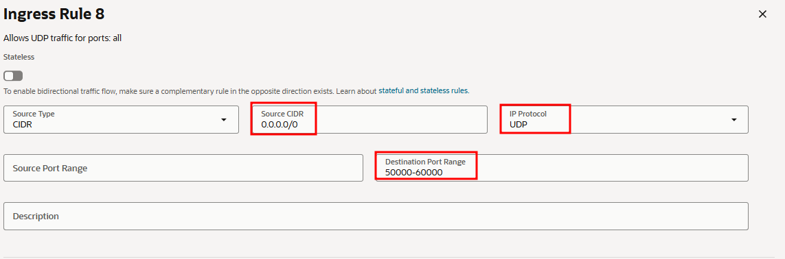{ .svg-img .dark-img }
    </figure>

---

## 4. SSH access, OpenVidu installation, and firewall rules
!!! warning
    Open the required ports before installing OpenVidu to avoid connectivity issues.

1. SSH into the instance:

```bash
ssh -i private_key_downloaded.key ubuntu@PUBLIC_IP
sudo apt update && sudo apt upgrade -y
```

2. Install and start the `firewall-cmd` tool:

```bash
sudo apt install firewalld -y
sudo systemctl enable firewalld
sudo systemctl start firewalld
```

3. Clean the existing `iptables` rules, accept all inputs, disable `iptables` persistence at startup, and restart the network service if required:

```bash
sudo iptables -F
sudo iptables -P INPUT ACCEPT
sudo systemctl disable netfilter-persistent
```

4. Add the required firewall rules:

```bash
firewall-cmd --add-port=80/tcp
firewall-cmd --permanent --add-port=80/tcp

firewall-cmd --add-port=443/tcp
firewall-cmd --permanent --add-port=443/tcp

firewall-cmd --add-port=443/udp
firewall-cmd --permanent --add-port=443/udp

firewall-cmd --add-port=1935/tcp
firewall-cmd --permanent --add-port=1935/tcp

firewall-cmd --add-port=7881/tcp
firewall-cmd --permanent --add-port=7881/tcp

firewall-cmd --add-port=7885/udp
firewall-cmd --permanent --add-port=7885/udp

firewall-cmd --add-port=9000/tcp
firewall-cmd --permanent --add-port=9000/tcp

firewall-cmd --add-port=50000-60000/udp
firewall-cmd --permanent --add-port=50000-60000/udp
```

5. Apply the rules and verify that they are correctly configured:

```bash
firewall-cmd --reload
firewall-cmd --runtime-to-permanent

firewall-cmd --list-all
```

6. Follow the [On-Premises install instructions](../on-premises/install.md) to install OpenVidu on the instance.

---

## 5. Administration and upgrade
- For administration of this OpenVidu Single Node deployment, see the [On-Premises administration section](../on-premises/admin.md).
- To upgrade OpenVidu, see the [On-Premises upgrade section](../on-premises/upgrade.md).