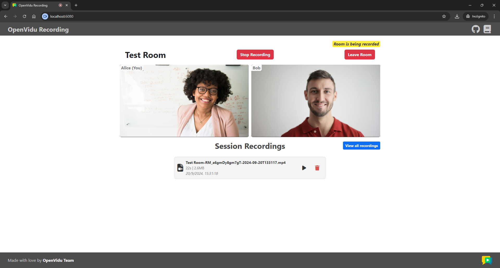

# openvidu-recording-basic-node

[Source code :simple-github:](https://github.com/OpenVidu/openvidu-livekit-tutorials/tree/master/advanced-features/openvidu-recording-basic-node){ .md-button target=\_blank }

This tutorial is a simple video-call application, built upon [Node.js server](../application-server/node.md){:target="\_blank"} and [JavaScript client](../application-client/javascript.md){:target="\_blank"} tutorials, and extends them by adding recording capabilities:

-   Start and stop recording a room.
-   List all recordings in a room.
-   Play a recording.
-   Delete a recording.
-   List all available recordings and filter them by room name.

## Running this tutorial

#### 1. Run OpenVidu Server

--8<-- "docs/docs/tutorials/shared/run-openvidu-server.md"

### 2. Download the tutorial code

```bash
git clone https://github.com/OpenVidu/openvidu-livekit-tutorials.git -b 3.0.0-beta3
```

### 3. Run the application

To run this application, you need [Node](https://nodejs.org/es/download/){:target="\_blank"} installed on your device.

1. Navigate into the application directory

```bash
cd openvidu-livekit-tutorials/advanced-features/openvidu-recording-basic-node
```

2. Install dependencies

```bash
npm install
```

3. Run the application

```bash
npm start
```

Once the server is up and running, you can test the application by visiting [`http://localhost:6080`](http://localhost:6080){:target="\_blank"}. You should see a screen like this:

<div class="grid-container">

<div class="grid-50"><p><a class="glightbox" href="../../../../assets/images/advanced-features/recording1.png" data-type="image" data-width="100%" data-height="auto" data-desc-position="bottom"></a></p></div>

<div class="grid-50"><p><a class="glightbox" href="../../../../assets/images/advanced-features/recording2.png" data-type="image" data-width="100%" data-height="auto" data-desc-position="bottom"></a></p></div>

</div>

!!! info "Accessing your application from other devices in your local network"

    One advantage of [running OpenVidu locally](#run-openvidu-locally) is that you can test your application with other devices in your local network very easily without worrying about SSL certificates.

    Access your application client through [`https://xxx-yyy-zzz-www.openvidu-local.dev:6443`](https://xxx-yyy-zzz-www.openvidu-local.dev:6443){target="_blank"}, where `xxx-yyy-zzz-www` part of the domain is your LAN private IP address with dashes (-) instead of dots (.). For more information, see section [Accessing your app from other devices in your network](../../self-hosting/local.md#accessing-your-local-deployment-from-other-devices-on-your-network){target="_blank"}.

## Understanding the code

This application consists of two essential backend files under the `src` directory:

-   `index.js`: This file holds the server application and defines the REST API endpoints.
-   `s3.service.js`: This file encapsulates the operations to interact with the S3 bucket.

And the following essential frontend files under the `public` directory:

-   `index.html`: This is the client application's main HTML file.
-   `app.js`: This is the main JavaScript file that interacts with the server application and handles the client application's logic and functionality.
-   `style.css`: This file contains the client application's styling.
-   `recordings.html`: This file defines the HTML for the general recording page.

---

### Backend

The server application extends the [Node.js server tutorial](../application-server/node.md){:target="\_blank"} by adding the following REST API endpoints:

-   **`POST /recordings/start`**: Starts the recording of a room.
-   **`POST /recordings/stop`**: Stops the recording of a room.
-   **`GET /recordings`**: Lists all recordings stored in the S3 bucket. This endpoint also allows filtering recordings by room name or room ID.
-   **`GET /recordings/:recordingName`**: Retrieves a recording from the S3 bucket and returns it as a stream.
-   **`DELETE /recordings/:recordingName`**: This endpoint deletes a recording from the S3 bucket.

Before we dive into the code of each endpoint, let's first see the changes introduced in the `index.js` file:

```javascript title="<a href='https://github.com/OpenVidu/openvidu-livekit-tutorials/blob/master/advanced-features/openvidu-recording-basic-node/src/index.js#L9-L28' target='_blank'>index.js</a>" linenums="9" hl_lines="4 8-9 17-20"
const SERVER_PORT = process.env.SERVER_PORT || 6080;

// LiveKit configuration
const LIVEKIT_URL = process.env.LIVEKIT_URL || "http://localhost:7880"; // (1)!
const LIVEKIT_API_KEY = process.env.LIVEKIT_API_KEY || "devkey";
const LIVEKIT_API_SECRET = process.env.LIVEKIT_API_SECRET || "secret";

const RECORDINGS_PATH = process.env.RECORDINGS_PATH ?? "recordings/"; // (2)!
const RECORDING_FILE_PORTION_SIZE = 5 * 1024 * 1024; // (3)!

const app = express();

app.use(cors());
app.use(express.json());
app.use(express.raw({ type: "application/webhook+json" }));

// Set the static files location
const __filename = fileURLToPath(import.meta.url);
const __dirname = path.dirname(__filename);
app.use(express.static(path.join(__dirname, "../public"))); // (4)!
```

1. The URL of the LiveKit server.
2. The path where recordings will be stored in the S3 bucket.
3. The portion size of the recording that will be sent to the client in each request. This value is set to `5 MB`.
4. Set the `public` directory as the static files location.

There are three new environment variables:

-   `LIVEKIT_URL`: The URL of the LiveKit server.
-   `RECORDINGS_PATH`: The path where recordings will be stored in the S3 bucket.
-   `RECORDING_FILE_PORTION_SIZE`: The portion size of the recording that will be sent to the client in each request.

Besides, the `index.js` file configures the server to serve static files from the `public` directory.

It also initializes the `EgressClient`, which will help interacting with [Egress API](https://docs.livekit.io/realtime/egress/api/){:target="\_blank"} to manage recordings, and the `S3Service`, which will help interacting with the S3 bucket:

```javascript title="<a href='https://github.com/OpenVidu/openvidu-livekit-tutorials/blob/master/advanced-features/openvidu-recording-basic-node/src/index.js#L59-L60' target='_blank'>index.js</a>" linenums="59"
const egressClient = new EgressClient(LIVEKIT_URL, LIVEKIT_API_KEY, LIVEKIT_API_SECRET);
const s3Service = new S3Service();
```

The `POST /token` endpoint has been modified to add the `roomRecord` permission to the access token, so that participants can start recording a room:

```javascript title="<a href='https://github.com/OpenVidu/openvidu-livekit-tutorials/blob/master/advanced-features/openvidu-recording-basic-node/src/index.js#L30-L45' target='_blank'>index.js</a>" linenums="30" hl_lines="13"
app.post("/token", async (req, res) => {
    const roomName = req.body.roomName;
    const participantName = req.body.participantName;

    if (!roomName || !participantName) {
        res.status(400).json({ errorMessage: "roomName and participantName are required" });
        return;
    }

    const at = new AccessToken(LIVEKIT_API_KEY, LIVEKIT_API_SECRET, {
        identity: participantName
    });
    at.addGrant({ roomJoin: true, room: roomName, roomRecord: true }); // (1)!
    const token = await at.toJwt();
    res.json({ token });
});
```

1. Add the `roomRecord` permission to the access token.

Now let's explore the code for each recording feature:

#### Start recording

The `POST /recordings/start` endpoint starts the recording of a room. It receives the room name of the room to record as parameter and returns the recording metadata:

```javascript title="<a href='https://github.com/OpenVidu/openvidu-livekit-tutorials/blob/master/advanced-features/openvidu-recording-basic-node/src/index.js#L62-L96' target='_blank'>index.js</a>" linenums="62"
app.post("/recordings/start", async (req, res) => {
    const { roomName } = req.body;

    if (!roomName) {
        res.status(400).json({ errorMessage: "roomName is required" });
        return;
    }

    const activeRecording = await getActiveRecordingByRoom(roomName); // (1)!

    // Check if there is already an active recording for this room
    if (activeRecording) {
        res.status(409).json({ errorMessage: "Recording already started for this room" }); // (2)!
        return;
    }

    // Use the EncodedFileOutput to save the recording to an MP4 file
    // (3)!
    const fileOutput = new EncodedFileOutput({
        fileType: EncodedFileType.MP4, // (4)!
        filepath: `${RECORDINGS_PATH}{room_name}-{room_id}-{time}` // (5)!
    });

    try {
        // Start a RoomCompositeEgress to record all participants in the room
        const egressInfo = await egressClient.startRoomCompositeEgress(roomName, { file: fileOutput }); // (6)!
        const recording = {
            name: egressInfo.fileResults[0].filename.split("/").pop(), // (7)!
            startedAt: Number(egressInfo.startedAt) / 1_000_000
        };
        res.json({ message: "Recording started", recording }); // (8)!
    } catch (error) {
        console.error("Error starting recording.", error);
        res.status(500).json({ errorMessage: "Error starting recording" });
    }
});
```

1. The `getActiveRecordingByRoom` function retrieves the active recording for a room.
2. If there is already an active recording for the room, the server returns a `409 Conflict` status code.
3. Use the `EncodedFileOutput` class to export the recording to an external file.
4. Define the file type as `MP4`.
5. Define the file path where the recording will be stored. The `{room_name}`, `{room_id}`, and `{time}` templates will be replaced by the actual room name, room ID and timestamp, respectively. Check out all available [filename templates](https://docs.livekit.io/realtime/egress/overview/#Filename-templating){:target="\_blank"}.
6. Start a `RoomCompositeEgress` to record all participants in the room by calling the `startRoomCompositeEgress` method of the `EgressClient` with the `roomName` and `fileOutput` as parameters.
7. Extract the recording name from the `fileResults` array.
8. Return the recording metadata to the client.

This endpoint does the following:

1.  Obtains the `roomName` parameter from the request body. If it is not available, it returns a `400` error.
2.  Check if there is already an active recording for the room. If there is, it returns a `409` error to prevent starting a new recording. To accomplish this, we use the `getActiveRecordingByRoom` function, which lists all active egresses for a specified room by calling the `listEgress` method of the `EgressClient` with the `roomName` and `active` parameters, and then returns the egress ID of the first active egress found:

    ```javascript title="<a href='https://github.com/OpenVidu/openvidu-livekit-tutorials/blob/master/advanced-features/openvidu-recording-basic-node/src/index.js#L130-L139' target='_blank'>index.js</a>" linenums="130"
    const getActiveRecordingByRoom = async (roomName) => {
        try {
            // List all active egresses for the room
            const egresses = await egressClient.listEgress({ roomName, active: true });
            return egresses.length > 0 ? egresses[0].egressId : null;
        } catch (error) {
            console.error("Error listing egresses.", error);
            return null;
        }
    };
    ```

3.  Initializes an `EncodedFileOutput` object to export the recording to an external file. It sets the file type as `MP4` and defines the file path where the recording will be stored. The `{room_name}`, `{room_id}`, and `{time}` templates will be replaced by the actual room name, room ID, and timestamp, respectively. Check out all available [filename templates](https://docs.livekit.io/realtime/egress/overview/#Filename-templating){:target="\_blank"}.

    !!! info "Saving recording metadata"

        The `EncodedFileOutput` class allows you to save the recording metadata to an external file. If you don't explicitly set the `disableManifest` property to `true`, the metadata will be saved in the same folder and with the same name as the recording file, but with a `.json` extension. This metadata file will contain information such as the egress ID, the recording start time, and the name and ID of the room recorded.

        This information may be insufficient depending on your requirements (e.g., you can't get the recording duration). If this is the case, you can follow the steps described in the [advanced recording tutorial](./recording-advanced.md){:target="\_blank"}, where we show how to save all necessary metadata in a separate file listening to webhook events.

4.  Starts a `RoomCompositeEgress` to record all participants in the room by calling the `startRoomCompositeEgress` method of the `EgressClient` with `roomName` and `fileOutput` as parameters.
5.  Extracts the recording name from the `fileResults` array.
6.  Returns the recording metadata to the client.

#### Stop recording

The `POST /recordings/stop` endpoint stops the recording of a room. It receives the room name of the room to stop recording as a parameter and returns the updated recording metadata:

```javascript title="<a href='https://github.com/OpenVidu/openvidu-livekit-tutorials/blob/master/advanced-features/openvidu-recording-basic-node/src/index.js#L98-L128' target='_blank'>index.js</a>" linenums="98"
app.post("/recordings/stop", async (req, res) => {
    const { roomName } = req.body;

    if (!roomName) {
        res.status(400).json({ errorMessage: "roomName is required" });
        return;
    }

    const activeRecording = await getActiveRecordingByRoom(roomName); // (1)!

    // Check if there is an active recording for this room
    if (!activeRecording) {
        res.status(409).json({ errorMessage: "Recording not started for this room" }); // (2)!
        return;
    }

    try {
        // Stop the egress to finish the recording
        const egressInfo = await egressClient.stopEgress(activeRecording); // (3)!
        const file = egressInfo.fileResults[0];
        const recording = {
            name: file.filename.split("/").pop(),
            startedAt: Number(egressInfo.startedAt) / 1_000_000,
            size: Number(file.size)
        };
        res.json({ message: "Recording stopped", recording }); // (4)!
    } catch (error) {
        console.error("Error stopping recording.", error);
        res.status(500).json({ errorMessage: "Error stopping recording" });
    }
});
```

1. The `getActiveRecordingByRoom` function retrieves the active recording for a room.
2. If there is no active recording for the room, the server returns a `409 Conflict` status code.
3. Stop the egress to finish the recording by calling the `stopEgress` method of the `EgressClient` with the egress ID (`activeRecording`) as a parameter.
4. Return the updated recording metadata to the client.

This endpoint does the following:

1. Obtains the `roomName` parameter from the request body. If it is not available, it returns a `400` error.
2. Retrieves all active egresses for the room. If there is no active egress for the room, it returns a `409` error to prevent stopping a non-existent recording.
3. Extracts the `egressId` from the active egress.
4. Stops the egress to finish the recording by calling the `stopEgress` method of the `EgressClient` with the egress ID (`activeRecording`) as a parameter.
5. Returns the updated recording metadata to the client.

#### List recordings

The `GET /recordings` endpoint lists all recordings stored in the S3 bucket. This endpoint also allows filtering recordings by room name or room ID:

```javascript title="<a href='https://github.com/OpenVidu/openvidu-livekit-tutorials/blob/master/advanced-features/openvidu-recording-basic-node/src/index.js#L141-L159' target='_blank'>index.js</a>" linenums="141"
app.get("/recordings", async (req, res) => {
    const roomName = req.query.roomName?.toString();
    const roomId = req.query.roomId?.toString();

    try {
        const keyStart = RECORDINGS_PATH + (roomName ? `${roomName}-` + (roomId ? roomId : "") : ""); // (1)!
        const keyEnd = ".mp4.json";
        const regex = new RegExp(`^${keyStart}.*${keyEnd}$`); // (2)!

        // List all egress metadata files in the recordings path that match the regex
        const payloadKeys = await s3Service.listObjects(RECORDINGS_PATH, regex); // (3)!
        const recordings = await Promise.all(payloadKeys.map((payloadKey) => getRecordingInfo(payloadKey))); // (4)!
        const sortedRecordings = filterAndSortRecordings(recordings, roomName, roomId); // (5)!
        res.json({ recordings: sortedRecordings }); // (6)!
    } catch (error) {
        console.error("Error listing recordings.", error);
        res.status(500).json({ errorMessage: "Error listing recordings" });
    }
});
```

1. Define the start of the key (path) depending on the `roomName` and `roomId` query parameters.
2. Create a regex pattern with the start and end of the key.
3. List all Egress metadata files in the recordings path in the S3 bucket that match the regex.
4. Retrieve the recording metadata for each recording that matches the regex.
5. Filter the recordings by room name and room ID and sort them by start time.
6. Return the list of recordings to the client.

This endpoint does the following:

1.  Extracts the `roomName` and `roomId` query parameters from the request.
2.  Defines the start of the key (path) depending on the `roomName` and `roomId` query parameters.
3.  Creates a regex pattern with the start and end of the key.
4.  Lists all Egress metadata files in the recordings path in the S3 bucket that match the regex. To accomplish this, we use the `listObjects` method of the `S3Service` with the `RECORDINGS_PATH` and `regex` as parameters.
5.  Retrieves the recording metadata for each recording that matches the regex. To accomplish this, we use the `getRecordingInfo` function, which retrieves the egress metadata file as JSON and the recording file size by calling the `getObjectAsJson` and `getObjectSize` methods of the `S3Service`, respectively. It then extracts the recording name from the recording key and returns the recording metadata:

    ```javascript title="<a href='https://github.com/OpenVidu/openvidu-livekit-tutorials/blob/master/advanced-features/openvidu-recording-basic-node/src/index.js#L161-L179' target='_blank'>index.js</a>" linenums="161"
    const getRecordingInfo = async (payloadKey) => {
        // Get the egress metadata file as JSON
        const data = await s3Service.getObjectAsJson(payloadKey); // (1)!

        // Get the recording file size
        const recordingKey = payloadKey.replace(".json", "");
        const size = await s3Service.getObjectSize(recordingKey); // (2)!

        const recordingName = recordingKey.split("/").pop();
        const recording = {
            id: data.egress_id,
            name: recordingName,
            roomName: data.room_name,
            roomId: data.room_id,
            startedAt: Number(data.started_at) / 1000000,
            size: size
        };
        return recording;
    };
    ```

    1. Get the egress metadata file as JSON.
    2. Get the recording file size.

6.  Filter the recordings by room name and room ID and sort them by start time. To accomplish this, we use the `filterAndSortRecordings` function:

    ```javascript title="<a href='https://github.com/OpenVidu/openvidu-livekit-tutorials/blob/master/advanced-features/openvidu-recording-basic-node/src/index.js#L181-L191' target='_blank'>index.js</a>" linenums="181"
    const filterAndSortRecordings = (recordings, roomName, roomId) => {
        let filteredRecordings = recordings;

        if (roomName || roomId) {
            filteredRecordings = recordings.filter((recording) => {
                return (!roomName || recording.roomName === roomName) && (!roomId || recording.roomId === roomId); // (1)!
            });
        }

        return filteredRecordings.sort((a, b) => b.startedAt - a.startedAt); // (2)!
    };
    ```

    1. Filter the recordings by room name and room ID if they are provided.
    2. Sort the recordings by start time in descending order.

7.  Returns the list of recordings to the client.

#### Get recording

The `GET /recordings/:recordingName` endpoint retrieves a specific portion of a recording from the S3 bucket and returns it as a stream. The server sends the recording file in portions of `5 MB` each time the client requests a range of the recording file. This is done to prevent loading the entire recording file into memory and to allow the client to play the recording while it is being downloaded and seek to a specific time:

```javascript title="<a href='https://github.com/OpenVidu/openvidu-livekit-tutorials/blob/master/advanced-features/openvidu-recording-basic-node/src/index.js#L193-L222' target='_blank'>index.js</a>" linenums="193"
app.get("/recordings/:recordingName", async (req, res) => {
    const { recordingName } = req.params;
    const { range } = req.headers;
    const key = RECORDINGS_PATH + recordingName;
    const exists = await s3Service.exists(key); // (1)!

    if (!exists) {
        res.status(404).json({ errorMessage: "Recording not found" });
        return;
    }

    try {
        // Get the recording file from S3
        const { stream, size, start, end } = await getRecordingStream(recordingName, range); // (2)!

        // Set the response headers
        res.status(206); // (3)!
        res.setHeader("Cache-Control", "no-cache"); // (4)!
        res.setHeader("Content-Type", "video/mp4"); // (5)!
        res.setHeader("Accept-Ranges", "bytes"); // (6)!
        res.setHeader("Content-Range", `bytes ${start}-${end}/${size}`); // (7)!
        res.setHeader("Content-Length", end - start + 1); // (8)!

        // Pipe the recording file to the response
        body.pipe(res).on("finish", () => res.end()); // (9)!
    } catch (error) {
        console.error("Error getting recording.", error);
        res.status(500).json({ errorMessage: "Error getting recording" });
    }
});
```

1. Check if the recording exists in the S3 bucket.
2. Get the recording file from the S3 bucket.
3. Set the response status code to `206 Partial Content`.
4. Set the `Cache-Control` header as `no-cache`.
5. Set the `Content-Type` header as `video/mp4`.
6. Set the `Accept-Ranges` header as `bytes`.
7. Set the `Content-Range` header with the start and end of the recording file and its size.
8. Set the `Content-Length` header as the size of the recording file portion.
9. Pipe the recording file to the response.

This endpoint does the following:

1.  Extracts the `recordingName` parameter from the request.
2.  Checks if the recording exists in the S3 bucket by calling the `exists` method of the `S3Service` with the `key` as a parameter. If the recording does not exist, it returns a `404` error.
3.  Gets the requested range of the recording file by calling the `getRecordingStream` function:

    ```javascript title="<a href='https://github.com/OpenVidu/openvidu-livekit-tutorials/blob/master/advanced-features/openvidu-recording-basic-node/src/index.js#L224-L236' target='_blank'>index.js</a>" linenums="224"
    const getRecordingStream = async (recordingName, range) => {
        const key = RECORDINGS_PATH + recordingName;
        const size = await s3Service.getObjectSize(key); // (1)!

        // Get the requested range
        const parts = range?.replace(/bytes=/, "").split("-");
        const start = range ? parseInt(parts[0], 10) : 0; // (2)!
        const endRange = parts[1] ? parseInt(parts[1], 10) : start + RECORDING_FILE_PORTION_SIZE; // (3)!
        const end = Math.min(endRange, size - 1); // (4)!

        const stream = await s3Service.getObject(key, { start, end }); // (5)!
        return { stream, size, start, end };
    };
    ```

    1. Get the size of the recording file.
    2. Get the start of the requested range.
    3. Get the end of the requested range or set it to the start plus the established portion size.
    4. Get the minimum between the end of the requested range and the size of the recording file minus one.
    5. Get the recording file from the S3 bucket with the requested range.

    This function does the following:

    1.  Gets the size of the recording file by calling the `getObjectSize` method of the `S3Service` with the `key` as a parameter.
    2.  Extracts the start of the requested range from the `range` header.
    3.  Extracts the end of the requested range from the `range` header. If the end is not provided, it sets the end to the start plus the established portion size.
    4.  Gets the minimum between the end of the requested range and the size of the recording file minus one. This is done to prevent requesting a range that exceeds the recording file size.
    5.  Gets the recording file from the S3 bucket with the requested range by calling the `getObject` method of the `S3Service` with the `key` and `range` as parameters.

4.  Sets the response headers:

    -   `Cache-Control`: `no-cache`.
    -   `Content-Type`: `video/mp4`.
    -   `Accept-Ranges`: `bytes`.
    -   `Content-Range`: The start and end of the recording file and its size.
    -   `Content-Length`: The size of the recording file portion.

5.  Pipes the recording file to the response.

!!! info "Direct access to S3 bucket"

    With this approach, the backend acts as a proxy between the client and S3, which may result in increased server resource usage. To avoid this, it is more efficient to provide the client with a **presigned URL**, allowing direct access to the recording files from the S3 bucket. In the [advanced recording tutorial](./recording-advanced.md){:target="\_blank"}, we show how to implement this method, along with a discussion of its advantages and disadvantages.

#### Delete recording

The `DELETE /recordings/:recordingName` endpoint deletes a recording from the S3 bucket:

```javascript title="<a href='https://github.com/OpenVidu/openvidu-livekit-tutorials/blob/master/advanced-features/openvidu-recording-basic-node/src/index.js#L238-L256' target='_blank'>index.js</a>" linenums="238"
app.delete("/recordings/:recordingName", async (req, res) => {
    const { recordingName } = req.params;
    const key = RECORDINGS_PATH + recordingName;
    const exists = await s3Service.exists(key); // (1)!

    if (!exists) {
        res.status(404).json({ errorMessage: "Recording not found" });
        return;
    }

    try {
        // Delete the recording file and metadata file from S3
        await Promise.all([s3Service.deleteObject(key), s3Service.deleteObject(`${key}.json`)]); // (2)!
        res.json({ message: "Recording deleted" });
    } catch (error) {
        console.error("Error deleting recording.", error);
        res.status(500).json({ errorMessage: "Error deleting recording" });
    }
});
```

1. Check if the recording exists in the S3 bucket.
2. Delete the recording file and metadata file from the S3 bucket.

This endpoint does the following:

1.  Extracts the `recordingName` parameter from the request.
2.  Checks if the recording exists in the S3 bucket by calling the `exists` method of the `S3Service` with the `key` as a parameter. If the recording does not exist, it returns a `404` error.
3.  Deletes the recording file and metadata file from the S3 bucket by calling the `deleteObject` method of the `S3Service` with the `key` and `${key}.json` as a parameter, respectively.

---

#### S3 service

Finally, let's take a look at the `s3.service.js` file, which encapsulates the operations to interact with the S3 bucket:

```javascript title="<a href='https://github.com/OpenVidu/openvidu-livekit-tutorials/blob/master/advanced-features/openvidu-recording-basic-node/src/s3.service.js' target='_blank'>s3.service.js</a>" linenums="9"
// S3 configuration
const S3_ENDPOINT = process.env.S3_ENDPOINT || "http://localhost:9000"; // (1)!
const S3_ACCESS_KEY = process.env.S3_ACCESS_KEY || "minioadmin"; // (2)!
const S3_SECRET_KEY = process.env.S3_SECRET_KEY || "minioadmin"; // (3)!
const AWS_REGION = process.env.AWS_REGION || "us-east-1"; // (4)!
const S3_BUCKET = process.env.S3_BUCKET || "openvidu"; // (5)!

export class S3Service {
    static instance;

    constructor() {
        if (S3Service.instance) {
            return S3Service.instance;
        }
        // (6)!
        this.s3Client = new S3Client({
            endpoint: S3_ENDPOINT,
            credentials: {
                accessKeyId: S3_ACCESS_KEY,
                secretAccessKey: S3_SECRET_KEY
            },
            region: AWS_REGION,
            forcePathStyle: true
        });

        S3Service.instance = this;
        return this;
    }
    // (7)!
    async exists(key) {
        try {
            await this.headObject(key);
            return true;
        } catch (error) {
            return false;
        }
    }
    // (8)!
    async headObject(key) {
        const params = {
            Bucket: S3_BUCKET,
            Key: key
        };
        const command = new HeadObjectCommand(params);
        return this.run(command);
    }
    // (9)!
    async getObjectSize(key) {
        const { ContentLength: size } = await this.headObject(key);
        return size;
    }
    // (10)!
    async getObject(key, range) {
        const params = {
            Bucket: S3_BUCKET,
            Key: key,
            Range: range ? `bytes=${range.start}-${range.end}` : undefined
        };
        const command = new GetObjectCommand(params);
        const { Body: body } = await this.run(command);
        return body;
    }
    // (11)!
    async getObjectAsJson(key) {
        const body = await this.getObject(key);
        const stringifiedData = await body.transformToString();
        return JSON.parse(stringifiedData);
    }
    // (12)!
    async listObjects(prefix, regex) {
        const params = {
            Bucket: S3_BUCKET,
            Prefix: prefix
        };
        const command = new ListObjectsV2Command(params);
        const { Contents: objects } = await this.run(command);

        // Filter objects by regex and return the keys
        return objects?.filter((object) => regex.test(object.Key)).map((payload) => payload.Key) ?? [];
    }
    // (13)!
    async deleteObject(key) {
        const params = {
            Bucket: S3_BUCKET,
            Key: key
        };
        const command = new DeleteObjectCommand(params);
        return this.run(command);
    }
    // (14)!
    async run(command) {
        return this.s3Client.send(command);
    }
}
```

1. The URL of the S3 server.
2. The access key of the S3 server.
3. The secret key of the S3 server.
4. The AWS region of the S3 server.
5. The name of the S3 bucket.
6. Initialize the `S3Client` with the provided configuration.
7. Check if an object exists in the S3 bucket.
8. Retrieve the metadata of an object in the S3 bucket.
9. Retrieve the size of an object in the S3 bucket.
10. Retrieve a specified range of bytes from an object in the S3 bucket.
11. Retrieve an object from the S3 bucket as JSON.
12. List objects in the S3 bucket that match a regex pattern.
13. Delete an object from the S3 bucket.
14. Execute an S3 command.

This file loads environment variables for the S3 configuration:

-   `S3_ENDPOINT`: The URL of the S3 server.
-   `S3_ACCESS_KEY`: The access key of the S3 server.
-   `S3_SECRET_KEY`: The secret key of the S3 server.
-   `AWS_REGION`: The AWS region of the S3 server.
-   `S3_BUCKET`: The name of the S3 bucket.

Then, it defines the `S3Service` class as a singleton, which initializes the `S3Client` with the provided configuration. The class encapsulates the following methods to interact with the S3 bucket:

-   `exists`: Checks if an object exists in the S3 bucket.
-   `headObject`: Retrieves the metadata of an object in the S3 bucket.
-   `getObjectSize`: Retrieves the size of an object in the S3 bucket.
-   `getObject`: Retrieves an object from the S3 bucket.
-   `getObjectAsJson`: Retrieves an object from the S3 bucket as JSON.
-   `listObjects`: Lists objects in the S3 bucket that match a regex pattern.
-   `deleteObject`: Deletes an object from the S3 bucket.
-   `run`: Executes an S3 command.

---

### Frontend

The client application extends the [JavaScript client tutorial](../application-client/javascript.md){:target="\_blank"} by adding recording features, introducing new buttons to facilitate actions such as starting and stopping recording a room, as well as listing, playing and deleting recordings. When these newly introduced buttons are interacted with, the client triggers requests to the REST API endpoints of the server application.

In order to update the user interface of all participants in the room according to the recording status, the client application subscribes to the `RoomEvent.RecordingStatusChanged` event, which is triggered when the room changes from being recorded to not being recorded, and vice versa. When this event is triggered, the `updateRecordingInfo` function is called to update the recording information of the room displayed on the screen. This function is also called when a participant joins the room, using the current value of the `room.recording` property at that moment. This is done in the `joinRoom` function of the `app.js` file:

!!! warning "Limitations of the `RoomEvent.RecordingStatusChanged` event"

    By using the `RoomEvent.RecordingStatusChanged` event, we can only detect when the recording has started or stopped, but not other states like `starting`, `stopping` or `failed`. Additionally, when the recording stops, the event is not triggered until the recorder participant leaves the room, causing a delay of 20 seconds approximately between the stop and when participants are notified.

    To overcome these limitations, you can follow the steps described in the [advanced recording tutorial](./recording-advanced.md){:target="\_blank"}, where we implement a custom notification system. This system informs participants about the recording status by listening to webhook events and updating room metadata.

```javascript title="<a href='https://github.com/OpenVidu/openvidu-livekit-tutorials/blob/master/advanced-features/openvidu-recording-basic-node/public/app.js#L20-L76' target='_blank'>app.js</a>" linenums="20" hl_lines="25-28 51-52"
async function joinRoom() {
    // Disable 'Join' button
    document.getElementById("join-button").disabled = true;
    document.getElementById("join-button").innerText = "Joining...";

    // Initialize a new Room object
    room = new LivekitClient.Room();

    // Specify the actions when events take place in the room
    // On every new Track received...
    room.on(LivekitClient.RoomEvent.TrackSubscribed, (track, _publication, participant) => {
        addTrack(track, participant.identity);
    });

    // On every new Track destroyed...
    room.on(LivekitClient.RoomEvent.TrackUnsubscribed, (track, _publication, participant) => {
        track.detach();
        document.getElementById(track.sid)?.remove();

        if (track.kind === "video") {
            removeVideoContainer(participant.identity);
        }
    });

    // When recording status changes...
    room.on(LivekitClient.RoomEvent.RecordingStatusChanged, async (isRecording) => {
        await updateRecordingInfo(isRecording);
    });

    try {
        // Get the room name and participant name from the form
        const roomName = document.getElementById("room-name").value;
        const userName = document.getElementById("participant-name").value;

        // Get a token from your application server with the room name and participant name
        const token = await getToken(roomName, userName);

        // Connect to the room with the LiveKit URL and the token
        await room.connect(LIVEKIT_URL, token);

        // Hide the 'Join room' page and show the 'Room' page
        document.getElementById("room-title").innerText = roomName;
        document.getElementById("join").hidden = true;
        document.getElementById("room").hidden = false;

        // Publish your camera and microphone
        await room.localParticipant.enableCameraAndMicrophone();
        const localVideoTrack = this.room.localParticipant.videoTrackPublications.values().next().value.track;
        addTrack(localVideoTrack, userName, true);

        // Update recording info
        await updateRecordingInfo(room.isRecording);
    } catch (error) {
        console.log("There was an error connecting to the room:", error.message);
        await leaveRoom();
    }
}
```

The `updateRecordingInfo` function updates the recording information of the room by changing the recording button's text and color according to the recording status. It also shows or hides the alert message that informs the user that the room is being recorded. Finally, it updates the recording list by calling the `listRecordings` function.

This function retrieves all recordings available for the room from the backend and displays their relevant information by invoking the `showRecordingList` function:

```javascript title="<a href='https://github.com/OpenVidu/openvidu-livekit-tutorials/blob/master/advanced-features/openvidu-recording-basic-node/public/app.js#L317-L354' target='_blank'>app.js</a>" linenums="317"
function showRecordingList(recordings) {
    const recordingsList = document.getElementById("recording-list");

    if (recordings.length === 0) {
        recordingsList.innerHTML = "<span>There are no recordings available</span>";
    } else {
        recordingsList.innerHTML = "";
    }

    recordings.forEach((recording) => {
        const recordingName = recording.name;
        const recordingSize = formatBytes(recording.size ?? 0);
        const recordingDate = new Date(recording.startedAt).toLocaleString();

        const recordingContainer = document.createElement("div");
        recordingContainer.className = "recording-container";
        recordingContainer.id = recordingName;

        recordingContainer.innerHTML = `
            <i class="fa-solid fa-file-video"></i>
            <div class="recording-info">
                <p class="recording-name">${recordingName}</p>
                <p class="recording-size">${recordingSize}</p>
                <p class="recording-date">${recordingDate}</p>
            </div>
            <div class="recording-actions">
                <button title="Play" class="icon-button" onclick="displayRecording('${recordingName}')">
                    <i class="fa-solid fa-play"></i>
                </button>
                <button title="Delete" class="icon-button delete-button" onclick="deleteRecording('${recordingName}')">
                    <i class="fa-solid fa-trash"></i>
                </button>
            </div>
        `;

        recordingsList.append(recordingContainer);
    });
}
```

The `showRecordingList` function creates a new `div` element for each recording available in the room and appends it to the `recording-list` container. Each `div` element contains the recording name, size, and start date, as well as buttons to play and delete the recording.

!!! info "Recording deletion"

    When a recording is deleted, it is removed from the recording list, but only for the user who initiated the deletion. Other users will continue to see the recording in their list until it is refreshed.

    In the [advanced recording tutorial](./recording-advanced.md){:target="\_blank"}, we show how to implement a custom notification system that alerts all participants of a recording's deletion by sending data messages.

When the user clicks the play button, the `displayRecording` function is called to play the recording. This function opens a dialog window with an embedded video element and sets the source of the video to the [get recording endpoint](#get-recording) of the server application:

```javascript title="<a href='https://github.com/OpenVidu/openvidu-livekit-tutorials/blob/master/advanced-features/openvidu-recording-basic-node/public/app.js#L356-L361' target='_blank'>app.js</a>" linenums="356"
function displayRecording(recordingName) {
    const recordingVideoDialog = document.getElementById("recording-video-dialog");
    recordingVideoDialog.showModal();
    const recordingVideo = document.getElementById("recording-video");
    recordingVideo.src = `/recordings/${recordingName}`;
}
```

```html title="<a href='https://github.com/OpenVidu/openvidu-livekit-tutorials/blob/master/advanced-features/openvidu-recording-basic-node/public/index.html#L94-L99' target='_blank'>index.html</a>" linenums="94"
<dialog id="recording-video-dialog">
    <video id="recording-video" autoplay controls></video>
    <button class="btn btn-secondary" id="close-recording-video-dialog" onclick="closeRecording()">Close</button>
</dialog>
```

---

#### General recording page

The `recordings.html` file defines the HTML for the general recording page. This page lists all available recordings from all rooms and allows the user to filter them by room name. It also provides buttons to play and delete each recording.

<div class="grid-container">

<div class="grid-50"><p><a class="glightbox" href="../../../../assets/images/advanced-features/recording3.png" data-type="image" data-width="100%" data-height="auto" data-desc-position="bottom"></a></p></div>

<div class="grid-50"><p><a class="glightbox" href="../../../../assets/images/advanced-features/recording4.png" data-type="image" data-width="100%" data-height="auto" data-desc-position="bottom"></a></p></div>

</div>
