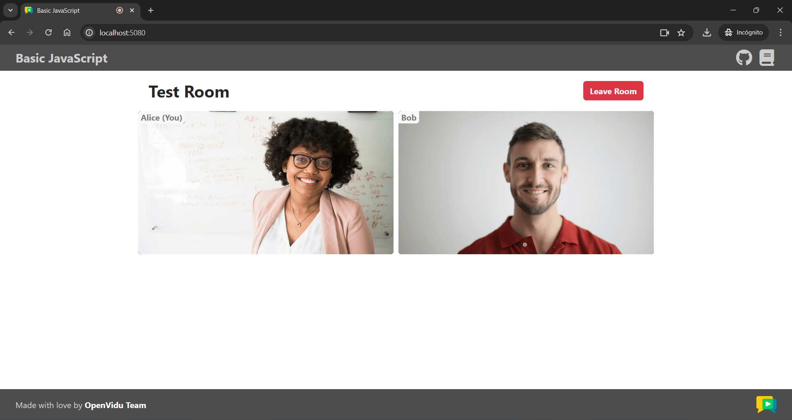

# Live Captions tutorial

[Source code :simple-github:](https://github.com/OpenVidu/openvidu-livekit-tutorials/tree/3.2.0/ai-services/openvidu-live-captions){ .md-button target=\_blank }

This tutorial is a simple variation of the [JavaScript client](../application-client/javascript.md) tutorial, adding **live captions** thanks to the use of OpenVidu [Live Captions service](../../ai/live-captions.md).

## Running this tutorial

### 1. Run OpenVidu Server

--8<-- "shared/tutorials/run-openvidu-server-speech-agent.md"

### 2. Download the tutorial code

```bash
git clone https://github.com/OpenVidu/openvidu-livekit-tutorials.git -b 3.2.0
```

### 3. Run a server application

--8<-- "shared/tutorials/application-server/application-server-tabs.md"

### 4. Run the client application

To run the client application tutorial, you need an HTTP web server installed on your development computer. A great option is [http-server](https://github.com/http-party/http-server){:target="\_blank"}. You can install it via [NPM](https://docs.npmjs.com/downloading-and-installing-node-js-and-npm){:target="\_blank"}:

```bash
npm install -g http-server
```

1. Navigate into the application client directory:

    ```bash
    cd openvidu-livekit-tutorials/ai-services/openvidu-live-captions
    ```

2. Serve the application:

    ```bash
    http-server -p 5080 ./src
    ```

Once the server is up and running, you can test the application by visiting [`http://localhost:5080`](http://localhost:5080){:target="\_blank"}. You should see a screen like this:

<div class="grid-container">

<div class="grid-50"><p><a class="glightbox" href="../../../../assets/images/application-clients/join-js.png" data-type="image" data-width="100%" data-height="auto" data-desc-position="bottom"></a></p></div>

<div class="grid-50"><p><a class="glightbox" href="../../../../assets/images/application-clients/room-js.png" data-type="image" data-width="100%" data-height="auto" data-desc-position="bottom"></a></p></div>

</div>

--8<-- "shared/tutorials/testing-other-devices.md"


## Understanding the code

You can first take a look at the [JavaScript client tutorial](../application-client/javascript.md), as this application shares the same codebase. The only thing added by this tutorial is a new handle for the [`Room`](https://docs.livekit.io/reference/client-sdk-js/classes/Room.html){:target="\_blank"} object to receive transcription messages and display them as live captions in the HTML:

```javascript title="<a href='https://github.com/OpenVidu/openvidu-livekit-tutorials/blob/3.2.0/ai-services/openvidu-live-captions/src/app.js#L60-L81' target='_blank'>app.js</a>" linenums="60"
room.registerTextStreamHandler("lk.transcription", async (reader, participantInfo) => { // (1)!
    const message = await reader.readAll(); // (2)!
    const isFinal = reader.info.attributes["lk.transcription_final"] === "true"; // (3)!

    if (isFinal) {
      const audioTrackId = reader.info.attributes["lk.transcribed_track_id"]; // (4)!

      // Due to a bug in LiveKit Server the participantInfo object may be empty.
      // You can still get the participant owning the audio track like below:
      const participant = [room.localParticipant]
        .concat(Array.from(room.remoteParticipants.values()))
        .find((p) => p.audioTrackPublications.has(audioTrackId));

      const captionsTextarea = document.getElementById("captions"); // (5)!
      const timestamp = new Date().toLocaleTimeString();
      const participantIdentity =
        participant == room.localParticipant ? "You" : participant.identity;
      captionsTextarea.value += `[${timestamp}] ${participantIdentity}: ${message}\n`;
      captionsTextarea.scrollTop = captionsTextarea.scrollHeight;
    }
  }
);
```

1. Use method [Room.registerTextStreamHandler](https://docs.livekit.io/reference/client-sdk-js/classes/Room.html#registertextstreamhandler){:target="\_blank"} to register a handler on topic `lk.transcription`. Transcription messages will arrive to this handler.
2. Await each transcription message.
3. Read attribute `lk.transcription_final` to determine if the transcription message is a final or an interim one. See [Final vs Interim transcriptions](../../ai/live-captions.md#final-vs-interim-transcriptions).
4. Read attribute `lk.transcribed_track_id` to know which specific audio track has been transcribed.
5. Build your live caption message as desired and append it to the HTML.

Using method [Room.registerTextStreamHandler](https://docs.livekit.io/reference/client-sdk-js/classes/Room.html#registertextstreamhandler){:target="\_blank"} we subscribe to topic `lk.transcription`. All transcription messages will arrive to this handler.

Apart from the message itself (which you get by awaiting method `reader.readAll()`) there are two main attributes in the transcription message (which you can access via `reader.info.attributes`):

- `lk.transcription_final`: Indicates whether the transcription message is final or interim. See [Final vs Interim transcriptions](../../ai/live-captions.md#final-vs-interim-transcriptions) for more details.
- `lk.transcribed_track_id`: The ID of the audio track that has been transcribed. This is useful to know which specific participant's audio track has been transcribed, if necessary.

Once you have all the information about the transcription message, you can build your live caption text as desired and display it in the HTML (in this case, using a simple `<textarea>` element).