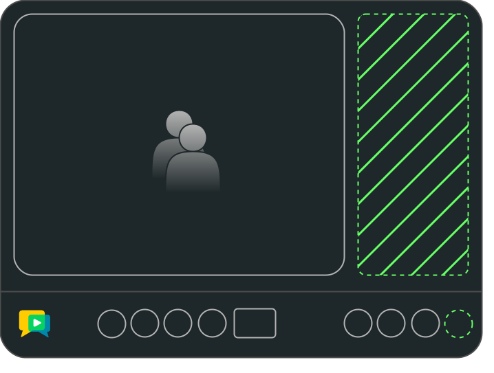

# openvidu-additional-panels

[Source code :simple-github:](https://github.com/OpenVidu/openvidu-tutorials/tree/master/openvidu-components-angular/openvidu-additional-panels){ .md-button target=\_blank }

The **openvidu-additional-panels** tutorial demonstrates how to add new panels to the videoconference, providing a more tailored user experience.

Adding new videoconference panels is made simple with the **AdditionalPanelsDirective**, which offers a straightforward way to replace and adapt the **PanelComponent** to your needs.

<figure markdown>
  { loading=lazy .svg-img  .mkdocs-img}
  <figcaption>OpenVidu Components - Additional Panel</figcaption>
</figure>

This tutorial combines the use of the **ToolbarAdditionalPanelButtonsDirective** and the **AdditionalPanelsDirective** to add new buttons to the toolbar and new panels to the videoconference. If you want to learn how to add new buttons to the toolbar, you can check the [openvidu-toolbar-panel-buttons](./openvidu-toolbar-panel-buttons.md) tutorial.

## Running this tutorial

#### 1. Run OpenVidu Server

--8<-- "docs/docs/tutorials/shared/run-openvidu-server.md"

#### 2. Download the tutorial code

```bash
git clone https://github.com/OpenVidu/openvidu-livekit-tutorials.git
git clone https://github.com/OpenVidu/openvidu-tutorials.git
```

#### 3. Run the server application

--8<-- "docs/docs/tutorials/shared/run-application-server.md"

#### 4. Run the openvidu-additional-panels tutorial

To run the client application tutorial, you need [Node](https://nodejs.org/en/download){:target="\_blank"} installed on your development computer.

1.  Navigate into the application client directory:

    ```bash
      cd openvidu-tutorials/openvidu-components/openvidu-additional-panels
    ```

2.  Install the required dependencies:

    ```bash
      npm install
    ```

3.  Serve the application:

    ```bash
      npm start
    ```

Once the server is up and running, you can test the application by visiting [`http://localhost:5080`](http://localhost:5080){:target="\_blank"}.

<!-- { loading=lazy } -->

--8<-- "docs/docs/tutorials/shared/testing-other-devices.md"

## Understanding the code

--8<-- "docs/docs/tutorials/shared/openvidu-components-files.md"

---

--8<-- "docs/docs/tutorials/shared/openvidu-components-install.md"

=== "main.ts"

    --8<-- "docs/docs/tutorials/shared/openvidu-components-import.md"

=== "app.component.ts"

    Use the `ov-videoconference` component to create a videoconference. This component requires a token to connect to the OpenVidu Room. The `AppComponent` class is responsible for requesting the token and passing it to the `ov-videoconference` component.

    ```typescript
    import { OpenViduComponentsModule } from 'openvidu-components-angular';

    @Component({
      selector: 'app-root',
      template:`
        <!-- OpenVidu Video Conference Component -->
        <ov-videoconference
          [token]="token"
          [livekitUrl]="LIVEKIT_URL"
          (onTokenRequested)="onTokenRequested($event)"
        >
          <!-- Additional Toolbar Buttons -->
          <div *ovToolbarAdditionalPanelButtons style="text-align: center;">
            <button mat-icon-button (click)="toggleMyPanel('my-panel1')">
              <mat-icon>360</mat-icon>
            </button>
            <button mat-icon-button (click)="toggleMyPanel('my-panel2')">
              <mat-icon>star</mat-icon>
            </button>
          </div>

          <!-- Additional Panels -->
          <div *ovAdditionalPanels id="my-panels">
            @if (showExternalPanel) {
            <div id="my-panel1">
              <h2>NEW PANEL 1</h2>
              <p>This is my new additional panel</p>
            </div>
            } @if (showExternalPanel2) {
            <div id="my-panel2">
              <h2>NEW PANEL 2</h2>
              <p>This is another new panel</p>
            </div>
            }
          </div>
        </ov-videoconference>
      `,
      styles: [''],
      standalone: true,
      imports: [OpenViduComponentsModule, MatIconButton, MatIcon],
    })
    export class AppComponent {
      // For local development, leave these variables empty
      // For production, configure them with correct URLs depending on your deployment

      APPLICATION_SERVER_URL = '';  // (1)!
      LIVEKIT_URL = ''; // (2)!

      // The name of the room to join.
      roomName = 'openvidu-additional-panels';  // (3)!

      // The token used to join the room.
      token!: string; // (4)!

      // Flags to control the visibility of external panels
      showExternalPanel: boolean = false; // (5)!
      showExternalPanel2: boolean = false; // (6)!

      constructor(private httpClient: HttpClient) {
        this.configureUrls();
      }

      private configureUrls() {
        // If APPLICATION_SERVER_URL is not configured, use default value from local development
        if (!this.APPLICATION_SERVER_URL) {
          if (window.location.hostname === 'localhost') {
            this.APPLICATION_SERVER_URL = 'http://localhost:6080/';
          } else {
            this.APPLICATION_SERVER_URL =
              'https://' + window.location.hostname + ':6443/';
          }
        }

        // If LIVEKIT_URL is not configured, use default value from local development
        if (!this.LIVEKIT_URL) {
          if (window.location.hostname === 'localhost') {
            this.LIVEKIT_URL = 'ws://localhost:7880/';
          } else {
            this.LIVEKIT_URL = 'wss://' + window.location.hostname + ':7443/';
          }
        }
      }

      ngOnInit() {
        this.subscribeToPanelToggling(); // (7)!
      }

      // Requests a token to join the room with the given participant name.
      async onTokenRequested(participantName: string) { // (8)!
        const { token } = await this.getToken(this.roomName, participantName);
        this.token = token;
      }

      // Subscribe to panel toggling events
      subscribeToPanelToggling() {
        this.panelService.panelStatusObs.subscribe((ev: PanelStatusInfo) => { // (9)!
          this.showExternalPanel = ev.isOpened && ev.panelType === 'my-panel1';
          this.showExternalPanel2 = ev.isOpened && ev.panelType === 'my-panel2';
        });
      }

      // Toggle the visibility of external panels
      toggleMyPanel(type: string) { // (10)!
        this.panelService.togglePanel(type);
      }

      // Retrieves a token to join the room with the given name and participant name.
      getToken(roomName: string, participantName: string): Promise<any> { // (11)!
        // Requesting token to the server application
      }
    }
    ```

    1. `APPLICATION_SERVER_URL`: URL to communicate the client application with the server application to request OpenVidu tokens.
    2. `LIVEKIT_URL`: URL to communicate the client application with the LiveKit server.
    3. `roomName`: OpenVidu Room identifier. This is the room where the VideoconferenceComponent will connect.
    4. `token`: OpenVidu Token used to connect to the OpenVidu Room.
    5. `showExternalPanel`: Flag to control the visibility of the first external panel.
    6. `showExternalPanel2`: Flag to control the visibility of the second external panel.
    7. `subscribeToPanelToggling` method that subscribes to panel toggling events.
    8. `onTokenRequested` method that fires when the VideoconferenceComponent requests a token to connect to the OpenVidu Room.
    9. `panelService.panelStatusObs` observable that listens to panel toggling events.
    10. `toggleMyPanel` method that toggles the visibility of external panels.
    11. `getToken` method that requests a token to the server application.

    The `app.component.ts` file declares the following properties and methods:

    - `APPLICATION_SERVER_URL`: URL to communicate the client application with the server application to request OpenVidu tokens.
    - `LIVEKIT_URL`: URL to communicate the client application with the LiveKit server.
    - `roomName`: OpenVidu Room identifier. This is the room where the VideoconferenceComponent will connect.
    - `token`: OpenVidu Token used to connect to the OpenVidu Room.
    - `showExternalPanel`: Flag to control the visibility of the first external panel.
    - `showExternalPanel2`: Flag to control the visibility of the second external panel.
    - `subscribeToPanelToggling` method that subscribes to panel toggling events.
    - `onTokenRequested` method that fires when the VideoconferenceComponent requests a token to connect to the OpenVidu Room.
    - `panelService.panelStatusObs` observable that listens to panel toggling events.
    - `toggleMyPanel` method that toggles the visibility of external panels.
    - `getToken` method that requests a token to the server application.

    --8<-- "docs/docs/tutorials/shared/configure-urls.md"

=== "styles.scss"

    --8<-- "docs/docs/tutorials/shared/openvidu-components-styles.md"

### Adding new panels

The `*ovPanel` directive is used to replace the default videoconference panels with a custom ones.
In the `app.component.ts` file, you can see the following code snippet:

```typescript
@Component({
	selector: 'app-root',
	template: `
		<!-- OpenVidu Video Conference Component -->
		<ov-videoconference
			[token]="token"
			[livekitUrl]="LIVEKIT_URL"
			[toolbarDisplayRoomName]="false"
			(onTokenRequested)="onTokenRequested($event)"
		>
			<!-- Additional Toolbar Buttons -->
			<div *ovToolbarAdditionalPanelButtons style="text-align: center;">
				<button mat-icon-button (click)="toggleMyPanel('my-panel1')">
					<mat-icon>360</mat-icon>
				</button>
				<button mat-icon-button (click)="toggleMyPanel('my-panel2')">
					<mat-icon>star</mat-icon>
				</button>
			</div>

			<!-- Additional Panels -->
			<div *ovAdditionalPanels id="my-panels">
				@if (showExternalPanel) {
				<div id="my-panel1">
					<h2>NEW PANEL 1</h2>
					<p>This is my new additional panel</p>
				</div>
				} @if (showExternalPanel2) {
				<div id="my-panel2">
					<h2>NEW PANEL 2</h2>
					<p>This is another new panel</p>
				</div>
				}
			</div>
		</ov-videoconference>
	`,
	styles: [''],
	standalone: true,
	imports: [OpenViduComponentsModule, MatIconButton, MatIcon],
})
export class AppComponent {
	// ...
}
```

In this code snippet, the `*ovToolbarAdditionalPanelButtons` directive is used to add new buttons to the toolbar and the `*ovAdditionalPanels` directive is used to add new panels to the videoconference.

When the user clicks on the buttons, the `toggleMyPanel` method is called to toggle the visibility of the new panels. These new panels are handled by the `showExternalPanel` and `showExternalPanel2` flags.

<!-- ## Deploying openvidu-additional-panels

#### 1) Build the docker image

Under the root project folder, you can see the `openvidu-components/docker/` directory. Here it is included all the required files yo make it possible the deployment with OpenVidu.

First of all, you will need to create the **openvidu-additional-panels** docker image. Under `openvidu-components/docker/` directory you will find the `create_image.sh` script. This script will create the docker image with the [openvidu-basic-node](application-server/openvidu-basic-node/) as application server and the static files.

```bash
./create_image.sh openvidu/openvidu-additional-panels-demo:X.Y.Z openvidu-additional-panels
```

The script needs two parameters:

1. The name of the docker image to create.
2. The name of the tutorial folder.

This script will create an image named `openvidu/openvidu-additional-panels-demo:X.Y.Z`. This name will be used in the next step.

#### 2) Deploy the docker image

Time to deploy the docker image. You can follow the [Deploy OpenVidu based application with Docker](/deployment/deploying-openvidu-apps/#with-docker) guide for doing this. -->
