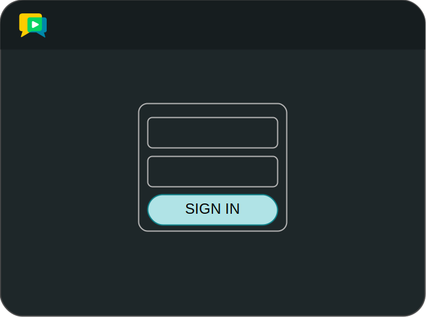
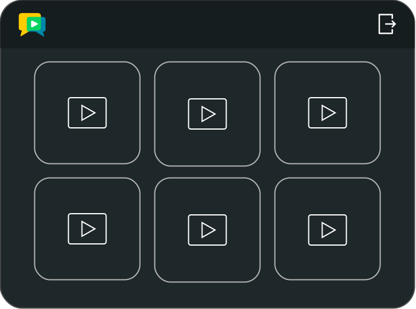

# openvidu-admin-dashboard

[Source code :simple-github:](https://github.com/OpenVidu/openvidu-tutorials/tree/master/openvidu-components-angular/openvidu-admin-dashboard){ .md-button target=\_blank }

The **openvidu-admin-dashboard** tutorial demonstrates how to create an admin dashboard to manage the recordings of a videoconference using the OpenVidu Components Angular library.

<div class="grid cards" markdown>

<figure markdown>
  { loading=lazy .svg-img  .mkdocs-img}
  <figcaption>OpenVidu Components - Admin Login</figcaption>
</figure>

<figure markdown>
  { loading=lazy .svg-img  .mkdocs-img}
  <figcaption>OpenVidu Components - Admin Dashboard</figcaption>
</figure>

</div>

## Running this tutorial

#### 1. Run OpenVidu Server

--8<-- "docs/docs/tutorials/shared/run-openvidu-server.md"

#### 2. Download the tutorial code

```bash
git clone https://github.com/OpenVidu/openvidu-livekit-tutorials.git
git clone https://github.com/OpenVidu/openvidu-tutorials.git
```

#### 3. Run the server application

--8<-- "docs/docs/tutorials/shared/run-application-server.md"

#### 4. Run the openvidu-admin-dashboard tutorial

To run the client application tutorial, you need [Node](https://nodejs.org/en/download){:target="\_blank"} installed on your development computer.

1.  Navigate into the application client directory:

    ```bash
      cd openvidu-tutorials/openvidu-components/openvidu-admin-dashboard
    ```

2.  Install the required dependencies:

    ```bash
      npm install
    ```

3.  Serve the application:

    ```bash
      npm start
    ```

Once the server is up and running, you can test the application by visiting [`http://localhost:5080`](http://localhost:5080){:target="\_blank"}.

--8<-- "docs/docs/tutorials/shared/testing-other-devices.md"

## Understanding the code

--8<-- "docs/docs/tutorials/shared/openvidu-components-files.md"

---

--8<-- "docs/docs/tutorials/shared/openvidu-components-install.md"

=== "main.ts"

    --8<-- "docs/docs/tutorials/shared/openvidu-components-import.md"

=== "app.component.ts"

    Use the `ov-admin-login` component to create a login form and the `ov-admin-dashboard` component to create the admin dashboard.

    ```typescript
    import { OpenViduComponentsModule } from 'openvidu-components-angular';

    @Component({
      selector: 'app-root',
      template:`
        @if (logged) {
        <ov-admin-dashboard
          [recordingsList]="recordings()"
          (onLogoutRequested)="onLogoutRequested()"
          (onRefreshRecordingsRequested)="onRefreshRecordingsRequested()"
          (onLoadMoreRecordingsRequested)="onLoadMoreRecordingsRequested()"
          (onRecordingDeleteRequested)="onRecordingDeleteRequested($event)"
        ></ov-admin-dashboard>
        } @else {
        <ov-admin-login (onLoginRequested)="onLoginRequested($event)">
        </ov-admin-login>
        }
      `,
      styles: [''],
      standalone: true,
      imports: [OpenViduComponentsModule],
    })
    export class AppComponent {

      roomName = 'openvidu-admin-dashboard'; // (1)!

      logged: boolean = false; // (2)!

      // Recordings list to show in the dashboard
      // This is a dummy list, you should replace it with your own list from the server
      recordings: WritableSignal<RecordingInfo[]> = signal([ // (3)!
        {
          id: 'recording1',
          roomName: this.roomName,
          roomId: 'roomId1',
          outputMode: RecordingOutputMode.COMPOSED,
          status: RecordingStatus.READY,
          filename: 'sampleRecording.mp4',
          startedAt: new Date().getTime(),
          endedAt: new Date().getTime(),
          duration: 0,
          size: 100,
          location: 'http://localhost:8080/recordings/recording1',
        }
      ]);

      constructor() {}

      onLoginRequested(credentials: { username: string; password: string }) { // (4)!
        console.log(`Login button clicked ${credentials}`);
        /**
         * WARNING! This code is developed for didactic purposes only.
         * The authentication process should be done in the server side.
         **/
        this.logged = true;
      }

      onLogoutRequested() { // (5)!
        console.log('Logout button clicked');
        /**
         * WARNING! This code is developed for didactic purposes only.
         * The authentication process should be done in the server side.
         **/
        this.logged = false;
      }

      onRefreshRecordingsRequested() { // (6)!
        console.log('Refresh recording clicked');
        /**
         * WARNING! This code is developed for didactic purposes only.
         * The authentication process should be done in the server side.
         **/
        // Getting the recordings from the server
        this.recordings.update(() => [
          {
            id: 'recording1',
            roomName: this.title,
            roomId: 'roomId1',
            outputMode: RecordingOutputMode.COMPOSED,
            status: RecordingStatus.READY,
            filename: 'sampleRecording1.mp4',
            startedAt: new Date().getTime(),
            endedAt: new Date().getTime(),
            duration: 0,
            size: 100,
            location: 'http://localhost:8080/recordings/recording1',
          },
        ]);
      }

      onLoadMoreRecordingsRequested() { // (7)!
        console.log('Load more recordings clicked');
      }

      onRecordingDeleteRequested(recording: RecordingDeleteRequestedEvent) { // (8)!
        console.log(`Delete recording clicked ${recording.recordingId}`);
        /**
         * WARNING! This code is developed for didactic purposes only.
         * The authentication process should be done in the server side.
         **/
        // Deleting the recording from the server
        this.recordings.update((recordings) =>
          recordings.filter((rec) => rec.id !== recording.recordingId)
        );

        console.log(this.recordings());
      }
    }
    ```

    1. `roomName`: OpenVidu Room name.
    2. `logged`: Boolean that indicates if the user is logged in.
    3. `recordings`: Dummy list of recordings to show in the dashboard. You should replace it with your own list from the server from the server.
    4. `onLoginRequested` method that fires when the login button is clicked.
    5. `onLogoutRequested` method that fires when the logout button is clicked.
    6. `onRefreshRecordingsRequested` method that fires when the refresh recordings button is clicked.
    7. `onLoadMoreRecordingsRequested` method that fires when the load more recordings button is clicked.
    8. `onRecordingDeleteRequested` method that fires when the delete recording button is clicked.


    The `app.component.ts` file declares the following properties and methods:

    - `roomName`: OpenVidu Room name.
    - `logged`: Boolean that indicates if the user is logged in.
    - `recordings`: Dummy list of recordings to show in the dashboard. You should replace it with your own list from the server from the server.
    - `onLoginRequested` method that fires when the login button is clicked.
    - `onLogoutRequested` method that fires when the logout button is clicked.
    - `onRefreshRecordingsRequested` method that fires when the refresh recordings button is clicked.
    - `onLoadMoreRecordingsRequested` method that fires when the load more recordings button is clicked.
    - `onRecordingDeleteRequested` method that fires when the delete recording button is clicked.

    --8<-- "docs/docs/tutorials/shared/configure-urls.md"

=== "styles.scss"

    --8<-- "docs/docs/tutorials/shared/openvidu-components-styles.md"
