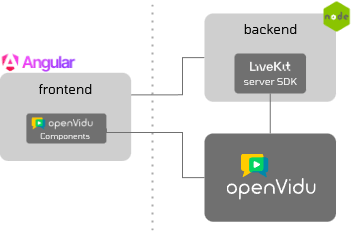

# Demo App using Angular Components

[Source code :simple-github:](https://github.com/OpenVidu/openvidu-tutorials/tree/master/openvidu-components-angular/openvidu-demo-app){ .md-button target=\_blank }

Introducing **OpenVidu Components Demo App**, the premier videoconference application that showcases the full potential of the OpenVidu platform. OpenVidu Components Demo App is not just any videoconferencing tool; it’s the default and flagship app built with the robust and versatile [OpenVidu Components](../../ui-components/angular-components.md).


<figure markdown>
  { loading=lazy .ov-call-docs-img .round-corners .mkdocs-img}
  <figcaption>OpenVidu Components Demo App</figcaption>
</figure>

## Run OpenVidu Components Demo App

#### 1. Run OpenVidu Server

=== "Run OpenVidu locally"

    --8<-- "shared/tutorials/run-openvidu-locally.md"

=== "Deploy OpenVidu"

    To use a production-ready OpenVidu deployment, visit the official [deployment guide](../self-hosting/deployment-types.md).

    !!! info "Configure Webhooks"

        OpenVidu Components Demo App have an endpoint to receive webhooks from OpenVidu. For this reason, when using a production deployment you need to configure webhooks to point to your local application server in order to make it work. Check the [Send Webhooks to a Local Application Server](../self-hosting/how-to-guides/enable-webhooks.md#send-webhooks-to-a-local-application-server){:target="\_blank"} section for more information.


#### 2. Download the demo code

```bash
git clone https://github.com/OpenVidu/openvidu-tutorials.git -b 3.4.0
```

#### 3. Run the Components Demo App backend


1. Navigate to the `backend` directory:

    ```bash
    cd openvidu-tutorials/openvidu-components-angular/openvidu-demo-app/backend
    ```

2. Install the dependencies:

    ```bash
    npm install
    ```

3. Start the application:

    ```bash
    npm run dev:start
    ```

#### 4. Run the Components Demo App frontend

Launching another terminal, under the `openvidu-tutorials/openvidu-components-angular/openvidu-demo-app` directory:

1. Navigate to the `frontend` directory:

    ```bash
    cd openvidu-tutorials/openvidu-components-angular/openvidu-demo-app/frontend
    ```

2. Install the dependencies:

    ```bash
    npm install
    ```

3. Start the application:

    ```bash
    npm run dev:start
    ```

The application will be available at [`http://localhost:5080`](http://localhost:5080){:target="\_blank"}.


## Architecture

The OpenVidu Components Demo App architecture is divided into two main components:

* **frontend**: which is the client-side application built with Angular and OpenVidu Components.
* **backend**: which is the server-side application built with Node.js and Express and uses the LiveKit Server SDK library to interact with the OpenVidu Server.

<figure markdown>
  { loading=lazy .svg-img .mkdocs-img}
  <figcaption>OpenVidu Components Demo App Architecture</figcaption>
</figure>

=== ":simple-angular:{.icon .lg-icon .tab-icon} Demo App frontend"

    The client-side application built with Angular that provides the user interface for the videoconference. It uses the OpenVidu Components library to create the videoconference layout with ease.

    The project architecture is divided into the following directories:

    - `guards`: Contains the guards that handle the authentication.
    - `models`: Contains the models that define the data structures.
    - `pages`: Contains the components that define the different pages of the application.
    - `services`: Contains the services that interact with the backend in a RESTful manner.

    Additionally, the project hosts the following files:

    - `app.component.ts`: The main file that initializes the Angular application.
    - `app-routes.ts`: Contains the routes that define the application navigation.
    - `app,config.ts`: Contains the configuration settings for the application. This file is where import for the OpenVidu Angular Components are defined.

=== ":simple-nodedotjs:{.icon .lg-icon .tab-icon} Demo App backend"

    The server-side application built with Node.js and Express that manages the communication between the OpenVidu Server and the frontend.

    It uses the LiveKit Server SDK library to interact with the OpenVidu Server and handle the authentication, videoconference rooms, recordings, broadcasts, and other features.

    The project architecture is divided into the following directories:

    - `controllers`: Contains the controllers that handle the HTTP requests.
    - `services`: Contains the services that interact with the OpenVidu Server.
    - `models`: Contains the models that define the data structures.
    - `helpers`: Contains the helper functions.

    Additionally, the project hosts the following files:

    - `server.ts`: The main file that initializes the Express application.
    - `routes.ts`: Contains the routes that define the API endpoints.
    - `config.ts`: Contains the configuration settings for the application.

## Features

### Authentication

OpenVidu Components Demo App provides user authentication to ensure that only authorized users can access the videoconference rooms. The authentication process is handled by the backend, which uses **Basic Authentication** to verify the user credentials.

### Video conferencing

#### Essential Features

OpenVidu Components Demo App offers essential features that make video conferencing simple and intuitive for users. These features include:

<div class="grid cards" markdown>

-   :material-translate-variant:{ .ov-call-docs-icon .middle } __Multilingual__

    ---

    Supports for multiple languages, allowing users to select their preferred language for the interface

-   :material-microphone:{ .ov-call-docs-icon .middle } :material-video:{ .ov-call-docs-icon .middle } __Device Selection__

    ---

    Users can choose their preferred audio and video devices before and during the call

-   :material-fullscreen:{ .ov-call-docs-icon .middle } __Fullscreen Mode__

    ---

	Offers a fullscreen mode for users to **focus on the videoconference without any distractions**


-   :material-monitor-share:{ .ov-call-docs-icon .middle } __Screen Sharing__

    ---

    Allow users to **share their screen and their camera at the same time** with other participants in the call


-   :material-view-grid-plus:{ .ov-call-docs-icon  .middle } __Powerful Layout__

    ---

    Offers a powerful layout where users can **view multiple participants simultaneously** in a **grid layout** or **focus on a single participant**

-   :material-chat:{ .ov-call-docs-icon .middle } __Chat Integration__

    ---

    Built-in chat functionality enabling participants to send text messages to the group

</div>

<br>

#### Advanced Features

The advanced features of OpenVidu Components Demo App enhance the video conferencing experience by providing additional functionalities that improve collaboration and productivity.


<div class="grid cards" markdown>

-   :material-account-voice:{ .ov-call-docs-icon .middle } __Speaker Detection__

    ---

    **Highlights the active speaker automatically**, making it easier for participants to follow the conversation

-   :material-connection:{ .ov-call-docs-icon .middle } __Automatic Reconnection__

    ---

    Ensures that **users are automatically reconnected** to the call in case of temporary network issues


-   :material-record-circle-outline:{ .ov-call-docs-icon .middle } __Recording__

    ---

    Supports recording of video conferences for later playback

-   :material-broadcast:{ .ov-call-docs-icon .middle } __Broadcasting (Live Streaming)__

    ---

    Allows **live streaming** of the video conference to platforms like **YouTube**, **Twitch**, and others **for a wider audience**

-   :material-blur:{ .ov-call-docs-icon .middle } __Virtual Backgrounds__

    ---

    Enables users to use **virtual backgrounds** during the call, **enhancing privacy and professionalism**

</div>

### Admin Dashboard

An admin dashboard is integrated into OpenVidu Components Demo App to provide additional functionalities for the admin user.

<div class="grid cards" markdown>

-   :material-lock:{ .ov-call-docs-icon .middle } __Admin Authentication__

    ---

    Provides admin authentication to ensure that only authorized users can access the admin dashboard

-   :material-note-search:{ .ov-call-docs-icon .middle } __Recording Management__

    ---

    Allows the admin user to view, download, and delete the recordings stored in the OpenVidu Server

</div>


## Build and Deployment

### Docker Image

The process to build a Docker image of OpenVidu Components Demo App is really easy, you just need to run the following instructions:

1. Build the Docker image:

	```bash
	cd docker
	./create_image.sh openvidu-components-demo-app
	```

	This script will create a Docker image with the name `openvidu-components-demo-app`.

2. Run the Docker container:

	```bash
	docker run -p 6080:6080 \
	-e LIVEKIT_URL=wss://your-livekit-server-url \
	-e LIVEKIT_API_KEY=your-livekit-api-key \
	-e LIVEKIT_API_SECRET=your-livekit-api-secret \
	openvidu-components-demo-app
	```

	Once the container is running, you can access the OpenVidu Components Demo App application by visiting [`http://localhost:6080`](http://localhost:6080){:target="\_blank"}.

### Package bundle

To build the OpenVidu Components Demo App application without using Docker, you can follow these instructions:

1. Build the frontend application

	```bash
	cd frontend
	npm install && npm run build-and-copy
    cd ..
	```

2. Build the backend application

	```bash
	cd backend
	npm install
	npm run build
	```

3. Start the backend application

	```bash
	node dist/src/server.js
	```