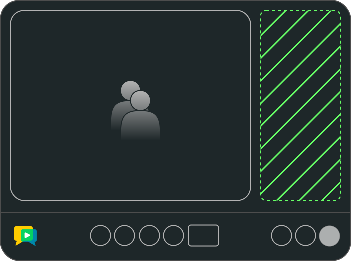

# openvidu-custom-chat-panel

[Source code :simple-github:](https://github.com/OpenVidu/openvidu-tutorials/tree/master/openvidu-components-angular/openvidu-custom-chat-panel){ .md-button target=\_blank }

The **openvidu-custom-chat-panel** tutorial demonstrates how to customize the chat panel, providing a more tailored user experience.

Replacing the default chat panel is made simple with the **ChatPanelDirective**, which offers a straightforward way to replace and adapt the **ChatPanelComponent** to your needs.

<figure markdown>
  { loading=lazy .svg-img  .mkdocs-img}
  <figcaption>OpenVidu Components - Custom Chat Panel</figcaption>
</figure>

## Running this tutorial

#### 1. Run OpenVidu Server

--8<-- "docs/docs/tutorials/shared/run-openvidu-server.md"

#### 2. Download the tutorial code

```bash
git clone https://github.com/OpenVidu/openvidu-livekit-tutorials.git
git clone https://github.com/OpenVidu/openvidu-tutorials.git
```

#### 3. Run the server application

--8<-- "docs/docs/tutorials/shared/run-application-server.md"

#### 4. Run the openvidu-custom-chat-panel tutorial

To run the client application tutorial, you need [Node](https://nodejs.org/en/download){:target="\_blank"} installed on your development computer.

1.  Navigate into the application client directory:

    ```bash
      cd openvidu-tutorials/openvidu-components/openvidu-custom-chat-panel
    ```

2.  Install the required dependencies:

    ```bash
      npm install
    ```

3.  Serve the application:

    ```bash
      npm start
    ```

Once the server is up and running, you can test the application by visiting [`http://localhost:5080`](http://localhost:5080){:target="\_blank"}.

<!-- { loading=lazy } -->

--8<-- "docs/docs/tutorials/shared/testing-other-devices.md"

## Understanding the code

--8<-- "docs/docs/tutorials/shared/openvidu-components-files.md"

---

--8<-- "docs/docs/tutorials/shared/openvidu-components-install.md"

=== "main.ts"

    --8<-- "docs/docs/tutorials/shared/openvidu-components-import.md"

=== "app.component.ts"

    Use the `ov-videoconference` component to create a videoconference. This component requires a token to connect to the OpenVidu Room. The `AppComponent` class is responsible for requesting the token and passing it to the `ov-videoconference` component.

    ```typescript
    import {
      DataPacket_Kind,
      DataPublishOptions,
      DataTopic,
      ParticipantService,
      RemoteParticipant,
      Room,
      RoomEvent,
      OpenViduComponentsModule,
    } from 'openvidu-components-angular';

    @Component({
      selector: 'app-root',
      template:`
        <!-- OpenVidu Video Conference Component -->
        <ov-videoconference
          [token]="token"
          [livekitUrl]="LIVEKIT_URL"
          [toolbarDisplayRoomName]="false"
          (onTokenRequested)="onTokenRequested($event)"
          (onRoomCreated)="onRoomCreated($event)"
        >
          <!-- Chat Panel -->
          <div *ovChatPanel id="my-panel">
            <h3>Chat</h3>
            <div>
              <ul>
                @for (msg of messages; track msg) {
                <li>{{ msg }}</li>
                }
              </ul>
            </div>
            <input value="Hello" #input />
            <button (click)="send(input.value)">Send</button>
          </div>
        </ov-videoconference>
      `,
      styles: [''],
      standalone: true,
      imports: [OpenViduComponentsModule],
    })
    export class AppComponent {
      // For local development, leave these variables empty
      // For production, configure them with correct URLs depending on your deployment

      APPLICATION_SERVER_URL = '';  // (1)!
      LIVEKIT_URL = ''; // (2)!

      // The name of the room to join.
      roomName = 'openvidu-custom-chat-panel';  // (3)!

      // The token used to join the room.
      token!: string; // (4)!

      messages: string[] = []; // (5)!

      constructor(private httpClient: HttpClient, private participantService: ParticipantService) {
        this.configureUrls();
      }

      private configureUrls() {
        // If APPLICATION_SERVER_URL is not configured, use default value from local development
        if (!this.APPLICATION_SERVER_URL) {
          if (window.location.hostname === 'localhost') {
            this.APPLICATION_SERVER_URL = 'http://localhost:6080/';
          } else {
            this.APPLICATION_SERVER_URL =
              'https://' + window.location.hostname + ':6443/';
          }
        }

        // If LIVEKIT_URL is not configured, use default value from local development
        if (!this.LIVEKIT_URL) {
          if (window.location.hostname === 'localhost') {
            this.LIVEKIT_URL = 'ws://localhost:7880/';
          } else {
            this.LIVEKIT_URL = 'wss://' + window.location.hostname + ':7443/';
          }
        }
      }

      // Requests a token to join the room with the given participant name.
      async onTokenRequested(participantName: string) { // (6)!
        const { token } = await this.getToken(this.roomName, participantName);
        this.token = token;
      }

      /**
       * Handles the creation of a new room and sets up an event listener for receiving data.
       *
       * @param room - The Room object that was created.
       */
      onRoomCreated(room: Room) { // (7)!
        // Set up an event listener for the RoomEvent.DataReceived event.
        room.on(RoomEvent.DataReceived, ( // (8)!
          payload: Uint8Array,
          participant?: RemoteParticipant,
          _?: DataPacket_Kind,
          topic?: string
        ) => {
          // Check if the received data topic is related to chat messages.
          if (topic === DataTopic.CHAT) {
            // Decode the payload from Uint8Array to a string and parse it as JSON.
            const { message } = JSON.parse(new TextDecoder().decode(payload));

            // Get the participant's name or default to 'Unknown' if not available.
            const participantName = participant?.name || 'Unknown';

            // Add the received message to the messages array.
            this.messages.push(message);

            // Log the received message and the participant's name to the console.
            console.log(`Message received from ${participantName}:`, message);
          }
        });
      }

      // Function to send a chat message
      async send(message: string): Promise<void> { // (9)!
        const strData = JSON.stringify({ message });
        const data: Uint8Array = new TextEncoder().encode(strData);
        const options: DataPublishOptions = { topic: DataTopic.CHAT };
        await this.participantService.publishData(data, options);
        this.messages.push(message);
      }

      // Retrieves a token to join the room with the given name and participant name.
      getToken(roomName: string, participantName: string): Promise<any> { // (10)!
        // Requesting token to the server application
      }
    }
    ```

    1. `APPLICATION_SERVER_URL`: URL to communicate the client application with the server application to request OpenVidu tokens.
    2. `LIVEKIT_URL`: URL to communicate the client application with the LiveKit server.
    3. `roomName`: OpenVidu Room identifier. This is the room where the VideoconferenceComponent will connect.
    4. `token`: OpenVidu Token used to connect to the OpenVidu Room.
    5. `messages` array that stores the chat messages.
    6. `onTokenRequested` method that fires when the VideoconferenceComponent requests a token to connect to the OpenVidu Room.
    7. `onRoomCreated` method that handles the creation of a new room and sets up an event listener for receiving data.
    8. Event listener for the RoomEvent.DataReceived event that listens to chat messages.
    9. `send` method that sends a chat message.
    10. `getToken` method that requests a token to the server application.

    The `app.component.ts` file declares the following properties and methods:

    - `APPLICATION_SERVER_URL`: URL to communicate the client application with the server application to request OpenVidu tokens.
    - `LIVEKIT_URL`: URL to communicate the client application with the LiveKit server.
    - `roomName`: OpenVidu Room identifier. This is the room where the VideoconferenceComponent will connect.
    - `token`: OpenVidu Token used to connect to the OpenVidu Room.
    - `messages` array that stores the chat messages.
    - `onTokenRequested` method that fires when the VideoconferenceComponent requests a token to connect to the OpenVidu Room.
    - `onRoomCreated` method that handles the creation of a new room and sets up an event listener for receiving data.
    - Event listener for the RoomEvent.DataReceived event that listens to chat messages.
    - `send` method that sends a chat message.
    - `getToken` method that requests a token to the server application.

    --8<-- "docs/docs/tutorials/shared/configure-urls.md"

=== "styles.scss"

    --8<-- "docs/docs/tutorials/shared/openvidu-components-styles.md"

### Customizing chat panel

This tutorial uses the `*ovChatPanel` directive with the aim of replacing the default chat panel with a custom one.

In the `app.component.ts` file, you can see the following code snippet:

```typescript
@Component({
	selector: 'app-root',
	template: `
		<!-- OpenVidu Video Conference Component -->
		<ov-videoconference
			[token]="token"
			[livekitUrl]="LIVEKIT_URL"
			(onTokenRequested)="onTokenRequested($event)"
			(onRoomCreated)="onRoomCreated($event)"
		>
			<!-- Chat Panel -->
			<div *ovChatPanel id="my-panel">
				<h3>Chat</h3>
				<div>
					<ul>
						@for (msg of messages; track msg) {
						<li>{{ msg }}</li>
						}
					</ul>
				</div>
				<input value="Hello" #input />
				<button (click)="send(input.value)">Send</button>
			</div>
		</ov-videoconference>
	`,
	styles: [''],
	standalone: true,
	imports: [OpenViduComponentsModule],
})
export class AppComponent {
	// ...
}
```


<!-- ## Deploying openvidu-custom-chat-panel

#### 1) Build the docker image

Under the root project folder, you can see the `openvidu-components/docker/` directory. Here it is included all the required files yo make it possible the deployment with OpenVidu.

First of all, you will need to create the **openvidu-custom-chat-panel** docker image. Under `openvidu-components/docker/` directory you will find the `create_image.sh` script. This script will create the docker image with the [openvidu-basic-node](application-server/openvidu-basic-node/) as application server and the static files.

```bash
./create_image.sh openvidu/openvidu-custom-chat-panel-demo:X.Y.Z openvidu-custom-chat-panel
```

The script needs two parameters:

1. The name of the docker image to create.
2. The name of the tutorial folder.

This script will create an image named `openvidu/openvidu-custom-chat-panel-demo:X.Y.Z`. This name will be used in the next step.

#### 2) Deploy the docker image

Time to deploy the docker image. You can follow the [Deploy OpenVidu based application with Docker](/deployment/deploying-openvidu-apps/#with-docker) guide for doing this. -->
