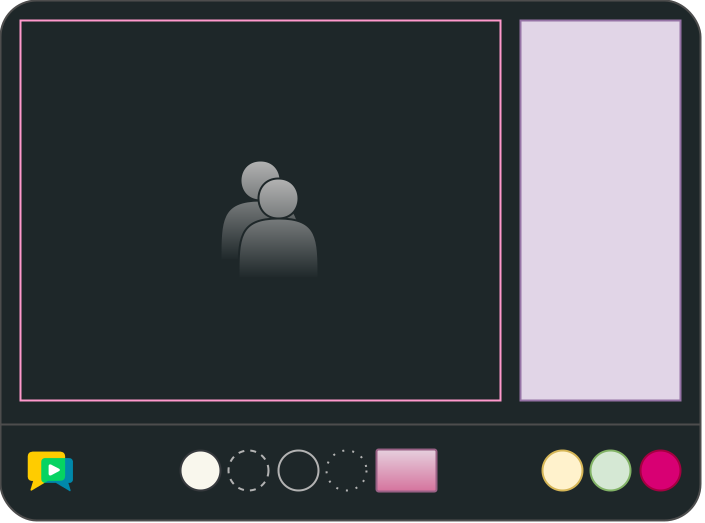

# openvidu-custom-ui

[Source code :simple-github:](https://github.com/OpenVidu/openvidu-tutorials/tree/master/openvidu-components-angular/openvidu-custom-ui){ .md-button target=\_blank }

Creating a unique and intuitive user interface (UI) is essential for ensuring a great user experience. **OpenVidu Components Angular** allows for flexibility in UI customization to fit your application's design requirements.


<figure markdown>
  { loading=lazy .svg-img  .mkdocs-img}
  <figcaption>OpenVidu Components - Custom UI</figcaption>
</figure>


## Running this tutorial

#### 1. Run OpenVidu Server

--8<-- "docs/docs/tutorials/shared/run-openvidu-server.md"

#### 2. Download the tutorial code

```bash
git clone https://github.com/OpenVidu/openvidu-livekit-tutorials.git
git clone https://github.com/OpenVidu/openvidu-tutorials.git
```

#### 3. Run the server application

--8<-- "docs/docs/tutorials/shared/run-application-server.md"

#### 4. Run the openvidu-custom-ui tutorial

To run the client application tutorial, you need [Node](https://nodejs.org/en/download){:target="\_blank"} installed on your development computer.

1.  Navigate into the application client directory:

    ```bash
      cd openvidu-tutorials/openvidu-components/openvidu-custom-ui
    ```

2. Install the required dependencies:

    ```bash
      npm install
    ```

3. Serve the application:

    ```bash
      npm start
    ```

Once the server is up and running, you can test the application by visiting [`http://localhost:5080`](http://localhost:5080){:target="\_blank"}.

<!-- { loading=lazy } -->

--8<-- "docs/docs/tutorials/shared/testing-other-devices.md"

## Understanding the code

--8<-- "docs/docs/tutorials/shared/openvidu-components-files.md"


---


--8<-- "docs/docs/tutorials/shared/openvidu-components-install.md"

=== "main.ts"

    --8<-- "docs/docs/tutorials/shared/openvidu-components-import.md"

=== "app.component.ts"

    Use the `ov-videoconference` component to create a videoconference. This component requires a token to connect to the OpenVidu Room. The `AppComponent` class is responsible for requesting the token and passing it to the `ov-videoconference` component.

    ```typescript
    import { OpenViduComponentsModule } from 'openvidu-components-angular';

    @Component({
      selector: 'app-root',
      template:`
        <ov-videoconference
          [token]="token"
          [livekitUrl]="LIVEKIT_URL"
          (onTokenRequested)="onTokenRequested($event)"
        >
        </ov-videoconference>
      `,
      styles: [''],
      standalone: true,
      imports: [OpenViduComponentsModule],
    })
    export class AppComponent {
      // For local development, leave these variables empty
      // For production, configure them with correct URLs depending on your deployment

      APPLICATION_SERVER_URL = '';  // (1)!
      LIVEKIT_URL = ''; // (2)!

      // The name of the room to join.
      roomName = 'openvidu-custom-ui';  // (3)!

      // The token used to join the room.
      token!: string; // (4)!

      constructor(private httpClient: HttpClient) {
        this.configureUrls();
      }

      private configureUrls() {
        // If APPLICATION_SERVER_URL is not configured, use default value from local development
        if (!this.APPLICATION_SERVER_URL) {
          if (window.location.hostname === 'localhost') {
            this.APPLICATION_SERVER_URL = 'http://localhost:6080/';
          } else {
            this.APPLICATION_SERVER_URL =
              'https://' + window.location.hostname + ':6443/';
          }
        }

        // If LIVEKIT_URL is not configured, use default value from local development
        if (!this.LIVEKIT_URL) {
          if (window.location.hostname === 'localhost') {
            this.LIVEKIT_URL = 'ws://localhost:7880/';
          } else {
            this.LIVEKIT_URL = 'wss://' + window.location.hostname + ':7443/';
          }
        }
      }

      // Requests a token to join the room with the given participant name.
      async onTokenRequested(participantName: string) { // (5)!
        const { token } = await this.getToken(this.roomName, participantName);
        this.token = token;
      }

      // Retrieves a token to join the room with the given name and participant name.
      getToken(roomName: string, participantName: string): Promise<any> { // (6)!
        // Requesting token to the server application
      }
    }
    ```

    1. `APPLICATION_SERVER_URL`: URL to communicate the client application with the server application to request OpenVidu tokens.
    2. `LIVEKIT_URL`: URL to communicate the client application with the LiveKit server.
    3. `roomName`: OpenVidu Room identifier. This is the room where the VideoconferenceComponent will connect
    4. `token`: OpenVidu Token used to connect to the OpenVidu Room.
    5. `onTokenRequested` method that fires when the VideoconferenceComponent requests a token to connect to the OpenVidu Room.
    6. `getToken` method that requests a token to the server application.

    The `app.component.ts` file declares the following properties and methods:

    - `APPLICATION_SERVER_URL`: URL to communicate the client application with the server application to request OpenVidu tokens.
    - `LIVEKIT_URL`: URL to communicate the client application with the LiveKit server.
    - `roomName`: OpenVidu Room identifier. This is the room where the VideoconferenceComponent will connect
    - `token`: OpenVidu Token used to connect to the OpenVidu Room.
    - `onTokenRequested` method that fires when the VideoconferenceComponent requests a token to connect to the OpenVidu Room.
    - `getToken` method that requests a token to the server application.

    --8<-- "docs/docs/tutorials/shared/configure-urls.md"

=== "styles.scss"

    --8<-- "docs/docs/tutorials/shared/openvidu-components-styles.md"

#### Customizing the UI

To customize the appearance of OpenVidu Components, simply redefine the necessary CSS variables in your `styles.scss` file. For instance, to change the primary color used throughout your application, you would update the `--ov-primary-color` variable as shown below:


```css
:root {
  --ov-primary-color: #yourNewColor; /* Replace #yourNewColor with your chosen hex color code */

  /* Others variables ... */
}
```
Once you redefine a variable, the new style will automatically apply to all components in the OpenVidu UI that use that variable.

The library also allows you to customize **shape of buttons, panels and videos customization**, the **background color personalization** of panels, buttons and videoconference and also you can **change the text color**.

#### Replacing the branding logo

You can replace the branding logo with your own. Just modify the `src/assets/images/logo.png` file with your own logo.

<!-- ## Deploying openvidu-custom-ui

#### Build the docker image

Under the root project folder, you can see the `openvidu-components/docker/` directory. Here it is included all the required files yo make it possible the deployment with OpenVidu.

First of all, you will need to create the **openvidu-custom-ui** docker image. Under `openvidu-components/docker/` directory you will find the `create_image.sh` script. This script will create the docker image with the [openvidu-basic-node](application-server/openvidu-basic-node/) as application server and the static files.

```bash
./create_image.sh openvidu/openvidu-custom-ui-demo:X.Y.Z openvidu-custom-ui
```

The script needs two parameters:

1. The name of the docker image to create.
2. The name of the tutorial folder.

This script will create an image named `openvidu/openvidu-custom-ui-demo:X.Y.Z`. This name will be used in the next step.

#### Deploy the docker image

Time to deploy the docker image. You can follow the [Deploy OpenVidu based application with Docker](/deployment/deploying-openvidu-apps/#with-docker) guide for doing this. -->
