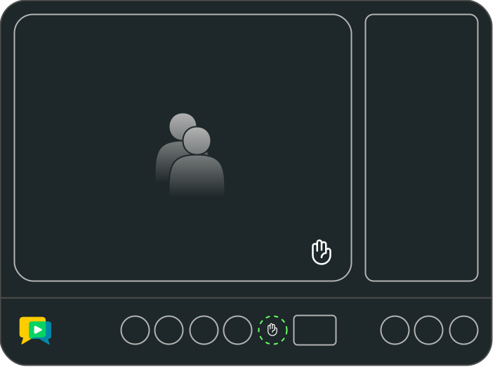

# openvidu-toggle-hand

[Source code :simple-github:](https://github.com/OpenVidu/openvidu-tutorials/tree/master/openvidu-components-angular/openvidu-toggle-hand){ .md-button target=\_blank }

The **openvidu-toggle-hand** tutorial demonstrates how to add a toggle hand feature to the OpenVidu Components Angular library.

The toggle hand feature allows participants to raise and lower their hand during a videoconference. This feature is useful for participants to signal that they want to speak or ask a question.

This tutorial combines the use of the **ToolbarAdditionalButtonsDirective**, the **StreamDirective** and the **ParticipantsPanelItemElementsDirective** to create a custom toolbar button, a custom stream component element and a custom participant panel item element. Check the [openvidu-toolbar-buttons](./openvidu-toolbar-buttons.md) and the [openvidu-custom-stream](./openvidu-custom-stream.md) tutorials documentation for learning more about these directives.

<figure markdown>
  { loading=lazy .svg-img  .mkdocs-img}
  <figcaption>OpenVidu Components - Toggle Hand</figcaption>
</figure>

## Running this tutorial

#### 1. Run OpenVidu Server

--8<-- "docs/docs/tutorials/shared/run-openvidu-server.md"

#### 2. Download the tutorial code

```bash
git clone https://github.com/OpenVidu/openvidu-livekit-tutorials.git
git clone https://github.com/OpenVidu/openvidu-tutorials.git
```

#### 3. Run the server application

--8<-- "docs/docs/tutorials/shared/run-application-server.md"

#### 4. Run the openvidu-toggle-hand tutorial

To run the client application tutorial, you need [Node](https://nodejs.org/en/download){:target="\_blank"} installed on your development computer.

1.  Navigate into the application client directory:

    ```bash
      cd openvidu-tutorials/openvidu-components/openvidu-toggle-hand
    ```

2.  Install the required dependencies:

    ```bash
      npm install
    ```

3.  Serve the application:

    ```bash
      npm start
    ```

Once the server is up and running, you can test the application by visiting [`http://localhost:5080`](http://localhost:5080){:target="\_blank"}.

<!-- { loading=lazy } -->

--8<-- "docs/docs/tutorials/shared/testing-other-devices.md"

## Understanding the code

--8<-- "docs/docs/tutorials/shared/openvidu-components-files.md"

- `app/models/participant-app.model.ts`: Contains the `ParticipantAppModel` class that extends the `ParticipantModel` class to add the ability to raise and lower the hand.

---

--8<-- "docs/docs/tutorials/shared/openvidu-components-install.md"

=== "main.ts"

    --8<-- "docs/docs/tutorials/shared/openvidu-components-import.md"

=== "app.component.ts"

    Use the `ov-videoconference` component to create a videoconference. This component requires a token to connect to the OpenVidu Room. The `AppComponent` class is responsible for requesting the token and passing it to the `ov-videoconference` component.

    ```typescript
    import {
      ParticipantModel,
      ParticipantService,
      OpenViduComponentsModule
    } from 'openvidu-components-angular';

    enum DataTopicApp {
      HAND_TOGGLE = 'handToggle'
    }

    @Component({
      selector: 'app-root',
      template:`
        <!-- OpenVidu Video Conference Component -->
        <ov-videoconference
          [prejoin]="true"
          [token]="token"
          [livekitUrl]="LIVEKIT_URL"
          (onTokenRequested)="onTokenRequested($event)"
          (onRoomCreated)="handleRemoteHand($event)"
        >
          <div *ovToolbarAdditionalButtons>
            <button toolbar-btn mat-icon-button (click)="handleLocalHand()" [class.active-btn]="hasHandRaised">
              <mat-icon matTooltip="Toggle hand">front_hand</mat-icon>
            </button>
          </div>

          <div *ovStream="let track" style="height: 100%">
            <ov-stream [track]="track"></ov-stream>
            @if (track.participant.hasHandRaised) {
            <mat-icon @inOutHandAnimation id="hand-notification">front_hand</mat-icon>
            }
          </div>

          <div *ovParticipantPanelItemElements="let participant">
            @if (participant.hasHandRaised) {
            <mat-icon>front_hand</mat-icon>
            }
          </div>
        </ov-videoconference>
      `,
      styles: [''],
      standalone: true,
      imports: [OpenViduComponentsModule, MatIconButton, MatIcon]
    })
    export class AppComponent {
      // For local development, leave these variables empty
      // For production, configure them with correct URLs depending on your deployment

      APPLICATION_SERVER_URL = '';  // (1)!
      LIVEKIT_URL = ''; // (2)!

      // The name of the room to join.
      roomName = 'openvidu-toggle-hand';  // (3)!

      // The token used to join the room.
      token!: string; // (4)!

      // Whether the local participant has raised their hand.
      hasHandRaised: boolean = false; // (5)!

      constructor(private httpClient: HttpClient, private participantService: ParticipantService) {
        this.configureUrls();
      }

      private configureUrls() {
        // If APPLICATION_SERVER_URL is not configured, use default value from local development
        if (!this.APPLICATION_SERVER_URL) {
          if (window.location.hostname === 'localhost') {
            this.APPLICATION_SERVER_URL = 'http://localhost:6080/';
          } else {
            this.APPLICATION_SERVER_URL =
              'https://' + window.location.hostname + ':6443/';
          }
        }

        // If LIVEKIT_URL is not configured, use default value from local development
        if (!this.LIVEKIT_URL) {
          if (window.location.hostname === 'localhost') {
            this.LIVEKIT_URL = 'ws://localhost:7880/';
          } else {
            this.LIVEKIT_URL = 'wss://' + window.location.hostname + ':7443/';
          }
        }
      }

      // Requests a token to join the room with the given participant name.
      async onTokenRequested(participantName: string) { // (6)!
        const { token } = await this.getToken(this.roomName, participantName);
        this.token = token;
      }

      // Handles the reception of a remote hand-raising event.
      handleRemoteHand(room: Room) { // (7)!
        // Subscribe to hand toggling events from other participants
        room.on(RoomEvent.DataReceived, (payload: Uint8Array, participant?: RemoteParticipant, _?: DataPacket_Kind, topic?: string) => { // (8)!
          if (topic === DataTopicApp.HAND_TOGGLE) {
            const p = this.participantService.getRemoteParticipantBySid(participant.sid); // (9)!
            if (p) {
              (<ParticipantAppModel>p).toggleHandRaised(); // (10)!
            }
            this.participantService.updateRemoteParticipants(); // (11)!
          }
        });
      }

      // Handles the local hand-raising event.
      async handleLocalHand() {  // (12)!
        // Get local participant with ParticipantService
        const participant = <ParticipantAppModel>this.participantService.getLocalParticipant(); // (13)!

        // Toggle the participant hand with the method we wil add in our ParticipantAppModel
        participant.toggleHandRaised(); // (14)!

        // Refresh the local participant object for others component and services
        this.participantService.updateLocalParticipant(); // (15)!

        // Send a signal with the new value to others participant using the openvidu-browser signal
        const strData = JSON.stringify({});
        const data: Uint8Array = new TextEncoder().encode(strData);
        const options: DataPublishOptions = { topic: DataTopicApp.HAND_TOGGLE };

        await this.participantService.publishData(data, options); // (16)!
      }

      // Retrieves a token to join the room with the given name and participant name.
      getToken(roomName: string, participantName: string): Promise<any> { // (17)!
        // Requesting token to the server application
      }
    }
    ```

    1. `APPLICATION_SERVER_URL`: URL to communicate the client application with the server application to request OpenVidu tokens.
    2. `LIVEKIT_URL`: URL to communicate the client application with the LiveKit server.
    3. `roomName`: OpenVidu Room identifier. This is the room where the VideoconferenceComponent will connect.
    4. `token`: OpenVidu Token used to connect to the OpenVidu Room.
    5. `hasHandRaised`: Boolean that indicates if the local participant has raised their hand.
    6. `onTokenRequested` method that fires when the VideoconferenceComponent requests a token to connect to the OpenVidu Room.
    7. `handleRemoteHand` method that handles the reception of a remote `HAND_TOGGLE`  event.
    8. `on` method that subscribes to the `DataReceived` event to handle the reception of a remote `HAND_TOGGLE` event.
    9. `getRemoteParticipantBySid` method that retrieves a remote participant by its unique ID.
    10. `toggleHandRaised` method that toggles the hand raising status of a remote participant.
    11. `updateRemoteParticipants` method that updates the list of remote participants.
    12. `handleLocalHand` method that handles the local `HAND_TOGGLE` event.
    13. `getLocalParticipant` method that retrieves the local participant.
    14. `toggleHandRaised` method that toggles the hand raising status of the local participant.
    15. `updateLocalParticipant` method that updates the local participant.
    16. `publishData` method that sends a signal to other participants.
    17. `getToken` method that requests a token to the server application.


    The `app.component.ts` file declares the following properties and methods:

    - `APPLICATION_SERVER_URL`: URL to communicate the client application with the server application to request OpenVidu tokens.
    - `LIVEKIT_URL`: URL to communicate the client application with the LiveKit server.
    - `roomName`: OpenVidu Room identifier. This is the room where the VideoconferenceComponent will connect.
    - `token`: OpenVidu Token used to connect to the OpenVidu Room.
    - `hasHandRaised`: Boolean that indicates if the local participant has raised their hand.
    - `onTokenRequested` method that fires when the VideoconferenceComponent requests a token to connect to the OpenVidu Room.
    - `handleRemoteHand` method that handles the reception of a remote `HAND_TOGGLE`  event.
    - `on` method that subscribes to the `DataReceived` event to handle the reception of a remote `HAND_TOGGLE` event.
    - `getRemoteParticipantBySid` method that retrieves a remote participant by its unique ID.
    - `toggleHandRaised` method that toggles the hand raising status of a remote participant.
    - `updateRemoteParticipants` method that updates the list of remote participants.
    - `handleLocalHand` method that handles the local `HAND_TOGGLE` event.
    - `getLocalParticipant` method that retrieves the local participant.
    - `toggleHandRaised` method that toggles the hand raising status of the local participant.
    - `updateLocalParticipant` method that updates the local participant.
    - `publishData` method that sends a signal to other participants.
    - `getToken` method that requests a token to the server application.

    --8<-- "docs/docs/tutorials/shared/configure-urls.md"

=== "models/participant-app.model.ts"

    The `ParticipantAppModel` class extends the `ParticipantModel` class to add the ability to raise and lower the hand.

    ```typescript
      import { ParticipantModel, ParticipantProperties } from 'openvidu-components-angular';

      // Represents a participant in the application, with the ability to raise their hand.
      export class ParticipantAppModel extends ParticipantModel {

        // Indicates whether the participant has raised their hand.
        hasHandRaised: boolean;

        //  Creates a new instance of ParticipantAppModel.
        constructor(props: ParticipantProperties) {
          super(props);
          this.hasHandRaised = false;
        }

        // Toggles the participant's hand raised status.
        toggleHandRaised() {
          this.hasHandRaised = !this.hasHandRaised;
        }
      }
    ```

=== "styles.scss"

    --8<-- "docs/docs/tutorials/shared/openvidu-components-styles.md"


<!-- ## Deploying openvidu-toggle-hand

#### 1) Build the docker image

Under the root project folder, you can see the `openvidu-components/docker/` directory. Here it is included all the required files yo make it possible the deployment with OpenVidu.

First of all, you will need to create the **openvidu-toggle-hand** docker image. Under `openvidu-components/docker/` directory you will find the `create_image.sh` script. This script will create the docker image with the [openvidu-basic-node](application-server/openvidu-basic-node/) as application server and the static files.

```bash
./create_image.sh openvidu/openvidu-toggle-hand-demo:X.Y.Z openvidu-toggle-hand
```

The script needs two parameters:

1. The name of the docker image to create.
2. The name of the tutorial folder.

This script will create an image named `openvidu/openvidu-toggle-hand-demo:X.Y.Z`. This name will be used in the next step.

#### 2) Deploy the docker image

Time to deploy the docker image. You can follow the [Deploy OpenVidu based application with Docker](/deployment/deploying-openvidu-apps/#with-docker) guide for doing this. -->
