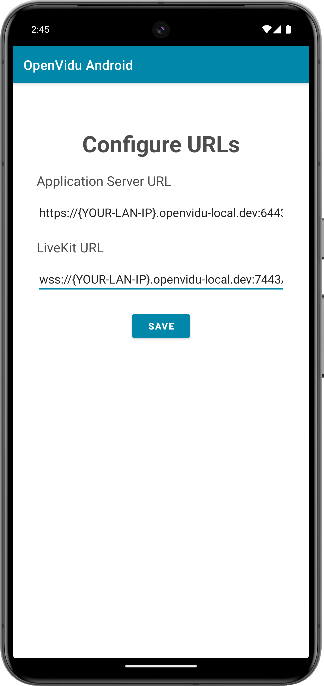

# openvidu-android

[Source code :simple-github:](https://github.com/OpenVidu/openvidu-livekit-tutorials/tree/master/application-client/openvidu-android){ .md-button target=\_blank }

This tutorial is a simple video-call application built for **Android**, using **Kotlin**, that allows:

-   Joining a video call room by requesting a token from any [application server](../application-server/index.md).
-   Publishing your camera and microphone.
-   Subscribing to all other participants' video and audio tracks automatically.
-   Leaving the video call room at any time.

It uses the [LiveKit Android Kotlin SDK](https://docs.livekit.io/client-sdk-android){:target="\_blank"} to connect to the LiveKit server and interact with the video call room.

## Running this tutorial

### 1. Run OpenVidu Server

--8<-- "docs/docs/tutorials/shared/run-openvidu-server.md"

### 2. Download the tutorial code

```bash
git clone https://github.com/OpenVidu/openvidu-livekit-tutorials.git
```

### 3. Run a server application

--8<-- "docs/docs/tutorials/shared/application-server-tabs.md"

### 4. Run the client application

To run the client application tutorial, you need [Android Studio](https://developer.android.com/studio){:target="\_blank"} installed on your development computer.

1. Open Android Studio and import the project located at `openvidu-livekit-tutorials/application-client/openvidu-android`.

2. Run the application in an emulator or a physical device by clicking the "Run" button in Android Studio. Check out the [official documentation](https://developer.android.com/studio/run){:target="\_blank"} for further information.

The application will initiate as a native Android program. Once the application is opened, you should see a screen like this:

<div class="grid-container">

<div class="grid-50"><p style="text-align: center;"><a class="glightbox" href="../../../../assets/images/application-clients/join-android.png" data-type="image" data-width="100%" data-height="auto" data-desc-position="bottom"></a></p></div>

<div class="grid-50"><p style="text-align: center;"><a class="glightbox" href="../../../../assets/images/application-clients/room-android.png" data-type="image" data-width="100%" data-height="auto" data-desc-position="bottom"></a></p></div>

</div>

!!! info "Connecting real Android device to application server running in you local network"

    One advantage of [running OpenVidu locally](#run-openvidu-locally) is that you can test your application client in a real Android device and be able to reach the application server very easily without worrying about SSL certificates if they are both running in the same local network. For more information, see section [Accessing your app from other devices in your network](../../self-hosting/local.md#accessing-your-local-deployment-from-other-devices-on-your-network){target="_blank"}.

## Understanding the code

This Android project has been generated with Android Studio. You may come across various configuration files and other items that are not essential for this tutorial. Our focus will be on the key files located within the `app/src/main/java` directory:

-   `MainActivity.kt`: This file defines the main activity of the application, which allows the user to join a video call room by providing a room name and a user name.
-   `RoomLayoutActivity.kt`: Activity responsible for managing the video call room, including publishing and subscribing to video and audio tracks.
-   `PaticipantAdapter.kt` and `ParticipantViewHolder.kt`: These files define the **Adapter** and **ViewHolder** for the **RecyclerView** that displays the participants video tracks in the video call room.
-   `Urls.kt`: Object that contains the URLs of the application server and the LiveKit server.
-   `ConfigureUrlsActivity.kt`: Activity that allows the user to configure the URLs of the application server and the LiveKit server.

The activity layout files are located in the `app/src/main/res/layout` directory.

To use LiveKit in an Android application, you need to add the [LiveKit Android Kotlin SDK](https://docs.livekit.io/client-sdk-android){:target="\_blank"} as a dependency in the `build.gradle.kts` file. This dependecy provides the necessary classes and methods to interact with the LiveKit server:

```gradle title="<a href='https://github.com/OpenVidu/openvidu-livekit-tutorials/blob/master/application-client/openvidu-android/app/build.gradle.kts#L43' target='_blank'>build.gradle.kts</a>"
dependencies {
    implementation 'io.livekit:livekit-android:2.5.0'
}
```

You will also need JitPack as a repository in the `settings.gradle.kts` file:

```gradle title="<a href='https://github.com/OpenVidu/openvidu-livekit-tutorials/blob/master/application-client/openvidu-android/settings.gradle.kts#L19' target='_blank'>settings.gradle.kts</a>"
dependencyResolutionManagement {
    //...
    repositories {
        google()
        mavenCentral()
        maven("https://jitpack.io")
    }
}
```

---

### Android specific requirements

In order to be able to test the application on an Android device, the application must ask for the necessary permissions to access the device's camera and microphone.

First, you need to add the following permissions to the `AndroidManifest.xml` file located in the `app/src/main` directory:

```xml title="<a href='https://github.com/OpenVidu/openvidu-livekit-tutorials/blob/master/application-client/openvidu-android/app/src/main/AndroidManifest.xml#L9-L12' target='_blank'>AndroidManifest.xml</a>" linenums="9"
<uses-permission android:name="android.permission.INTERNET" />
<uses-permission android:name="android.permission.CAMERA" />
<uses-permission android:name="android.permission.RECORD_AUDIO" />
<uses-permission android:name="android.permission.MODIFY_AUDIO_SETTINGS" />
```

Then, the app need to request these permissions when the user joins the video call room. This is done in the `RoomLayoutActivity.kt` file by calling the `requestNeededPermissions` method in the `onCreate` method:

```kotlin title="<a href='https://github.com/OpenVidu/openvidu-livekit-tutorials/blob/master/application-client/openvidu-android/app/src/main/java/io/openvidu/android/RoomLayoutActivity.kt#L175-L208' target='_blank'>RoomLayoutActivity.kt</a>" linenums="175"
private fun requestNeededPermissions(onHasPermissions: () -> Unit) {
    val requestPermissionLauncher =
        registerForActivityResult(ActivityResultContracts.RequestMultiplePermissions()) { grants ->
            var hasDenied = false

            // Check if any permissions weren't granted
            for (grant in grants.entries) {
                if (!grant.value) {
                    Toast.makeText(this, "Missing permission: ${grant.key}", Toast.LENGTH_SHORT)
                        .show()

                    hasDenied = true
                }
            }

            if (!hasDenied) {
                onHasPermissions()
            }
        }

    // Assemble the needed permissions to request
    val neededPermissions =
        listOf(Manifest.permission.RECORD_AUDIO, Manifest.permission.CAMERA).filter {
            ContextCompat.checkSelfPermission(
                this, it
            ) == PackageManager.PERMISSION_DENIED
        }.toTypedArray()

    if (neededPermissions.isNotEmpty()) {
        requestPermissionLauncher.launch(neededPermissions)
    } else {
        onHasPermissions()
    }
}
```

---

### Configuring URLs

The `Urls.kt` file defines an object that contains the following URLs:

-   `applicationServerUrl`: The URL of the application server. This variable is used to make requests to the server to obtain a token for joining the video call room.
-   `livekitUrl`: The URL of the LiveKit server. This variable is used to connect to the LiveKit server and interact with the video call room.

You should configure these variables with the correct URLs depending on your deployment. In case you are [running OpenVidu locally](#run-openvidu-locally), you can set the `applicationServerUrl` to [`https://xxx-yyy-zzz-www.openvidu-local.dev:6443`](https://xxx-yyy-zzz-www.openvidu-local.dev:5443){target="\_blank"} and the `livekitUrl` to [`wss://xxx-yyy-zzz-www.openvidu-local.dev:7443`](wss://xxx-yyy-zzz-www.openvidu-local.dev:5443){target="\_blank"}, where `xxx-yyy-zzz-www` part of the domain is the LAN private IP address of the machine running OpenVidu, with dashes (-) instead of dots (.).

If you leave them empty, the user will be prompted to enter the URLs when the application starts. This is done in the `ConfigureUrlsActivity.kt` file:

<div class="grid-container">

<div class="grid-100"><p style="text-align: center;"><a class="glightbox" href="../../../../assets/images/application-clients/configure-urls-android.png" data-type="image" data-width="100%" data-height="auto" data-desc-position="bottom"></a></p></div>

</div>

When the user clicks the `Save` button, the `onSaveUrls()` method is called, which saves the URLs in the `Urls` object and finishes the activity, returning to the MainActivity:

```kotlin title="<a href='https://github.com/OpenVidu/openvidu-livekit-tutorials/blob/master/application-client/openvidu-android/app/src/main/java/io/openvidu/android/ConfigureUrlsActivity.kt#L21-L32' target='_blank'>ConfigureUrlsActivity.kt</a>" linenums="21"
private fun onSaveUrls() {
    val serverUrl = binding.serverUrl.text.toString()
    val livekitUrl = binding.livekitUrl.text.toString()

    if (serverUrl.isNotEmpty() && livekitUrl.isNotEmpty()) {
        Urls.livekitUrl = binding.livekitUrl.text.toString()
        Urls.applicationServerUrl = binding.serverUrl.text.toString()
        finish()
    } else {
        Toast.makeText(this, "Please fill in all fields", Toast.LENGTH_SHORT).show()
    }
}
```

---

### Joining a room

Before joining a room, the user must provide a room name and a user name. After the user specifies them, when they click the `Join` button, the `navigateToRoomLayoutActivity()` method of the `MainActivity.kt` file is called, which simply set the values of the participant name and room name in the intent and starts the `RoomLayoutActivity`:

```kotlin title="<a href='https://github.com/OpenVidu/openvidu-livekit-tutorials/blob/master/application-client/openvidu-android/app/src/main/java/io/openvidu/android/MainActivity.kt#L33-L49' target='_blank'>MainActivity.kt</a>" linenums="33"
private fun navigateToRoomLayoutActivity() {
    binding.joinButton.isEnabled = false

    val participantName = binding.participantName.text.toString()
    val roomName = binding.roomName.text.toString()

    if (participantName.isNotEmpty() && roomName.isNotEmpty()) {
        val intent = Intent(this, RoomLayoutActivity::class.java)
        intent.putExtra("participantName", participantName)
        intent.putExtra("roomName", roomName)
        startActivity(intent)
    } else {
        Toast.makeText(this, "Please fill in all fields", Toast.LENGTH_SHORT).show()
    }

    binding.joinButton.isEnabled = true
}
```

Now let's see the code of the `RoomLayoutActivity.kt` file:

```kotlin title="<a href='https://github.com/OpenVidu/openvidu-livekit-tutorials/blob/master/application-client/openvidu-android/app/src/main/java/io/openvidu/android/RoomLayoutActivity.kt#L32-L50' target='_blank'>RoomLayoutActivity.kt</a>" linenums="32"
data class TrackInfo( // (1)!
    val track: VideoTrack,
    val participantIdentity: String,
    val isLocal: Boolean = false
)

class RoomLayoutActivity : AppCompatActivity() {
    private lateinit var binding: ActivityRoomLayoutBinding // (2)!
    private lateinit var participantAdapter: ParticipantAdapter // (3)!

    private lateinit var room: Room // (4)!
    private val participantTracks: MutableList<TrackInfo> = mutableListOf() // (5)!

    private val client = HttpClient(CIO) { // (6)!
        expectSuccess = true
        install(ContentNegotiation) {
            json()
        }
    }
```

1. `TrackInfo` data class, which groups a video track with the participant's identity.
2. The binding object for the activity layout.
3. The adapter for the RecyclerView that displays the participants' video tracks.
4. The room object, which represents the video call room.
5. A list of `TrackInfo` objects, which represent the video tracks of the participants in the room.
6. The HTTP client used to make requests to the application server.

The `RoomLayoutActivity.kt` file defines the following variables:

-   `room`: The room object, which represents the video call room.
-   `participantTracks`: A list of `TrackInfo` objects, which represent the video tracks of the participants in the room.

When the activity is created, the `onCreate` method is called. This method initializes the activity layout, create a `Room` object, initializes the `RecyclerView` and request needed permissions:

```kotlin title="<a href='https://github.com/OpenVidu/openvidu-livekit-tutorials/blob/master/application-client/openvidu-android/app/src/main/java/io/openvidu/android/RoomLayoutActivity.kt#L52-L69' target='_blank'>RoomLayoutActivity.kt</a>" linenums="52"
override fun onCreate(savedInstanceState: Bundle?) {
    super.onCreate(savedInstanceState)
    binding = ActivityRoomLayoutBinding.inflate(layoutInflater)
    setContentView(binding.root)

    binding.loader.visibility = View.VISIBLE
    binding.leaveButton.setOnClickListener {
        leaveRoom()
    }

    // Create Room object
    room = LiveKit.create(applicationContext)

    initRecyclerView()

    // Check for audio and camera permissions before connecting to the room
    requestNeededPermissions { connectToRoom() }
}
```

After the application check if the user has granted permissions, the `connectToRoom()` method is called:

```kotlin title="<a href='https://github.com/OpenVidu/openvidu-livekit-tutorials/blob/master/application-client/openvidu-android/app/src/main/java/io/openvidu/android/RoomLayoutActivity.kt#L77-L134' target='_blank'>RoomLayoutActivity.kt</a>" linenums="77"
private fun connectToRoom() {
    // Get the room name and participant name from the intent
    val participantName = intent.getStringExtra("participantName") ?: "Participant1" // (1)!
    val roomName = intent.getStringExtra("roomName") ?: "Test Room"

    binding.roomName.text = roomName // (2)!

    lifecycleScope.launch {
        // Specify the actions when events take place in the room
        launch {
            room.events.collect { event ->
                when (event) {
                    // On every new Track received...
                    is RoomEvent.TrackSubscribed -> onTrackSubscribed(event) // (3)!
                    // On every new Track destroyed...
                    is RoomEvent.TrackUnsubscribed -> onTrackUnsubscribed(event) // (4)!
                    else -> {}
                }
            }
        }

        try {
            // Get token from your application server with the room name and participant name
            val token = getToken(roomName, participantName) // (5)!

            // Connect to the room with the LiveKit URL and the token
            room.connect(Urls.livekitUrl, token) // (6)!

            // Publish your camera and microphone
            val localParticipant = room.localParticipant
            localParticipant.setMicrophoneEnabled(true) // (7)!
            localParticipant.setCameraEnabled(true)

            // Add local video track to the participantTracks list
            launch {
                localParticipant::videoTrackPublications.flow
                    .collect { publications ->
                        val videoTrack = publications.firstOrNull()?.second as? VideoTrack

                        if (videoTrack != null) {
                            participantTracks.add( // (8)!
                                0,
                                TrackInfo(videoTrack, participantName, true)
                            )
                            participantAdapter.notifyItemInserted(0)
                        }
                    }
            }

            binding.loader.visibility = View.GONE
        } catch (e: Exception) {
            println("There was an error connecting to the room: ${e.message}")
            Toast.makeText(this@RoomLayoutActivity, "Failed to join room", Toast.LENGTH_SHORT)
                .show()
            leaveRoom()
        }
    }
}
```

1. Get the room name and participant name from the intent.
2. Set the room title in the layout.
3. Event handling for when a new track is received in the room.
4. Event handling for when a track is destroyed.
5. Get a token from the application server with the room name and participant name.
6. Connect to the room with the LiveKit URL and the token.
7. Publish your camera and microphone.
8. Add local video track to the `participantTracks` list

The `connectToRoom()` method performs the following actions:

1.  It retrieves the room name and participant name from the intent.
2.  Set the room title in the layout.
3.  Event handling is configured for different scenarios within the room. These events are fired when new tracks are subscribed to and when existing tracks are unsubscribed.

    -   **`RoomEvent.TrackSubscribed`**: This event is triggered when a new track is received in the room. It manages the storage of the new track in the `participantTracks` list if it is a video track and notify the Adapter that a new item has been inserted.

    ```kotlin title="<a href='https://github.com/OpenVidu/openvidu-livekit-tutorials/blob/master/application-client/openvidu-android/app/src/main/java/io/openvidu/android/RoomLayoutActivity.kt#L136-L144' target='_blank'>RoomLayoutActivity.kt</a>" linenums="136"
    private fun onTrackSubscribed(event: RoomEvent.TrackSubscribed) {
        val track = event.track

        // If the track is a video track, add it to the participantTracks list
        if (track is VideoTrack) {
            participantTracks.add(TrackInfo(track, event.participant.identity!!.value))
            participantAdapter.notifyItemInserted(participantTracks.size - 1)
        }
    }
    ```

    -   **`RoomEvent.TrackUnsubscribed`**: This event occurs when a track is destroyed, and it takes care of removing the video track from the `participantTracks` list and notify the Adapter that an item has been removed.

    ```kotlin title="<a href='https://github.com/OpenVidu/openvidu-livekit-tutorials/blob/master/application-client/openvidu-android/app/src/main/java/io/openvidu/android/RoomLayoutActivity.kt#L146-L158' target='_blank'>RoomLayoutActivity.kt</a>" linenums="146"
    private fun onTrackUnsubscribed(event: RoomEvent.TrackUnsubscribed) {
        val track = event.track

        // If the track is a video track, remove it from the participantTracks list
        if (track is VideoTrack) {
            val index = participantTracks.indexOfFirst { it.track.sid == track.sid }

            if (index != -1) {
                participantTracks.removeAt(index)
                participantAdapter.notifyItemRemoved(index)
            }
        }
    }
    ```

    These event handlers are essential for managing the behavior of tracks within the video call.

    !!! info "Take a look at all events"

        You can take a look at all the events in the [Livekit Documentation](https://docs.livekit.io/client-sdk-js/enums/RoomEvent.html)

4.  It requests a token from the application server using the room name and participant name. This is done by calling the `getToken()` method:

    ```kotlin title="<a href='https://github.com/OpenVidu/openvidu-livekit-tutorials/blob/master/application-client/openvidu-android/app/src/main/java/io/openvidu/android/RoomLayoutActivity.kt#L210-L229' target='_blank'>RoomLayoutActivity.kt</a>" linenums="210"
    /**
     * --------------------------------------------
     * GETTING A TOKEN FROM YOUR APPLICATION SERVER
     * --------------------------------------------
     * The method below request the creation of a token to
     * your application server. This prevents the need to expose
     * your LiveKit API key and secret to the client side.
     *
     * In this sample code, there is no user control at all. Anybody could
     * access your application server endpoints. In a real production
     * environment, your application server must identify the user to allow
     * access to the endpoints.
     */
    private suspend fun getToken(roomName: String, participantName: String): String {
        val response = client.post(Urls.applicationServerUrl + "token") {
            contentType(ContentType.Application.Json)
            setBody(TokenRequest(participantName, roomName))
        }
        return response.body<TokenResponse>().token
    }
    ```

    This method sends a POST request using [Ktor Client](https://ktor.io/docs/client-create-and-configure.html){:target="\_blank"} to the application server's `/token` endpoint. The request body contains the room name and participant name. The server responds with a token that is used to connect to the room.

5.  It connects to the room using the LiveKit URL and the token.
6.  It publishes the camera and microphone tracks to the room using `setMicrophoneEnabled()` and `setCameraEnabled()` methods from `room.localParticipant`.
7.  It adds the local video track to the `participantTracks` list.

---

### Displaying Video Tracks

In order to display the video tracks of the participants in the room, the `RoomLayoutActivity` uses a `RecyclerView` with a custom `Adapter` and `ViewHolder`. This allows the application to load and display the video tracks dynamically as they are received.

Whenever a new video track is added to the `participantTracks` list, the `ParticipantAdapter` is notified that a new item has been inserted. The `ParticipantAdapter` then updates the `RecyclerView` to display the new video track by calling the `render` method of the `ParticipantViewHolder`:

```kotlin title="<a href='https://github.com/OpenVidu/openvidu-livekit-tutorials/blob/master/application-client/openvidu-android/app/src/main/java/io/openvidu/android/ParticipantViewHolder.kt#L12-L28' target='_blank'>ParticipantViewHolder.kt</a>" linenums="12"
fun render(trackInfo: TrackInfo, room: Room) {
    val participantIdentity = if (trackInfo.isLocal) {
        trackInfo.participantIdentity + " (You)"
    } else {
        trackInfo.participantIdentity
    }

    binding.identity.text = participantIdentity // (1)!

    // Only initialize the renderer once
    if (!used) {
        room.initVideoRenderer(binding.renderer) // (2)!
        used = true
    }

    trackInfo.track.addRenderer(binding.renderer) // (3)!
}
```

1. Set the participant identity in the layout.
2. Initialize the video renderer for the participant.
3. Add the video track to the renderer.

The `render` method performs the following actions:

-   It sets the participant identity in the layout.
-   It initializes the video renderer for the participant. This is done only once for each participant.
-   It adds the video track to the renderer.

---

### Leaving the room

When the user wants to leave the room, they can click the `Leave Room` button. This action calls the `leaveRoom()` method:

```kotlin title="<a href='https://github.com/OpenVidu/openvidu-livekit-tutorials/blob/master/application-client/openvidu-android/app/src/main/java/io/openvidu/android/RoomLayoutActivity.kt#L160-L173' target='_blank'>RoomLayoutActivity.kt</a>" linenums="160"
private fun leaveRoom() {
    // Leave the room by calling 'disconnect' method over the Room object
    room.disconnect() // (1)!

    client.close() // (2)!

    // Go back to the previous activity.
    finish() // (3)!
}

override fun onDestroy() { // (4)!
    super.onDestroy()
    leaveRoom()
}
```

1. Disconnect the user from the room.
2. Close the HTTP client.
3. Finish the activity and go back to the previous activity.
4. Call the `leaveRoom()` method when the activity is destroyed.

The `leaveRoom()` method performs the following actions:

-   It disconnects the user from the room by calling the `disconnect()` method on the `room` object.
-   It closes the HTTP client.
-   It finishes the activity and goes back to the previous activity.

The `onDestroy()` lifecycle method is used to ensure that the user leaves the room when the activity is destroyed.
