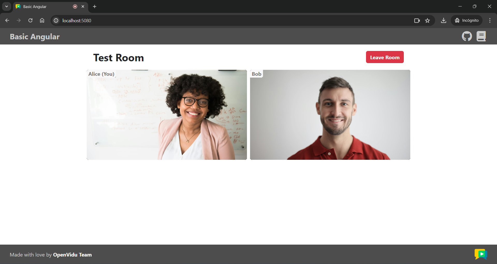

# openvidu-angular

[Source code :simple-github:](https://github.com/OpenVidu/openvidu-livekit-tutorials/tree/master/application-client/openvidu-angular){ .md-button target=\_blank }

This tutorial is a simple video-call application built with **Angular** that allows:

-   Joining a video call room by requesting a token from any [application server](../application-server/index.md).
-   Publishing your camera and microphone.
-   Subscribing to all other participants' video and audio tracks automatically.
-   Leaving the video call room at any time.

It uses the [LiveKit JS SDK](https://docs.livekit.io/client-sdk-js){:target="\_blank"} to connect to the LiveKit server and interact with the video call room.

## Running this tutorial

#### 1. Run OpenVidu Server

--8<-- "docs/docs/tutorials/shared/run-openvidu-server.md"

### 2. Download the tutorial code

```bash
git clone https://github.com/OpenVidu/openvidu-livekit-tutorials.git
```

### 3. Run a server application

--8<-- "docs/docs/tutorials/shared/application-server-tabs.md"

### 4. Run the client application

To run the client application tutorial, you need [Node](https://nodejs.org/en/download){:target="\_blank"} installed on your development computer.

1. Navigate into the application client directory:

    ```bash
    cd openvidu-livekit-tutorials/application-client/openvidu-angular
    ```

2. Install the required dependencies:

    ```bash
    npm install
    ```

3. Serve the application:

    ```bash
    npm start
    ```

Once the server is up and running, you can test the application by visiting [`http://localhost:5080`](http://localhost:5080){:target="\_blank"}. You should see a screen like this:

<div class="grid-container">

<div class="grid-50"><p><a class="glightbox" href="../../../../assets/images/application-clients/join-angular.png" data-type="image" data-width="100%" data-height="auto" data-desc-position="bottom"></a></p></div>

<div class="grid-50"><p><a class="glightbox" href="../../../../assets/images/application-clients/room-angular.png" data-type="image" data-width="100%" data-height="auto" data-desc-position="bottom"></a></p></div>

</div>

--8<-- "docs/docs/tutorials/shared/testing-other-devices.md"

## Understanding the code

This Angular project has been created using the Angular CLI tool. You may come across various configuration files and other items that are not essential for this tutorial. Our focus will be on the key files located within the `src/app/` directory:

-   `app.component.ts`: This file defines the `AppComponent`, which serves as the main component of the application. It is responsible for handling tasks such as joining a video call and managing the video calls themselves.
-   `app.component.html`: This HTML file is associated with the `AppComponent`, and it dictates the structure and layout of the main application component.
-   `app.component.css`: The CSS file linked to `AppComponent`, which controls the styling and appearance of the application's main component.
-   `VideoComponent`: Component responsible for displaying video tracks along with participant's data. It is defined in the `video.component.ts` file within the `video` directory, along with its associated HTML and CSS files.
-   `AudioComponent`: Component responsible for displaying audio tracks. It is defined in the `audio.component.ts` file within the `audio` directory, along with its associated HTML and CSS files.

To use the LiveKit JS SDK in an Angular application, you need to install the `livekit-client` package. This package provides the necessary classes and methods to interact with the LiveKit server. You can install it using the following command:

```bash
npm install livekit-client
```

Now let's see the code of the `app.component.ts` file:

```typescript title="<a href='https://github.com/OpenVidu/openvidu-livekit-tutorials/blob/master/application-client/openvidu-angular/src/app/app.component.ts#L16-L65' target='_blank'>app.component.ts</a>" linenums="16"
type TrackInfo = { // (1)!
    trackPublication: RemoteTrackPublication;
    participantIdentity: string;
};

// For local development, leave these variables empty
// For production, configure them with correct URLs depending on your deployment
var APPLICATION_SERVER_URL = ''; // (2)!
var LIVEKIT_URL = ''; // (3)!

@Component({ // (4)!
    selector: 'app-root',
    standalone: true,
    imports: [ReactiveFormsModule, AudioComponent, VideoComponent],
    templateUrl: './app.component.html',
    styleUrl: './app.component.css',
})
export class AppComponent implements OnDestroy {
    roomForm = new FormGroup({ // (5)!
        roomName: new FormControl('Test Room', Validators.required),
        participantName: new FormControl('Participant' + Math.floor(Math.random() * 100), Validators.required),
    });

    room = signal<Room | undefined>(undefined); // (6)!
    localTrack = signal<LocalVideoTrack | undefined>(undefined); // (7)!
    remoteTracksMap = signal<Map<string, TrackInfo>>(new Map()); // (8)!

    constructor(private httpClient: HttpClient) {
        this.configureUrls();
    }

    configureUrls() {
        // If APPLICATION_SERVER_URL is not configured, use default value from local development
        if (!APPLICATION_SERVER_URL) {
            if (window.location.hostname === 'localhost') {
                APPLICATION_SERVER_URL = 'http://localhost:6080/';
            } else {
                APPLICATION_SERVER_URL = 'https://' + window.location.hostname + ':6443/';
            }
        }

        // If LIVEKIT_URL is not configured, use default value from local development
        if (!LIVEKIT_URL) {
            if (window.location.hostname === 'localhost') {
                LIVEKIT_URL = 'ws://localhost:7880/';
            } else {
                LIVEKIT_URL = 'wss://' + window.location.hostname + ':7443/';
            }
        }
    }
```

1. `TrackInfo` type, which groups a track publication with the participant's identity.
2. The URL of the application server.
3. The URL of the LiveKit server.
4. Angular component decorator that defines the `AppComponent` class and associates the HTML and CSS files with it.
5. The `roomForm` object, which is a form group that contains the `roomName` and `participantName` fields. These fields are used to join a video call room.
6. The room object, which represents the video call room.
7. The local video track, which represents the user's camera.
8. Map that links track SIDs with `TrackInfo` objects. This map is used to store remote tracks and their associated participant identities.

The `app.component.ts` file defines the following variables:

-   `APPLICATION_SERVER_URL`: The URL of the application server. This variable is used to make requests to the server to obtain a token for joining the video call room.
-   `LIVEKIT_URL`: The URL of the LiveKit server. This variable is used to connect to the LiveKit server and interact with the video call room.
-   `roomForm`: A form group that contains the `roomName` and `participantName` fields. These fields are used to join a video call room.
-   `room`: The room object, which represents the video call room.
-   `localTrack`: The local video track, which represents the user's camera.
-   `remoteTracksMap`: A map that links track SIDs with `TrackInfo` objects. This map is used to store remote tracks and their associated participant identities.

--8<-- "docs/docs/tutorials/shared/configure-urls.md"

---

### Joining a Room

After the user specifies their participant name and the name of the room they want to join, when they click the `Join` button, the `joinRoom()` method is called:

```typescript title="<a href='https://github.com/OpenVidu/openvidu-livekit-tutorials/blob/master/application-client/openvidu-angular/src/app/app.component.ts#L67-L116' target='_blank'>app.component.ts</a>" linenums="67"
async joinRoom() {
    // Initialize a new Room object
    const room = new Room();
    this.room.set(room); // (1)!

    // Specify the actions when events take place in the room
    // On every new Track received...
    this.room.on(
        RoomEvent.TrackSubscribed,
        (_track: RemoteTrack, publication: RemoteTrackPublication, participant: RemoteParticipant) => { // (2)!
            this.remoteTracksMap.update((map) => {
                map.set(publication.trackSid, {
                    trackPublication: publication,
                    participantIdentity: participant.identity,
                });
                return map;
            });
        }
    );

    // On every new Track destroyed...
    room.on(RoomEvent.TrackUnsubscribed, (_track: RemoteTrack, publication: RemoteTrackPublication) => { // (3)!
        this.remoteTracksMap.update((map) => {
            map.delete(publication.trackSid);
            return map;
        });
    });

    try {
        // Get the room name and participant name from the form
        const roomName = this.roomForm.value.roomName!; // (4)!
        const participantName = this.roomForm.value.participantName!;

        // Get a token from your application server with the room name and participant name
        const token = await this.getToken(roomName, participantName); // (5)!

        // Connect to the room with the LiveKit URL and the token
        await room.connect(LIVEKIT_URL, token); // (6)!

        // Publish your camera and microphone
        await room.localParticipant.enableCameraAndMicrophone(); // (7)!
        this.localTrack.set(room.localParticipant.videoTrackPublications.values().next().value.videoTrack);
    } catch (error: any) {
        console.log(
            'There was an error connecting to the room:',
            error?.error?.errorMessage || error?.message || error
        );
        await this.leaveRoom();
    }
}
```

1. Initialize a new `Room` object.
2. Event handling for when a new track is received in the room.
3. Event handling for when a track is destroyed.
4. Get the room name and participant name from the form.
5. Get a token from the application server with the room name and participant name.
6. Connect to the room with the LiveKit URL and the token.
7. Publish your camera and microphone.

The `joinRoom()` method performs the following actions:

1.  It creates a new `Room` object. This object represents the video call room.

    !!! info

        When the room object is defined, the HTML template is automatically updated hiding the "Join room" page and showing the "Room" layout.

2.  Event handling is configured for different scenarios within the room. These events are fired when new tracks are subscribed to and when existing tracks are unsubscribed.

    -   **`RoomEvent.TrackSubscribed`**: This event is triggered when a new track is received in the room. It manages the storage of the new track in the `remoteTracksMap`, which links track SIDs with `TrackInfo` objects containing the track publication and the participant's identity.

    -   **`RoomEvent.TrackUnsubscribed`**: This event occurs when a track is destroyed, and it takes care of removing the track from the `remoteTracksMap`.

    These event handlers are essential for managing the behavior of tracks within the video call. You can further extend the event handling as needed for your application.

    !!! info "Take a look at all events"

        You can take a look at all the events in the [Livekit Documentation](https://docs.livekit.io/client-sdk-js/enums/RoomEvent.html)

3.  It retrieves the room name and participant name from the form.
4.  It requests a token from the application server using the room name and participant name. This is done by calling the `getToken()` method:

    ```typescript title="<a href='https://github.com/OpenVidu/openvidu-livekit-tutorials/blob/master/application-client/openvidu-angular/src/app/app.component.ts#L134-L152' target='_blank'>app.component.ts</a>" linenums="134"
    /**
     * --------------------------------------------
     * GETTING A TOKEN FROM YOUR APPLICATION SERVER
     * --------------------------------------------
     * The method below request the creation of a token to
     * your application server. This prevents the need to expose
     * your LiveKit API key and secret to the client side.
     *
     * In this sample code, there is no user control at all. Anybody could
     * access your application server endpoints. In a real production
     * environment, your application server must identify the user to allow
     * access to the endpoints.
     */
    async getToken(roomName: string, participantName: string): Promise<string> {
        const response = await lastValueFrom(
            this.httpClient.post<{ token: string }>(APPLICATION_SERVER_URL + 'token', { roomName, participantName })
        );
        return response.token;
    }
    ```

    This function sends a POST request using [HttpClient](https://angular.io/api/common/http/HttpClient){:target="\_blank"} to the application server's `/token` endpoint. The request body contains the room name and participant name. The server responds with a token that is used to connect to the room.

5.  It connects to the room using the LiveKit URL and the token.
6.  It publishes the camera and microphone tracks to the room using `room.localParticipant.enableCameraAndMicrophone()`, which asks the user for permission to access their camera and microphone at the same time. The local video track is then stored in the `localTrack` variable.

---

### Displaying Video and Audio Tracks

In order to display participants' video and audio tracks, the `app.component.html` file integrates the `VideoComponent` and `AudioComponent`.

```html title="<a href='https://github.com/OpenVidu/openvidu-livekit-tutorials/blob/master/application-client/openvidu-angular/src/app/app.component.html#L24-L42' target='_blank'>app.component.html</a>" linenums="24"
<div id="layout-container">
    @if (localTrack()) {
    <video-component
        [track]="localTrack()!"
        [participantIdentity]="roomForm.value.participantName!"
        [local]="true"
    ></video-component>
    }
    @for (remoteTrack of remoteTracksMap().values(); track remoteTrack.trackPublication.trackSid) {
        @if (remoteTrack.trackPublication.kind === 'video') {
        <video-component
            [track]="remoteTrack.trackPublication.videoTrack!"
            [participantIdentity]="remoteTrack.participantIdentity"
        ></video-component>
        } @else {
        <audio-component [track]="remoteTrack.trackPublication.audioTrack!" hidden></audio-component>
        }
    }
</div>
```

This code snippet does the following:

-   We use the Angular `@if` block to conditionally display the local video track using the `VideoComponent`. The `local` property is set to `true` to indicate that the video track belongs to the local participant.

    !!! info

        The audio track is not displayed for the local participant because there is no need to hear one's own audio.

-   Then, we use the Angular `@for` block to iterate over the `remoteTracksMap`. For each remote track, we create a `VideoComponent` or an `AudioComponent` depending on the track's kind (video or audio). The `participantIdentity` property is set to the participant's identity, and the `track` property is set to the video or audio track. The `hidden` attribute is added to the `AudioComponent` to hide the audio tracks from the layout.

Let's see now the code of the `video.component.ts` file:

```typescript title="<a href='https://github.com/OpenVidu/openvidu-livekit-tutorials/blob/master/application-client/openvidu-angular/src/app/video/video.component.ts#L4-L27' target='_blank'>video.component.ts</a>" linenums="3"
// (1)!
@Component({
    selector: 'video-component',
    standalone: true,
    imports: [],
    templateUrl: './video.component.html',
    styleUrl: './video.component.css',
})
export class VideoComponent implements AfterViewInit, OnDestroy {
    videoElement = viewChild<ElementRef<HTMLVideoElement>>('videoElement'); // (2)!

    track = input.required<LocalVideoTrack | RemoteVideoTrack>(); // (3)!
    participantIdentity = input.required<string>(); // (4)!
    local = input(false); // (5)!

    ngAfterViewInit() {
        if (this.videoElement()) {
            this.track().attach(this.videoElement()!.nativeElement); // (6)!
        }
    }

    ngOnDestroy() {
        this.track().detach(); // (7)!
    }
}
```

1. Angular component decorator that defines the `VideoComponent` class and associates the HTML and CSS files with it.
2. The reference to the video element in the HTML template.
3. The video track object, which can be a `LocalVideoTrack` or a `RemoteVideoTrack`.
4. The participant identity associated with the video track.
5. A boolean flag that indicates whether the video track belongs to the local participant.
6. Attach the video track to the video element when the track is set.
7. Detach the video track when the component is destroyed.

The `VideoComponent` does the following:

-   It defines the properties `track`, `participantIdentity`, and `local` as inputs of the component:

    -   `track`: The video track object, which can be a `LocalVideoTrack` or a `RemoteVideoTrack`.
    -   `participantIdentity`: The participant identity associated with the video track.
    -   `local`: A boolean flag that indicates whether the video track belongs to the local participant. This flag is set to `false` by default.

-   It creates a reference to the video element in the HTML template.
-   It attaches the video track to the video element when the view is initialized.
-   It detaches the video track when the component is destroyed.

Finally, let's see the code of the `audio.component.ts` file:

```typescript title="<a href='https://github.com/OpenVidu/openvidu-livekit-tutorials/blob/master/application-client/openvidu-angular/src/app/audio/audio.component.ts#L4-L25' target='_blank'>audio.component.ts</a>" linenums="3"
// (1)!
@Component({
    selector: 'audio-component',
    standalone: true,
    imports: [],
    templateUrl: './audio.component.html',
    styleUrl: './audio.component.css',
})
export class AudioComponent implements AfterViewInit, OnDestroy {
    audioElement = viewChild<ElementRef<HTMLAudioElement>>('audioElement'); // (2)!

    track = input.required<LocalAudioTrack | RemoteAudioTrack>(); // (3)!

    ngAfterViewInit() {
        if (this.audioElement()) {
            this.track().attach(this.audioElement()!.nativeElement); // (4)!
        }
    }

    ngOnDestroy() {
        this.track().detach(); // (5)!
    }
}
```

1. Angular component decorator that defines the `AudioComponent` class and associates the HTML and CSS files with it.
2. The reference to the audio element in the HTML template.
3. The audio track object, which can be a `RemoteAudioTrack` or a `LocalAudioTrack`, although in this case, it will always be a `RemoteAudioTrack`.
4. Attach the audio track to the audio element when view is initialized.
5. Detach the audio track when the component is destroyed.

The `AudioComponent` class is similar to the `VideoComponent` class, but it is used to display audio tracks. It attaches the audio track to the audio element when view is initialized and detaches the audio track when the component is destroyed.

---

### Leaving the Room

When the user wants to leave the room, they can click the `Leave Room` button. This action calls the `leaveRoom()` method:

```typescript title="<a href='https://github.com/OpenVidu/openvidu-livekit-tutorials/blob/master/application-client/openvidu-angular/src/app/app.component.ts#L118-L132' target='_blank'>app.component.ts</a>" linenums="118"
async leaveRoom() {
    // Leave the room by calling 'disconnect' method over the Room object
    await this.room()?.disconnect(); // (1)!

    // Reset all variables
    this.room.set(undefined); // (2)!
    this.localTrack.set(undefined);
    this.remoteTracksMap.set(new Map());
}

@HostListener('window:beforeunload') // (3)!
async ngOnDestroy() {
    // On window closed or component destroyed, leave the room
    await this.leaveRoom();
}
```

1. Disconnect the user from the room.
2. Reset all variables.
3. Call the `leaveRoom()` method when the user closes the browser window or navigates to another page.

The `leaveRoom()` method performs the following actions:

-   It disconnects the user from the room by calling the `disconnect()` method on the `room` object.
-   It resets all variables.

The `window.onbeforeunload` event and the `ngOnDestroy()` lifecycle hook are used to ensure that the user leaves the room when the browser window is closed or the component is destroyed.
