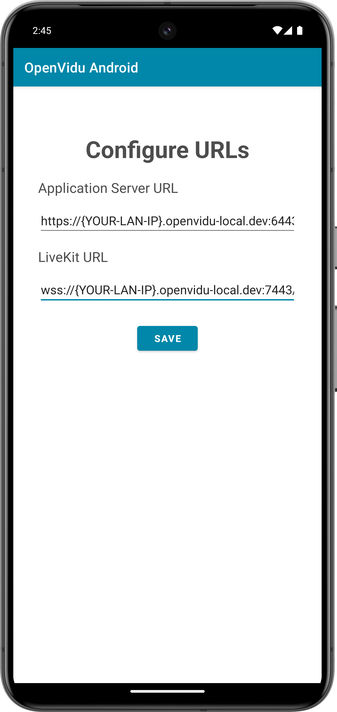
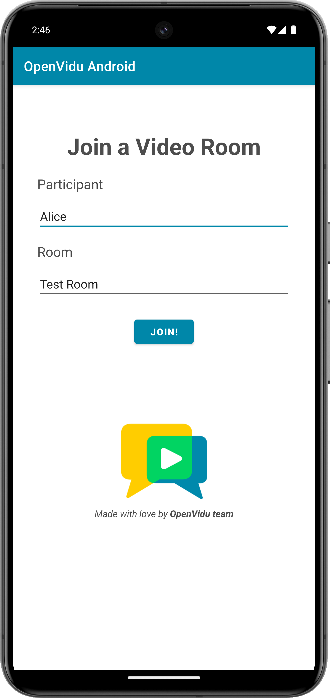
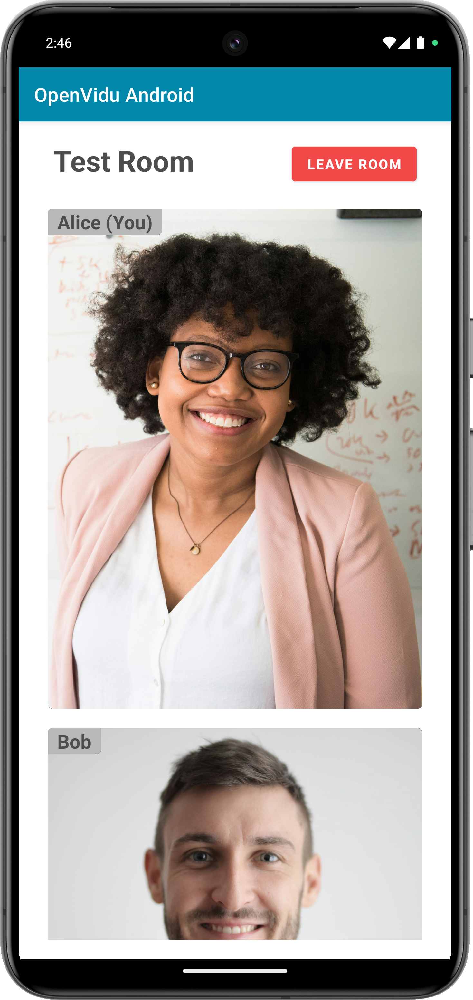

To run the client application tutorial, you need [Android Studio](https://developer.android.com/studio){:target="\_blank"} installed on your development computer.

1. Open Android Studio and import the project located at `openvidu-livekit-tutorials/application-client/openvidu-android`.

2. Run the application in an emulator or a physical device by clicking the "Run" button in Android Studio. Check out the [official documentation](https://developer.android.com/studio/run){:target="\_blank"} for further information.

The application will initiate as a native Android program. Once the application is opened, you should see a screen like this:

This screen allows you to configure the URLs of the application server and the LiveKit server. You need to set them up for requesting tokens to your application server and connecting to the LiveKit server.

!!! info "Connecting real Android device to application server running in you local network"

    One advantage of [running OpenVidu locally](#run-openvidu-locally) is that you can test your application client in a real Android device and be able to reach the application server very easily without worrying about SSL certificates if they are both running in the same local network. For more information, see section [Accessing your local deployment from other devices on your network](../../self-hosting/local.md#accessing-your-local-deployment-from-other-devices-on-your-network){target="_blank"}.

Once you have configured the URLs, you can join a video call room by providing a room name and a user name. After joining the room, you will be able to see your own video and audio tracks, as well as the video and audio tracks of the other participants in the room.

