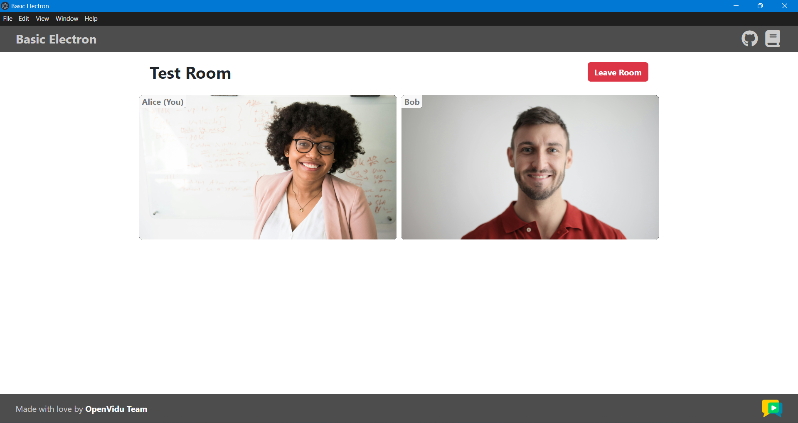

To run the client application tutorial, you need [Node](https://nodejs.org/en/download){:target="\_blank"} installed on your development computer.

1. Navigate into the application client directory:

    ```bash
    cd openvidu-livekit-tutorials/application-client/openvidu-electron
    ```

2. Install the required dependencies:

    ```bash
    npm install
    ```

3. Run the application:

    ```bash
    npm start
    ```

The application will seamlessly initiate as a native desktop program, adapting itself to the specific operating system you are using. Once the application is open, you should see a screen like this:

<div class="grid-container">

<div class="grid-50"><p><a class="glightbox" href="../../../../assets/images/application-clients/join-electron.png" data-type="image" data-width="100%" data-height="auto" data-desc-position="bottom"></a></p></div>

<div class="grid-50"><p><a class="glightbox" href="../../../../assets/images/application-clients/room-electron.png" data-type="image" data-width="100%" data-height="auto" data-desc-position="bottom"></a></p></div>

</div>

!!! info "Running your application client from other devices in your local network"

    One advantage of [running OpenVidu locally](#run-openvidu-locally) is that you can test your application client with other devices in your local network very easily without worrying about SSL certificates. For more information, see section [Accessing your app from other devices in your network](../../self-hosting/local.md#accessing-your-local-deployment-from-other-devices-on-your-network){target="_blank"}.
