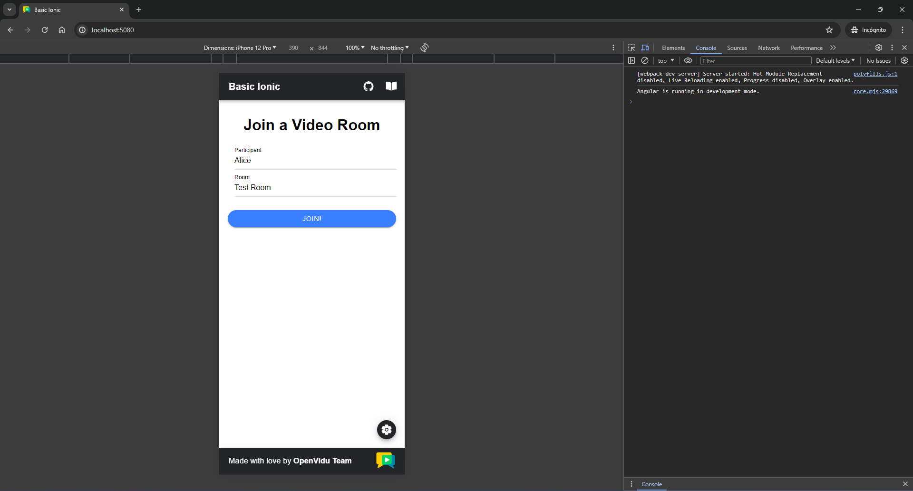

To run the client application tutorial, you need [Node](https://nodejs.org/en/download){:target="\_blank"} installed on your development computer.

1.  Navigate into the application client directory:

    ```bash
    cd openvidu-livekit-tutorials/application-client/openvidu-ionic
    ```

2.  Install the required dependencies:

    ```bash
    npm install
    ```

3.  Serve the application:

    You have two options for running the client application: **browser-based** or **mobile device-based**:

    === ":fontawesome-solid-desktop:{.icon .lg-icon .tab-icon} Browser"

        To run the application in a browser, you will need to start the Ionic server. To do so, run the following command:

        ```bash
        npm start
        ```

        Once the server is up and running, you can test the application by visiting [`http://localhost:5080`](http://localhost:5080){:target="\_blank"}. You should see a screen like this:

        !!! info "Mobile appearance"

            To show the app with a mobile device appearance, open the dev tools in your browser and find the button to adapt the viewport to a mobile device aspect ratio. You may also choose predefined types of devices to see the behavior of your app in different resolutions.

        <div class="grid-50"><p><a class="glightbox" href="../../../../assets/images/application-clients/join-ionic-web.png" data-type="image" data-width="100%" data-height="auto" data-desc-position="bottom"></a></p></div>

        <div class="grid-50"><p><a class="glightbox" href="../../../../assets/images/application-clients/room-ionic-web.png" data-type="image" data-width="100%" data-height="auto" data-desc-position="bottom"></a></p></div>

        --8<-- "docs/docs/tutorials/shared/testing-other-devices.md"

    === ":fontawesome-solid-mobile-screen-button:{.icon .lg-icon .tab-icon} Mobile"

        Running the tutorial on a mobile device presents additional challenges compared to running it in a browser, mainly due to the application being launched on a different device, such as an Android smartphone or iPhone, rather than our computer. To overcome these challenges, the following steps need to be taken:

        1. **Localhost limitations:**

            The usage of `localhost` in our Ionic app is restricted, preventing seamless communication between the application client and the server.

        2. **Serve over local network:**

            The application must be served over our local network to enable communication between the device and the server.

        3. **Secure connection requirement for WebRTC API:**

            The WebRTC API demands a secure connection for functionality outside of localhost, necessitating the serving of the application over HTTPS.

        If you run [OpenVidu locally](#run-openvidu-locally) you don't need to worry about this. OpenVidu will handle all of the above requirements for you. For more information, see section [Accessing your local deployment from other devices on your network](../../self-hosting/local.md#accessing-your-local-deployment-from-other-devices-on-your-network).

        Now, let's explore how to run the application on a mobile device:

        !!! warning "Requirements"

            Before running the application on a mobile device, make sure that the device is connected to the same network as your PC and the mobile is connected to the PC via USB or Wi-Fi.

        === ":fontawesome-brands-android:{.icon .lg-icon .tab-icon} Android device"

            ```bash
            npm run android
            ```

        === ":fontawesome-brands-apple:{.icon .lg-icon .tab-icon} iOS device"

            You will need [Ruby](https://www.ruby-lang.org/en/documentation/installation/){target="_blank"} and [Cocoapods](https://guides.cocoapods.org/using/getting-started.html){target="_blank"} installed in your computer.

            The app must be signed with a development team. To do so, open the project in **Xcode** and select a development team in the **Signing & Capabilities** editor.

            ```bash
            npm run ios
            ```

        The script will ask you for the device you want to run the application on. You should select the real device you have connected to your computer.

        Once the mobile device has been selected, the script will launch the application on the device and you will see a screen like this:

        <div class="grid-container">

        <div class="grid-100"><p style="text-align: center;"><a class="glightbox" href="../../../../assets/images/application-clients/configure-urls-ionic.png" data-type="image" data-width="100%" data-height="auto" data-desc-position="bottom"></a></p></div>

        </div>

        This screen allows you to configure the URLs of the application server and the LiveKit server. You need to set them up for requesting tokens to your application server and connecting to the LiveKit server.

        Once you have configured the URLs, you can join a video call room by providing a room name and a user name. After joining the room, you will be able to see your own video and audio tracks, as well as the video and audio tracks of the other participants in the room.

        <div class="grid-container">

        <div class="grid-50"><p style="text-align: center;"><a class="glightbox" href="../../../../assets/images/application-clients/join-ionic-device.png" data-type="image" data-width="100%" data-height="auto" data-desc-position="bottom"></a></p></div>

        <div class="grid-50"><p style="text-align: center;"><a class="glightbox" href="../../../../assets/images/application-clients/room-ionic-device.png" data-type="image" data-width="100%" data-height="auto" data-desc-position="bottom"></a></p></div>

        </div>
