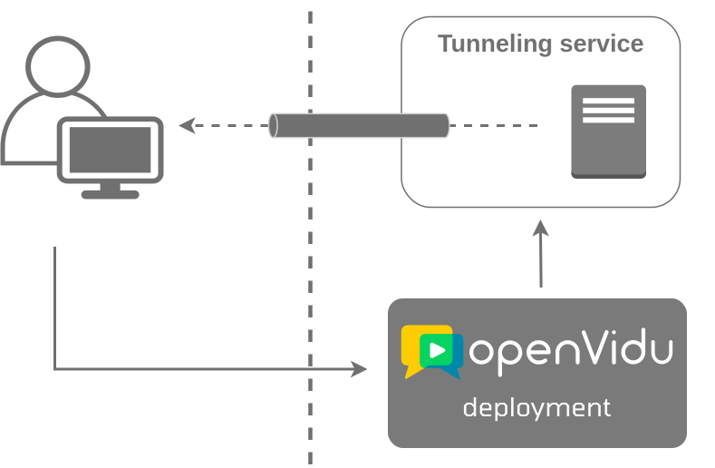

##### From production to a local server

When developing locally pointing to a production deployment and webhooks events are required by your application, you might face issues because OpenVidu cannot access your local server.

To receive webhooks from OpenVidu on your local machine, you need to expose your local server to the internet. This exposure allows OpenVidu to send webhooks directly to your local server.

The following images illustrate the difference between an unreachable local server and a reachable local server:

<figure markdown>
  { loading=lazy .svg-img  .mkdocs-img}
  <figcaption>Unreachable local server</figcaption>
</figure>

<figure markdown>
  { loading=lazy .svg-img  .mkdocs-img}
  <figcaption>Reachable local server</figcaption>
</figure>

Exposing your local server to the internet is a common practice when developing applications locally. Tools like [Ngrok](https://ngrok.com/){target="\_blank"}, [LocalTunnel](https://localtunnel.github.io/www/){target="\_blank"}, [LocalXpose](https://localxpose.io/){target="\_blank"} and [Zrok](https://zrok.io/){target="\_blank"} can help you achieve this.

These tools provide you with a public URL that forwards requests to your local server. You can use this URL to receive webhooks from OpenVidu. For information on how to add this URL as the webhook URL in the OpenVidu deployment, refer to the following documentation:

=== "OpenVidu Local"

    - Configure webhooks for an **OpenVidu Local deployment**. [Learn more](../../self-hosting/local.md#configuring-webhooks).

=== "OpenVidu Single Node"

    - Configure webhooks for an **OpenVidu Single Node deployment**. [Learn more](../../self-hosting/single-node/on-premises/admin.md#enabling-webhooks).

=== "OpenVidu Elastic"

    - Configure webhooks for an **OpenVidu Elastic On-Premises deployment**. [Learn more](../../self-hosting/elastic/on-premises/admin.md#enabling-webhooks).

    - Configure webhooks for an **OpenVidu Elastic AWS deployment**. [Learn more](../../self-hosting/elastic/aws/admin.md#enabling-webhooks).

=== "OpenVidu High Availability"

    - Configure webhooks for an **OpenVidu High Availability On-Premises deployment**. [Learn more](../../self-hosting/ha/on-premises/admin.md#enabling-webhooks).

    - Configure webhooks for an **OpenVidu High Availability AWS deployment**. [Learn more](../../self-hosting/ha/aws/admin.md#enabling-webhooks).
