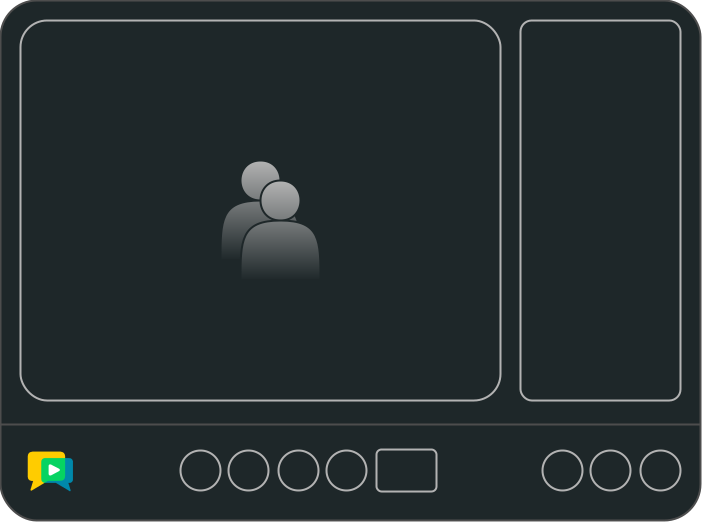

# Angular Components

## Introduction

Angular Components are the simplest way to create real-time videoconferencing apps with Angular. There's no need to manage state or low-level events; Angular Components from OpenVidu handle all the complexity for you.

This **Angular library**, offers developers a robust set of **powerful and comprehensive videoconferencing components**. These components are highly adaptable, extendable, and easily replaceable, allowing you to tailor them to your application's specific requirements.

<figure markdown>
  { loading=lazy .svg-img  .mkdocs-img}
  <figcaption>Angular Components</figcaption>
</figure>

The primary goal of the OpenVidu team is to minimize the developer's effort when creating videoconferencing applications. **Angular Components** significantly contribute to this objective for several reasons:

-   :material-rocket-launch:{ .openvidu-call-feature-icon .middle } __Rapid Development__

    ---

    Abstracts the complexity of videoconferencing applications, allowing you to focus on customizations

-   :material-brush:{ .openvidu-call-feature-icon .middle } __Flexible Customization__

    ---

    Offers maximum customization flexibility, allowing you to adapt, extend, and replace any component

-   :material-cog:{ .openvidu-call-feature-icon .middle } __Easy Maintenance__

    ---

    Ensures your code remains up to date, making it easier to update your application with each new OpenVidu release

## How to use

Using Angular Components in your application is straightforward. The official [Angular Components Tutorials](../tutorials/angular-components/index.md) cover everything Angular Components offers, from customizing colors and branding logos to injecting new custom features.

## Featured Components

-   __Videoconference__

    ---

    The Videoconference component is the core of Angular Components. You can nest HTML and Angular components inside it or leave it empty to use the default setup.

    ---

    [:octicons-arrow-right-24: See Reference](../reference-docs/openvidu-components-angular/components/VideoconferenceComponent.html){:target="_blank"}

-   __Panel__

    ---

    The Panel components is the root of side panels in the videoconference. You can nest HTML and Angular components inside it or leave it empty to use the default setup.

    ---

    [:octicons-arrow-right-24: See Reference](../reference-docs/openvidu-components-angular/components/PanelComponent.html){:target="_blank"}

## Prefabricated Components

**Angular Components** provides a wide range of prefabricated components that you can use to build your videoconferencing application in a matter of minutes. These components are designed for direct use without any extensions or modifications.

  <a href="/docs/reference-docs/openvidu-components-angular/components/ToolbarComponent.html" target="_blank" class="card no-shadow">Toolbar</a>
  <a href="/docs/reference-docs/openvidu-components-angular/components/LayoutComponent.html" target="_blank" class="card no-shadow">Layout</a>
  <a href="/docs/reference-docs/openvidu-components-angular/components/StreamComponent.html" target="_blank" class="card no-shadow">Stream</a>
  <a href="/docs/reference-docs/openvidu-components-angular/components/ChatPanelComponent.html" target="_blank" class="card no-shadow">ChatPanel</a>
  <a href="/docs/reference-docs/openvidu-components-angular/components/ParticipantsPanelComponent.html" target="_blank" class="card no-shadow">ParticipantsPanel</a>
  <a href="/docs/reference-docs/openvidu-components-angular/components/ParticipantPanelItemComponent.html" target="_blank" class="card no-shadow">ParticipantPanelItem</a>
  <a href="/docs/reference-docs/openvidu-components-angular/components/ActivitiesPanelComponent.html" target="_blank" class="card no-shadow">ActivitiesPanel</a>
  <a href="/docs/reference-docs/openvidu-components-angular/components/RecordingActivityComponent.html" target="_blank" class="card no-shadow">RecordingActivity</a>
  <a href="/docs/reference-docs/openvidu-components-angular/components/BroadcastingActivityComponent.html" target="_blank" class="card no-shadow">BroadcastingActivity</a>
  <a href="/docs/reference-docs/openvidu-components-angular/components/AdminLoginComponent.html" target="_blank" class="card no-shadow">AdminLogin</a>
  <a href="/docs/reference-docs/openvidu-components-angular/components/AdminDashboardComponent.html" target="_blank" class="card no-shadow">AdminDashboard</a>

## Directives

Angular Components provides two types of directives: **Structural Directives** and **Attribute Directives**.

- **Structural Directives**: These directives manipulate the DOM by adding or removing elements from the view.

    They are distinguished by the asterisk (__*__) prefix and must be placed inside an HTML element within any [_Featured Component_](#featured-components).

    For example, the `*ovToolbar` directive allows you to add a custom toolbar to the videoconference, replacing the default one.

    You can check the list of available structural directives in the [Angular Components API Reference](../reference-docs/openvidu-components-angular/modules/OpenViduComponentsDirectiveModule.html){:target="_blank"}.

- **Attribute Directives**: Commonly known as **Components Inputs**, allow you to manipulate the appearance or behavior of an element.

    You can check the list of available structural directives in the [Angular Components API Reference](../reference-docs/openvidu-components-angular/modules/OpenViduComponentsDirectiveModule.html){:target="_blank"}.

## Events

Each component in **Angular Components** emits a set of events that you can listen to in your application to trigger specific actions.

These events are designed to provide you with the flexibility to customize your videoconferencing application according to your requirements.

You can check out all component events in the [Angular Components API Reference](../reference-docs/openvidu-components-angular/index.html){:target="_blank"}.

## Applications

A practical example showcases the potential of Angular Components is our production-ready flagship application, [**OpenVidu Call**](../openvidu-call/index.md). This application is built using Angular Components and demonstrates the power and flexibility of the library.

## References

- [Angular Components API Reference](../reference-docs/openvidu-components-angular/index.html){:target="_blank"}
