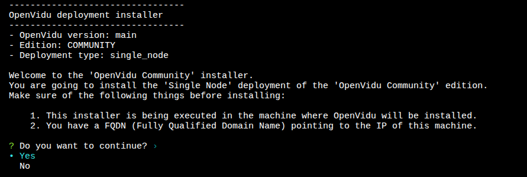
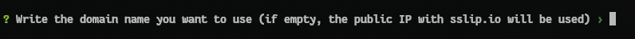
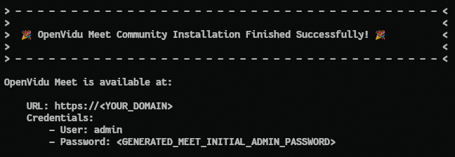
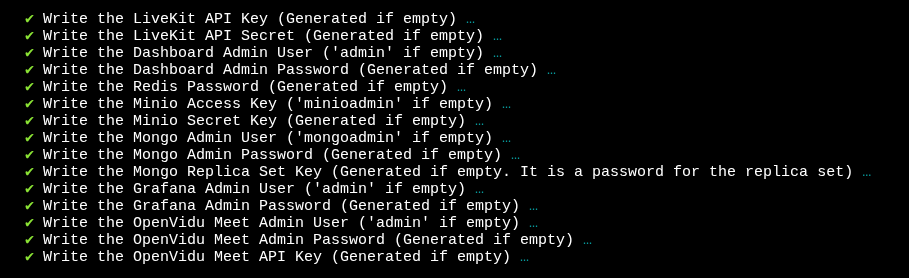
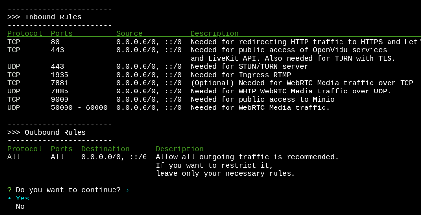
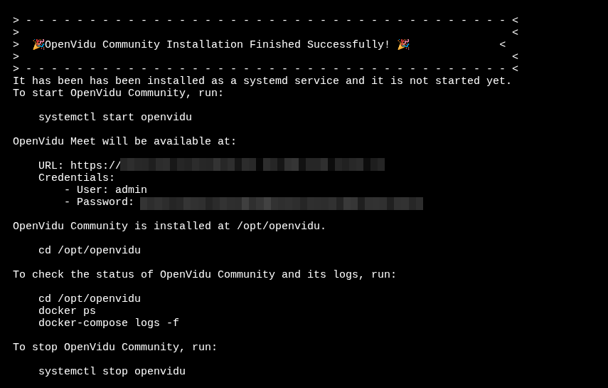

This section contains the instructions to deploy a production-ready deployment of OpenVidu Meet in a single server.

!!! info
    This guide shows a single-node installation in a Linux machine. To see other deployment options, such as deploying in cloud providers like AWS, Azure, or GCP, or deploying in a multi-node architecture, check the [Other deployment options](#other-deployment-options) section at the end of this page.

## Prerequisites

Before starting the installation process, make sure you have the following prerequisites:

- **A machine with at least 4GB RAM and 4 CPU cores** and **Linux installed (Ubuntu recommended)**.
- **Generous disk space (100GB recommended)**, especially if you plan to record your meetings.
- The machine **must have a public IP**.

## Port rules

Make sure that all these rules are configured in your firewall, security group, or any kind of network configuration that you have in your machine.

**Inbound port rules**

| Protocol | Ports         | Source          | Requirement               |
| -------- | ------------- | --------------- | ------------------------- |
| TCP      | 80            | 0.0.0.0/0, ::/0 | Mandatory                 |
| TCP      | 443           | 0.0.0.0/0, ::/0 | Mandatory                 |
| UDP      | 443           | 0.0.0.0/0, ::/0 | Mandatory                 |
| TCP      | 7881          | 0.0.0.0/0, ::/0 | Optional, but recommended |
| UDP      | 50000 - 60000 | 0.0.0.0/0, ::/0 | Optional, but recommended |

!!! info
    The mandatory ports ensure that OpenVidu Meet can be used by all users, independently of their network conditions. But for optimal performance, the optional ports are highly recommended. They allow for a more efficient, higher quality video communication.

**Outbound port rules**

Typically, all outbound traffic is allowed.

## Installation

Before starting the installation process, make sure that your server meets the [prerequisites](#prerequisites) and the [port rules](#port-rules).

Then, connect to your server (typically via SSH) and run this command to start the installation wizard:

```bash
sh <(curl -fsSL http://get.openvidu.io/community/singlenode/latest/install.sh)
```

Follow the instructions of the installation wizard. They are self-explanatory, but here is a breakdown:

1. Select **Yes** to continue when prompted after the installation summary:

     

2. Leave the domain name blank, by clicking **Enter**:

    

3. Select **Let's Encrypt Certificate** when prompted for the certificate type to use:

    

4. Leave all modules enabled, by clicking **Enter**:

    

5. You can leave all passswords to be generated automatically, by clicking **Enter** repeatedly:

    

6. A summary with the port rules will be shown. Simply select **Yes** when prompted to continue the installation:

    

The installation will begin, pulling all the necessary Docker images and configuring your server. Once the installation is complete, you will see this message:



At this point OpenVidu Meet will be installed but not running yet. Just as the message indicates, you can start it with this command:

```bash
systemctl start openvidu
```

Once running, you can access OpenVidu Meet in your browser using the URL and credentials shown in the installation completion message.

## Administration

You can manage the OpenVidu Meet installation running simple commands on your server:

```bash
# Start OpenVidu Meet
sudo systemctl start openvidu

# Stop OpenVidu Meet
sudo systemctl stop openvidu

# Restart OpenVidu Meet
sudo systemctl restart openvidu
```

OpenVidu Meet is under the hood an OpenVidu Platform deployment, so you can refer to the [OpenVidu Platform Single Node administration guide](../../docs/self-hosting/single-node/on-premises/admin.md) for more advanced management tasks, including:

- [Check the status of services](../../docs/self-hosting/single-node/on-premises/admin.md#checking-the-status-of-services)
- [Check logs](../../docs/self-hosting/single-node/on-premises/admin.md#checking-logs)
- [Upgrade OpenVidu Meet to a newer version](../../docs/self-hosting/single-node/on-premises/upgrade.md)
- [Uninstall OpenVidu Meet](../../docs/self-hosting/single-node/on-premises/admin.md#uninstalling-openvidu)


## Other deployment options

This guide has covered the manual installation of OpenVidu Meet as a single-node deployment in a Linux server. Under the hood OpenVidu Meet is an OpenVidu Platform deployment, so there are further deployment options available:

- **Non-interactive installation**: you can run the installation wizard in a non-interactive way, providing all the required parameters in a single command. Check the [Non-interactive installation](../../docs/self-hosting/single-node/on-premises/install.md#non-interactive-installation) guide for OpenVidu Platform.
- **Deploy OpenVidu Meet single-node in AWS**: using our CloudFormation template, you can deploy OpenVidu Meet using native AWS resources. Follow the [AWS deployment](../../docs/self-hosting/single-node/aws/install.md) guide for OpenVidu Platform.
- **Deploy OpenVidu Meet single-node in Azure**: using our ARM template, you can deploy OpenVidu Meet using native Azure resources. Follow the [Azure deployment](../../docs/self-hosting/single-node/azure/install.md) guide for OpenVidu Platform.
<!-- START CHECK BEFORE RELEASE -->
<!-- Check GPC path -->
- **Deploy OpenVidu Meet single-node in GCP**: using our Terraform template, you can deploy OpenVidu Meet using native GCP resources. Follow the [GCP deployment](../../docs/self-hosting/single-node/gcp/install.md) guide for OpenVidu Platform.
<!-- END CHECK BEFORE RELEASE -->
- **Deploy OpenVidu Meet in a multi-node architecture**: there are multi-node deployment options available to make your OpenVidu Meet installation scalable and fault-tolerant. Check out the [Advanced deployments](./advanced.md) section for more information.