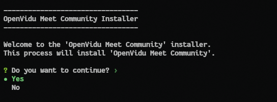

!!! warning
    OpenVidu Meet is currently considered in **BETA**. There may be bugs and its APIs are subject to change.

This section contains the instructions to deploy a production-ready deployment of OpenVidu Meet in a single server.

!!! info
    This guide shows a single-node installation in a Linux machine. To see other deployment options, such as deploying in cloud providers like AWS, Azure, or GCP, or deploying in a multi-node architecture, check the [Other deployment options](#other-deployment-options) section at the end of this page.

## Prerequisites

### OS

- **Ubuntu** 22.04 or newer.
- User with **root** permissions (via `sudo`).

### Recommended hardware

- At least 4 GB RAM and 4 CPU cores.
- Generous disk space (100 GB recommended), especially if you plan to record your meetings.

### Networking

- A public IP, that doesn't change between restarts (a static IP).
- (Recommended) A domain name (FQDN) pointing to the public IP.
- Port rules: these inbound ports must be open in your firewall and reachable from the internet.

    | Protocol | Ports         | Source          | Requirement               |
    | -------- | ------------- | --------------- | ------------------------- |
    | TCP      | 80            | 0.0.0.0/0, ::/0 | Mandatory                 |
    | TCP      | 443           | 0.0.0.0/0, ::/0 | Mandatory                 |
    | UDP      | 443           | 0.0.0.0/0, ::/0 | Mandatory                 |
    | TCP      | 7881          | 0.0.0.0/0, ::/0 | Optional, but recommended for optimal perfomance and media quality |
    | UDP      | 50000 - 60000 | 0.0.0.0/0, ::/0 | Optional, but recommended for optimal perfomance and media quality |

## Installation

Run this command in your server to start the installation wizard:

```bash
sh <(curl -fsSL http://get.openvidu.io/community/singlenode/latest/install_meet.sh)
```

Follow the instructions of the installation wizard. They are self-explanatory, but here is a breakdown:

1. Select **Yes** to continue when prompted after the installation summary:

     

2. If you have a domain name, enter it when prompted. If you don't have one, just press **Enter** to continue:

    <!-- TODO: Remove this warning when sslip.io rate limiting issue is resolved. Track at https://openvidu.discourse.group/t/deployment-without-domain/5474 -->
    !!! warning "sslip.io rate limiting"
        **sslip.io** is currently experiencing **Let's Encrypt rate limiting issues**, which may prevent SSL certificates from being generated. It is recommended to use your own domain name. Check [this community thread](https://openvidu.discourse.group/t/deployment-without-domain/5474){:target="_blank"} for troubleshooting and updates.

    

3. The installer will ask you to confirm if you want to proceed with the installation. Select **Yes** to start the installation. 

    The installation will begin, downloading the software and configuring your server. Once the installation is complete, you will see this message:

    

    You can access OpenVidu Meet in your browser using the URL and credentials shown in the installation completion message.

## Administration

You can manage the OpenVidu Meet installation running simple commands on your server:

```bash
# Start OpenVidu Meet
sudo systemctl start openvidu

# Stop OpenVidu Meet
sudo systemctl stop openvidu

# Restart OpenVidu Meet
sudo systemctl restart openvidu
```

OpenVidu Meet is under the hood an OpenVidu Platform deployment, so you can refer to the [OpenVidu Platform Single Node administration guide](../../docs/self-hosting/single-node/on-premises/admin.md) for more advanced management tasks, including:

- [Check the status of services](../../docs/self-hosting/single-node/on-premises/admin.md#checking-the-status-of-services)
- [Check logs](../../docs/self-hosting/single-node/on-premises/admin.md#checking-logs)
- [Upgrade OpenVidu Meet to a newer version](../../docs/self-hosting/single-node/on-premises/upgrade.md)
- [Uninstall OpenVidu Meet](../../docs/self-hosting/single-node/on-premises/admin.md#uninstalling-openvidu)


## Other deployment options

This guide has covered the manual installation of OpenVidu Meet as a single-node deployment in a Linux server. Under the hood OpenVidu Meet is an OpenVidu Platform deployment, so there are further deployment options available:

- **Non-interactive installation**: you can run the installation wizard in a non-interactive way, providing all the required parameters in a single command. Check the [Non-interactive installation](../../docs/self-hosting/single-node/on-premises/install.md#non-interactive-installation) guide for OpenVidu Platform.
- **Deploy OpenVidu Meet single-node in AWS**: using our CloudFormation template, you can deploy OpenVidu Meet using native AWS resources. Follow the [AWS deployment](../../docs/self-hosting/single-node/aws/install.md) guide for OpenVidu Platform.
- **Deploy OpenVidu Meet single-node in Azure**: using our ARM template, you can deploy OpenVidu Meet using native Azure resources. Follow the [Azure deployment](../../docs/self-hosting/single-node/azure/install.md) guide for OpenVidu Platform.
<!-- START CHECK BEFORE RELEASE -->
<!-- Check GPC path -->
- **Deploy OpenVidu Meet single-node in GCP**: using our Terraform template, you can deploy OpenVidu Meet using native GCP resources. Follow the [GCP deployment](../../docs/self-hosting/single-node/gcp/install.md) guide for OpenVidu Platform.
<!-- END CHECK BEFORE RELEASE -->
- **Deploy OpenVidu Meet in a multi-node architecture**: there are multi-node deployment options available to make your OpenVidu Meet installation scalable and fault-tolerant. Check out the [Advanced deployments](./advanced.md) section for more information.