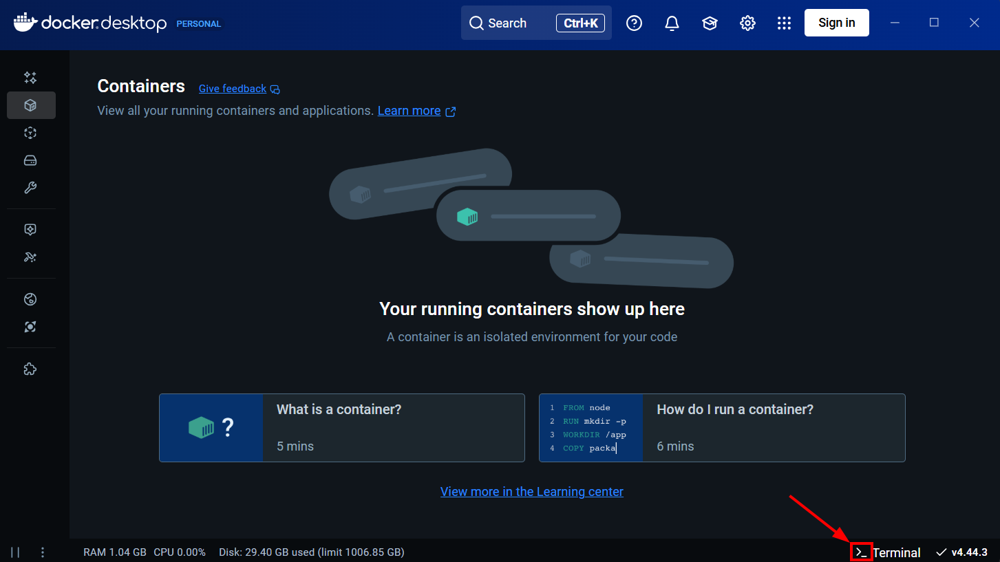
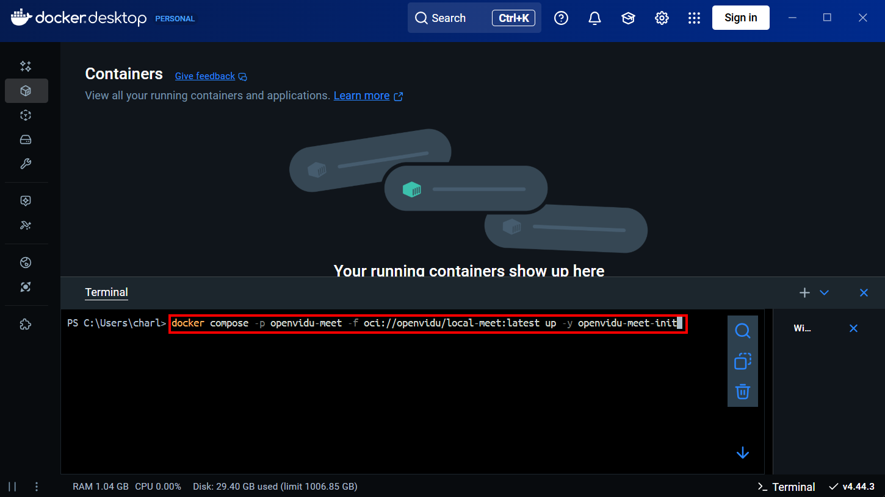
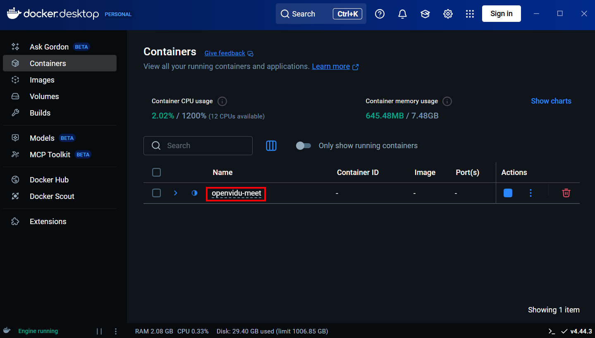
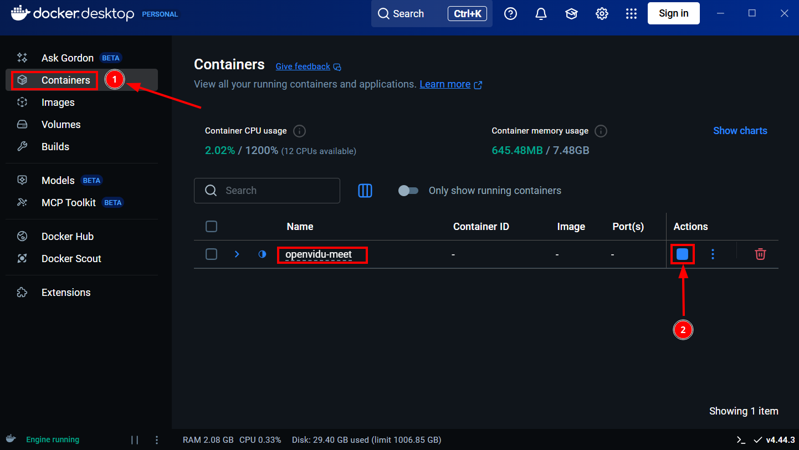
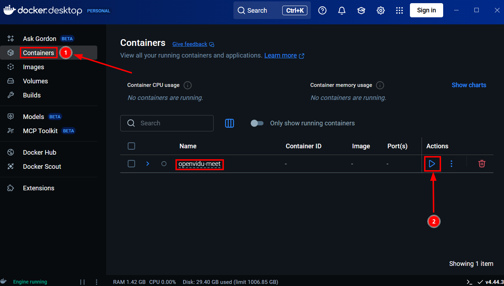
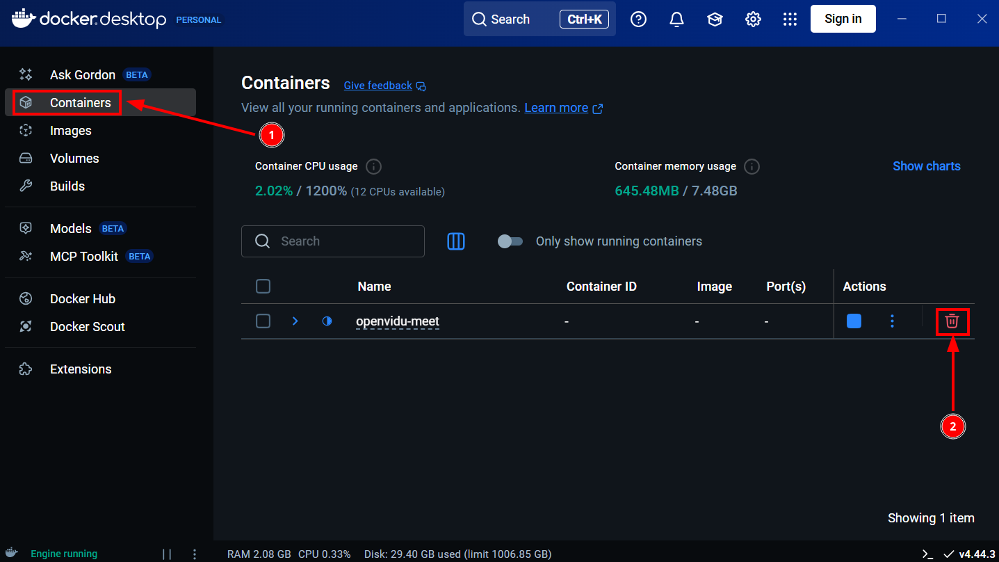
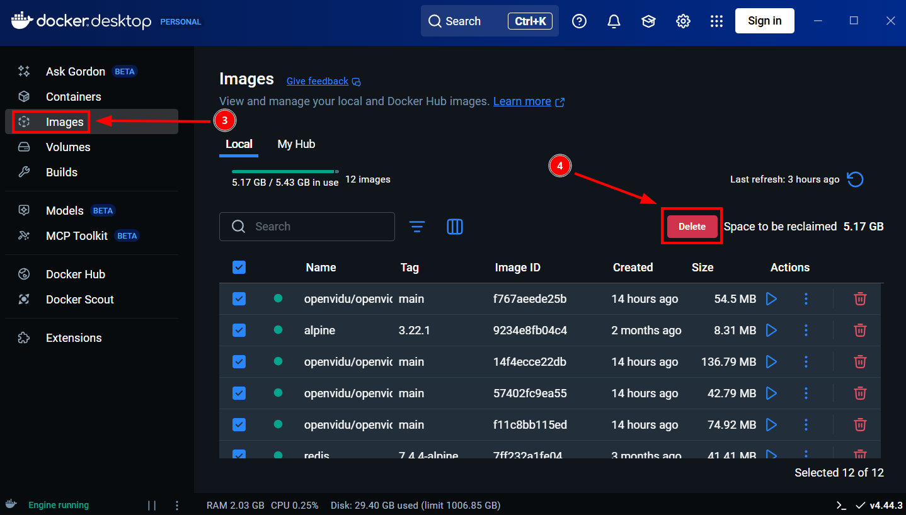
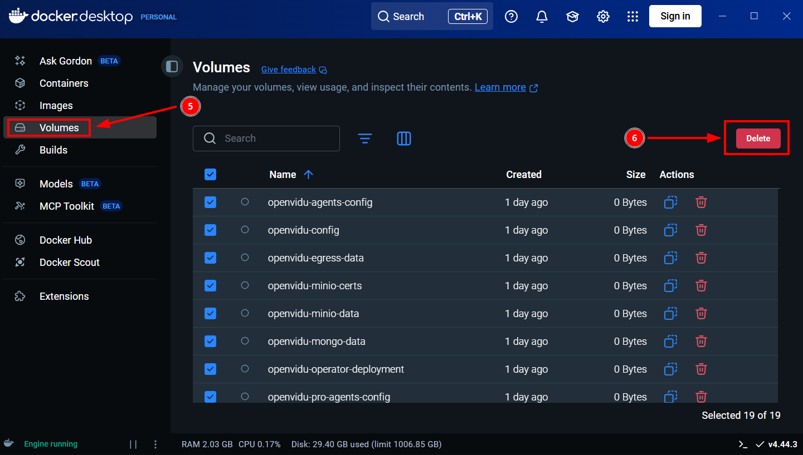
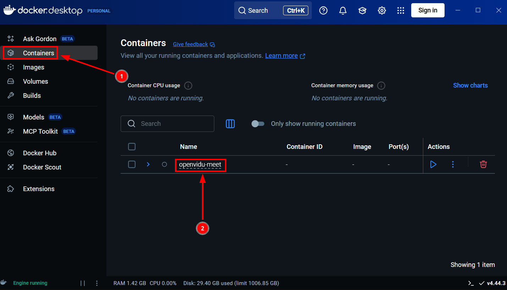
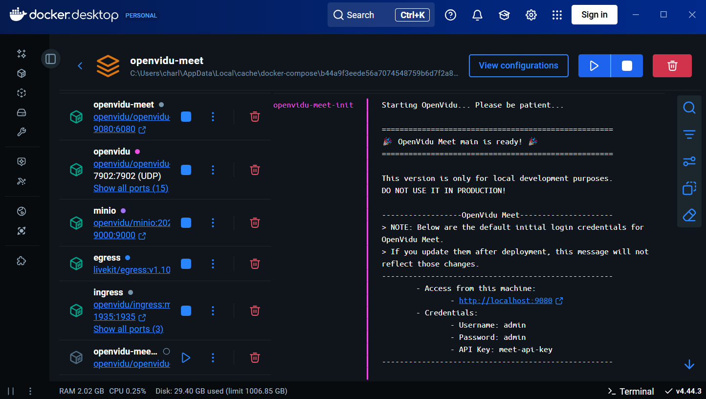

# Try OpenVidu Meet Locally

You can easily deploy **OpenVidu Meet** on your local machine to explore its features right away.

You can simulate **several users** joining to the **same room** using diferent tabs of your preferred browser.

This local deployment is the ideal choice to develop the [embedding of OpenVidu Meet into your own application](../../embedded/intro).

!!! warning
    Remember that this deployment is designed for **demo** and **development** propurposes. For production follow the [Basic deployment](../../deployment/basic/) or [Advanced deployments](../../advanced/basic/).

## Prerequisites

- A computer with **Windows**, **macOS**, or **Linux** installed.
- 4 CPU cores and 8 GB of RAM (16 GB recommended for better performance).
- At least 10 GB of free disk space.
- [Docker Desktop](https://docs.docker.com/desktop/) (see installation instructions below).

## Installing Docker Desktop

[Docker](https://docs.docker.com/get-started/docker-overview/) is a technology the simplifies the installation of applications in **Windows**, **macOS**, and **Linux**. 

In the Docker terminology, an application is downloaded as a one or several **docker images**. When the application is executed, it is composed of one or several **docker containers**.

Instructions to install [Docker Desktop](https://docs.docker.com/desktop/) (the software needed to execute Docker containers):

=== ":fontawesome-brands-windows:{.icon .lg-icon .tab-icon} Windows"

    - Install [Docker Desktop :fontawesome-solid-external-link:{.external-link-icon}](https://docs.docker.com/desktop/install/windows-install/){:target="\_blank"}

=== ":simple-apple:{.icon .lg-icon .tab-icon} macOS"

    - Install [Docker Desktop :fontawesome-solid-external-link:{.external-link-icon}](https://docs.docker.com/desktop/install/mac-install/){:target="\_blank"}

=== ":simple-linux:{.icon .lg-icon .tab-icon} Linux"

    - Install [Docker Desktop :fontawesome-solid-external-link:{.external-link-icon}](https://docs.docker.com/desktop/install/linux-install/){:target="\_blank"}

    !!! info 
        This guide is based on Docker Desktop, but the commands can also be used in a linux machine with [Docker Engine :fontawesome-solid-external-link:{.external-link-icon}](https://docs.docker.com/engine/install/#supported-platforms) and [Docker Compose :fontawesome-solid-external-link:{.external-link-icon}](https://docs.docker.com/compose/install/linux/){:target="\_blank"} installed.

## Running OpenVidu Meet Locally

1. Open **Docker Desktop** and click on the **"Terminal"** button at the bottom right corner.

    

2. Copy and paste the following command into the terminal:

    ```bash
    docker compose -p openvidu-meet -f oci://openvidu/local-meet:latest up -y openvidu-meet-init
    ```

    

    If you want to deploy a specific version, replace `latest` with the desired version tag (e.g., `3.4.0`).

3. After pasting the command, press **Enter** to execute the command.

    The terminal will show how OpenVidu Meet is downloaded and executed.

    First of all, OpenVidu Meet components (docker images) are downloaded (only the first time). It will take ~5 minutes on a 100 Mbps Internet connection.

    Then, OpenVidu Meet components (docker containers) are executed.

    Finally, the terminal will show when OpenVidu Meet is ready to be used:

    ```
    openvidu-meet-init-1  | Waiting for OpenVidu to start...    
    openvidu-meet-init-1  | Starting OpenVidu... Please be patient...
    openvidu-meet-init-1  | Starting OpenVidu... Please be patient...
    openvidu-meet-init-1  | Starting OpenVidu... Please be patient...
    openvidu-meet-init-1  | Starting OpenVidu... Please be patient...
    openvidu-meet-init-1  | Starting OpenVidu... Please be patient...
    openvidu-meet-init-1  | Starting OpenVidu... Please be patient...
    ...
    openvidu-meet-init-1  |
    openvidu-meet-init-1  | ====================================================
    openvidu-meet-init-1  | 🎉 OpenVidu Meet main is ready! 🎉
    openvidu-meet-init-1  | ====================================================
    openvidu-meet-init-1  |
    openvidu-meet-init-1  | This version is only for local development purposes.
    openvidu-meet-init-1  | DO NOT USE IT IN PRODUCTION!
    openvidu-meet-init-1  |
    openvidu-meet-init-1  | ------------------OpenVidu Meet---------------------
    openvidu-meet-init-1  | > NOTE: Below are the default initial login credentials
    openvidu-meet-init-1  | > for OpenVidu Meet. If you update them after deployment,
    openvidu-meet-init-1  | > this message will not reflect those changes.
    openvidu-meet-init-1  | ----------------------------------------------------
    openvidu-meet-init-1  | 	- Access from this machine:
    openvidu-meet-init-1  | 		- http://localhost:9080
    openvidu-meet-init-1  | 	- Credentials:
    openvidu-meet-init-1  | 		- Username: admin
    openvidu-meet-init-1  | 		- Password: admin
    openvidu-meet-init-1  | 		- API Key: meet-api-key
    openvidu-meet-init-1  | ----------------------------------------------------
    ```

## Accessing OpenVidu Meet

You can access **OpenVidu Meet** by opening [http://localhost:9080](http://localhost:9080) in your web browser with credentials:

- Username: `admin`
- Password: `admin`

You can use the [REST API](../../embedded/reference/rest-api/) to [embedd OpenVidu Meet](../../embedded/intro) using:

- API Key: `meet-api-key` 

You can change them later from the [OpenVidu Meet Users And Permissions](../../features/users-and-permissions/#modify-openvidu-meet-authentication).


## Managing the deployment

Once installed and executed, **`openvidu-meet`** will appear in **Docker Desktop → Containers** section.



You can manage OpenVidu Meet execution interactively:

=== "Stop"

    3. Click the **Stop** button.

    

=== "Start"

    3. Click the **Start** button.

    

=== "Remove"

    !!! warning

        It will remove rooms and recordings.

    1. Click the **Delete** button.

        

    2. Go to **Docker Desktop → Images**.
    3. Remove the images related to **OpenVidu Meet**.

        

    4. Go to **Docker Desktop → Volumes**.
    5. Remove the volumes related to **OpenVidu Meet**.

        

=== "View logs"

    2. Click on the container group to open its details. The logs will be shown after clicking on the container group.

    
    

## Accessing OpenVidu Meet from other computers or phones

You can connect to OpenVidu Meet from other computers or phones. It it very useful to join several people to the same room and try the communication features.

Follow this steps:

1. Be sure that other computers or phones are connected to the same wifi or local network (LAN) where OpenVidu Meet is installed.

2. Stop OpenVidu Meet if it is alredy started.

3. Start it again with a new command.

    === ":fontawesome-brands-windows:{.icon .lg-icon .tab-icon} Windows"

        1. Obtain the local IP of the computer where OpenVidu is intalled following [this guide :fontawesome-solid-external-link:{.external-link-icon}](https://www.avast.com/c-how-to-find-ip-address){:target="\_blank"}. It typically is similar to `192.168.1.100`.

        2. Execute the following command in Docker Desktop (replacing `<YOUR_PRIVATE_IP>` with the IP obtained)

        ```powershell
        $env:LAN_PRIVATE_IP='<YOUR_PRIVATE_IP>'; docker compose -p openvidu-meet -f oci://openvidu/local-meet:latest up -y openvidu-meet-init
        ```
    === ":simple-apple:{.icon .lg-icon .tab-icon} macOS"

        1. Obtain the local IP of the computer where OpenVidu is intalled following [this guide :fontawesome-solid-external-link:{.external-link-icon}](https://www.avast.com/c-how-to-find-ip-address){:target="\_blank"}. It typically is similar to `192.168.1.100`.

        2. Execute the following command in Docker Desktop (replacing `<YOUR_PRIVATE_IP>` with the IP obtained)

        ```bash
        LAN_PRIVATE_IP='<YOUR_PRIVATE_IP>' docker compose -p openvidu-meet -f oci://openvidu/local-meet:latest up -y openvidu-meet-init
        ```

    === ":simple-linux:{.icon .lg-icon .tab-icon} Linux"

        1. Obtain the local IP of the computer where OpenVidu is intalled following [this guide :fontawesome-solid-external-link:{.external-link-icon}](https://www.ionos.com/digitalguide/hosting/technical-matters/get-linux-ip-address/){:target="\_blank"}. It typically is similar to `192.168.1.100`.

        2. Execute the following command in Docker Desktop (replacing `<YOUR_PRIVATE_IP>` with the IP obtained)

        ```bash
        LAN_PRIVATE_IP='<YOUR_PRIVATE_IP>' docker compose -p openvidu-meet -f oci://openvidu/local-meet:latest up -y openvidu-meet-init
        ```

4. Access to OpenVidu Meet with a different URL:

    When OpenVidu Meet is ready to be used the terminal will show the URL where it is accessible.

    For example, if your private IP is `192.168.1.100` you have to use the URL `https://192-168-1-100.openvidu-local.dev:9443`{.no-break}.

    You will see the following instrutions in the terminal when OpenVidu Meet is ready:

    ```
    openvidu-meet-init-1  |
    openvidu-meet-init-1  | ====================================================
    openvidu-meet-init-1  | 🎉 OpenVidu Meet main is ready! 🎉
    openvidu-meet-init-1  | ====================================================
    openvidu-meet-init-1  |
    openvidu-meet-init-1  | This version is only for local development purposes.
    openvidu-meet-init-1  | DO NOT USE IT IN PRODUCTION!
    openvidu-meet-init-1  |
    openvidu-meet-init-1  | ------------------OpenVidu Meet---------------------
    openvidu-meet-init-1  | > NOTE: Below are the default initial login credentials
    openvidu-meet-init-1  | > for OpenVidu Meet. If you update them after deployment,
    openvidu-meet-init-1  | > this message will not reflect those changes.
    openvidu-meet-init-1  | ----------------------------------------------------
    openvidu-meet-init-1  | 	- Access from this machine:
    openvidu-meet-init-1  | 		- https://192-168-1-100.openvidu-local.dev:9443
    openvidu-meet-init-1  | 	- Credentials:
    openvidu-meet-init-1  | 		- Username: admin
    openvidu-meet-init-1  | 		- Password: admin
    openvidu-meet-init-1  | 		- API Key: meet-api-key
    openvidu-meet-init-1  | ----------------------------------------------------
    ```


## Advanced Local Deployment

If you want to modify some configurations or to have more control over the local deployment, you can deploy the [OpenVidu Platform Local deployment](../../docs/self-hosting/local.md) which includes **OpenVidu Meet** as one of its services.