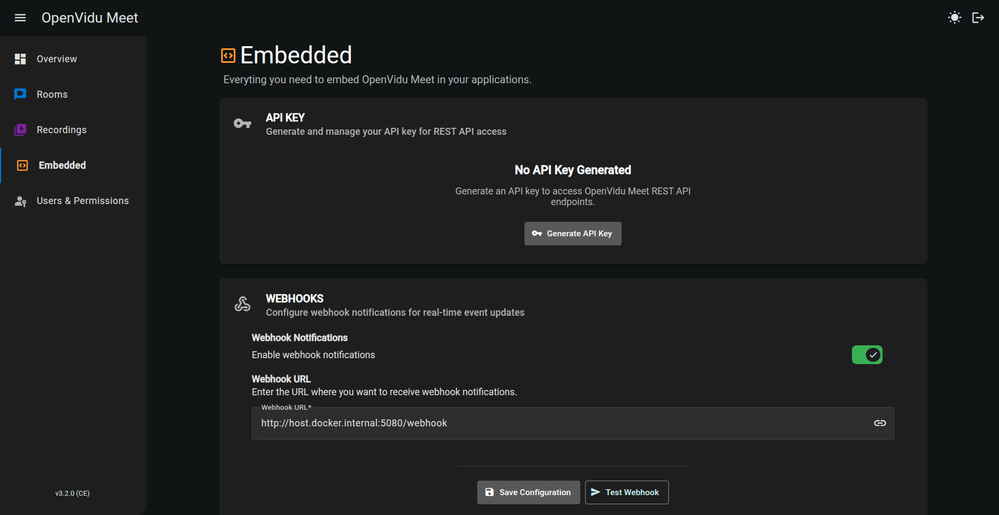
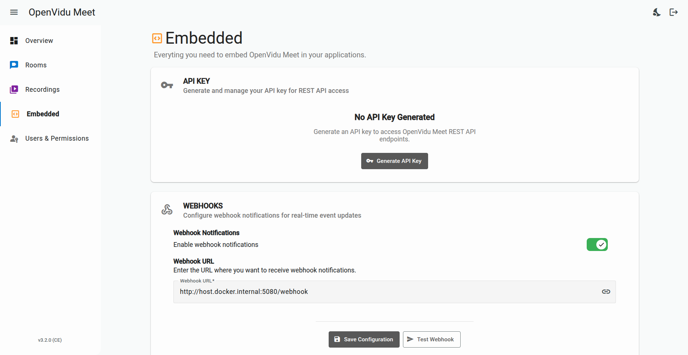

With **OpenVidu Meet Embedded**, you can integrate the best video calling experience directly into your own application:

- Quick setup using an **URL**, an **iframe** or a **Web Component**.
- Integrate into your application's logic using **REST API** and **Webhooks**.
- Customizable user interface to match your app's **branding and style**.

- 
- 

