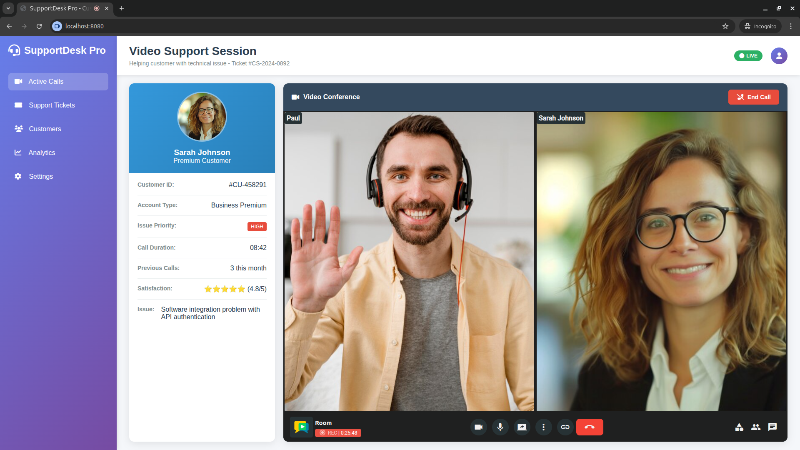

With **OpenVidu Meet Embedded**, you can integrate the best video calling experience directly into your own application:

- Quick setup using an **URL**, an **iframe** or a **Web Component**.
- Integrate into your application's logic using **REST API** and **Webhooks**.
- Customizable user interface to match your app's **branding and style**.

<div class="cards no-border no-shadow ov-meet-commercial-feature-cards" style="margin-top: 4em" markdown>

__Add video calling capabilities to your app with a single line of HTML__{ .ov-meet-commercial-card-title }

```html
<openvidu-meet room-url="https://YOUR_DOMAIN/room/your-room?secret=1234567"></openvidu-meet>
```

</div>

<div class="grid cards no-border no-shadow ov-call-commercial-feature-cards commercial-code-blocks" markdown>

- __Create rooms through REST API__{ .ov-meet-commercial-card-title }

    ```bash
    curl --request POST \
      --url https://YOUR_DOMAIN/api/v1/rooms \
      --header 'Accept: application/json' \
      --header 'Content-Type: application/json' \
      --header 'X-API-KEY: YOUR_API_KEY' \
      --data '{"roomIdPrefix": "my-room"}'
    ```

- __Manage recordings through REST API__{ .ov-meet-commercial-card-title }

    ```bash
    curl --request GET \
      --url https://YOUR_DOMAIN/api/v1/recordings \
      --header 'Accept: application/json' \
      --header 'X-API-KEY: YOUR_API_KEY'
    ```

</div>

<div class="cards no-border no-shadow ov-meet-commercial-feature-cards" markdown>

__Integrate OpenVidu Meet into your own UI and business logic__{ .ov-meet-commercial-card-title }

<a class="glightbox" href="../../../assets/images/meet/embedded/webcomponent-meeting.png" data-type="image" data-desc-position="bottom" data-gallery="gallery1"></a>

<a class="glightbox" href="../../../assets/images/meet/embedded/webcomponent-telehealth.png" data-type="image" data-desc-position="bottom" data-gallery="gallery1"></a>

</div>

<hr style="margin: 4em 0" />

<h2 class="meetplatform-slogan">
Where to start? We recommend following the <a href="../step-by-step-guide"><strong>step by step guide</strong></a> or exploring one of our <a href="../tutorials"><strong>tutorials</strong></a>.
</h2>