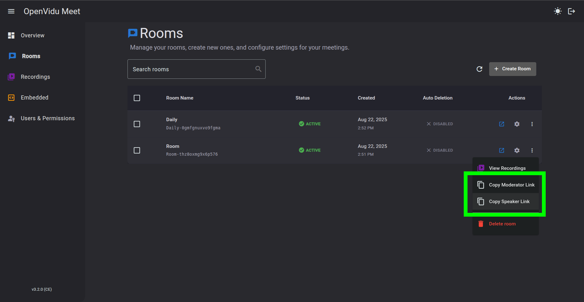

## 1. Run OpenVidu Meet

--8<-- "shared/tutorials/run-openvidu-server.md"

## 2. Create a room

You can create a room from the **"Rooms"** page in OpenVidu Meet:

<a class="glightbox" href="../../../assets/videos/meet/meet-rooms-dark.mp4" data-type="video" data-desc-position="bottom" data-gallery="gallery1"><video class="round-corners" src="../../../assets/videos/meet/meet-rooms-dark.mp4#only-dark" loading="lazy" defer muted playsinline autoplay loop async></video></a>
<a class="glightbox" href="../../../assets/videos/meet/meet-rooms-light.mp4" data-type="video" data-desc-position="bottom" data-gallery="gallery1"><video class="round-corners" src="../../../assets/videos/meet/meet-rooms-light.mp4#only-light" loading="lazy" defer muted playsinline autoplay loop async></video></a>

### Automating room creation

You can automate the room creation process by using the OpenVidu Meet REST API. This allows you to create rooms programmatically from your application's backend,  without manual intervention.

#### 1. Generate an API key

1. Connect to OpenVidu Meet at `https://YOUR_OPENVIDU_DEPLOYMENT_DOMAIN/`.
2. Navigate to the **"Embedded"** page.
3. Click on **":material-key: Generate API Key"** button.

<a class="glightbox" href="../../../assets/videos/meet/generate-api-key.mp4" data-type="video" data-desc-position="bottom" data-gallery="gallery2"><video class="round-corners" style="margin-bottom: 2em" src="../../../assets/videos/meet/generate-api-key.mp4" loading="lazy" defer muted playsinline autoplay loop async></video></a>

#### 2. Create a room using OpenVidu Meet REST API

Check out the [API reference](../../assets/htmls/rest-api.html#/operations/createRoom){:target="_blank"}. Below you have copy-paste snippets for most common languages.

!!! info
    Remember to replace **`YOUR_OPENVIDU_DEPLOYMENT_DOMAIN`** and **`YOUR_API_KEY`** in the snippets below.

=== ":material-bash:{.icon .lg-icon .tab-icon} curl"

    ```bash
    curl --request POST \
        --url https://YOUR_OPENVIDU_DEPLOYMENT_DOMAIN/api/v1/rooms \
        --header 'Accept: application/json' \
        --header 'Content-Type: application/json' \
        --header 'X-API-KEY: YOUR_API_KEY' \
        --data '{"roomIdPrefix": "quickstart-room"}'
    ```

=== ":simple-nodedotjs:{.icon .lg-icon .tab-icon} Node.js"

    ```javascript
    const https = require('https');

    const options = {
        method: 'POST',
        hostname: 'YOUR_OPENVIDU_DEPLOYMENT_DOMAIN',
        port: 443,
        path: '/api/v1/rooms',
        headers: {
            'Content-Type': 'application/json',
            Accept: 'application/json',
            'X-API-KEY': 'YOUR_API_KEY'
        }
    };

    const req = https.request(options, function (res) {
        const chunks = [];
        res.on('data', function (chunk) {
            chunks.push(chunk);
        });
        res.on('end', function () {
            const body = Buffer.concat(chunks);
            console.log(body.toString());
        });
    });

    req.write(JSON.stringify({
        roomIdPrefix: 'quickstart-room',
    }));

    req.end();
    ```

=== ":simple-goland:{.icon .lg-icon .tab-icon} Go"

    ```go
    package main

    import (
        "fmt"
        "strings"
        "net/http"
        "io"
    )

    func main() {

        url := "https://YOUR_OPENVIDU_DEPLOYMENT_DOMAIN/api/v1/rooms"

        payload := strings.NewReader("{\"roomIdPrefix\":\"quickstart-room\"}")

        req, _ := http.NewRequest("POST", url, payload)

        req.Header.Add("Content-Type", "application/json")
        req.Header.Add("Accept", "application/json")
        req.Header.Add("X-API-KEY", "YOUR_API_KEY")

        res, _ := http.DefaultClient.Do(req)

        defer res.Body.Close()
        body, _ := io.ReadAll(res.Body)

        fmt.Println(res)
        fmt.Println(string(body))

    }
    ```

=== ":simple-ruby:{.icon .lg-icon .tab-icon} Ruby"

    ```ruby
    require 'uri'
    require 'net/http'
    require 'openssl'

    url = URI("https://YOUR_OPENVIDU_DEPLOYMENT_DOMAIN/api/v1/rooms")

    http = Net::HTTP.new(url.host, url.port)
    http.use_ssl = true

    request = Net::HTTP::Post.new(url)
    request["Content-Type"] = 'application/json'
    request["Accept"] = 'application/json'
    request["X-API-KEY"] = 'YOUR_API_KEY'
    request.body = "{\"roomIdPrefix\": \"quickstart-room\"}"

    response = http.request(request)
    puts response.read_body
    ```

=== ":fontawesome-brands-java:{.icon .lg-icon .tab-icon} Java"

    ```java
    HttpRequest request = HttpRequest.newBuilder()
        .uri(URI.create("https://YOUR_OPENVIDU_DEPLOYMENT_DOMAIN/api/v1/rooms"))
        .header("Content-Type", "application/json")
        .header("Accept", "application/json")
        .header("X-API-KEY", "YOUR_API_KEY")
        .method("POST", HttpRequest.BodyPublishers.ofString("{\"roomIdPrefix\": \"quickstart-room\"}"))
        .build();
    HttpResponse<String> response = HttpClient.newHttpClient().send(request, HttpResponse.BodyHandlers.ofString());
    System.out.println(response.body());
    ```

=== ":fontawesome-brands-python:{.icon .lg-icon .tab-icon} Python"

    ```python
    import http.client

    conn = http.client.HTTPSConnection("YOUR_OPENVIDU_DEPLOYMENT_DOMAIN")

    payload = "{\"roomIdPrefix\": \"quickstart-room\"}"

    headers = {
        'Content-Type': "application/json",
        'Accept': "application/json",
        'X-API-KEY': "YOUR_API_KEY"
    }

    conn.request("POST", "/api/v1/rooms", payload, headers)

    res = conn.getresponse()
    data = res.read()

    print(data.decode("utf-8"))
    ```

=== ":simple-rust:{.icon .lg-icon .tab-icon} Rust"

    ```rust
    // Cargo.toml:
    // reqwest = { version = "0.12", features = ["blocking", "rustls-tls"] }

    use reqwest::blocking::Client;
    use reqwest::header::{ACCEPT, CONTENT_TYPE};

    fn main() -> Result<(), Box<dyn std::error::Error>> {
        let client = Client::new();
        let url = "https://YOUR_OPENVIDU_DEPLOYMENT_DOMAIN/api/v1/rooms";
        let payload = r#"{"roomIdPrefix": "quickstart-room"}"#;

        let resp = client
            .post(url)
            .header(ACCEPT, "application/json")
            .header(CONTENT_TYPE, "application/json")
            .header("X-API-KEY", "YOUR_API_KEY")
            .body(payload)
            .send()?;

        println!("Status: {}", resp.status());
        println!("{}", resp.text()?);
        Ok(())
    }
    ```

=== ":simple-php:{.icon .lg-icon .tab-icon} PHP"

    ```php
    <?php

    $curl = curl_init();

    curl_setopt_array($curl, [
        CURLOPT_URL => "https://YOUR_OPENVIDU_DEPLOYMENT_DOMAIN/api/v1/rooms",
        CURLOPT_RETURNTRANSFER => true,
        CURLOPT_POST => true,
        CURLOPT_POSTFIELDS => json_encode(['roomIdPrefix' => 'quickstart-room']),
        CURLOPT_HTTPHEADER => [
            "Accept: application/json",
            "Content-Type: application/json",
            "X-API-KEY: YOUR_API_KEY"
        ],
    ]);

    $response = curl_exec($curl);
    $err = curl_error($curl);

    curl_close($curl);

    if ($err) {
        echo "cURL Error #:" . $err;
    } else {
        echo $response;
    }
    ```

=== ":simple-dotnet:{.icon .lg-icon .tab-icon} .NET"

    ```csharp
    using System.Net.Http.Headers;
    var client = new HttpClient();
    var request = new HttpRequestMessage
    {
        Method = HttpMethod.Post,
        RequestUri = new Uri("https://YOUR_OPENVIDU_DEPLOYMENT_DOMAIN/api/v1/rooms"),
        Headers =
        {
            { "Accept", "application/json" },
            { "X-API-KEY", "YOUR_API_KEY" },
        },
        Content = new StringContent("{\"roomIdPrefix\": \"quickstart-room\"}")
        {
            Headers =
            {
                ContentType = new MediaTypeHeaderValue("application/json")
            }
        }
    };
    using (var response = await client.SendAsync(request))
    {
        response.EnsureSuccessStatusCode();
        var body = await response.Content.ReadAsStringAsync();
        Console.WriteLine(body);
    }
    ```

The response to this request will be a JSON object as below. The required properties for the next step are `moderatorUrl` and `publisherUrl`, needed to embed the room into your application as explained in step 3.

```json hl_lines="18-19"
{
    "roomId": "quickstart-room-123",
    "roomIdPrefix": "quickstart-room",
    "creationDate": 1620000000000,
    "autoDeletionDate": 1900000000000,
    "preferences": {
        "chatPreferences": {
            "enabled": true
        },
        "recordingPreferences": {
            "enabled": true,
            "allowAccessTo": "admin-moderator-publisher"
        },
        "virtualBackgroundPreferences": {
            "enabled": true
        }
    },
    "moderatorUrl": "http://localhost:6080/room/quickstart-room-123?secret=123456",
    "publisherUrl": "http://localhost:6080/room/quickstart-room-123?secret=654321"
}
```

## 3. Embed the room into your application

To embed a room into your application's frontend you need the room URL:

=== "Get room URL from OpenVidu Meet console"

    In the **"Rooms"** page you can copy the room URL for each participant role.

    <a class="glightbox" href="../../../assets/images/meet/embedded/share-room-link.png" data-type="image" data-desc-position="bottom" data-gallery="gallery3"></a>

=== "Get room URL programatically"

    Properties `moderatorUrl` and `speakerUrl` of object [MeetRoom](../../assets/htmls/rest-api.html#/schemas/MeetRoom){:target="_blank"}. You can find these properties in the JSON response of the previous step [Create a room using OpenVidu Meet REST API](#2-create-a-room-using-openvidu-meet-rest-api).

Once you got the desired room URL, there are 3 alternatives to embed the OpenVidu Meet room into your application's interface:

### Use a link

This is the simplest way to embed the OpenVidu Meet room into your application. Just link to the room URL from any element in your frontend. For example, with a simple `<a>` tag:

```html
<a href="{{ your-room-url }}" target="_blank">Join Room</a>
```

After clicking on the element, the user will be redirected to OpenVidu Meet, ready to join the room.

<a class="glightbox" href="../../../assets/videos/meet/embed-url.mp4" data-type="video" data-desc-position="bottom" data-gallery="gallery4"><video class="round-corners" src="../../../assets/videos/meet/embed-url.mp4" loading="lazy" defer muted playsinline autoplay loop async></video></a>

### Use the Web Component

Include a `<script>` tag to load the OpenVidu Meet Web Component definition from your OpenVidu deployment. Then, you can use the `<openvidu-meet>` custom element in your HTML, setting the `room-url` attribute.

!!! info
    Check out the [Web Component reference](./reference/webcomponent.md) for the complete list of attributes, commands and events offered by it.

```html
<html>
    <head>
        <title>My meeting</title>
        <script src="https://{{ your-openvidu-deployment-domain }}/v1/openvidu-meet.js"></script>
    </head>
    <body>
        <div>
            <openvidu-meet room-url="{{ your-room-url }}"></openvidu-meet>
        </div>
    </body>
</html>
```

<a class="glightbox" href="../../../assets/images/meet/embedded/embed-iframe.png" data-type="image" data-desc-position="bottom" data-gallery="gallery5"></a>

### Use an iframe

This method allows you to embed the OpenVidu Meet room directly into your application's interface using an iframe.

```html
<html>
    <head>
        <title>My meeting</title>
    </head>
    <body>
        <div>
            <iframe
                src="{{ your-room-url }}"
                allow="camera; microphone; display-capture; fullscreen; autoplay; compute-pressure;"
                width="100%" height="100%">
            </iframe>
        </div>
    </body>
</html>
```

The required iframe attributes are:

- `src`: the room URL.
- `allow`: the minimum permissions required by the iframe for the room to work fine. These are:
    - `camera`: allow access to the camera.
    - `microphone`: allow access to the microphone.
    - `display-capture`: allow screen sharing.
    - `fullscreen`: allow fullscreen mode.
    - `autoplay`: allow autoplay of media.
    - `compute-pressure`: allow access to the device's compute pressure API.