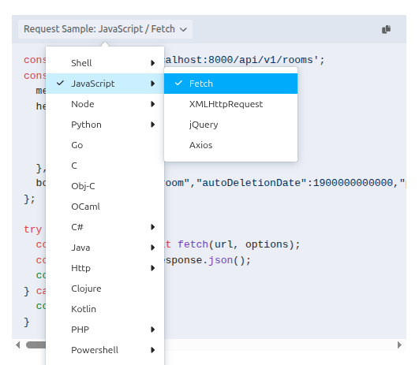
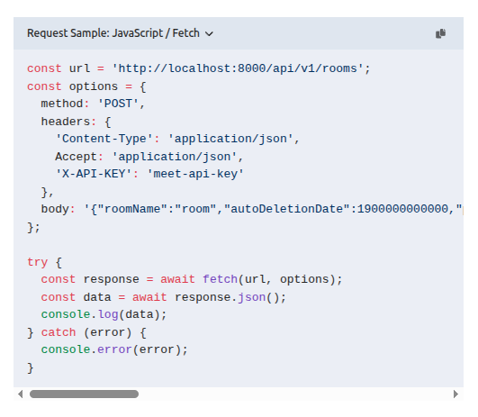

## Overview

OpenVidu Meet provides a REST API for managing **rooms** and **recordings** programmatically from your application's backend. As a general rule, any action that is available in OpenVidu Meet UI for rooms and recordings can also be performed using the REST API.

There are two endpoints:

- `/api/v1/rooms`: manage [rooms](../../features/rooms-and-meetings.md).
- `/api/v1/recordings`: manage [recordings](../../features/recordings.md).

## Authentication

Any request to the OpenVidu Meet REST API must include a valid API key in the `X-API-KEY` header:

```
X-API-KEY: your-openvidu-meet-api-key
```

### Generate an API key

1. Connect to OpenVidu Meet at `https://YOUR_OPENVIDU_DEPLOYMENT_DOMAIN/`.
2. Navigate to the **"Embedded"** page.
3. Click on **":material-key: Generate API Key"** button.

<a class="glightbox" href="../../../../assets/videos/meet/generate-api-key.mp4" data-type="video" data-desc-position="bottom" data-gallery="gallery2"><video class="round-corners" style="margin-bottom: 2em" src="../../../../assets/videos/meet/generate-api-key.mp4" loading="lazy" defer muted playsinline autoplay loop async></video></a>

## Reference

You can access the REST API reference documentation at:

- Link [OpenVidu Meet REST API Reference](../../../assets/htmls/rest-api.html){target="_blank"}
- Your own OpenVidu Meet deployment serves the documentation at **`https://{{your-openvidu-deployment-domain}}/api/v1/docs/`**

### Code snippets

The reference documentation provides code snippets for each REST API method. You can choose from countless languages and frameworks and copy-paste directly to your code.

<div class="grid cards no-border no-shadow two-columns" markdown>

<a class="glightbox" href="../../../../assets/images/meet/reference/rest-snippets-1.png" data-type="image" data-desc-position="bottom" data-gallery="gallery1"></a>

<a class="glightbox" href="../../../../assets/images/meet/reference/rest-snippets-2.png" data-type="image" data-desc-position="bottom" data-gallery="gallery1"></a>

</div>

### Testing API Endpoints

When accessing the REST API documentation from your own OpenVidu Meet deployment at `https://{{your-openvidu-deployment-domain}}/api/v1/docs/`{.no-break}, you can test every endpoint directly from the browser. Just configure a valid API key in the `X-API-KEY` header input.

<a class="glightbox" href="../../../../assets/videos/meet/rest-api-test.mp4" data-type="video" data-desc-position="bottom" data-gallery="gallery1"><video class="round-corners" src="../../../../assets/videos/meet/rest-api-test.mp4" defer muted playsinline autoplay loop async></video></a>