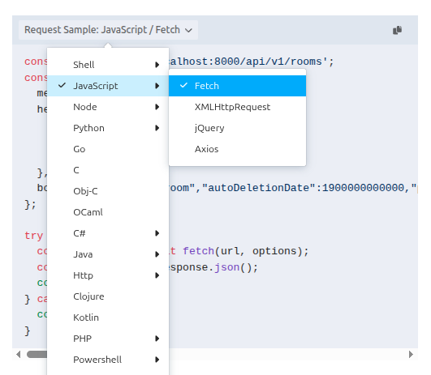
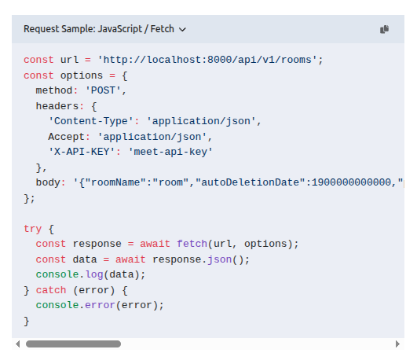

## Overview

OpenVidu Meet provides a REST API for managing **rooms**, **room members**, **meetings**, **recordings**, **users** and **webhooks** programmatically from your application's backend. As a general rule, any action that is available in the OpenVidu Meet UI for these resources can also be performed using the REST API.

The available endpoints are:

- `/api/v1/rooms`: manage [rooms](../../features/rooms/overview.md).
- `/api/v1/rooms/{roomId}/members`: manage [room members](../../features/room-members/overview.md) (users and identified guests of a room).
- `/api/v1/meetings`: read and moderate the live [meeting](../../features/meetings/overview.md) of a room and its participants.
- `/api/v1/recordings`: manage [recordings](../../features/recordings/overview.md).
- `/api/v1/users`: manage [users](../../features/users/overview.md).
- `/api/v1/webhooks`: manage the [webhooks](webhooks.md) that receive event notifications.

## Authentication

Any request to the OpenVidu Meet REST API must include a valid API key in the `X-API-KEY` header:

```
X-API-KEY: your-api-key
```

A request authenticated with the API key is not subject to any room member permission: it can do anything on any room. Some endpoints also accept the token of a logged-in user or of a room member (see the security schemes of each operation in the [REST API reference :fontawesome-solid-external-link:{.external-link-icon}](api.html){:target="_blank"}); such a request is then limited to what that user or member is allowed to do.

!!! info "Permission names"
    Every operation on a live meeting and on its recordings is gated by one [room member permission](../../features/room-members/overview.md#permissions), named in the operation's description and listed in the [MeetPermissions :fontawesome-solid-external-link:{.external-link-icon}](api.html#/schemas/MeetPermissions){:target="_blank"} schema.

### Generate an API key

1. Connect to OpenVidu Meet app at `https://YOUR_OPENVIDU_DEPLOYMENT_DOMAIN/meet`.
2. Navigate to the **"Embedded"** page.
3. Click on **"Generate API Key"** button.

<a class="glightbox" href="/assets/videos/meet/embedded/reference/generate-api-key-dark.mp4" data-type="video" data-gallery="dark"><video class="round-corners lazy-video" src="/assets/videos/meet/embedded/reference/generate-api-key-dark.mp4#only-dark" preload="none" muted playsinline loop style="margin-bottom: 2em"></video></a>
<a class="glightbox" href="/assets/videos/meet/embedded/reference/generate-api-key-light.mp4" data-type="video" data-gallery="light"><video class="round-corners lazy-video" src="/assets/videos/meet/embedded/reference/generate-api-key-light.mp4#only-light" preload="none" muted playsinline loop style="margin-bottom: 2em"></video></a>

## Reference

You can access the REST API reference documentation at:

- [**OpenVidu Meet REST API Reference** :fontawesome-solid-external-link:{.external-link-icon}](api.html){:target="_blank"}
- **Your own OpenVidu Meet deployment** serves the documentation at **`https://{{ your-openvidu-deployment-domain }}/meet/api/v1/docs/`**{.nowrap}

### Code snippets

The reference documentation provides code snippets for each REST API method. You can choose from countless languages and frameworks and copy-paste directly to your code.

<div class="grid-container" markdown>

<div class="grid-50" markdown>
{ .round-corners loading=lazy }
</div>

<div class="grid-50" markdown>
{ .round-corners loading=lazy }
</div>

</div>

### Testing API Endpoints

When accessing the REST API documentation from your own OpenVidu Meet deployment at **`https://{{ your-openvidu-deployment-domain }}/meet/api/v1/docs/`**{.nowrap}, you can test every endpoint directly from the browser. This is a great way to explore the API's body requests and responses.

Just configure a valid API key in the `X-API-KEY` header input.

<a class="glightbox" href="/assets/videos/meet/embedded/reference/rest-api-test.mp4" data-type="video"><video class="round-corners lazy-video" src="/assets/videos/meet/embedded/reference/rest-api-test.mp4" preload="none" muted playsinline loop></video></a>