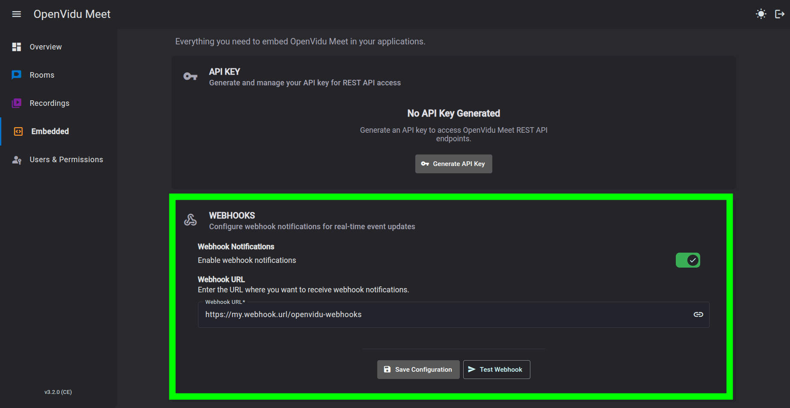

# Webhooks

OpenVidu Meet sends webhooks to inform about important events happening in a room. You can receive them in your application's backend and react accordingly with your own business logic.

## Configuration

You can configure webhooks in OpenVidu Meet in the **"Embedded"** page. There you can:

- Enable/Disable sending webhooks
- Set up a valid webhook URL
- Test the current webhook configuration with a fake event

## Reference

Visit [OpenVidu Meet Webhooks :fontawesome-solid-external-link:{.external-link-icon}](../../../assets/htmls/rest-api.html#/webhooks/recordingStartedWebhook){target="_blank"} reference documentation for a complete list of all available webhook events. They include:

- [`meetingStarted` :fontawesome-solid-external-link:{.external-link-icon}](../../../assets/htmls/rest-api.html#/webhooks/meetingStartedWebhook){target="_blank"}
- [`meetingEnded` :fontawesome-solid-external-link:{.external-link-icon}](../../../assets/htmls/rest-api.html#/webhooks/meetingEndedWebhook){target="_blank"}
- [`recordingStarted` :fontawesome-solid-external-link:{.external-link-icon}](../../../assets/htmls/rest-api.html#/webhooks/recordingStartedWebhook){target="_blank"}
- [`recordingUpdated` :fontawesome-solid-external-link:{.external-link-icon}](../../../assets/htmls/rest-api.html#/webhooks/recordingUpdatedWebhook){target="_blank"}
- [`recordingEnded` :fontawesome-solid-external-link:{.external-link-icon}](../../../assets/htmls/rest-api.html#/webhooks/recordingEndedWebhook){target="_blank"}

## Validate events

It is important to validate all webhook events received by your endpoint. This way you can ensure that the events are coming from a trusted source and have not been tampered with.

PENDING...

## Failures and retries

PENDING...

