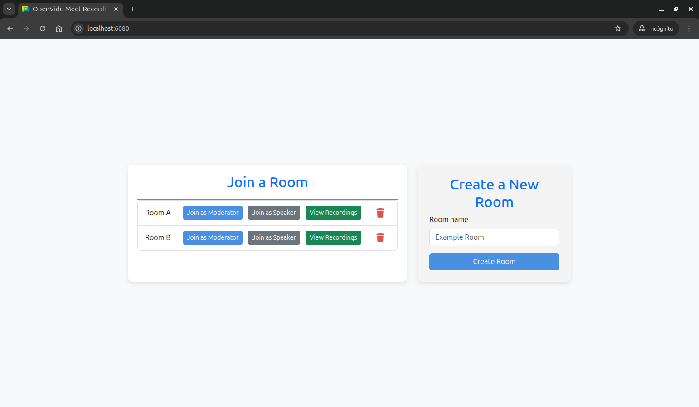
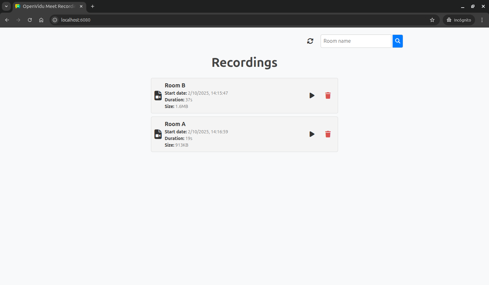

# Recordings Tutorial

[Source code :simple-github:](https://github.com/OpenVidu/openvidu-meet-tutorials/tree/3.7.0/advanced-features/meet-recordings){ .md-button target=\_blank }

This tutorial extends the [advanced OpenVidu Meet WebComponent tutorial](../embedding-options/webcomponent-advanced.md) to add **recording management capabilities**. It demonstrates how to list, view, and delete recordings from your OpenVidu Meet meetings.

The application includes all the features from the basic tutorial, plus:

- **List recordings**: View all available recordings from past meetings, with optional filtering by room.
- **View recordings**: Play recordings directly in the browser using the OpenVidu Meet WebComponent.
- **Delete recordings**: Remove recordings from the server.

## Running this tutorial

#### 1. Run OpenVidu Meet

--8<-- "shared/tutorials/run-openvidu-meet.md"

### 2. Download the tutorial code

```bash
git clone https://github.com/OpenVidu/openvidu-meet-tutorials.git -b 3.7.0
```

### 3. Run the application

To run this application, you need [Node.js :fontawesome-solid-external-link:{.external-link-icon}](https://nodejs.org/en/download){:target="\_blank"} (≥ 18) installed on your device.

1. Navigate into the application directory

```bash
cd openvidu-meet-tutorials/advanced-features/meet-recordings
```

2. Install dependencies

```bash
npm install
```

3. Run the application

```bash
npm start
```

Once the server is up and running, you can test the application by visiting [`http://localhost:6080`](http://localhost:6080){:target="\_blank"}. You should see a screen like this:

<div class="grid-container">

<div class="grid-50"><p><a class="glightbox" href="../../../../../assets/images/meet/tutorials/recordings-home.png" data-type="image" data-desc-position="bottom"></a></p></div>

<div class="grid-50"><p><a class="glightbox" href="../../../../../assets/images/meet/tutorials/recordings-recordings.png" data-type="image" data-desc-position="bottom"></a></p></div>

</div>

## Understanding the code

This tutorial builds upon the [advanced OpenVidu Meet WebComponent tutorial](../embedding-options/webcomponent-advanced.md), adding recording management functionality. We'll focus on the new features and modifications related to recordings.

---

### Backend modifications

The main changes to the backend involve adding new endpoints for recording management in the `src/index.js` file:

- **`GET /recordings`**: List all recordings, with optional filtering by room.
- **`DELETE /recordings/:recordingId`**: Delete a specific recording.
- **`GET /recordings/:recordingId/url`**: Get the playback URL for a specific recording.

Let's see the code of each new endpoint:

---

#### List recordings

The `GET /recordings` endpoint retrieves the list of recordings, with optional room filtering:

```javascript title="<a href='https://github.com/OpenVidu/openvidu-meet-tutorials/blob/3.7.0/advanced-features/meet-recordings/src/index.js#L74-L92' target='_blank'>index.js</a>" linenums="74"
// List all recordings
app.get('/recordings', async (req, res) => {
	// Create the base path for recordings: list up to 100 recordings, filtered to completed ones only.
	// We use 'status=complete' because in-progress recordings cannot be played or downloaded yet.
	let recordingsPath = `recordings?maxItems=100&status=complete`; // (1)!

	const { room: roomName } = req.query; // (2)!
	if (roomName) {
		// If a room is specified, filter recordings by room name
		recordingsPath += `&roomName=${roomName}`; // (3)!
	}

	try {
		const { recordings } = await httpRequest('GET', recordingsPath); // (4)!
		res.status(200).json({ recordings }); // (5)!
	} catch (error) {
		handleApiError(res, error, 'Error fetching recordings');
	}
});
```

1. Create the base path for fetching recordings. The `maxItems` parameter limits the number of recordings returned to 100, and `status=complete` keeps only completed recordings, since in-progress recordings cannot be played or downloaded yet.
2. Extract optional room name from query parameters for filtering.
3. If a room name is provided, it appends the `roomName` parameter to the recordings path to filter recordings by that room.
4. Fetch recordings using the OpenVidu Meet API by sending a `GET` request to the constructed `recordingsPath`.
5. The server returns a `200 OK` response with the list of recordings in JSON format.

This endpoint does the following:

1. Creates the base path for fetching recordings. The `maxItems` parameter limits the number of recordings returned to 100, and the `status=complete` parameter restricts the result to completed recordings only, because in-progress recordings cannot be played or downloaded yet.
2. Extracts an optional room name from the query parameters for filtering. If a room name is provided, it appends the `roomName` parameter to the recordings path to filter recordings by that room.
3. Fetches recordings using the OpenVidu Meet API by sending a `GET` request to the constructed `recordingsPath`.
4. If successful, it returns a `200 OK` response with the list of recordings in JSON format. Otherwise, the error is handled by the `handleApiError` function.

---

#### Delete recording

The `DELETE /recordings/:recordingId` endpoint deletes the specified recording:

```javascript title="<a href='https://github.com/OpenVidu/openvidu-meet-tutorials/blob/3.7.0/advanced-features/meet-recordings/src/index.js#L94-L105' target='_blank'>index.js</a>" linenums="94"
// Delete a recording
app.delete('/recordings/:recordingId', async (req, res) => {
	const { recordingId } = req.params; // (1)!

	try {
		// Delete the recording using OpenVidu Meet API
		await httpRequest('DELETE', `recordings/${recordingId}`); // (2)!
		res.status(200).json({ message: `Recording '${recordingId}' deleted successfully` }); // (3)!
	} catch (error) {
		handleApiError(res, error, `Error deleting recording '${recordingId}'`);
	}
});
```

1. The `recordingId` parameter is obtained from the request parameters.
2. The recording is deleted using the OpenVidu Meet API by sending a `DELETE` request to the `recordings/:recordingId` endpoint.
3. The server returns a `200 OK` response with a success message.

This endpoint simply deletes the specified recording using the OpenVidu Meet API by sending a `DELETE` request to the `recordings/:recordingId` endpoint. If the deletion is successful, it returns a `200 OK` response with a success message. Otherwise, the error is handled by the `handleApiError` function.

---

#### Get recording URL

A new `GET /recordings/:recordingId/url` endpoint retrieves the recording URL for playback:

```javascript title="<a href='https://github.com/OpenVidu/openvidu-meet-tutorials/blob/3.7.0/advanced-features/meet-recordings/src/index.js#L107-L118' target='_blank'>index.js</a>" linenums="107"
// Get recording URL
app.get('/recordings/:recordingId/url', async (req, res) => {
	const { recordingId } = req.params; // (1)!

	try {
		// Fetch the recording URL using OpenVidu Meet API
		const { url } = await httpRequest('GET', `recordings/${recordingId}/url`); // (2)!
		res.status(200).json({ url }); // (3)!
	} catch (error) {
		handleApiError(res, error, `Error fetching URL for recording '${recordingId}'`);
	}
});
```

1. The `recordingId` parameter is obtained from the request parameters.
2. Fetch the recording URL from the OpenVidu Meet API by sending a `GET` request to the `recordings/:recordingId/url` endpoint.
3. The server returns a `200 OK` response with the recording URL.

This endpoint retrieves the playback URL for a specific recording by sending a `GET` request to the `recordings/:recordingId/url` endpoint. If successful, it returns a `200 OK` response with the recording URL. Otherwise, the error is handled by the `handleApiError` function.

---

### Frontend modifications

The frontend has been enhanced to include recording management functionality. The main changes are in the `public/js/app.js` file:

#### Additional state management

A new `Map` is created to store recordings indexed by their recording ID:

```javascript title="<a href='https://github.com/OpenVidu/openvidu-meet-tutorials/blob/3.7.0/advanced-features/meet-recordings/public/js/app.js#L1-L2' target='_blank'>app.js</a>" linenums="1" hl_lines="2"
const rooms = new Map();
const recordings = new Map(); // (1)!
```

1. Added a recordings map to store recording data indexed by recording ID.

---

#### Enhanced room list template

The room list template is updated to include a `View Recordings` button for each room:

```javascript title="<a href='https://github.com/OpenVidu/openvidu-meet-tutorials/blob/3.7.0/advanced-features/meet-recordings/public/js/app.js#L51-L101' target='_blank'>app.js</a>" linenums="51" hl_lines="32-39"
function getRoomListItemTemplate(room) {
	return `
        <li class="ov-list-item">
            <span class="ov-list-item__name">${room.roomName}</span>
            <div class="ov-list-item__actions">
                <button
                    type="button"
                    title="Access as moderator"
                    class="ov-btn ov-btn--primary ov-btn--sm"
                    onclick="accessRoom(
                        '${room.roomName}',
                        '${room.access.anonymous.moderator.url}',
                        'moderator'
                    );"
                >
                    <span class="material-symbols-outlined">shield_person</span>
                    Moderator
                </button>
                <button
                    type="button"
                    title="Access as speaker"
                    class="ov-btn ov-btn--secondary ov-btn--sm"
                    onclick="accessRoom(
                        '${room.roomName}',
                        '${room.access.anonymous.speaker.url}',
                        'speaker'
                    );"
                >
                    <span class="material-symbols-outlined">record_voice_over</span>
                    Speaker
                </button>
                <button
                    type="button"
                    class="ov-btn ov-btn--recordings ov-btn--sm"
                    onclick="listRecordingsByRoom('${room.roomName}');"
                >
                    <span class="material-symbols-outlined">video_library</span>
                    View Recordings
                </button>
                <button
                    type="button"
                    title="Delete room"
                    class="ov-icon-btn ov-icon-btn--danger"
                    onclick="deleteRoom('${room.roomId}');"
                >
                    <span class="material-symbols-outlined">delete</span>
                </button>
            </div>
        </li>
    `;
}
```

The highlighted `View Recordings` button calls the `listRecordingsByRoom()` function when clicked, passing the room name as an argument. This allows you to view recordings for that specific room.

```javascript title="<a href='https://github.com/OpenVidu/openvidu-meet-tutorials/blob/3.7.0/advanced-features/meet-recordings/public/js/app.js#L215-L227' target='_blank'>app.js</a>" linenums="215"
async function listRecordingsByRoom(roomName) {
	// Hide the home screen and show the recordings screen
	const homeScreen = document.querySelector('#home');
	homeScreen.hidden = true; // (1)!
	const recordingsScreen = document.querySelector('#recordings');
	recordingsScreen.hidden = false; // (2)!

	// Set the room name in the search input
	const roomNameInput = document.querySelector('#recordings-room-search');
	roomNameInput.value = roomName; // (3)!

	await listRecordings(); // (4)!
}
```

1. Hide the home screen
2. Show the recordings screen.
3. Pre-fill the room search input with the selected room name.
4. Call the `listRecordings()` function to fetch and display recordings for the room.

This function sets up the recordings view by hiding the home screen, showing the recordings screen, pre-filling the room search input with the selected room name, and calling the `listRecordings()` function to fetch and display recordings for that room.

---

#### Listing recordings

The `listRecordings()` function fetches and displays recordings, optionally filtering by room name:

```javascript title="<a href='https://github.com/OpenVidu/openvidu-meet-tutorials/blob/3.7.0/advanced-features/meet-recordings/public/js/app.js#L237-L264' target='_blank'>app.js</a>" linenums="237"
async function listRecordings(e) {
	if (e) {
		// Prevent the default form submission
		e.preventDefault(); // (1)!
	}

	// Filter recordings by room name if provided
	const roomName = document.querySelector('#recordings-room-search').value; // (2)!
	const recordingsUrl = '/recordings' + (roomName ? `?room=${roomName}` : ''); // (3)!

	try {
		const { recordings: recordingsList } = await httpRequest('GET', recordingsUrl); // (4)!

		// Clear the previous recordings and populate the new ones
		recordings.clear();
		recordingsList.forEach((recording) => {
			recordings.set(recording.recordingId, recording); // (5)!
		});
		renderRecordings(); // (6)!
	} catch (error) {
		console.error('Error listing recordings:', error.message);

		// Show error message
		const recordingsErrorElement = document.querySelector('#no-recordings-or-error');
		recordingsErrorElement.textContent = 'Error loading recordings';
		recordingsErrorElement.hidden = false;
	}
}
```

1. Prevent the default form submission when invoked as the `submit` handler of the recordings search form.
2. Get the room name from the search input for filtering.
3. Build the API URL with optional room filter parameter.
4. Make a `GET` request to the `/recordings` endpoint to fetch the list of recordings. The backend already returns only completed recordings, so no client-side filtering is needed.
5. For each recording in the returned list, add it to the `recordings` map indexed by recording ID.
6. Call the `renderRecordings()` function to display the list of recordings in the UI.

The listRecordings() function performs the following actions:

1. Prevents the default form submission when it is invoked as the `submit` handler of the recordings search form (in which case it receives the event object).
2. Gets the room name from the search input field to optionally filter recordings by room.
3. Makes a `GET` request to the `/recordings` endpoint to fetch the list of recordings, including the room filter parameter if specified. The backend endpoint already filters to completed recordings only, so no client-side status filtering is required.
4. For each recording in the returned list, it adds the recording to the `recordings` map. This map is used to store the recordings indexed by their recording IDs to make it easier to access them later.
5. Calls the `renderRecordings()` function to display the list of recordings.
6. If an error occurs during the request, it logs the error and displays an appropriate error message.

The `renderRecordings()` function is responsible for updating the UI with the list of recordings:

```javascript title="<a href='https://github.com/OpenVidu/openvidu-meet-tutorials/blob/3.7.0/advanced-features/meet-recordings/public/js/app.js#L266-L286' target='_blank'>app.js</a>" linenums="266"
function renderRecordings() {
	// Clear the previous list of recordings
	const recordingsList = document.querySelector('#recordings-list ul'); // (1)!
	recordingsList.innerHTML = ''; // (2)!

	// Show or remove the "No recordings found" message
	const noRecordingsElement = document.querySelector('#no-recordings-or-error');
	if (recordings.size === 0) {
		noRecordingsElement.textContent = 'No recordings found for the filters applied.';
		noRecordingsElement.hidden = false;
		return;
	} else {
		noRecordingsElement.textContent = '';
		noRecordingsElement.hidden = true;
	}

	// Add recordings to the list element
	recordingsList.innerHTML = Array.from(recordings.values())
		.map((recording) => getRecordingListItemTemplate(recording)) // (3)!
		.join('');
}
```

1. Get the `ul` element where the list of recordings will be displayed.
2. Clear the previous list of recordings.
3. For each recording, get the HTML template for the recording list item, then join all the items into a single HTML string assigned to the list element.

The `renderRecordings()` function performs the following actions:

1. Clears the previous list of recordings by getting the `ul` element and setting its inner HTML to an empty string.
2. Checks if there are any recordings in the `recordings` map. If there are no recordings, it shows a message indicating that no recordings were found for the filters applied. Otherwise, it hides the message.
3. Maps every recording to its HTML template using the `getRecordingListItemTemplate()` function and joins them into a single string that is assigned to the list element's inner HTML.

The `getRecordingListItemTemplate()` function generates the HTML template for each recording list item:

```javascript title="<a href='https://github.com/OpenVidu/openvidu-meet-tutorials/blob/3.7.0/advanced-features/meet-recordings/public/js/app.js#L288-L314' target='_blank'>app.js</a>" linenums="288"
function getRecordingListItemTemplate(recording) {
	const recordingId = recording.recordingId; // (1)!
	const roomName = recording.roomName; // (2)!
	const startDate = recording.startDate ? new Date(recording.startDate).toLocaleString() : '-'; // (3)!
	const duration = recording.duration ? secondsToHms(recording.duration) : '-'; // (4)!
	const size = recording.size ? formatBytes(recording.size ?? 0) : '-'; // (5)!

	return `
        <li class="ov-recording">
            <span class="material-symbols-outlined ov-recording__icon">video_file</span>
            <div class="ov-recording__info">
                <p class="ov-recording__name">${roomName}</p>
                <p><span class="ov-recording__tag">Start date: </span><span class="ov-recording__value">${startDate}</span></p>
                <p><span class="ov-recording__tag">Duration: </span><span class="ov-recording__value">${duration}</span></p>
                <p><span class="ov-recording__tag">Size: </span><span class="ov-recording__value">${size}</span></p>
            </div>
            <div class="ov-recording__actions">
                <button type="button" title="Play" class="ov-icon-btn" onclick="displayRecording('${recordingId}')">
                    <span class="material-symbols-outlined">play_arrow</span>
                </button>
                <button type="button" title="Delete recording" class="ov-icon-btn ov-icon-btn--danger" onclick="deleteRecording('${recordingId}')">
                    <span class="material-symbols-outlined">delete</span>
                </button>
            </div>
        </li>
    `;
}
```

1. Retrieve the recording ID.
2. Retrieve the room name associated with the recording.
3. Format the start date for display.
4. Convert the duration from seconds to a human-readable format using the `secondsToHms()` helper function.
5. Format the file size using the `formatBytes()` helper function.

This function creates an HTML list item containing the recording's metadata, including the room name associated with the recording, start date, duration, and file size, along with buttons to play and delete the recording. The buttons call the `displayRecording()` and `deleteRecording()` functions respectively, passing the recording ID as an argument. The recording information is formatted using helper functions like `secondsToHms()` for duration and `formatBytes()` for file size to provide a user-friendly display.

---

#### Playing recording

When the user clicks the play button for a recording, the `displayRecording()` function is called:

```javascript title="<a href='https://github.com/OpenVidu/openvidu-meet-tutorials/blob/3.7.0/advanced-features/meet-recordings/public/js/app.js#L316-L351' target='_blank'>app.js</a>" linenums="316"
async function displayRecording(recordingId) {
	// Hide the recordings screen and show the display recording screen
	const recordingsScreen = document.querySelector('#recordings');
	recordingsScreen.hidden = true; // (1)!
	const displayRecordingScreen = document.querySelector('#display-recording');
	displayRecordingScreen.hidden = false; // (2)!

	// Get the recording media URL and set it to the source of the video element
	const recordingUrl = await getRecordingUrl(recordingId); // (3)!

	// Inject the OpenVidu Meet component into the display recording container specifying the recording URL
	displayRecordingScreen.innerHTML = `
        <openvidu-meet 
            recording-url="${recordingUrl}"
        >
        </openvidu-meet>
    `; // (4)!

	// Add event listener for when the OpenVidu Meet component is closed
	const meet = document.querySelector('openvidu-meet');
	meet.once('closed', () => {
		// (5)!
		// Hide the display recording screen and show the recordings screen
		displayRecordingScreen.hidden = true;
		recordingsScreen.hidden = false;
	});
}

async function getRecordingUrl(recordingId) {
	try {
		const { url } = await httpRequest('GET', `/recordings/${recordingId}/url`); // (6)!
		return url;
	} catch (error) {
		console.error('Error fetching recording URL:', error.message);
		return null;
	}
}
```

1. Hide the recordings list screen.
2. Show the recording playback screen.
3. Fetch the recording URL from the backend using the `getRecordingUrl()` function.
4. Inject the OpenVidu Meet WebComponent with the `recording-url` attribute for playback.
5. Add an event listener for the `closed` event, which is triggered when the recording playback view is closed. It hides the playback screen and shows the recordings list screen again.
6. Make a `GET` request to the `/recordings/:recordingId/url` endpoint to retrieve the recording URL.

The `displayRecording()` function handles the playback of a specific recording by first hiding the recordings list screen and showing the display recording screen. It then fetches the recording URL from the backend using the `getRecordingUrl()` helper function, which makes a `GET` request to the `/recordings/:recordingId/url` endpoint. Next, it injects the OpenVidu Meet WebComponent into the display container with the `recording-url` attribute set to the fetched URL, enabling the recording to be played directly in the browser. Finally, it registers a listener for the `closed` event of the WebComponent, so that when the user closes the recording playback view the playback screen is hidden and the recordings list screen is shown again. If an error occurs during URL fetching, it logs the error to the console and returns null.

---

#### Deleting recording

When the user clicks the delete recording button, the `deleteRecording()` function is called:

```javascript title="<a href='https://github.com/OpenVidu/openvidu-meet-tutorials/blob/3.7.0/advanced-features/meet-recordings/public/js/app.js#L353-L363' target='_blank'>app.js</a>" linenums="353"
async function deleteRecording(recordingId) {
	try {
		await httpRequest('DELETE', `/recordings/${recordingId}`); // (1)!

		// Remove the recording from the list
		recordings.delete(recordingId); // (2)!
		renderRecordings(); // (3)!
	} catch (error) {
		console.error('Error deleting recording:', error.message);
	}
}
```

1. Make a `DELETE` request to the `/recordings/:recordingId` endpoint to delete the specified recording.
2. Remove the recording from the `recordings` map.
3. Call the `renderRecordings()` function to update the list of recordings.

The `deleteRecording()` function simply makes a `DELETE` request to the `/recordings/:recordingId` endpoint to delete the specified recording. If the recording is successfully deleted, it removes the recording from the `recordings` map and calls the `renderRecordings()` function to update the list of recordings. If an error occurs during recording deletion, it logs the error to the console.

## Accessing this tutorial from other computers or phones

--8<-- "shared/tutorials/access-tutorial-from-other-devices.md"

## Connecting this tutorial to an OpenVidu Meet production deployment

--8<-- "shared/tutorials/connect-tutorial-to-production-deployment.md"
