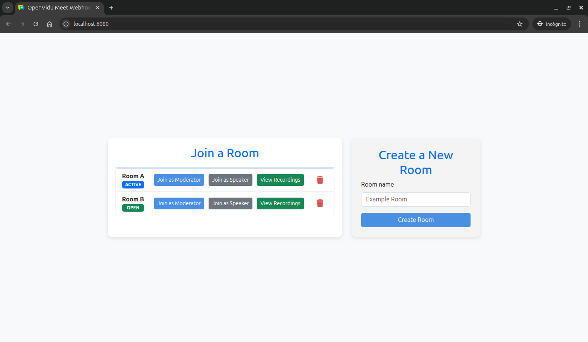
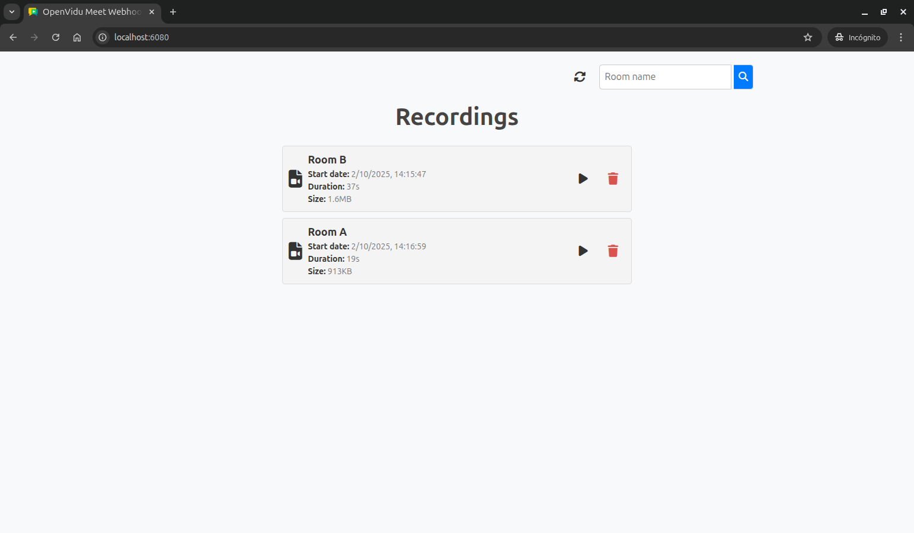

# Webhooks Tutorial

[Source code :simple-github:](https://github.com/OpenVidu/openvidu-meet-tutorials/tree/3.7.0/advanced-features/meet-webhooks){ .md-button target=\_blank }

This tutorial extends the [recordings tutorial](recordings.md) to add **real-time updates** through webhooks and Server-Sent Events (SSE). It demonstrates how to receive and process OpenVidu Meet webhooks to provide live status updates for rooms and recordings.

The application includes all the features from the recordings tutorial, plus:

- **Real-time room status updates**: Live updates when meetings start or end.
- **Live recording updates**: Instant updates when recordings are completed.
- **Webhook validation**: Secure webhook processing with signature verification.
- **Room status badges**: Visual indicators showing room status (open, active, closed).
- **Server-Sent Events**: Efficient real-time communication between server and client.

## Running this tutorial

#### 1. Run OpenVidu Meet

--8<-- "shared/tutorials/run-openvidu-meet.md"

### 2. Download the tutorial code

```bash
git clone https://github.com/OpenVidu/openvidu-meet-tutorials.git -b 3.7.0
```

### 3. Run the application

To run this application, you need [Node.js :fontawesome-solid-external-link:{.external-link-icon}](https://nodejs.org/en/download){:target="\_blank"} (≥ 18) installed on your device.

1. Navigate into the application directory

```bash
cd openvidu-meet-tutorials/advanced-features/meet-webhooks
```

2. Install dependencies

```bash
npm install
```

3. Run the application

```bash
npm start
```

Once the server is up and running, you can test the application by visiting [`http://localhost:6080`](http://localhost:6080){:target="\_blank"}. You should see a screen like this:

<div class="grid-container">

<div class="grid-50"><p><a class="glightbox" href="../../../../../assets/images/meet/tutorials/webhooks-home.png" data-type="image" data-desc-position="bottom"></a></p></div>

<div class="grid-50"><p><a class="glightbox" href="../../../../../assets/images/meet/tutorials/webhooks-recordings.png" data-type="image" data-desc-position="bottom"></a></p></div>

</div>

## Understanding the code

This tutorial builds upon the [recordings tutorial](recordings.md), adding real-time functionality through webhooks and Server-Sent Events. We'll focus on the new webhook handling capabilities and live update features.

---

### Backend modifications

The main backend changes involve implementing webhook processing, SSE communication, and security validation.

#### Server-Sent Events setup

The backend now includes SSE support for real-time client notifications:

```javascript title="<a href='https://github.com/OpenVidu/openvidu-meet-tutorials/blob/3.7.0/advanced-features/meet-webhooks/src/index.js#L1-L27' target='_blank'>index.js</a>" linenums="1" hl_lines="5 26-27"
import cors from 'cors';
import crypto from 'crypto';
import dotenv from 'dotenv';
import express from 'express';
import SSE from 'express-sse'; // (1)!
import path from 'path';
import { fileURLToPath } from 'url';

dotenv.config();

// Configuration
const SERVER_PORT = process.env.SERVER_PORT || 6080;
const OV_MEET_SERVER_URL = process.env.OV_MEET_SERVER_URL || 'http://localhost:9080/meet';
const OV_MEET_API_KEY = process.env.OV_MEET_API_KEY || 'meet-api-key';
const MAX_WEBHOOK_AGE = 120 * 1000; // Reject webhook events older than 2 minutes (replay-attack protection)

const app = express();

app.use(cors());
app.use(express.json());

const __filename = fileURLToPath(import.meta.url);
const __dirname = path.dirname(__filename);
app.use(express.static(path.join(__dirname, '../public')));

// Create SSE instance for real-time notifications
const sse = new SSE(); // (2)!
```

1. Import the `express-sse` library for Server-Sent Events functionality.
2. Create an SSE instance to manage real-time notifications to connected clients.

This code sets up the backend to support Server-Sent Events (SSE), enabling the server to push real-time notifications to connected clients. It imports the `express-sse` library and initializes an SSE instance for managing live event streams.

---

#### SSE endpoint for client subscriptions

A new endpoint allows clients to subscribe to real-time notifications:

```javascript title="<a href='https://github.com/OpenVidu/openvidu-meet-tutorials/blob/3.7.0/advanced-features/meet-webhooks/src/index.js#L128-L129' target='_blank'>index.js</a>" linenums="128"
// SSE endpoint for real-time notifications
app.get('/events', sse.init); // (1)!
```

1. Create an SSE endpoint that clients can connect to for receiving real-time webhook notifications.

This endpoint enables clients to establish a persistent connection for receiving live updates about room status changes and recording completions.

---

#### Webhook processing endpoint

A new endpoint handles incoming webhooks from OpenVidu Meet:

```javascript title="<a href='https://github.com/OpenVidu/openvidu-meet-tutorials/blob/3.7.0/advanced-features/meet-webhooks/src/index.js#L131-L147' target='_blank'>index.js</a>" linenums="131"
// Webhook endpoint to receive events from OpenVidu Meet
app.post('/webhook', (req, res) => {
	const body = req.body;
	const headers = req.headers;

	if (!isWebhookEventValid(body, headers)) {
		// (1)!
		console.error('Invalid webhook signature');
		return res.status(401).send('Invalid webhook signature');
	}

	console.log('Webhook received:', body);

	// Broadcast the webhook event to all connected SSE clients
	sse.send(body); // (2)!

	res.status(200).send();
});
```

1. Validate the webhook signature and timestamp to ensure authenticity and prevent replay attacks.
2. Broadcast the validated webhook event to all connected SSE clients for real-time updates.

This endpoint receives webhook events from OpenVidu Meet, validates their authenticity, and broadcasts them to all connected clients through Server-Sent Events.

---

#### Webhook signature validation

A security function validates webhook authenticity:

```javascript title="<a href='https://github.com/OpenVidu/openvidu-meet-tutorials/blob/3.7.0/advanced-features/meet-webhooks/src/index.js#L186-L213' target='_blank'>index.js</a>" linenums="186"
// Helper function to validate the signature of a webhook event.
// OpenVidu Meet signs every webhook so the receiver can verify it is genuine and was not tampered with.
// Each request carries two headers: 'x-signature' (the signature) and 'x-timestamp' (when it was sent).
const isWebhookEventValid = (body, headers) => {
	const signature = headers['x-signature']; // (1)!
	const timestamp = parseInt(headers['x-timestamp'], 10); // (2)!

	// Reject the event if either security header is missing or invalid
	if (!signature || !timestamp || isNaN(timestamp)) {
		return false; // (3)!
	}

	// Reject events older than MAX_WEBHOOK_AGE to prevent replay attacks
	// (an attacker resending a request that was valid in the past)
	const current = Date.now();
	const diffTime = current - timestamp;
	if (diffTime >= MAX_WEBHOOK_AGE) {
		return false; // (4)!
	}

	// Recreate the signature locally: HMAC-SHA256 of "<timestamp>.<body>" using the API key as the secret.
	// If our result matches the received signature, the event really came from OpenVidu Meet.
	const signedPayload = `${timestamp}.${JSON.stringify(body)}`; // (5)!
	const expectedSignature = crypto.createHmac('sha256', OV_MEET_API_KEY).update(signedPayload, 'utf8').digest('hex'); // (6)!

	// Compare with timingSafeEqual (not ===) so the comparison takes constant time and does not leak the expected value
	return crypto.timingSafeEqual(Buffer.from(expectedSignature, 'hex'), Buffer.from(signature, 'hex')); // (7)!
};
```

1. Extract the webhook signature from the `x-signature` header.
2. Extract and parse the timestamp from the `x-timestamp` header.
3. Return false if required headers are missing or invalid.
4. Reject webhooks older than the maximum allowed age to prevent replay attacks.
5. Create the signed payload by combining timestamp and JSON body.
6. Generate the expected signature using HMAC-SHA256 with the API key.
7. Use timing-safe comparison to validate the signature against the expected value.

This function implements webhook security by validating both the cryptographic signature and the timestamp to ensure webhooks are authentic and recent.

!!! info "Verifying webhooks in other languages"

    You can find examples of how to verify OpenVidu Meet webhooks in other programming languages in the [Validate events :fontawesome-solid-external-link:{.external-link-icon}](../../reference/webhooks.md#validate-events){:target="\_blank"} section of the Webhooks reference.

---

### Frontend modifications

The frontend has been enhanced with real-time update capabilities and improved visual feedback for room status.

#### Real-time notifications setup

The application now establishes an SSE connection on page load:

```javascript title="<a href='https://github.com/OpenVidu/openvidu-meet-tutorials/blob/3.7.0/advanced-features/meet-webhooks/public/js/app.js#L4-L8' target='_blank'>app.js</a>" linenums="4" hl_lines="4"
document.addEventListener('DOMContentLoaded', async () => {
	await fetchRooms();
	// Start listening for webhook notifications
	startWebhookNotifications(); // (1)!
});
```

1. Call `startWebhookNotifications()` to establish SSE connection for real-time updates.

---

#### Server-Sent Events connection

A new function establishes and manages the SSE connection:

```javascript title="<a href='https://github.com/OpenVidu/openvidu-meet-tutorials/blob/3.7.0/advanced-features/meet-webhooks/public/js/app.js#L387-L408' target='_blank'>app.js</a>" linenums="387"
// Function to start listening for webhook events via Server-Sent Events
function startWebhookNotifications() {
	const eventSource = new EventSource('/events'); // (1)!

	eventSource.onopen = (_event) => {
		console.log('Connected to webhook notifications'); // (2)!
	};

	eventSource.onmessage = (event) => {
		try {
			const data = JSON.parse(event.data); // (3)!
			handleWebhookNotification(data); // (4)!
		} catch (error) {
			console.error('Error parsing SSE message:', error);
		}
	};

	eventSource.onerror = (event) => {
		console.error('SSE connection error:', event); // (5)!
		// The browser will automatically try to reconnect
	};
}
```

1. Create an `EventSource` connection to the `/events` SSE endpoint.
2. Log successful connection establishment.
3. Parse incoming SSE messages as JSON webhook data.
4. Process webhook notifications through the `handleWebhookNotification()` function.
5. Handle connection errors with automatic browser reconnection.

This function creates a persistent connection to receive real-time webhook notifications from the server by creating an `EventSource` instance to the `/events` endpoint. When a message is received, it parses the JSON data and calls `handleWebhookNotification()` to process the event. The function also handles connection errors, allowing the browser to automatically attempt reconnection.

---

#### Webhook notification processing

A new function processes incoming webhook notifications and updates the UI accordingly:

```javascript title="<a href='https://github.com/OpenVidu/openvidu-meet-tutorials/blob/3.7.0/advanced-features/meet-webhooks/public/js/app.js#L410-L431' target='_blank'>app.js</a>" linenums="410"
// Function to handle webhook notifications and update UI
function handleWebhookNotification(webhookData) {
	const { event, data } = webhookData; // (1)!
	console.log(`Webhook '${event}' received for room '${data.roomName}':`, webhookData);

	switch (event) {
		case 'meetingStarted':
		case 'meetingEnded':
			// Update the room in the map and refresh the list,
			// so the home view shows the current status
			rooms.set(data.roomId, data); // (2)!
			renderRooms();
			break;
		case 'recordingEnded':
			// Add recording to list and re-render if on recordings screen
			if (isOnRecordingsScreen(data.roomName)) {
				// (3)!
				prependToMap(recordings, data.recordingId, data); // (4)!
				renderRecordings();
			}
			break;
	}
}
```

1. Extract the event type and data from the webhook payload.
2. Update the rooms map with the new room info and re-render the room list with the updated status.
3. Check if the user is viewing recordings for the relevant room before adding new recordings.
4. Prepend the new recording to the recordings map and re-render the recordings list so it appears first.

This function processes different webhook event types and updates the appropriate UI elements:

- For `meetingStarted` and `meetingEnded` events, it updates the room status in the `rooms` map and re-renders the room list, so the home view always reflects the current status.
- For `recordingEnded` events, it adds the new recording to the list and re-renders the recordings list, but only if the user is currently viewing recordings for the relevant room.

The `prependToMap()` helper used here adds an entry to the start of a `Map` so newly created items appear first, matching the order returned by the OpenVidu Meet API. It is inherited from the previous tutorials in this series.

The `recordingEnded` case relies on a helper that checks the current screen context:

```javascript title="<a href='https://github.com/OpenVidu/openvidu-meet-tutorials/blob/3.7.0/advanced-features/meet-webhooks/public/js/app.js#L486-L497' target='_blank'>app.js</a>" linenums="486"
// Helper to detect whether the recordings view is currently shown
function isOnRecordingsScreen(roomName) {
	const recordingsScreen = document.querySelector('#recordings');
	if (!recordingsScreen || recordingsScreen.hidden) {
		return false; // (1)!
	}

	// Check if the room filter matches room name
	const roomSearchInput = document.querySelector('#recordings-room-search');
	const roomFilter = roomSearchInput ? roomSearchInput.value.trim() : '';
	return !roomFilter || roomName === roomFilter; // (2)!
}
```

1. Return false if the recordings screen is not visible.
2. Return true only when there is no room filter, or the room name matches the current filter, so recording updates are applied only when relevant.

This helper ensures that UI updates are only applied when the recordings view is being shown and the incoming recording matches the room currently being filtered, avoiding unnecessary re-renders.

---

#### Enhanced room status display

The room template has been updated to include visual status indicators:

```javascript title="<a href='https://github.com/OpenVidu/openvidu-meet-tutorials/blob/3.7.0/advanced-features/meet-webhooks/public/js/app.js#L53-L121' target='_blank'>app.js</a>" linenums="53" hl_lines="2-13 17-20"
function getRoomListItemTemplate(room) {
	// Map each room status to its label, badge color and icon
	const STATUS = {
		active_meeting: { label: 'ACTIVE MEETING', badgeClass: 'ov-badge--active', icon: 'videocam' },
		open: { label: 'OPEN', badgeClass: 'ov-badge--open', icon: 'meeting_room' },
		closed: { label: 'CLOSED', badgeClass: 'ov-badge--closed', icon: 'lock' }
	}; // (1)!
	const {
		label: roomStatus,
		badgeClass: roomStatusBadgeClass,
		icon: roomStatusIcon
	} = STATUS[room.status] ?? STATUS.closed; // (2)!

	return `
        <li class="ov-list-item">
            <div class="ov-list-item__meta">
                <span class="ov-list-item__name">${room.roomName}</span>
                <span class="ov-badge ${roomStatusBadgeClass}">
                    <span class="material-symbols-outlined">${roomStatusIcon}</span>
                    ${roomStatus}
                </span>
            </div>
            <div class="ov-list-item__actions">
                <button
                    type="button"
                    title="Access as moderator"
                    class="ov-btn ov-btn--primary ov-btn--sm"
                    onclick="accessRoom(
                        '${room.roomName}',
                        '${room.access.anonymous.moderator.url}',
                        'moderator'
                    );"
                >
                    <span class="material-symbols-outlined">shield_person</span>
                    Moderator
                </button>
                <button
                    type="button"
                    title="Access as speaker"
                    class="ov-btn ov-btn--secondary ov-btn--sm"
                    onclick="accessRoom(
                        '${room.roomName}',
                        '${room.access.anonymous.speaker.url}',
                        'speaker'
                    );"
                >
                    <span class="material-symbols-outlined">record_voice_over</span>
                    Speaker
                </button>
                <button
                    type="button"
                    class="ov-btn ov-btn--recordings ov-btn--sm"
                    onclick="listRecordingsByRoom('${room.roomName}');"
                >
                    <span class="material-symbols-outlined">video_library</span>
                    View Recordings
                </button>
                <button
                    type="button"
                    title="Delete room"
                    class="ov-icon-btn ov-icon-btn--danger"
                    onclick="deleteRoom('${room.roomId}');"
                >
                    <span class="material-symbols-outlined">delete</span>
                </button>
            </div>
        </li>
    `;
}
```

1. Define a `STATUS` lookup object that maps each room status value to its display label, badge CSS class and Material Symbols icon.
2. Destructure the entry for the room's current status, falling back to the `closed` entry for any unknown status.

The room template now includes status badges that provide immediate visual feedback about room state. The badge label, color (through the `ov-badge--*` design-system class) and icon are all resolved from the `STATUS` lookup object:

- **ACTIVE MEETING** (`videocam` icon, `ov-badge--active`): A meeting is currently in progress.
- **OPEN** (`meeting_room` icon, `ov-badge--open`): The room is available for access.
- **CLOSED** (`lock` icon, `ov-badge--closed`): The room is closed and cannot be accessed.

## Accessing this tutorial from other computers or phones

--8<-- "shared/tutorials/access-tutorial-from-other-devices.md"

## Connecting this tutorial to an OpenVidu Meet production deployment

If you have a production deployment of OpenVidu Meet (installed in a server following [deployment steps :fontawesome-solid-external-link:{.external-link-icon}](../../../deployment/basic.md){:target="\_blank"}), you can connect this tutorial to it by following these steps:

1. **Update the server URL**: Modify the `OV_MEET_SERVER_URL` environment variable in the `.env` file to point to your OpenVidu Meet production deployment URL.

    ```text
    # Example for a production deployment
    OV_MEET_SERVER_URL=https://your-openvidu-meet-domain.com
    ```

2. **Update the API key**: Ensure the `OV_MEET_API_KEY` environment variable in the `.env` file matches the API key configured in your production deployment. See [Generate an API Key :fontawesome-solid-external-link:{.external-link-icon}](../../reference/rest-api.md#generate-an-api-key){:target="\_blank"} section to learn how to obtain it.

    ```text
    OV_MEET_API_KEY=your-production-api-key
    ```

3. **Update the OpenVidu Meet WebComponent script URL**: In the `public/index.html` file, update the `<script>` tag that includes the OpenVidu Meet WebComponent to use the same base URL as above.

    ```html
    <script src="https://your-openvidu-meet-domain.com/v1/openvidu-meet.js"></script>
    ```

4. **Restart the application** to apply the changes:

    ```bash
    npm start
    ```

5. **Make the tutorial accessible to OpenVidu Meet deployment**: As OpenVidu Meet needs to send webhooks to this tutorial, it must be accessible from the internet. To achieve this, you have the following options:
    - **Using tunneling tools**: Configure tools like [VS Code port forwarding :fontawesome-solid-external-link:{.external-link-icon}](https://code.visualstudio.com/docs/debugtest/port-forwarding){:target="\_blank"}, [ngrok :fontawesome-solid-external-link:{.external-link-icon}](https://ngrok.com/){:target="\_blank"}, [localtunnel :fontawesome-solid-external-link:{.external-link-icon}](https://localtunnel.github.io/www/){:target="\_blank"}, or similar services to expose this tutorial to the internet with a secure (HTTPS) public URL.
    - **Deploying to a public server**: Upload this tutorial to a web server and configure it to be accessible with a secure (HTTPS) public URL. This can be done by updating the source code to manage SSL certificates or configuring a reverse proxy (e.g., Nginx, Apache) to serve it.

    A the end, you should have a public URL (e.g., `https://your-tutorial-domain.com:XXXX`) that points to this tutorial.

6. **Configure webhooks in OpenVidu Meet**: Set up webhooks in your OpenVidu Meet production deployment to point to this tutorial. Follow the instructions in the [Webhooks configuration :fontawesome-solid-external-link:{.external-link-icon}](../../reference/webhooks.md#configuration){:target="\_blank"} section to learn how to configure a webhook URL. Use the public URL of this tutorial followed by `/webhook` (e.g., `https://your-tutorial-domain.com:XXXX/webhook`).

7. **Access the tutorial**: Access the tutorial from any device connected to the internet using its public URL (e.g., `https://your-tutorial-domain.com:XXXX`).
