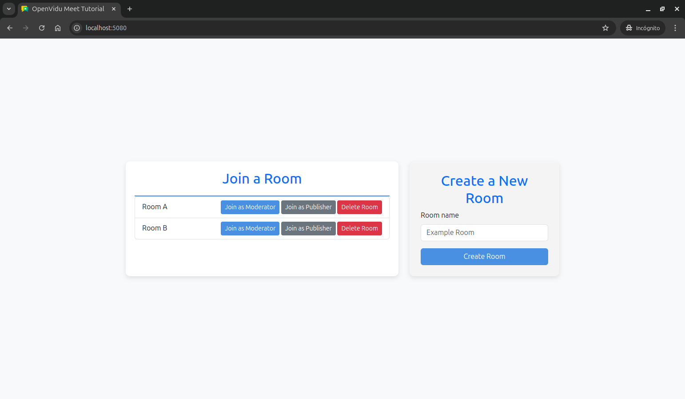
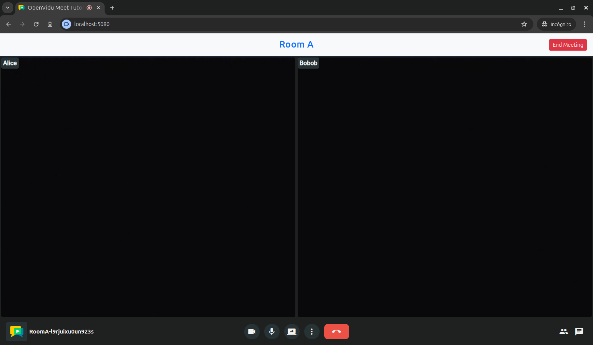

# OpenVidu Meet Direct Link Tutorial

[Source code :simple-github:](https://github.com/OpenVidu/openvidu-meet-tutorials/tree/main/meet-direct-link){ .md-button target=\_blank }

This tutorial is a simple example of how to integrate **OpenVidu Meet** into a **Node.js** application by easily using a direct link. It is built using **Node.js and Express** for the backend and plain **HTML/CSS/JavaScript** for the frontend.

At the end of this tutorial, you will have a fully functional simple video-call application with the following features:

-   Users can create rooms.
-   Users can delete rooms.
-   Users can join a room as moderator or speaker.
-   Users can chat with other participants.
-   Moderators can record the meeting.
-   Users may leave the room at any time.
-   Moderators may end the meeting at any time, disconnecting all participants.
-   Users can view the recordings of the meeting.

The application uses the [OpenVidu Meet API](../../embedded/reference/rest-api.md) to create and delete rooms, and direct links to the **OpenVidu Meet interface** to access the video call functionality.

## Running this tutorial

#### 1. Run OpenVidu Meet

--8<-- "shared/tutorials/run-openvidu-meet.md"

### 2. Download the tutorial code

```bash
git clone https://github.com/OpenVidu/openvidu-meet-tutorials.git -b main
```

### 3. Run the application

To run this application, you need [Node.js :fontawesome-solid-external-link:{.external-link-icon}](https://nodejs.org/en/download){:target="\_blank"} installed on your device.

1. Navigate into the application directory

```bash
cd openvidu-meet-tutorials/meet-direct-link
```

2. Install dependencies

```bash
npm install
```

3. Run the application

```bash
npm start
```

Once the server is up and running, you can test the application by visiting [`http://localhost:6080`](http://localhost:6080){:target="\_blank"}. You should see a screen like this:

<div class="grid-container">

<div class="grid-50"><p><a class="glightbox" href="../../../../assets/images/meet/tutorials/home-js.png" data-type="image" data-desc-position="bottom"></a></p></div>

<div class="grid-50"><p><a class="glightbox" href="../../../../assets/images/meet/tutorials/room-js.png" data-type="image" data-desc-position="bottom"></a></p></div>

</div>

## Understanding the code

This application is designed to be beginner-friendly and consists of one essential backend file under the `src` directory:

-   `index.js`: This file holds the server application and defines the REST API endpoints.

And the following essential frontend files under the `public` directory:

-   `index.html`: This is the client application's main HTML file.
-   `app.js`: This is the main JavaScript file that interacts with the server application and handles the client application's logic and functionality.
-   `style.css`: This file contains the client application's styling.

---

### Backend

The server application is a simple Express app with a single file `index.js` that exports three endpoints:

-   **`POST /rooms`**: Create a new room with the given room name.
-   **`GET /rooms`**: Get the list of rooms.
-   **`DELETE /rooms/:roomId`**: Delete a room with the given room ID.

Let's see the code of the `index.js` file:

```javascript title="<a href='https://github.com/OpenVidu/openvidu-meet-tutorials/blob/main/meet-direct-link/src/index.js#L1-L23' target='_blank'>index.js</a>" linenums="1"
import bodyParser from 'body-parser';
import cors from 'cors';
import dotenv from 'dotenv';
import express from 'express';
import path from 'path';
import { fileURLToPath } from 'url';

dotenv.config(); // (1)!

// Configuration
const SERVER_PORT = process.env.SERVER_PORT || 6080; // (2)!
const OV_MEET_SERVER_URL = process.env.OV_MEET_SERVER_URL || 'http://localhost:9080'; // (3)!
const OV_MEET_API_KEY = process.env.OV_MEET_API_KEY || 'meet-api-key'; // (4)!

const app = express(); // (5)!

app.use(cors()); // (6)!
app.use(express.json()); // (7)!
app.use(bodyParser.urlencoded({ extended: true }));

const __filename = fileURLToPath(import.meta.url);
const __dirname = path.dirname(__filename);
app.use(express.static(path.join(__dirname, '../public'))); // (8)!
```

1. Load environment variables from `.env` file.
2. The port where the application will be listening.
3. The OpenVidu Meet server URL.
4. The OpenVidu Meet API key.
5. Initialize the Express application.
6. Enable CORS support.
7. Enable JSON body parsing.
8. Serve static files from the `public` directory.

The `index.js` file imports the required dependencies and loads the necessary environment variables:

-   `SERVER_PORT`: The port where the application will be listening.
-   `OV_MEET_SERVER_URL`: The OpenVidu Meet server URL.
-   `OV_MEET_API_KEY`: The OpenVidu Meet API key.

Then the `express` application is initialized. CORS is allowed, JSON body parsing is enabled, and static files are served from the `public` directory.

Now let's see the code of each endpoint:

---

#### Create room

The `POST /rooms` endpoint creates a new room. It receives the room name as a body parameter and returns the newly created room:

```javascript title="<a href='https://github.com/OpenVidu/openvidu-meet-tutorials/blob/main/meet-direct-link/src/index.js#L25-L58' target='_blank'>index.js</a>" linenums="25"
// Create a new room
app.post('/rooms', async (req, res) => {
    const { roomName } = req.body; // (1)!

    if (!roomName) {
        res.status(400).json({ message: `'roomName' is required` }); // (2)!
        return;
    }

    try {
        // Create a new OpenVidu Meet room using the API
        const room = await httpRequest('POST', 'rooms', {
            roomName, // (3)!
            config: {
                // (4)!
                // Default room configuration
                chat: {
                    enabled: true // Enable chat for this room
                },
                recording: {
                    enabled: true, // Enable recording for this room
                    allowAccessTo: 'admin_moderator_speaker' // Allow access to recordings for admin, moderator and speaker roles
                },
                virtualBackground: {
                    enabled: true // Enable virtual background for this room
                }
            }
        });

        console.log('Room created:', room);
        res.status(201).json({ message: `Room '${roomName}' created successfully`, room }); // (5)!
    } catch (error) {
        handleApiError(res, error, `Error creating room '${roomName}'`); // (6)!
    }
});
```

1. The `roomName` parameter is obtained from the request body.
2. If the `roomName` is not provided, the server returns a `400 Bad Request` response.
3. Specify the name of the room.
4. Set the configuration for the room, enabling chat, recording and virtual background.
5. The server returns a `201 Created` response with the room object.
6. If an error occurs during room creation, it is handled by the `handleApiError` function.

This endpoint does the following:

1. The `roomName` parameter is obtained from the request body. If it is not provided, the server returns a `400 Bad Request` response.
2. A new room is created using the OpenVidu Meet API by sending a `POST` request to the `rooms` endpoint. The request includes the room name and additional configuration options (with default values):

    - **Chat Configuration**: Enables chat functionality for the room.
    - **Recording Configuration**: Enables recording for the room and allows access to recordings for the roles `admin`, `moderator` and `speaker`.
    - **Virtual Background Configuration**: Enables virtual background functionality for the room.

    To send requests to the OpenVidu Meet API, we use the `httpRequest` function:

    ```javascript title="<a href='https://github.com/OpenVidu/openvidu-meet-tutorials/blob/main/meet-direct-link/src/index.js#L89-L111' target='_blank'>index.js</a>" linenums="89"
    // Function to make HTTP requests to OpenVidu Meet API
    const httpRequest = async (method, path, body) => {
        // (1)!
        const response = await fetch(`${OV_MEET_SERVER_URL}/api/v1/${path}`, {
            method,
            headers: {
                'Content-Type': 'application/json',
                'X-API-KEY': OV_MEET_API_KEY // Include the API key in the header for authentication
            },
            body: body ? JSON.stringify(body) : undefined // (2)!
        });

        const responseBody = await response.json(); // (3)!

        if (!response.ok) {
            console.error('Error while performing request to OpenVidu Meet API:', responseBody);
            // Create an error object that includes the HTTP status code from the API
            const error = new Error(responseBody.message || 'Failed to perform request to OpenVidu Meet API');
            error.statusCode = response.status;
            throw error; // (4)!
        }

        return responseBody; // (5)!
    };
    ```

    1. Perform an HTTP request to the OpenVidu Meet API in the specified method and path.
    2. Include the body in the request if provided.
    3. Parse the response body as JSON.
    4. If the response is not OK, throw an error with the message and status code from the response.
    5. Return the response body.

    This function makes HTTP requests to the OpenVidu Meet API using the `fetch` function. It receives the HTTP method, path and body as parameters. The API key is included in the request headers for authentication.

    It parses the response body as JSON and checks if the response is OK. If not, it throws an error with the message and status code from the response.

3. If the room is successfully created, the server returns a `201 Created` response with the room object. Otherwise, the error is handled by the `handleApiError` function, which logs the error and returns an appropriate HTTP response:

    ```javascript title="<a href='https://github.com/OpenVidu/openvidu-meet-tutorials/blob/main/meet-direct-link/src/index.js#L113-L119' target='_blank'>index.js</a>" linenums="113"
    // Helper function to handle API errors consistently
    const handleApiError = (res, error, message) => {
        console.error(`${message}: ${error.message}`); // (1)!
        const statusCode = error.statusCode || 500; // (2)!
        const errorMessage = error.statusCode ? error.message : message; // (3)!
        res.status(statusCode).json({ message: errorMessage }); // (4)!
    };
    ```

    1. Log the error message to the console.
    2. Get the status code from the error object or default to `500 Internal Server Error`.
    3. Determine the error message to return based on whether the error has a status code.
    4. Return an HTTP response with the appropriate status code and error message.

---

#### List rooms

The `GET /rooms` endpoint retrieves the list of all rooms created in OpenVidu Meet:

```javascript title="<a href='https://github.com/OpenVidu/openvidu-meet-tutorials/blob/main/meet-direct-link/src/index.js#L60-L69' target='_blank'>index.js</a>" linenums="60"
// List all rooms
app.get('/rooms', (_req, res) => {
    try {
        // List all OpenVidu Meet rooms using the API (100 max)
        const { rooms } = await httpRequest('GET', 'rooms?maxItems=100'); // (1)!
        res.status(200).json({ rooms }); // (2)!
    } catch (error) {
        handleApiError(res, error, 'Error fetching rooms');
    }
});
```

1. Make a `GET` request to the `rooms` endpoint of the OpenVidu Meet API to retrieve the list of rooms (with a maximum of 100 rooms).
2. The server returns a `200 OK` response with the list of rooms.

This endpoint retrieves the list of rooms by making a `GET` request to the `rooms` endpoint (with a maximum of 100 rooms by setting the `maxItems` query parameter) of the OpenVidu Meet API using the `httpRequest` function. If the request is successful, the server returns a `200 OK` response with the list of rooms. Otherwise, the error is handled by the `handleApiError` function.

---

#### Delete room

The `DELETE /room/:roomId` endpoint deletes the specified room:

```javascript title="<a href='https://github.com/OpenVidu/openvidu-meet-tutorials/blob/main/meet-direct-link/src/index.js#L71-L82' target='_blank'>index.js</a>" linenums="71"
app.delete('/rooms/:roomId', async (req, res) => {
    const { roomId } = req.params; // (1)!

    try {
        // Delete the OpenVidu Meet room using the API
        await httpRequest('DELETE', `rooms/${roomId}`); // (2)!
        res.status(200).json({ message: `Room '${roomId}' deleted successfully` }); // (3)!
    } catch (error) {
        handleApiError(res, error, `Error deleting room '${roomId}'`);
    }
});
```

1. The `roomId` parameter is obtained from the request parameters.
2. The room is deleted using the OpenVidu Meet API by sending a `DELETE` request to the `rooms/:roomId` endpoint.
3. The server returns a `200 OK` response with a success message.

This endpoint does the following:

1. The `roomId` parameter is obtained from the request parameters.
2. The room is deleted using the OpenVidu Meet API by sending a `DELETE` request to the `rooms/:roomId` endpoint.
3. If the room is successfully deleted, the server returns a `200 OK` response with a success message. Otherwise, the error is handled by the `handleApiError` function.

---

### Frontend

The client application consists of only three essential files that are located in the `public` directory:

-   `app.js`: This is the main JavaScript file for the sample application. It contains the logic for listing, creating, joining and deleting rooms.
-   `index.html`: This HTML file is responsible for creating the user interface. It contains the list of created rooms, and a form to create a new room.
-   `styles.css`: This file contains CSS classes that are used to style the `index.html` page.

Now let's see the code of the `app.js` file grouped by sections:

---

#### Listing rooms

The list of rooms is displayed in the `index.html` file as soon as the page loads. This is done by calling the `fetchRooms()` function, which fetches the list of rooms from the server and updates the UI accordingly.

```javascript title="<a href='https://github.com/OpenVidu/openvidu-meet-tutorials/blob/main/meet-direct-link/public/js/app.js#L1-L23' target='_blank'>app.js</a>" linenums="1"
const rooms = new Map(); // (1)!

document.addEventListener('DOMContentLoaded', async () => {
    await fetchRooms(); // (2)!
});

async function fetchRooms() {
    try {
        const { rooms: roomsList } = await httpRequest('GET', '/rooms'); // (3)!

        roomsList.forEach((room) => {
            rooms.set(room.roomId, room); // (4)!
        });
        renderRooms(); // (5)!
    } catch (error) {
        console.error('Error fetching rooms:', error.message);

        // Show error message
        const roomsErrorElement = document.querySelector('#no-rooms-or-error');
        roomsErrorElement.textContent = 'Error loading rooms';
        roomsErrorElement.hidden = false;
    }
}
```

1. Create a map to store the rooms.
2. When the DOM content is loaded, call the `fetchRooms()` function to fetch the list of rooms from the server.
3. Make a `GET` request to the `/rooms` endpoint to fetch the list of rooms.
4. For each room in the list, add it to the `rooms` map.
5. Call the `renderRooms()` function to display the list of rooms.

The `fetchRooms()` function performs the following actions:

1. Makes a `GET` request to the `/rooms` endpoint to fetch the list of rooms.

    To send requests to the backend, we use the `httpRequest` function:

    ```javascript title="<a href='https://github.com/OpenVidu/openvidu-meet-tutorials/blob/main/meet-direct-link/public/js/app.js#L117-L134' target='_blank'>app.js</a>" linenums="117"
    // Function to make HTTP requests to the backend
    async function httpRequest(method, path, body) {
        // (1)!
        const response = await fetch(path, {
            method,
            headers: {
                'Content-Type': 'application/json'
            },
            body: body ? JSON.stringify(body) : undefined // (2)!
        });

        const responseBody = await response.json(); // (3)!

        if (!response.ok) {
            throw new Error(responseBody.message || 'Failed to perform request to backend'); // (4)!
        }

        return responseBody; // (5)!
    }
    ```

    1. Perform an HTTP request to the backend in the specified method and path.
    2. Include the body in the request if provided.
    3. Parse the response body as JSON.
    4. If the response is not OK, throw an error with the message from the response.
    5. Return the response body.

    This function makes HTTP requests to the server API using the `fetch` function. It receives the HTTP method, path and body as parameters. Then, it parses the response body as JSON and checks if the response is OK. If not, it throws an error with the message from the response.

2. For each room in the list, it adds the room to the `rooms` map. This map is used to store the rooms indexed by their IDs to make it easier to access them later.
3. Calls the `renderRooms()` function to display the list of rooms.
4. If an error occurs during the request, it logs the error and displays an appropriate error message.

The `renderRooms()` function is responsible for updating the UI with the list of rooms:

```javascript title="<a href='https://github.com/OpenVidu/openvidu-meet-tutorials/blob/main/meet-direct-link/public/js/app.js#L25-L75' target='_blank'>app.js</a>" linenums="25"
function renderRooms() {
    // Clear the previous list of rooms
    const roomsList = document.querySelector('#rooms-list ul'); // (1)!
    roomsList.innerHTML = ''; // (2)!

    // Show or remove the "No rooms found" message
    const noRoomsElement = document.querySelector('#no-rooms-or-error');
    if (rooms.size === 0) {
        noRoomsElement.textContent = 'No rooms found. Please create a new room.';
        noRoomsElement.hidden = false;
        return;
    } else {
        noRoomsElement.textContent = '';
        noRoomsElement.hidden = true;
    }

    // Add rooms to the list element
    Array.from(rooms.values()).forEach((room) => {
        const roomItem = getRoomListItemTemplate(room); // (3)!
        roomsList.innerHTML += roomItem; // (4)!
    });
}

function getRoomListItemTemplate(room) {
    return `
        <li class="list-group-item">
            <span>${room.roomName}</span>
            <div class="room-actions">
                <a
                    class="btn btn-primary btn-sm"
                    href="${room.moderatorUrl}"
                >
                    Join as Moderator
                </a>
                <a
                    class="btn btn-secondary btn-sm"
                    href="${room.speakerUrl}"
                >
                    Join as Speaker
                </a>
                <button 
                    title="Delete room"
                    class="icon-button delete-button"
                    onclick="deleteRoom('${room.roomId}');"
                >
                    <i class="fa-solid fa-trash"></i>
                </button>
            </div>
        </li>
    `;
}
```

1. Get the `ul` element where the list of rooms will be displayed.
2. Clear the previous list of rooms.
3. For each room, get the HTML template for the room list item.
4. Append the room item to the list element.

The `renderRooms()` function performs the following actions:

1. Clears the previous list of rooms by getting the `ul` element and setting its inner HTML to an empty string.
2. Checks if there are any rooms in the `rooms` map. If there are no rooms, it shows a message indicating that no rooms were found. Otherwise, it hides the message.
3. For each room in the `rooms` map, it calls the `getRoomListItemTemplate()` function to get the HTML template for the room list item.
4. Appends the room item to the list element.

The `getRoomListItemTemplate()` function generates the HTML template for each room list item. It includes anchor links to join the room as a moderator or speaker using direct URLs, and a button to delete the room. The anchor links use the `moderatorUrl` and `speakerUrl` properties from the room object to redirect users directly to the OpenVidu Meet interface, while the delete button calls the `deleteRoom()` function passing the room ID to remove the room from the server.

---

#### Creating a room

After the user specifies the room name and clicks the `Create Room` button, the `createRoom()` function is called:

```javascript title="<a href='https://github.com/OpenVidu/openvidu-meet-tutorials/blob/main/meet-direct-link/public/js/app.js#L77-L103' target='_blank'>app.js</a>" linenums="77"
async function createRoom() {
    // Clear previous error message
    const errorDiv = document.querySelector('#create-room-error');
    errorDiv.textContent = '';
    errorDiv.hidden = true;

    try {
        const roomName = document.querySelector('#room-name').value; // (1)!

        const { room } = await httpRequest('POST', '/rooms', {
            roomName
        }); // (2)!

        // Add new room to the list
        rooms.set(room.roomId, room); // (3)!
        renderRooms(); // (4)!

        // Reset the form
        const createRoomForm = document.querySelector('#create-room form');
        createRoomForm.reset(); // (5)!
    } catch (error) {
        console.error('Error creating room:', error.message);

        // Show error message
        errorDiv.textContent = 'Error creating room';
        errorDiv.hidden = false;
    }
}
```

1. Get the room name from the input field.
2. Make a `POST` request to the `/rooms` endpoint to create a new room with the specified name.
3. Add the new room to the `rooms` map.
4. Call the `renderRooms()` function to update the list of rooms.
5. Reset the form to clear the input field.

The `createRoom()` function performs the following actions:

1. Clears any previous error messages.
2. Gets the room name from the input field.
3. Makes a `POST` request to the `/rooms` endpoint to create a new room with the specified name.
4. If the room is successfully created, it adds the new room to the `rooms` map and calls the `renderRooms()` function to update the list of rooms.
5. Resets the form to clear the input field.
6. If an error occurs during room creation, it logs the error and displays an appropriate error message.

---

#### Deleting a room

When the user clicks the delete room button, the `deleteRoom()` function is called:

```javascript title="<a href='https://github.com/OpenVidu/openvidu-meet-tutorials/blob/main/meet-direct-link/public/js/app.js#L105-L115' target='_blank'>app.js</a>" linenums="105"
async function deleteRoom(roomId) {
    try {
        await httpRequest('DELETE', `/rooms/${roomId}`); // (1)!

        // Remove the room from the list
        rooms.delete(roomId); // (2)!
        renderRooms(); // (3)!
    } catch (error) {
        console.error('Error deleting room:', error.message);
    }
}
```

1. Make a `DELETE` request to the `/rooms/:roomId` endpoint to delete the specified room.
2. Remove the room from the `rooms` map.
3. Call the `renderRooms()` function to update the list of rooms.

The `deleteRoom()` function simply makes a `DELETE` request to the `/rooms/:roomId` endpoint to delete the specified room. If the room is successfully deleted, it removes the room from the `rooms` map and calls the `renderRooms()` function to update the list of rooms. If an error occurs during room deletion, it logs the error to the console.
