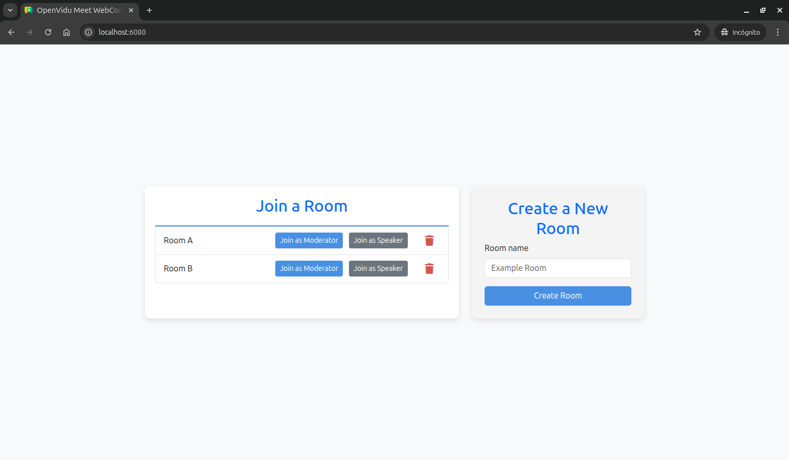
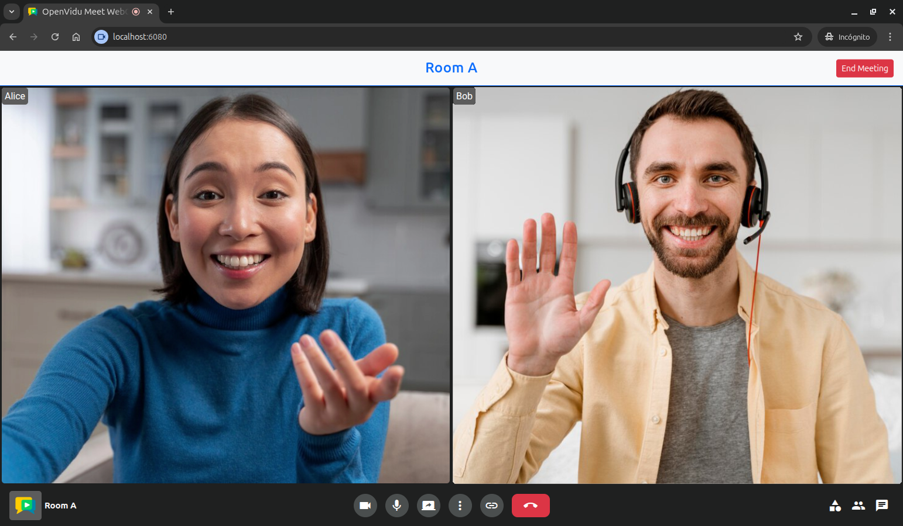

# WebComponent Commands & Events Tutorial

[Source code :simple-github:](https://github.com/OpenVidu/openvidu-meet-tutorials/tree/3.7.0/embedding-options/meet-webcomponent-commands-events){ .md-button target=\_blank }

This tutorial extends the [basic WebComponent tutorial](webcomponent.md) to add **advanced WebComponent functionality** through commands and event handling. It demonstrates how to interact with the OpenVidu Meet WebComponent programmatically and respond to meeting events.

The application includes all the features from the basic WebComponent tutorial, plus:

- **WebComponent commands**: Control the meeting programmatically (e.g., end meeting for moderators).
- **Event handling**: Listen to and respond to WebComponent events (joined, left, closed).
- **Role-based UI**: Display different interface elements based on user role (moderator/speaker).
- **Meeting header**: Show room information and controls above the WebComponent.
- **Enhanced room management**: In-memory room tracking with unique names per room.

## Running this tutorial

#### 1. Run OpenVidu Meet

--8<-- "shared/tutorials/run-openvidu-meet.md"

### 2. Download the tutorial code

```bash
git clone https://github.com/OpenVidu/openvidu-meet-tutorials.git -b 3.7.0
```

### 3. Run the application

To run this application, you need [Node.js :fontawesome-solid-external-link:{.external-link-icon}](https://nodejs.org/en/download){:target="\_blank"} installed on your device.

1. Navigate into the application directory

```bash
cd openvidu-meet-tutorials/embedding-options/meet-webcomponent-commands-events
```

2. Install dependencies

```bash
npm install
```

3. Run the application

```bash
npm start
```

Once the server is up and running, you can test the application by visiting [`http://localhost:6080`](http://localhost:6080){:target="\_blank"}. You should see a screen like this:

<div class="grid-container">

<div class="grid-50"><p><a class="glightbox" href="../../../../../assets/images/meet/tutorials/webcomponent-advanced-home.png" data-type="image" data-desc-position="bottom"></a></p></div>

<div class="grid-50"><p><a class="glightbox" href="../../../../../assets/images/meet/tutorials/webcomponent-advanced-room.png" data-type="image" data-desc-position="bottom"></a></p></div>

</div>

## Understanding the code

This tutorial builds upon the [basic WebComponent tutorial](webcomponent.md), adding advanced WebComponent interaction capabilities and enhanced room management. We'll focus on the key differences and new functionality.

---

### Backend

The backend is identical to previous tutorials. It provides the same three REST API endpoints:

- **`POST /rooms`**: Create a new room with the given room name.
- **`GET /rooms`**: Get the list of rooms.
- **`DELETE /rooms/:roomId`**: Delete a room with the given room ID.

For detailed backend documentation, please refer to the [Direct Link tutorial backend section](direct-link.md#backend).

---

### Frontend modifications

The frontend changes focus on enhanced room management, WebComponent event handling, and role-based UI features.

#### Enhanced room template

The room template now passes additional parameters including role information:

```javascript title="<a href='https://github.com/OpenVidu/openvidu-meet-tutorials/blob/3.7.0/embedding-options/meet-webcomponent-commands-events/public/js/app.js#L50-L92' target='_blank'>app.js</a>" linenums="50" hl_lines="6-39"
function getRoomListItemTemplate(room) {
	return `
        <li class="ov-list-item">
            <span class="ov-list-item__name">${room.roomName}</span>
            <div class="ov-list-item__actions">
                <button
                    type="button"
                    title="Access as moderator"
                    class="ov-btn ov-btn--primary ov-btn--sm"
                    onclick="accessRoom(
                        '${room.roomName}',
                        '${room.access.anonymous.moderator.url}',
                        'moderator'
                    );"
                >
                    <span class="material-symbols-outlined">shield_person</span>
                    Moderator
                </button>
                <button
                    type="button"
                    title="Access as speaker"
                    class="ov-btn ov-btn--secondary ov-btn--sm"
                    onclick="accessRoom(
                        '${room.roomName}',
                        '${room.access.anonymous.speaker.url}',
                        'speaker'
                    );"
                >
                    <span class="material-symbols-outlined">record_voice_over</span>
                    Speaker
                </button>
                <button
                    type="button"
                    title="Delete room"
                    class="ov-icon-btn ov-icon-btn--danger"
                    onclick="deleteRoom('${room.roomId}');"
                >
                    <span class="material-symbols-outlined">delete</span>
                </button>
            </div>
        </li>
    `;
}
```

The template now provides the room name and user role to the `accessRoom()` function, enabling role-based functionality and proper room identification.

---

#### Advanced room access with commands and events

The `accessRoom()` function has been significantly enhanced to handle WebComponent events and commands:

```javascript title="<a href='https://github.com/OpenVidu/openvidu-meet-tutorials/blob/3.7.0/embedding-options/meet-webcomponent-commands-events/public/js/app.js#L138-L202' target='_blank'>app.js</a>" linenums="138"
// Embed the OpenVidu Meet component and react to its events. 'roomName' and 'role' fill the
// custom room header shown once the local participant joins the meeting.
function accessRoom(roomName, roomUrl, role) {
	console.log(`Accessing room as ${role}`);

	// Hide the home screen and show the room screen
	const homeScreen = document.querySelector('#home');
	homeScreen.hidden = true; // (1)!
	const roomScreen = document.querySelector('#room');
	roomScreen.hidden = false; // (2)!

	// Hide the room header until the local participant joins the meeting
	const roomHeader = document.querySelector('#room-header');
	roomHeader.hidden = true; // (3)!

	// Inject the OpenVidu Meet component into the meet container specifying the room URL
	const meetContainer = document.querySelector('#meet-container');
	meetContainer.innerHTML = `
        <openvidu-meet 
            room-url="${roomUrl}"
        >
        </openvidu-meet>
    `; // (4)!

	// Add event listeners for the OpenVidu Meet component
	const meet = document.querySelector('openvidu-meet');

	// Event listener for when the local participant joins the meeting
	meet.once('joined', () => {
		// (5)!
		console.log('Local participant joined the meeting');

		// Show the room header with the room name
		roomHeader.hidden = false;
		const roomNameHeader = document.querySelector('#room-name-header');
		roomNameHeader.textContent = roomName; // (6)!

		// Show the participant's role as a badge
		const roleBadge = document.querySelector('#room-role-badge');
		const roleIcon = role === 'moderator' ? 'shield_person' : 'record_voice_over';
		roleBadge.className = `ov-badge ov-badge--${role === 'moderator' ? 'moderator' : 'speaker'}`;
		roleBadge.innerHTML = `<span class="material-symbols-outlined">${roleIcon}</span>${role}`; // (7)!

		// The "End meeting" command is available only to moderators
		const endMeetingButton = document.querySelector('#end-meeting-btn');
		endMeetingButton.hidden = role !== 'moderator'; // (8)!
		endMeetingButton.onclick = role === 'moderator' ? () => meet.endMeeting() : null; // (9)!
	});

	// Event listener for when the local participant leaves the room
	meet.once('left', (event) => {
		// (10)!
		console.log('Local participant left the room. Reason:', event.reason);

		// Hide the room header
		roomHeader.hidden = true;
	});

	// Event listener for when the OpenVidu Meet component is closed
	meet.once('closed', () => {
		// (11)!
		console.log('OpenVidu Meet component closed');

		// Hide the room screen and show the home screen
		roomScreen.hidden = true;
		homeScreen.hidden = false;
	});
}
```

1. Hide the home screen.
2. Show the room screen.
3. Hide the room header until the local participant joins the meeting.
4. Inject the OpenVidu Meet WebComponent into the meet container with the specified room URL.
5. Add an event listener for the `joined` event, which is triggered when the local participant joins the meeting.
6. Set the room name in the header.
7. Display the participant's role as a badge, choosing the icon and color based on whether the user is a moderator or a speaker.
8. Show the `End meeting` button only when the user is a moderator.
9. Wire the `End meeting` button to the `endMeeting()` method of the OpenVidu Meet WebComponent (only for moderators). This method disconnects all participants and ends the meeting for everyone.
10. Add an event listener for the `left` event, which is triggered when the local participant leaves the room.
11. Add an event listener for the `closed` event, which is triggered when the OpenVidu Meet component is closed.

The enhanced `accessRoom()` function now performs the following actions:

1. Hides the home screen and shows the room screen.
2. Hides the room header until the local participant joins the meeting.
3. Injects the OpenVidu Meet WebComponent into the meet container with the specified room URL.
4. Configures event listeners for the OpenVidu Meet WebComponent to handle different events:
    - **`joined`**: This event is triggered when the local participant joins the meeting. It shows the room header with the room name and a badge indicating the participant's role. It also displays the `End meeting` button only for moderators and wires it to the `endMeeting()` method of the OpenVidu Meet WebComponent. This method disconnects all participants and ends the meeting for everyone.
    - **`left`**: This event is triggered when the local participant leaves the room. It hides the room header.
    - **`closed`**: This event is triggered when the OpenVidu Meet component is closed. It hides the room screen and shows the home screen.

## Accessing this tutorial from other computers or phones

--8<-- "shared/tutorials/access-tutorial-from-other-devices.md"

## Connecting this tutorial to an OpenVidu Meet production deployment

--8<-- "shared/tutorials/connect-tutorial-to-production-deployment.md"
