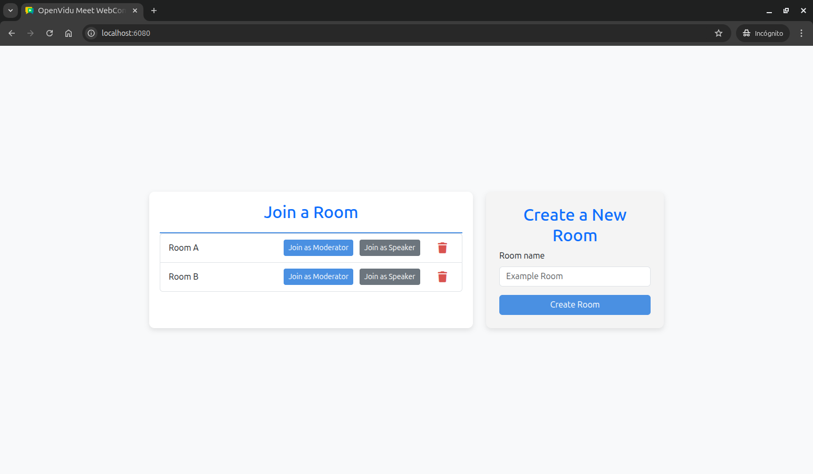

# OpenVidu Meet WebComponent Tutorial

[Source code :simple-github:](https://github.com/OpenVidu/openvidu-meet-tutorials/tree/3.5.0/meet-webcomponent-basic){ .md-button target=\_blank }

This tutorial extends the [Direct Link tutorial](direct-link.md) by integrating the **OpenVidu Meet WebComponent** directly into your application instead of using external links. It is built using **Node.js and Express** for the backend and plain **HTML/CSS/JavaScript** for the frontend.

At the end of this tutorial, you will have a fully functional simple video-call application with the following features:

-   Users can create rooms.
-   Users can delete rooms.
-   Users can join a room as moderator or speaker.
-   Users can chat with other users.
-   Users may leave the room at any time.
-   Users can view the recordings of the meeting.
-   Moderators can record the meeting.
-   Moderators may end the meeting at any time, disconnecting all users.

The application uses the [OpenVidu Meet API](../../embedded/reference/rest-api.md) to create and delete rooms, and the [OpenVidu Meet WebComponent](../../embedded/reference/webcomponent.md) to embed the video call interface directly into the application.

## Running this tutorial

#### 1. Run OpenVidu Meet

--8<-- "shared/tutorials/run-openvidu-meet.md"

### 2. Download the tutorial code

```bash
git clone https://github.com/OpenVidu/openvidu-meet-tutorials.git -b 3.5.0
```

### 3. Run the application

To run this application, you need [Node.js :fontawesome-solid-external-link:{.external-link-icon}](https://nodejs.org/en/download){:target="\_blank"} installed on your device.

1. Navigate into the application directory

```bash
cd openvidu-meet-tutorials/meet-webcomponent-basic
```

2. Install dependencies

```bash
npm install
```

3. Run the application

```bash
npm start
```

Once the server is up and running, you can test the application by visiting [`http://localhost:6080`](http://localhost:6080){:target="\_blank"}. You should see a screen like this:

<div class="grid-container">

<div class="grid-50"><p><a class="glightbox" href="../../../../assets/images/meet/tutorials/webcomponent-home.png" data-type="image" data-desc-position="bottom"></a></p></div>

<div class="grid-50"><p><a class="glightbox" href="../../../../assets/images/meet/tutorials/webcomponent-room.png" data-type="image" data-desc-position="bottom"></a></p></div>

</div>

## Understanding the code

This tutorial builds upon the [Direct Link tutorial](direct-link.md), replacing external redirect links with an embedded OpenVidu Meet WebComponent. The backend remains identical, so we'll focus on the frontend modifications that enable WebComponent integration.

---

### Backend

The backend is identical to the [Direct Link tutorial](direct-link.md). It provides the same three REST API endpoints:

-   **`POST /rooms`**: Create a new room with the given room name.
-   **`GET /rooms`**: Get the list of rooms.
-   **`DELETE /rooms/:roomId`**: Delete a room with the given room ID.

For detailed backend documentation, please refer to the [Direct Link tutorial backend section](direct-link.md#backend).

---

### Frontend modifications

The main changes in the frontend involve replacing direct links with embedded WebComponent functionality. The key modifications are in the `public/js/app.js` and `public/index.html` files.

#### Including the OpenVidu Meet WebComponent

To use the OpenVidu Meet WebComponent in your application, you need to include it in your HTML file by adding a script tag to the end of the `<body>` section:

```html title="<a href='https://github.com/OpenVidu/openvidu-meet-tutorials/blob/3.5.0/meet-webcomponent-basic/public/index.html#L66-L67' target='_blank'>index.html</a>" linenums="66"
<!-- OpenVidu Meet WebComponent bundle -->
<script src="http://localhost:9080/meet/v1/openvidu-meet.js"></script>
```

---

#### Enhanced room list template

The room list template has been modified to use buttons instead of direct links, enabling WebComponent integration:

```javascript title="<a href='https://github.com/OpenVidu/openvidu-meet-tutorials/blob/3.5.0/meet-webcomponent-basic/public/js/app.js#L48-L75' target='_blank'>app.js</a>" linenums="48" hl_lines="6-17"
function getRoomListItemTemplate(room) {
    return `
        <li class="list-group-item">
            <span>${room.roomName}</span>
            <div class="room-actions">
                <button
                    class="btn btn-primary btn-sm"
                    onclick="joinRoom('${room.moderatorUrl}');"
                >
                    Join as Moderator
                </button>
                <button
                    class="btn btn-secondary btn-sm"
                    onclick="joinRoom('${room.speakerUrl}');"
                >
                    Join as Speaker
                </button>
                <button
                    title="Delete room"
                    class="icon-button delete-button"
                    onclick="deleteRoom('${room.roomId}');"
                >
                    <i class="fa-solid fa-trash"></i>
                </button>
            </div>
        </li>
    `;
}
```

The key difference from the Direct Link tutorial is that instead of using anchor tags (`<a>`) with `href` attributes pointing to external URLs, this template uses buttons that call the `joinRoom()` function with the appropriate room URL.

---

#### Joining a room with WebComponent

When the user clicks the `Join as Moderator` or `Join as Speaker` button, the `joinRoom()` function is called, which handles embedding the OpenVidu Meet WebComponent:

```javascript title="<a href='https://github.com/OpenVidu/openvidu-meet-tutorials/blob/3.5.0/meet-webcomponent-basic/public/js/app.js#L117-L133' target='_blank'>app.js</a>" linenums="117"
function joinRoom(roomUrl) {
    // Hide the home screen and show the room screen
    const homeScreen = document.querySelector('#home');
    homeScreen.hidden = true; // (1)!
    const roomScreen = document.querySelector('#room');
    roomScreen.hidden = false; // (2)!

    // Inject the OpenVidu Meet component into the meeting container specifying the room URL
    const meetingContainer = document.querySelector('#meeting-container');
    meetingContainer.innerHTML = `
        <openvidu-meet
            room-url="${roomUrl}"
            leave-redirect-url="/"
        >
        </openvidu-meet>
    `; // (3)!
}
```

1. Hide the home screen to prepare for the meeting view.
2. Show the room screen where the WebComponent will be embedded.
3. Inject the OpenVidu Meet WebComponent into the meeting container with the specified room URL and a leave redirect URL.

The `joinRoom()` function hides the home screen and shows the room screen to provide a dedicated space for the video meeting. Then, it dynamically creates and injects the `<openvidu-meet>` WebComponent into the meeting container, setting the `room-url` attribute with the URL provided by the OpenVidu Meet API and configuring the `leave-redirect-url` attribute to return users to the home screen when they leave the meeting.

This approach provides a seamless user experience by keeping users within the same application while providing full video conferencing functionality through the embedded WebComponent.

## Accessing this tutorial from other computers or phones

--8<-- "shared/tutorials/access-tutorial-from-other-devices.md"

## Connecting this tutorial to an OpenVidu Meet production deployment

--8<-- "shared/tutorials/connect-tutorial-to-production-deployment.md"
