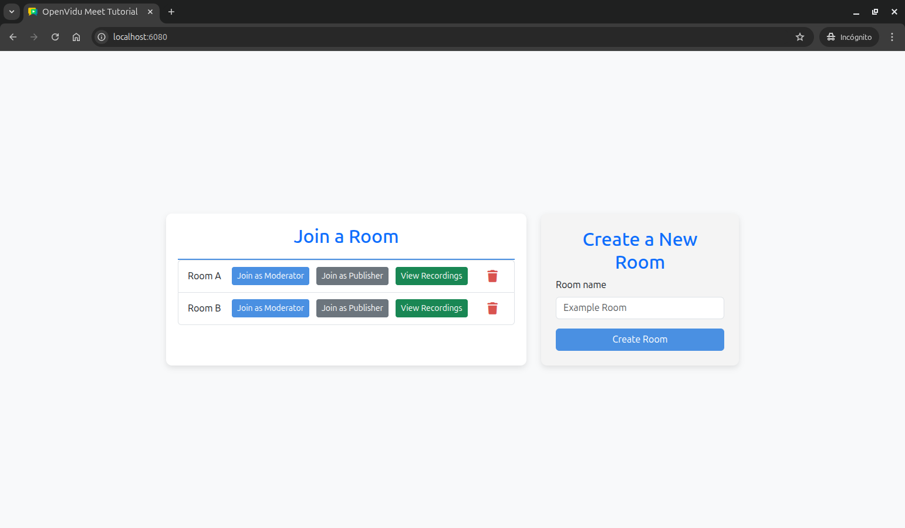

# OpenVidu Meet Webhooks Tutorial

[Source code :simple-github:](https://github.com/OpenVidu/openvidu-meet-tutorials/tree/main/meet-webhooks){ .md-button target=\_blank }

This tutorial extends the [recordings tutorial](recordings.md) to add **real-time updates** through webhooks and Server-Sent Events (SSE). It demonstrates how to receive and process OpenVidu Meet webhooks to provide live status updates for rooms and recordings.

The application includes all the features from the recordings tutorial, plus:

-   **Real-time room status updates**: Live updates when meetings start or end.
-   **Live recording updates**: Instant updates when recordings are completed.
-   **Webhook validation**: Secure webhook processing with signature verification.
-   **Room status badges**: Visual indicators showing room status (open, active, closed).
-   **Server-Sent Events**: Efficient real-time communication between server and client.

## Running this tutorial

#### 1. Run OpenVidu Meet

--8<-- "shared/tutorials/run-openvidu-meet.md"

### 2. Download the tutorial code

```bash
git clone https://github.com/OpenVidu/openvidu-meet-tutorials.git -b main
```

### 3. Run the application

To run this application, you need [Node.js :fontawesome-solid-external-link:{.external-link-icon}](https://nodejs.org/en/download){:target="\_blank"} (≥ 18) installed on your device.

1. Navigate into the application directory

```bash
cd openvidu-meet-tutorials/meet-webhooks
```

2. Install dependencies

```bash
npm install
```

3. Run the application

```bash
npm start
```

Once the server is up and running, you can test the application by visiting [`http://localhost:6080`](http://localhost:6080){:target="\_blank"}. You should see a screen like this:

<div class="grid-container">

<div class="grid-50"><p><a class="glightbox" href="../../../../assets/images/meet/tutorials/home-recordings.png" data-type="image" data-desc-position="bottom"></a></p></div>

<div class="grid-50"><p><a class="glightbox" href="../../../../assets/images/meet/tutorials/list-recordings.png" data-type="image" data-desc-position="bottom"></a></p></div>

</div>

## Understanding the code

This tutorial builds upon the [recordings tutorial](recordings.md), adding real-time functionality through webhooks and Server-Sent Events. We'll focus on the new webhook handling capabilities and live update features.

---

### Backend modifications

The main backend changes involve implementing webhook processing, SSE communication, and security validation.

#### Server-Sent Events setup

The backend now includes SSE support for real-time client notifications:

```javascript title="<a href='https://github.com/OpenVidu/openvidu-meet-tutorials/blob/main/meet-webhooks/src/index.js#L1-L29' target='_blank'>index.js</a>" linenums="1" hl_lines="6 18-19"
import bodyParser from 'body-parser';
import cors from 'cors';
import crypto from 'crypto';
import dotenv from 'dotenv';
import express from 'express';
import SSE from 'express-sse'; // (1)!
import path from 'path';
import { fileURLToPath } from 'url';

dotenv.config();

// Configuration
const SERVER_PORT = process.env.SERVER_PORT || 6080;
const OV_MEET_SERVER_URL = process.env.OV_MEET_SERVER_URL || 'http://localhost:9080';
const OV_MEET_API_KEY = process.env.OV_MEET_API_KEY || 'meet-api-key';
const MAX_WEBHOOK_AGE = 120 * 1000; // 2 minutes in milliseconds

// Create SSE instance for real-time notifications
const sse = new SSE(); // (2)!
```

1. Import the `express-sse` library for Server-Sent Events functionality.
2. Create an SSE instance to manage real-time notifications to connected clients.

This code sets up the backend to support Server-Sent Events (SSE), enabling the server to push real-time notifications to connected clients. It imports the `express-sse` library and initializes an SSE instance for managing live event streams.

---

#### SSE endpoint for client subscriptions

A new endpoint allows clients to subscribe to real-time notifications:

```javascript title="<a href='https://github.com/OpenVidu/openvidu-meet-tutorials/blob/main/meet-webhooks/src/index.js#L135-L136' target='_blank'>index.js</a>" linenums="135"
// SSE endpoint for real-time notifications
app.get('/events', sse.init); // (1)!
```

1. Create an SSE endpoint that clients can connect to for receiving real-time webhook notifications.

This endpoint enables clients to establish a persistent connection for receiving live updates about room status changes and recording completions.

---

#### Webhook processing endpoint

A new endpoint handles incoming webhooks from OpenVidu Meet:

```javascript title="<a href='https://github.com/OpenVidu/openvidu-meet-tutorials/blob/main/meet-webhooks/src/index.js#L138-L154' target='_blank'>index.js</a>" linenums="138"
// Webhook endpoint to receive events from OpenVidu Meet
app.post('/webhook', (req, res) => {
    const body = req.body;
    const headers = req.headers;

    if (!isWebhookEventValid(body, headers)) {
        // (1)!
        console.error('Invalid webhook signature');
        return res.status(401).send('Invalid webhook signature');
    }

    console.log('Webhook received:', body);

    // Broadcast the webhook event to all connected SSE clients
    sse.send(body); // (2)!

    res.status(200).send();
});
```

1. Validate the webhook signature and timestamp to ensure authenticity and prevent replay attacks.
2. Broadcast the validated webhook event to all connected SSE clients for real-time updates.

This endpoint receives webhook events from OpenVidu Meet, validates their authenticity, and broadcasts them to all connected clients through Server-Sent Events.

---

#### Webhook signature validation

A security function validates webhook authenticity:

```javascript title="<a href='https://github.com/OpenVidu/openvidu-meet-tutorials/blob/main/meet-webhooks/src/index.js#L193-L213' target='_blank'>index.js</a>" linenums="193"
// Helper function to validate webhook event signature
const isWebhookEventValid = (body, headers) => {
    const signature = headers['x-signature']; // (1)!
    const timestamp = parseInt(headers['x-timestamp'], 10); // (2)!

    if (!signature || !timestamp || isNaN(timestamp)) {
        return false; // (3)!
    }

    const current = Date.now();
    const diffTime = current - timestamp;
    if (diffTime >= MAX_WEBHOOK_AGE) {
        // Webhook event too old
        return false; // (4)!
    }

    const signedPayload = `${timestamp}.${JSON.stringify(body)}`; // (5)!
    const expectedSignature = crypto.createHmac('sha256', OV_MEET_API_KEY).update(signedPayload, 'utf8').digest('hex'); // (6)!

    return crypto.timingSafeEqual(Buffer.from(expectedSignature, 'hex'), Buffer.from(signature, 'hex')); // (7)!
};
```

1. Extract the webhook signature from the `x-signature` header.
2. Extract and parse the timestamp from the `x-timestamp` header.
3. Return false if required headers are missing or invalid.
4. Reject webhooks older than the maximum allowed age to prevent replay attacks.
5. Create the signed payload by combining timestamp and JSON body.
6. Generate the expected signature using HMAC-SHA256 with the API key.
7. Use timing-safe comparison to validate the signature against the expected value.

This function implements webhook security by validating both the cryptographic signature and the timestamp to ensure webhooks are authentic and recent.

---

### Frontend modifications

The frontend has been enhanced with real-time update capabilities and improved visual feedback for room status.

#### Real-time notifications setup

The application now establishes an SSE connection on page load:

```javascript title="<a href='https://github.com/OpenVidu/openvidu-meet-tutorials/blob/main/meet-webhooks/public/js/app.js#L4-L8' target='_blank'>app.js</a>" linenums="4" hl_lines="4"
document.addEventListener('DOMContentLoaded', async () => {
    await fetchRooms();
    // Start listening for webhook notifications
    startWebhookNotifications(); // (1)!
});
```

1. Call `startWebhookNotifications()` to establish SSE connection for real-time updates.

---

#### Server-Sent Events connection

A new function establishes and manages the SSE connection:

```javascript title="<a href='https://github.com/OpenVidu/openvidu-meet-tutorials/blob/main/meet-webhooks/public/js/app.js#L359-L380' target='_blank'>app.js</a>" linenums="359"
// Function to start listening for webhook events via Server-Sent Events
function startWebhookNotifications() {
    const eventSource = new EventSource('/events'); // (1)!

    eventSource.onopen = (_event) => {
        console.log('Connected to webhook notifications'); // (2)!
    };

    eventSource.onmessage = (event) => {
        try {
            const data = JSON.parse(event.data); // (3)!
            handleWebhookNotification(data); // (4)!
        } catch (error) {
            console.error('Error parsing SSE message:', error);
        }
    };

    eventSource.onerror = (event) => {
        console.error('SSE connection error:', event); // (5)!
        // The browser will automatically try to reconnect
    };
}
```

1. Create an `EventSource` connection to the `/events` SSE endpoint.
2. Log successful connection establishment.
3. Parse incoming SSE messages as JSON webhook data.
4. Process webhook notifications through the `handleWebhookNotification()` function.
5. Handle connection errors with automatic browser reconnection.

This function creates a persistent connection to receive real-time webhook notifications from the server by creating an `EventSource` instance to the `/events` endpoint. When a message is received, it parses the JSON data and calls `handleWebhookNotification()` to process the event. The function also handles connection errors, allowing the browser to automatically attempt reconnection.

---

#### Webhook notification processing

A new function processes incoming webhook notifications and updates the UI accordingly:

```javascript title="<a href='https://github.com/OpenVidu/openvidu-meet-tutorials/blob/main/meet-webhooks/public/js/app.js#L382-L410' target='_blank'>app.js</a>" linenums="382"
// Function to handle webhook notifications and update UI
function handleWebhookNotification(webhookData) {
    const { event, data } = webhookData; // (1)!
    console.log(`Webhook '${event}' received for room '${data.roomName}':`, webhookData);

    switch (event) {
        case 'meetingStarted':
            // Update rooms map with updated room info and re-render if on home screen
            if (isOnHomeScreen()) {
                // (2)!
                rooms.set(data.roomId, data);
                renderRooms(); // (3)!
            }
            break;
        case 'meetingEnded':
            // Update rooms map with updated room info and re-render if on home screen
            if (isOnHomeScreen()) {
                rooms.set(data.roomId, data);
                renderRooms();
            }
            break;
        case 'recordingEnded':
            // Add recording to list and re-render if on recordings screen
            if (isOnRecordingsScreen(data.roomName)) {
                // (4)!
                recordings.set(data.recordingId, data);
                renderRecordings(); // (5)!
            }
            break;
    }
}
```

1. Extract the event type and data from the webhook payload.
2. Check if the user is currently on the home screen before updating room status.
3. Update the rooms map and re-render the room list with new status information.
4. Check if the user is viewing recordings for the relevant room before adding new recordings.
5. Update the recordings map and re-render the recordings list with new recording data.

This function processes different webhook event types and updates the appropriate UI elements only when the user is viewing the relevant screen:

-   For `meetingStarted` and `meetingEnded` events, it updates the room status and re-renders the room list if the user is on the home screen.
-   For `recordingEnded` events, it adds the new recording to the list and re-renders the recordings list if the user is viewing recordings for the relevant room.

In order to determine the current screen context, new utility functions have been introduced:

```javascript title="<a href='https://github.com/OpenVidu/openvidu-meet-tutorials/blob/main/meet-webhooks/public/js/app.js#L455-L471' target='_blank'>app.js</a>" linenums="455"
// Helper functions to detect current screen
function isOnHomeScreen() {
    const homeScreen = document.querySelector('#home');
    return homeScreen && !homeScreen.hidden; // (1)!
}

function isOnRecordingsScreen(roomName) {
    const recordingsScreen = document.querySelector('#recordings');
    if (!recordingsScreen || recordingsScreen.hidden) {
        return false; // (2)!
    }

    // Check if the room filter matches room name
    const roomSearchInput = document.querySelector('#recordings-room-search');
    const roomFilter = roomSearchInput ? roomSearchInput.value.trim() : '';
    return !roomFilter || roomName.startsWith(roomFilter); // (3)!
}
```

1. Check if the home screen is currently visible to determine if room updates should be applied.
2. Return false if the recordings screen is not visible.
3. Check if the room name matches the current filter to determine if recording updates are relevant.

These helper functions ensure that UI updates are only applied when users are viewing the relevant sections, optimizing performance and preventing unnecessary re-renders:

-   `isOnHomeScreen()`: Checks if the home screen is currently visible.
-   `isOnRecordingsScreen(roomName)`: Checks if the recordings screen is visible and if the room name matches the current filter.

---

#### Enhanced room status display

The room template has been updated to include visual status indicators:

```javascript title="<a href='https://github.com/OpenVidu/openvidu-meet-tutorials/blob/main/meet-webhooks/public/js/app.js#L51-99' target='_blank'>app.js</a>" linenums="51"
function getRoomListItemTemplate(room) {
    const roomStatus = room.status === 'active_meeting' ? 'ACTIVE' : room.status === 'open' ? 'OPEN' : 'CLOSED'; // (1)!
    const roomStatusBadgeClass =
        room.status === 'active_meeting' ? 'bg-primary' : room.status === 'open' ? 'bg-success' : 'bg-warning'; // (2)!

    return `
        <li class="list-group-item">
            <div class="room-info">
                <span>${room.roomName}</span>
                <span class="badge ${roomStatusBadgeClass}">${roomStatus}</span>
            </div>
            <div class="room-actions">
                <!-- buttons remain the same -->
            </div>
        </li>
    `;
}
```

1. Map room status values to user-friendly display text.
2. Assign appropriate CSS classes for visual styling based on room status.

The room template now includes status badges that provide immediate visual feedback about room state:

-   **ACTIVE** (blue badge): Meeting is currently in progress
-   **OPEN** (green badge): Room is available for joining
-   **CLOSED** (yellow badge): Room is closed and cannot be joined
