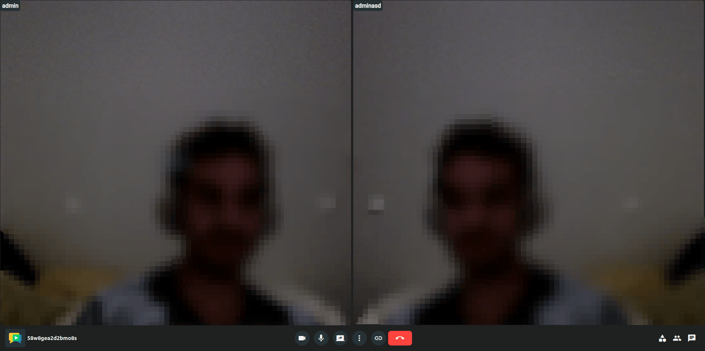

# Meeting lifecycle

Meetings consist of different views, shown to participants in sequence from the moment they open a room access link until the meeting ends.

## Lobby view

This is the first view participants see when accessing a room. It allows setting a nickname before joining the meeting. If the participant has the required permissions, they can also access the [Recording view](#recording-view) of this room from here.

## Device view

This view allows participants tuning their microphone and camera before joining the meeting, as well as setting a [virtual background](virtual-background.md).

<a class="glightbox" href="../../../../assets/videos/meet/device-view-dark.mp4" data-type="video" data-desc-position="bottom" data-gallery="gallery10"><video class="round-corners" src="../../../../assets/videos/meet/device-view-dark.mp4#only-dark" loading="lazy" defer muted playsinline autoplay loop async></video></a>
<a class="glightbox" href="../../../../assets/videos/meet/device-view-light.mp4" data-type="video" data-desc-position="bottom" data-gallery="gallery10"><video class="round-corners" src="../../../../assets/videos/meet/device-view-light.mp4#only-light" loading="lazy" defer muted playsinline autoplay loop async></video></a>

## Meeting view

The Meeting View is the central interface where all participants can see, hear, and interact with each other in real time. It features a [smart, dynamic layout](smart-layout.md) that automatically adapts to the number of active participants, ensuring an optimal viewing experience at all times.

## Recording view

This view allows to manage all recordings of the room (from the current or past meetings). Participants with the required permissions can review, play, download, and delete them, as well as share recordings via a link.

!!! info

    Recordings can also be accessed from the "Recordings" page in OpenVidu Meet. See [Managing recordings](../recordings/management.md#managing-recordings).

## End view

This view is shown to a participant when the meeting ends, at least for that participant. It informs about the specific reason why the meeting ended (a moderator ended it, the participant was kicked from the meeting, etc.).

