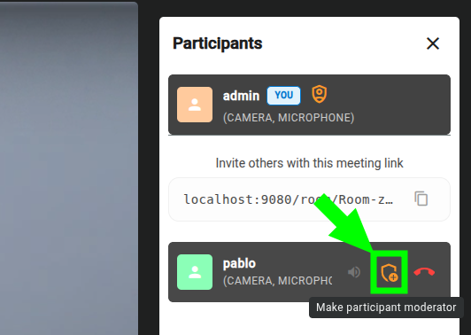

# Role Management

Participants in a meeting are assigned a role that determines their default set of permissions. The role is determined by the [room access link](../rooms/access.md#getting-room-access-links) used to join.

## Predefined roles

### Moderator

Grants full meeting permissions by default:

- **Meeting management**: end the meeting for all participants
- **Recording control** (`canRecord`): start/stop recordings, retrieve and delete recordings
- **Participant management** (`canMakeModerator`): promote other participants to moderator; (`canShareAccessLinks`): share room access links; kick participants
- **Media publishing**: publish video, audio, and share screen
- **Communication**: send chat messages, change virtual background

### Speaker

Grants basic participation permissions by default:

- **Media publishing**: publish video, audio, and share screen
- **Communication**: send chat messages, change virtual background

!!! info
    The default permissions for `Moderator` and `Speaker` roles can be customized per room when [creating](../rooms/create.md) or [editing](../rooms/edit.md) it. For the complete list of available permissions, see the [REST API :fontawesome-solid-external-link:{.external-link-icon}](../../embedded/reference/api.html#/schemas/MeetPermissions){:target="_blank"}.

## Promoting participants to moderator { #promoting-participants-to-moderator }

During an active meeting, participants with the `canMakeModerator` permission can promote or demote other participants from the **"Participants"** side panel:

When a participant is promoted to moderator:

- They receive all permissions associated with the `Moderator` role.
- The promotion applies only to the current session and does not modify their configured permissions.
- The promotion can be undone by demoting the participant back to their original role.
