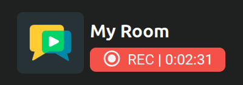
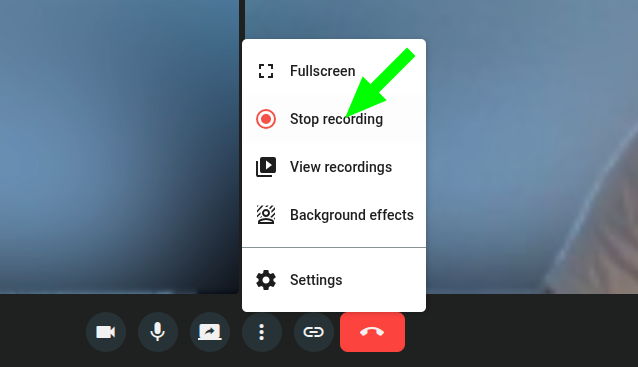
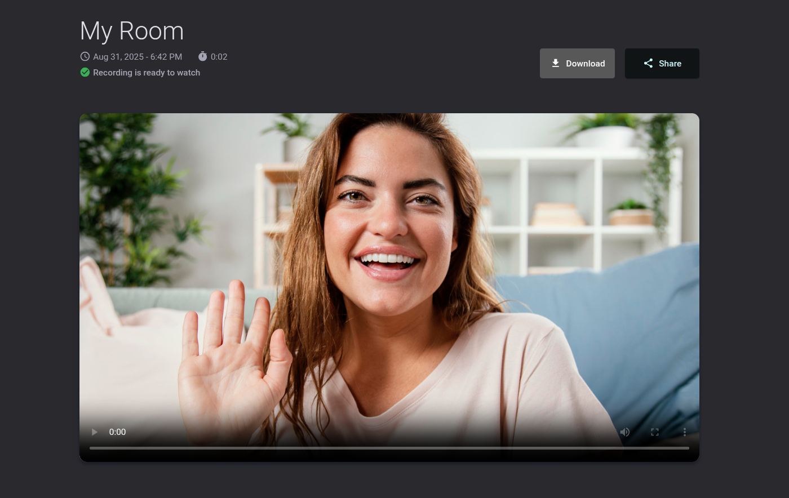
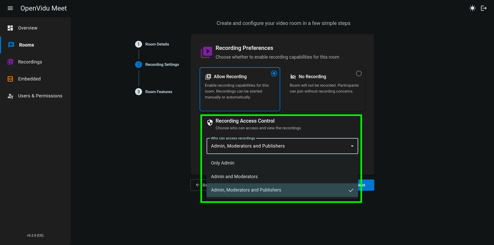
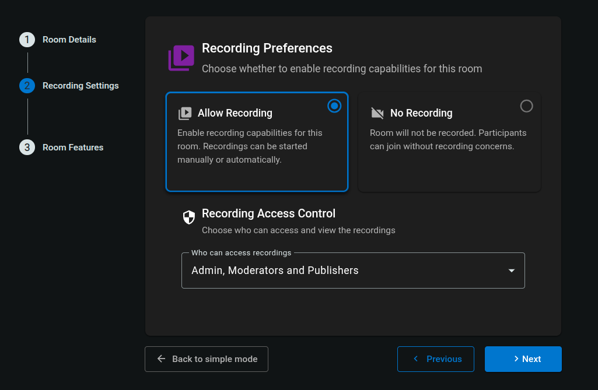
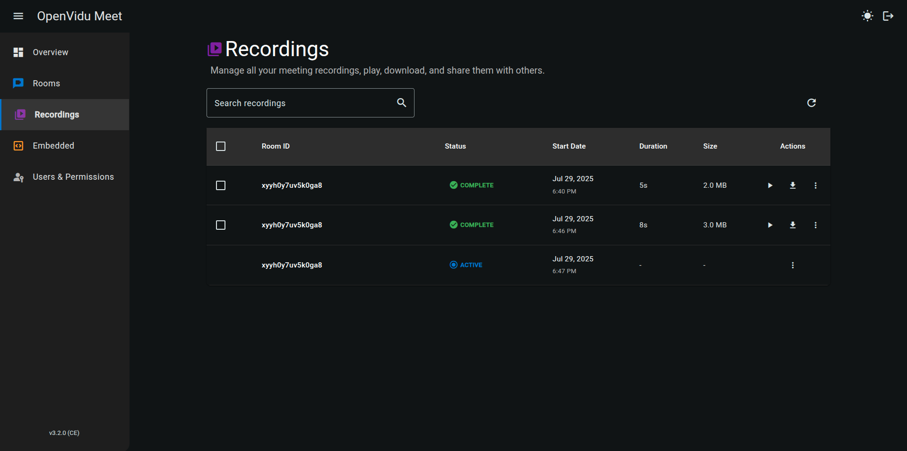

# Recordings

## Recording a meeting

Recordings must be started by a participant with role "Moderator" in the meeting view (see [Participant roles in a room](./users-and-permissions.md#participant-roles-in-a-room)).

<a class="glightbox" href="../../../assets/videos/meet/start-recording.mp4" data-type="video" data-desc-position="bottom" data-gallery="gallery1"><video class="round-corners" src="../../../assets/videos/meet/start-recording.mp4" loading="lazy" defer muted playsinline autoplay loop async></video></a>

While the recording is active, all participants in the meeting will see an indicator in the bottom left corner.

To stop the recording, a participant with role "Moderator" must simply click the "Stop recording" button. The recording will be automatically saved in the OpenVidu Meet server.

## Viewing recordings

By default recordings share the same access permissions as their rooms. Whenever a user uses a room link to join a meeting, they will also have the possibility of accessing the list of its previous recordings (if any):

The recording list shows every recording of that particular room:

Participants can also open the list of recordings for that room directly from the meeting view:

<a class="glightbox" href="../../../assets/videos/meet/recording-while-meeting.mp4" data-type="video" data-desc-position="bottom" data-gallery="gallery6"><video class="round-corners" src="../../../assets/videos/meet/recording-while-meeting.mp4" defer muted playsinline autoplay loop async></video></a>

The recording view allows playing the video, downloading it or creating a [shareable link](#sharing-recordings-via-link):

### Access permissions for recordings

When [creating a new room](./rooms-and-meetings.md#creating-a-room) you can configure who may access its recordings:

Available options are:

- **Only admin**: only administrators of OpenVidu Meet will have access to the recordings of this room. Administrators can always access recordings of any room.
- **Admin and moderators**: administrators and any participant of the meeting with "Moderator" role will have access to the recordings of this room.
- **Admin, moderators and speakers**: this is the default value. Administrators and any participant of the meeting with "Moderator" or "Speaker" role will have access to the recordings of this room.

!!! info
    Participants with role "Speaker" may only **play** recordings. Administrators and participants with role "Moderator" can also **delete** them.

### Sharing recordings via link

Specific recordings can be shared through a link:

- Users can generate a shareable link from the recording list.

    <a class="glightbox" href="../../../assets/videos/meet/share-recording-from-recording-list.mp4" data-type="video" data-desc-position="bottom" data-gallery="gallery6"><video class="round-corners" src="../../../assets/videos/meet/share-recording-from-recording-list.mp4" defer muted playsinline autoplay loop async></video></a>

- Users can generate a shareable link from the recording view.

    <a class="glightbox" href="../../../assets/videos/meet/share-recording.mp4" data-type="video" data-desc-position="bottom" data-gallery="gallery7"><video class="round-corners" src="../../../assets/videos/meet/share-recording.mp4" defer muted playsinline autoplay loop async></video></a>

- From OpenVidu Meet console it is possible to generate shareable links for any recording.

    <a class="glightbox" href="../../../assets/videos/meet/meet-recording-share-dark.mp4" data-type="video" data-desc-position="bottom" data-gallery="gallery8"><video class="round-corners" src="../../../assets/videos/meet/meet-recording-share-dark.mp4" defer muted playsinline autoplay loop async></video></a>

## Room recording settings

Rooms can be configured with different recording settings. You can setup these settings when [creating a new room](./rooms-and-meetings.md#creating-a-room) or [editing an existing room](./rooms-and-meetings.md#editing-a-room).

- **Allow Recording / No recording**: whether to allow recording the room or not.
- **Recording Access Control**: who can access the recordings of the room. See [Access permissions for viewing recordings](#access-permissions-for-viewing-recordings).

## Managing recordings

OpenVidu Meet console can be used to manage all recordings from the "Recordings" page. It is possible to see all recordings, play them, download them, delete them, and share them via a link:

## Recording REST API

Recordings can be managed via the [OpenVidu Meet REST API](../embedded/reference/rest-api.md):

| Operation | HTTP Method | Reference |
|-----------|-------------|-----------|
| Get recording | GET | [Reference :fontawesome-solid-external-link:{.external-link-icon}](../../assets/htmls/rest-api.html#/operations/getRecording){:target="_blank"} |
| Get all recordings | GET | [Reference :fontawesome-solid-external-link:{.external-link-icon}](../../assets/htmls/rest-api.html#/operations/getRecordings){:target="_blank"} |
| Delete recording | DELETE | [Reference :fontawesome-solid-external-link:{.external-link-icon}](../../assets/htmls/rest-api.html#/operations/deleteRecording){:target="_blank"} |
| Bulk delete recordings | DELETE | [Reference :fontawesome-solid-external-link:{.external-link-icon}](../../assets/htmls/rest-api.html#/operations/bulkDeleteRecordings){:target="_blank"} |
| Download recordings | GET | [Reference :fontawesome-solid-external-link:{.external-link-icon}](../../assets/htmls/rest-api.html#/operations/downloadRecordings){:target="_blank"} |
| Get recording media | GET | [Reference :fontawesome-solid-external-link:{.external-link-icon}](../../assets/htmls/rest-api.html#/operations/getRecordingMedia){:target="_blank"} |
| Get recording URL | GET | [Reference :fontawesome-solid-external-link:{.external-link-icon}](../../assets/htmls/rest-api.html#/operations/getRecordingUrl){:target="_blank"} |