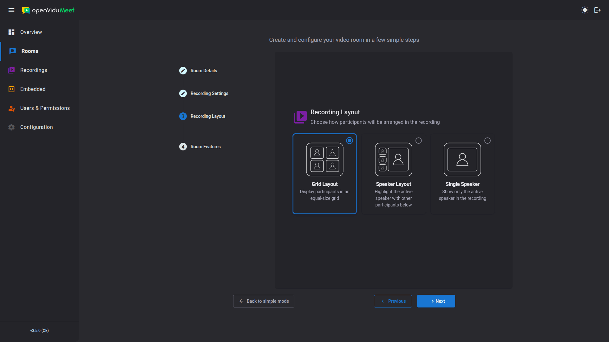

# Recording configuration

Recording behaviour is configured **per room**, when [creating or editing](../rooms/management.md#create-rooms) it. The following aspects can be configured:

- [Enabling recordings](#enabling-recordings) in the room.
- The [recording layout](#recording-layouts).
- The [recording encoding](#recording-encoding) — **only available through the REST API**.
- [Anonymous recording sharing](#anonymous-recording-sharing).

## Enabling recordings { #enabling-recordings }

Recording must be enabled in the room before any meeting in it can be recorded. It is enabled in the **Recording Settings** step of the room wizard, or with the `config.recording.enabled` property of the room configuration via the [REST API](../rooms/management.md#rest-api-reference).

!!! info
    Recording and [end-to-end encryption](../meetings/e2e-encryption.md) are mutually exclusive: a room cannot have both enabled at the same time.

## Recording layouts { #recording-layouts }

OpenVidu Meet provides multiple **recording layout options**. These layouts determine how participants appear in the meeting recording, allowing you to choose the most suitable format for presentations, webinars, or collaborative sessions.

### Available recording layouts

* **Grid layout** (`grid`)
  Displays all participants in an evenly spaced grid. This layout is ideal for team meetings, classrooms, or collaborative discussions where seeing all participants simultaneously is important.

* **Speaker layout** (`speaker`)
  Highlights the active speaker in a larger frame while showing other participants in smaller thumbnails. This layout is perfect for interactive sessions where one participant speaks at a time, keeping the focus on the main speaker.

* **Single Speaker layout** (`single-speaker`)
  Records only the active speaker, hiding all other participants. This layout is best suited for presentations, lectures, or interviews where the focus should remain entirely on the speaker.

<a class="glightbox" href="../../../../assets/images/meet/recordings/recording-layouts.png" data-type="image" data-desc-position="bottom" data-gallery="gallery8"></a>

## Recording encoding { #recording-encoding }

The **encoding** determines the resolution, frame rate, codec and bitrate of the resulting recording. You can define it in two ways:

- A **preset** — a single string covering the most common scenarios.
- A **full encoding options object** — for fine-grained control over every video and audio parameter.

!!! warning "Encoding is configured through the REST API only"
    Unlike the other recording settings, the encoding is **not** part of the room wizard in the OpenVidu Meet app. It can only be set with the `config.recording.encoding` property of the room configuration via the [REST API](../rooms/management.md#rest-api-reference).

You set it with the `config.recording.encoding` property, as either a preset string or a full options object. For example, using a preset:

```json title="Using an encoding preset"
{
  "config": {
    "recording": {
      "enabled": true,
      "layout": "grid",
      "encoding": "H264_1080P_30"
    }
  }
}
```

The available presets and the full encoding options object (all video and audio parameters) are documented in the [REST API specification :fontawesome-solid-external-link:{.external-link-icon}](../../embedded/reference/api.html#/schemas/MeetRoomConfig){:target="_blank"}.

!!! info "Overriding per recording"
    The room's default `layout` and `encoding` apply to every recording of the room, but they can be **overridden for an individual recording** when starting it via the [REST API](management.md#rest-api-reference).

## Anonymous recording sharing { #anonymous-recording-sharing }

A recording's [shareable link](management.md#sharing-recordings) can be created with one of two scopes:

- **OpenVidu Meet users**: any logged-in OpenVidu Meet user can open the recording through the link — even if they have no recording permissions in that room, or no access to the room at all.
- **Anyone**: any individual with the link can open the recording without logging in.

**Anonymous recording sharing is enabled by default**, so both scopes are available. You can disable it per room to restrict sharing to OpenVidu Meet users only — the "anyone" scope is then no longer offered. It is configured in the **Recording Settings** step of the room wizard ("Anonymous Recording Access"), or with the `access.anonymous.recording.enabled` property of the room configuration via the [REST API](../rooms/management.md#rest-api-reference).
