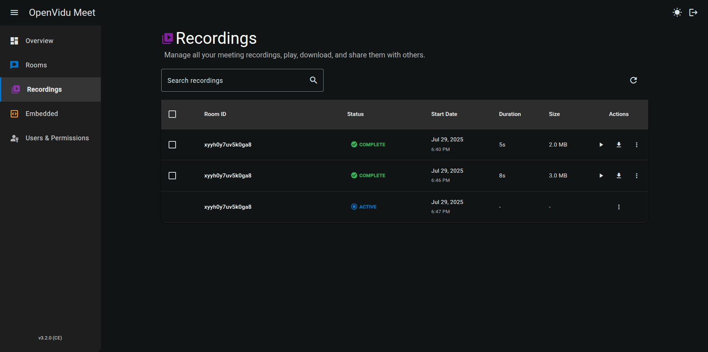
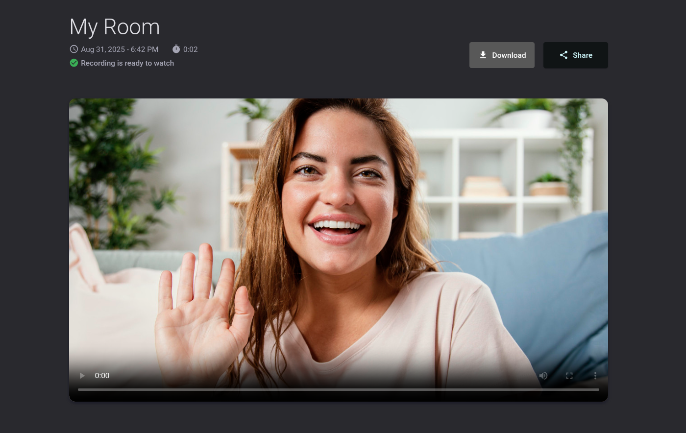
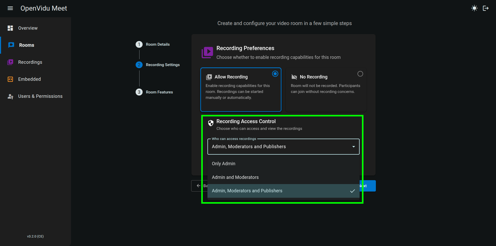

# List Recordings

OpenVidu Meet console can be used to manage all recordings from the "Recordings" page. It is possible to see all recordings, play them, download them, delete them, and share them via a link:

By default, recordings share the same access permissions as their rooms. Whenever a user uses a room link to join a meeting, they will also have the possibility of accessing the list of its previous recordings (if any):

The recording list shows every recording of that particular room:

Participants can also open the list of recordings for that room directly from the meeting view:

<a class="glightbox" href="../../../../assets/videos/meet/recording-while-meeting.mp4" data-type="video" data-desc-position="bottom" data-gallery="gallery6"><video class="round-corners" src="../../../../assets/videos/meet/recording-while-meeting.mp4" defer muted playsinline autoplay loop async></video></a>

The recording view allows playing the video, downloading it or creating a [shareable link](share-download.md):

## Access permissions for recordings

When [creating a new room](../rooms/create.md), you can define who is allowed to access and manage the recordings generated within that room. This access control system helps ensure privacy, security, and proper role-based permissions for recorded meetings.

### Available access options

* **Only admin**
  Restricts access to recordings exclusively to OpenVidu Meet administrators. This option provides the highest level of security and is ideal for sensitive meetings. Administrators always retain access to recordings from any room.

* **Admin and moderators**
  Grants recording access to administrators and participants assigned the **Moderator** role. This configuration allows trusted meeting leaders to review or manage recordings while maintaining controlled access.

* **Admin, moderators, and speakers** *(default)*
  Allows administrators, moderators, and participants with the **Speaker** role to access recordings. This default setting offers a balanced approach, promoting collaboration while still enforcing role-based permissions.

!!! info
    Participants with role "Speaker" may only **play** recordings. Administrators and participants with role "Moderator" can also **delete** them.
