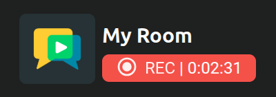
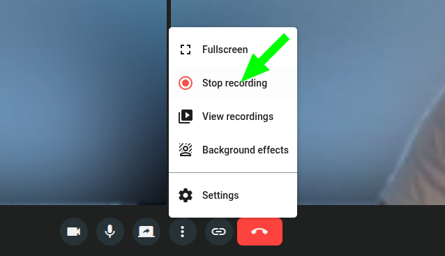

# Creation & Management

## Start / Stop recording

Recordings are started from the meeting view by a participant with the `canRecord` permission (see [Predefined roles](../rooms/access.md#predefined-roles)). The room must have recording [enabled in its configuration](configuration.md).

<a class="glightbox" href="../../../../assets/videos/meet/start-recording.mp4" data-type="video" data-desc-position="bottom" data-gallery="gallery1"><video class="round-corners" src="../../../../assets/videos/meet/start-recording.mp4" loading="lazy" defer muted playsinline autoplay loop async></video></a>

While the recording is active, all participants in the meeting will see an indicator in the bottom left corner.

To stop the recording, a participant with the `canRecord` permission must simply click the **"Stop recording"** button. The recording is then automatically saved on the OpenVidu Meet server.

!!! info "Starting and stopping recordings via REST API"
    Recordings can also be started and stopped with the [REST API](#rest-api-reference). There must be an **active meeting** in the target room — starting a recording in a room with no ongoing meeting returns an error. When starting a recording via the API, you may also **override** the room's default [layout and encoding](configuration.md#recording-layouts) for that specific recording.

## Managing recordings { #managing-recordings }

A saved recording can be **listed**, **played**, **shared**, **downloaded** and **deleted** (individually or in bulk). All of these actions are available — subject to your [recording permissions](overview.md#access-permissions-for-recordings) — from any of the places where recordings appear in the app:

- The general **"Recordings"** page, which lists every recording you can access.
- The **"Recordings"** tab of a [room's detail page](../rooms/management.md#room-details), listing that single room's recordings.
- The **room recordings view**, reachable from within a meeting (and from the lobby view before entering).
- The **single recording view**, which plays a recording and offers its download and share actions.

<a class="glightbox" href="../../../../assets/videos/meet/recording-while-meeting.mp4" data-type="video" data-desc-position="bottom" data-gallery="gallery6"><video class="round-corners" src="../../../../assets/videos/meet/recording-while-meeting.mp4" defer muted playsinline autoplay loop async></video></a>

### Sharing recordings { #sharing-recordings }

When you create a shareable link for a recording, you choose **who can open it**:

- **OpenVidu Meet users**: any logged-in OpenVidu Meet user can open the recording — even if they have no recording permissions in that room, or no access to the room at all.
- **Anyone**: any individual with the link can open it without logging in. This option is available only when the room has [anonymous recording sharing](configuration.md#anonymous-recording-sharing) enabled.

<a class="glightbox" href="../../../../assets/videos/meet/share-recording-from-recording-list.mp4" data-type="video" data-desc-position="bottom" data-gallery="gallery8"><video class="round-corners" src="../../../../assets/videos/meet/share-recording-from-recording-list.mp4" defer muted playsinline autoplay loop async></video></a>

<a class="glightbox" href="../../../../assets/videos/meet/share-recording.mp4" data-type="video" data-desc-position="bottom" data-gallery="gallery9"><video class="round-corners" src="../../../../assets/videos/meet/share-recording.mp4" defer muted playsinline autoplay loop async></video></a>

## REST API reference { #rest-api-reference }

All of these operations can also be performed programmatically with the [OpenVidu Meet REST API](../../embedded/reference/rest-api.md). See the [REST API specification :fontawesome-solid-external-link:{.external-link-icon}](../../embedded/reference/api.html){:target="_blank"} for the full list of available endpoints.

| Operation | HTTP Method | Reference |
|-----------|-------------|-----------|
| Start a recording | POST | [Reference :fontawesome-solid-external-link:{.external-link-icon}](../../embedded/reference/api.html#/operations/startRecording){:target="_blank"} |
| Stop a recording | POST | [Reference :fontawesome-solid-external-link:{.external-link-icon}](../../embedded/reference/api.html#/operations/stopRecording){:target="_blank"} |
| Get all recordings | GET | [Reference :fontawesome-solid-external-link:{.external-link-icon}](../../embedded/reference/api.html#/operations/getRecordings){:target="_blank"} |
| Download recordings | GET | [Reference :fontawesome-solid-external-link:{.external-link-icon}](../../embedded/reference/api.html#/operations/downloadRecordings){:target="_blank"} |
| Bulk delete recordings | DELETE | [Reference :fontawesome-solid-external-link:{.external-link-icon}](../../embedded/reference/api.html#/operations/bulkDeleteRecordings){:target="_blank"} |
| Get a recording | GET | [Reference :fontawesome-solid-external-link:{.external-link-icon}](../../embedded/reference/api.html#/operations/getRecording){:target="_blank"} |
| Delete a recording | DELETE | [Reference :fontawesome-solid-external-link:{.external-link-icon}](../../embedded/reference/api.html#/operations/deleteRecording){:target="_blank"} |
| Get recording media | GET | [Reference :fontawesome-solid-external-link:{.external-link-icon}](../../embedded/reference/api.html#/operations/getRecordingMedia){:target="_blank"} |
| Get recording URL | GET | [Reference :fontawesome-solid-external-link:{.external-link-icon}](../../embedded/reference/api.html#/operations/getRecordingUrl){:target="_blank"} |
