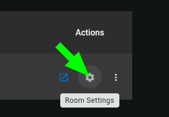
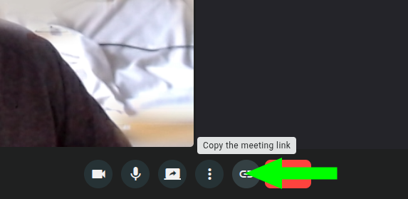

## Room vs meeting

It is important to understand these core concepts of OpenVidu Meet:

- A **room** is a persistent virtual space used to host one or more meetings. Its real-world counterpart is a physical conference room in a building: you can name it, lock it, change its appearance, etc.
- A **meeting** is a temporary session that occurs within a room, where participants can join and interact in real-time. Its real-world counterpart is a scheduled event that takes place in a specific room, where authorized people meet, talk and share information.

Rooms host meetings following these principles:

- First you create a room. Then you can host a meeting in the room.
- One room can host just one meeting at a time, but it can be reused for multiple meetings over time.
- Every room has a **room link**. A user connecting to a room link will either start a new meeting (if no meeting is currently active in the room) or join the existing meeting (if there is one).

## Rooms

### Creating a room

As an administrator, you can create a new room directly from the "Rooms" page in OpenVidu Meet.

Rooms require a name. Additionally, they can be customized with the following options by clicking on "Advanced Setup":

- Set up an [auto-deletion date](#room-auto-deletion).
- Set up recording and access control to them.
- Enable/disable features like chat or virtual backgrounds.

<a class="glightbox" href="../../../assets/videos/meet/meet-rooms-dark.mp4" data-type="video" data-desc-position="bottom" data-gallery="gallery1"><video class="round-corners" src="../../../assets/videos/meet/meet-rooms-dark.mp4#only-dark" loading="lazy" defer muted playsinline autoplay loop async></video></a>
<a class="glightbox" href="../../../assets/videos/meet/meet-rooms-light.mp4" data-type="video" data-desc-position="bottom" data-gallery="gallery1"><video class="round-corners" src="../../../assets/videos/meet/meet-rooms-light.mp4#only-light" loading="lazy" defer muted playsinline autoplay loop async></video></a>

Available rooms are all listed in the "Rooms" page. From there administrators can:

- Start a meeting in a room.
- Edit the room settings.
- Delete the room.
- Access the room's recordings.
- Share room links with different permissions (see [Users and permissions](users-and-permissions.md)).

<a class="glightbox" href="../../../assets/videos/meet/room-actions-dark.mp4" data-type="video" data-desc-position="bottom" data-gallery="gallery1"><video class="round-corners" src="../../../assets/videos/meet/room-actions-dark.mp4#only-dark" loading="lazy" defer muted playsinline autoplay loop async></video></a>
<a class="glightbox" href="../../../assets/videos/meet/room-actions-light.mp4" data-type="video" data-desc-position="bottom" data-gallery="gallery1"><video class="round-corners" src="../../../assets/videos/meet/room-actions-light.mp4#only-light" loading="lazy" defer muted playsinline autoplay loop async></video></a>

### Editing a room

You can edit the settings of an existing room at any time in the "Rooms" page. The same options available when creating a room are also available when editing it:

1. Name them.
2. Set up an [auto-deletion date](#room-auto-deletion).
3. Set up recording and access control to them.
4. Enable/disable features like chat or virtual backgrounds.

### Deleting a room

Rooms can be deleted at any time from the "Rooms" page. This will remove the room and all its associated data.

#### Room auto-deletion

Rooms can be configured with an **auto-deletion date**. You can set this date when [creating](#creating-a-room) or [editing a room](#editing-a-room). This helps keeping OpenVidu Meet clean and organized, avoiding clutter from old rooms that are no longer needed.

#### Room auto-deletion policies

When the auto-deletion date is reached, the room will be deleted. The **Auto-deletion policies** determine how to handle active meetings and stored recordings when attempting to delete the room:

- **Active meetings policy**
    - `Force`: the meeting will be immediately ended without waiting for participants to leave, and the room will be deleted.
    - `When meeting ends`: the room will be deleted after the active meeting ends.
- **Recordings policy**
    - `Force`: the room and all its recordings will be deleted.
    - `Close`: the room will be closed instead of deleted, maintaining its recordings.

### Bulk deleting rooms

Use the multi-select checkbox to delete multiple rooms at once.

<a class="glightbox" href="../../../assets/videos/meet/bulk-delete-rooms.mp4" data-type="video" data-desc-position="bottom" data-gallery="gallery6"><video class="round-corners" src="../../../assets/videos/meet/bulk-delete-rooms.mp4" loading="lazy" defer muted playsinline autoplay loop async></video></a>

### Room links

Rooms have predefined **room links** that grant access to them. Users connecting to a room link will start a new meeting (if no meeting is currently active in the room) or join the existing meeting (if there is one).

Each room has different room links, each one granting access to the room with a specific participant role. See [Participant roles in a meeting](users-and-permissions.md#participant-roles-in-a-meeting) for more information.

#### Get a room link from the "Rooms" page

Every room item allows sharing the room link for every participant role.

<a class="glightbox" href="../../../assets/videos/meet/share-room-link.mp4" data-type="video" data-desc-position="bottom" data-gallery="gallery8"><video class="round-corners" src="../../../assets/videos/meet/share-room-link.mp4" loading="lazy" defer muted playsinline autoplay loop async></video></a>

#### Get a room link from an active meeting

Participants with the `Moderator` role can share room links from the active meeting view.

!!! info
    Links copied from the meeting view will always grant access to the room with `Speaker` role. If necessary, users with role `Moderator` can upgrade other user's roles during the meeting. See [Changing participant roles during a meeting](users-and-permissions.md#changing-participant-roles-during-a-meeting) for more information.

#### Get a room link from the REST API

Available in properties `moderatorUrl` and `speakerUrl` of object [MeetRoom :fontawesome-solid-external-link:{.external-link-icon}](../../assets/htmls/rest-api.html#/schemas/MeetRoom){:target="_blank"}.

### Room visual customization

Rooms can be customized to fit your branding needs. As for now, you can setup the color scheme of your rooms from the "Configuration" page.

You can set separately the color of:

- **Main background**: background color of the meeting view.
- **Main controls**: colors for the main control buttons (mic, camera, etc.)
- **Secondary elements**: colors for logos, icons, borders and subtle details.
- **Highlights & accents**: colors for active states and highlighted items.
- **Panels & dialogs**: background color for side panels and dialog boxes.

You can also choose between a light and a dark background style, to ensure the displayed text is always readable after applying your color scheme.

### Room REST API

Every possible action against a room can be done through [OpenVidu Meet REST API](../embedded/reference/rest-api.md):

| Operation | HTTP Method | Reference |
|-----------|-------------|-----------|
| Create a room | POST | [Reference :fontawesome-solid-external-link:{.external-link-icon}](../../assets/htmls/rest-api.html#/operations/createRoom){:target="_blank"} |
| Get a room | GET | [Reference :fontawesome-solid-external-link:{.external-link-icon}](../../assets/htmls/rest-api.html#/operations/getRoom){:target="_blank"} |
| Get all rooms | GET | [Reference :fontawesome-solid-external-link:{.external-link-icon}](../../assets/htmls/rest-api.html#/operations/getRooms){:target="_blank"} |
| Delete a room | DELETE | [Reference :fontawesome-solid-external-link:{.external-link-icon}](../../assets/htmls/rest-api.html#/operations/deleteRoom){:target="_blank"} |
| Bulk delete rooms | DELETE | [Reference :fontawesome-solid-external-link:{.external-link-icon}](../../assets/htmls/rest-api.html#/operations/bulkDeleteRooms){:target="_blank"} |
| Get room preferences | GET | [Reference :fontawesome-solid-external-link:{.external-link-icon}](../../assets/htmls/rest-api.html#/operations/getRoomPreferences){:target="_blank"} |
| Update room preferences | PUT | [Reference :fontawesome-solid-external-link:{.external-link-icon}](../../assets/htmls/rest-api.html#/operations/updateRoomPreferences){:target="_blank"} |

## Meetings

### Starting a meeting

A meeting will start as soon as a participant enters an empty room using a valid **room link**. You can learn everything about room links [here](#room-links).

Users with access to OpenVidu Meet can join a meeting directly from the "Rooms" page:

<a class="glightbox" href="../../../assets/videos/meet/join-meeting.mp4" data-type="video" data-desc-position="bottom" data-gallery="gallery7"><video class="round-corners" src="../../../assets/videos/meet/join-meeting.mp4" loading="lazy" defer muted playsinline autoplay loop async></video></a>

!!! info
    Doing this simply opens a new tab with a `Moderator` room link.

Users with access to OpenVidu Meet can also copy a room link and share it with external participants:

<a class="glightbox" href="../../../assets/videos/meet/share-room-link.mp4" data-type="video" data-desc-position="bottom" data-gallery="gallery8"><video class="round-corners" src="../../../assets/videos/meet/share-room-link.mp4" loading="lazy" defer muted playsinline autoplay loop async></video></a>

### Lifecycle of a meeting

Meetings consist of different views:

#### Join view

This is the first view participants see when accessing a room link. It allows setting a nickname before joining the meeting. If the participant has the required permissions, they can also access the [Recording view](#recording-view) of this room from here.

#### Device view

This view allows participants tuning their microphone and camera before joining the meeting, as well as setting a virtual background.

<a class="glightbox" href="../../../assets/videos/meet/device-view-dark.mp4" data-type="video" data-desc-position="bottom" data-gallery="gallery10"><video class="round-corners" src="../../../assets/videos/meet/device-view-dark.mp4#only-dark" loading="lazy" defer muted playsinline autoplay loop async></video></a>
<a class="glightbox" href="../../../assets/videos/meet/device-view-light.mp4" data-type="video" data-desc-position="bottom" data-gallery="gallery10"><video class="round-corners" src="../../../assets/videos/meet/device-view-light.mp4#only-light" loading="lazy" defer muted playsinline autoplay loop async></video></a>

#### Meeting view

This is the main view of the meeting, where participants can interact with each other.

#### Recording view

This view allows to manage the recording of the meeting while it is active. Participants with the required permissions can review, play, download, delete, and share the recording via a link.

!!! info
    Recordings can also be accessed from the "Recordings" page in OpenVidu Meet, even after the meeting has ended. See [Managing recordings](./recordings.md#managing-recordings).

#### End view

This view is shown to a participant when the meeting ends, at least for that participant. It informs about the specific reason why the meeting ended (an administrator ended it, the participant was evicted from the meeting, etc.).

