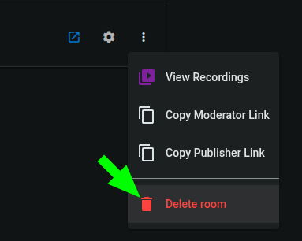
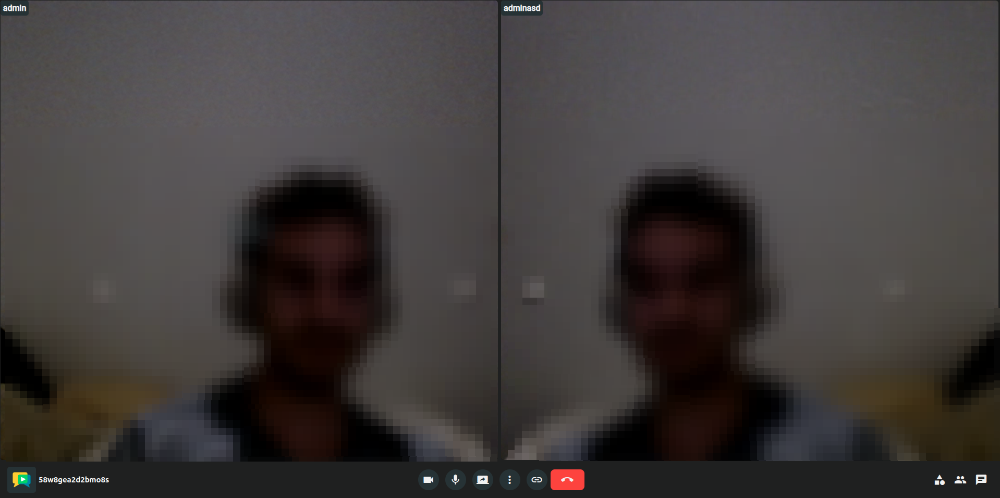

## Room vs meeting

It is important to understand these core concepts of OpenVidu Meet:

- A **room** is a persistent virtual space used to host one or more meetings. Its real-world counterpart is a physical conference room in a building: you can name it, lock it, change its appearance, etc.
- A **meeting** is a temporary session that occurs within a room, where participants can join and interact in real-time. Its real-world counterpart is a scheduled event that takes place in that room, where authorized people can join, talk, and share information.

One room can host just one meeting at a time, but it can be reused for multiple meetings over time.

## Rooms

### Creating a room

As an administrator, you can create a new room directly from the "Rooms" page in OpenVidu Meet.

<a class="glightbox" href="../../../assets/videos/meet/meet-rooms-dark.mp4" data-type="video" data-desc-position="bottom" data-gallery="gallery1"><video class="round-corners" src="../../../assets/videos/meet/meet-rooms-dark.mp4" loading="lazy" defer muted playsinline autoplay loop async></video></a>

Rooms are configurable in multiple ways:

1. Name them.
2. Set up recording.
3. Change its appearance.
4. ...

!!! info
    You can also programmatically create rooms using [OpenVidu Meet REST API](../../assets/htmls/rest-api.html#/operations/createRoom){:target="_blank"}.

Available rooms are all listed in the "Rooms" page. From there administrators can:

- Start a meeting in a room.
- Edit the room settings.
- Delete the room.
- Access the room's recordings.
- Share room links with different permissions (see [Users and permissions](users-and-permissions.md)).

<a class="glightbox" href="../../../assets/videos/meet/room-actions.mp4" data-type="video" data-desc-position="bottom" data-gallery="gallery2"><video class="round-corners" src="../../../assets/videos/meet/room-actions.mp4" loading="lazy" defer muted playsinline autoplay loop async></video></a>

#### Room auto-deletion

Rooms can be created with an **auto-deletion date**. This helps keeping OpenVidu Meet clean and organized, avoiding clutter from old rooms that are no longer needed.

!!! info
    You can set an auto-deletion date using parameter `autoDeletionDate` when creating a room programmatically through [OpenVidu Meet REST API](../../assets/htmls/rest-api.html#/operations/createRoom#request-body){:target="_blank"}.

### Editing a room

You can edit the settings of an existing room at any time in the "Rooms" page. The same options available when creating a room are also available when editing it:

1. Name them.
2. Set up recording.
3. Change its appearance.
4. ...

<a class="glightbox" href="../../../assets/images/meet/rooms-and-meetings/edit-room.png" data-type="video" data-desc-position="bottom" data-gallery="gallery4"><video class="round-corners" src="../../../assets/images/meet/rooms-and-meetings/edit-room.png" loading="lazy" defer muted playsinline autoplay loop async></video></a>

!!! info
    You can also programmatically edit rooms using [OpenVidu Meet REST API](../../assets/htmls/rest-api.html#/operations/updateRoom){:target="_blank"}.

### Deleting a room

Rooms can be deleted at any time from the "Rooms" page. This will remove the room and all its associated data.

!!! info
    You can also programmatically delete rooms using [OpenVidu Meet REST API](../../assets/htmls/rest-api.html#/operations/deleteRoom){:target="_blank"}.

### Bulk deleting rooms

Use the multi-select checkbox to delete multiple rooms at once.

<a class="glightbox" href="../../../assets/videos/meet/bulk-delete-rooms.mp4" data-type="video" data-desc-position="bottom" data-gallery="gallery6"><video class="round-corners" src="../../../assets/videos/meet/bulk-delete-rooms.mp4" loading="lazy" defer muted playsinline autoplay loop async></video></a>

!!! info
    You can also programmatically bulk delete rooms using [OpenVidu Meet REST API](../../assets/htmls/rest-api.html#/operations/bulkDeleteRooms){:target="_blank"}.

## Meetings

### Starting a meeting

A meeting will start as soon as a participant enters the room using a valid **room link**.

Administrators can join any meeting directly from the "Rooms" page in OpenVidu Meet:

<a class="glightbox" href="../../../assets/videos/meet/join-meeting.mp4" data-type="video" data-desc-position="bottom" data-gallery="gallery7"><video class="round-corners" src="../../../assets/videos/meet/join-meeting.mp4" loading="lazy" defer muted playsinline autoplay loop async></video></a>

Administrator can also copy the room link and share it with other participants. There are multiple room links, each granting different permissions to the participants (for more information, see [Participant permissions in a meeting](users-and-permissions.md#participant-permissions-in-a-meeting)):

<a class="glightbox" href="../../../assets/videos/meet/share-room-link.mp4" data-type="video" data-desc-position="bottom" data-gallery="gallery8"><video class="round-corners" src="../../../assets/videos/meet/share-room-link.mp4" loading="lazy" defer muted playsinline autoplay loop async></video></a>

### Lifecycle of a meeting

Meetings consist of different views:

#### Join view

This is the first view participants see when accessing a room link. It allows setting a nickname before joining the meeting. If the participant has the required permissions, they can also access the [Recording view](#recording-view) of this room from here.

#### Device view

This view allows participants tuning their microphone and camera before joining the meeting.

#### Meeting view

This is the main view of the meeting, where participants can interact with each other.

#### Recording view

This view allows to manage the recording of the meeting while it is active. Participants with the required permissions can review, play, download, delete, and share the recording via a link.

!!! info
    Recordings can also be accessed from the "Recordings" page in OpenVidu Meet, even after the meeting has ended. See [Managing recordings](./recordings.md#managing-recordings).

#### End view

This view is shown to a participant when the meeting ends, at least for that participant. It informs about the specific reason why the meeting ended (an administrator ended it, the participant was evicted from the meeting, etc.).

