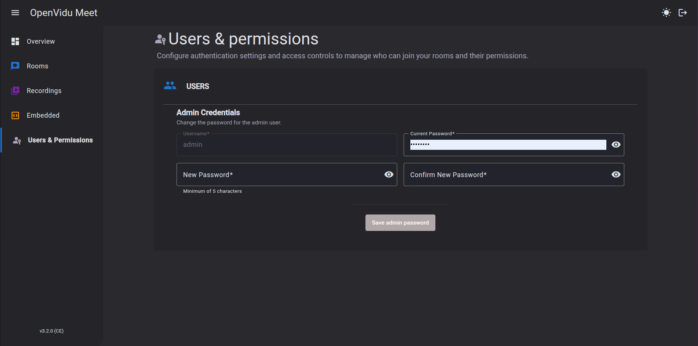

# Room Access

Access to a room is determined by two complementary mechanisms:

1. **Room access links**: URLs that grant access to the room with specific permissions.
2. **OpenVidu Meet internal users**: the console user management system, which controls who can manage rooms and recordings.

## Room access links { #getting-room-access-links }

There are two types of **room access links** that grant access to a room:

- **Anonymous access links**: Predefined URLs that allow users to access a room without identification. Permissions are tied to a specific role (`Moderator` or `Speaker`). These links can be shared freely with any user, unless anonymous access for that role has been explicitly disabled for the room.
- **Room member links**: Custom URLs associated with a specific user and their personalized permissions. For external users, each member has a unique URL that should only be delivered to them. For OpenVidu Meet internal users, the URL is the same for all members of the room, and membership is determined by their authenticated user account.

See [Room Members](#room-members) for details on creating and managing room member links.

### From the "Rooms" page

OpenVidu Meet internal users with permissions to manage rooms can share anonymous room access links for each role from the **"Rooms"** page.

<a class="glightbox" href="../../../../assets/videos/meet/share-room-link.mp4" data-type="video" data-desc-position="bottom" data-gallery="gallery8"><video class="round-corners" src="../../../../assets/videos/meet/share-room-link.mp4" loading="lazy" defer muted playsinline autoplay loop async></video></a>

### From an active meeting

Participants with the `canShareAccessLinks` permission can share room access links from the active meeting view.

<a class="glightbox" href="../../../../assets/images/meet/users-and-permissions/share-room-link.png" data-type="image" data-desc-position="bottom" data-gallery="gallery5"></a>

!!! info
    Links copied from the meeting view grant anonymous access with `Speaker` role. Participants with the `canMakeModerator` permission can promote other participants to `Moderator` during the meeting. See [Role Management](../meetings/role-management.md#promoting-participants-to-moderator) for more information.

### From the REST API

Anonymous access links are available in properties `anonymous.moderator.accessUrl` and `anonymous.speaker.accessUrl` of object [MeetRoom :fontawesome-solid-external-link:{.external-link-icon}](../../embedded/reference/api.html#/schemas/MeetRoom){:target="_blank"}.

The room owner and internal user members can access the room through the general authenticated access URL in property `accessUrl` of [MeetRoom :fontawesome-solid-external-link:{.external-link-icon}](../../embedded/reference/api.html#/schemas/MeetRoom){:target="_blank"}. For external user members, each member has their own unique access URL in property `accessUrl` of each [MeetRoomMember :fontawesome-solid-external-link:{.external-link-icon}](../../embedded/reference/api.html#/schemas/MeetRoomMember){:target="_blank"} object.

## OpenVidu Meet internal users { #openvidu-meet-internal-users }

OpenVidu Meet has an internal user management system that controls access to the OpenVidu Meet console and the ability to create and manage rooms. Internal users are identified by a `userId` and can be assigned one of three roles.

### Root administrator { #root-administrator }

The root administrator is a special user with the fixed `userId` **`admin`**. This user has full control over OpenVidu Meet and cannot be deleted. The root administrator password is set during installation:

- In **local deployments**: the password is always **`admin`**.
- In **production deployments**: the password is specified during installation (or randomly generated if not provided).

These credentials are required when accessing the OpenVidu Meet console:

<a class="glightbox" href="../../../../assets/images/meet/users-and-permissions/login-dark.png" data-type="image" data-desc-position="bottom" data-gallery="gallery1"></a>
<a class="glightbox" href="../../../../assets/images/meet/users-and-permissions/login-light.png" data-type="image" data-desc-position="bottom" data-gallery="gallery1"></a>

The location of the initial administrator password depends on the deployment environment:

=== "Local (Demo)"

    Credentials are always username **`admin`** and password **`admin`**.

=== "On Premises"

    Credentials will be logged at the end of the installation process:

    ```
    OpenVidu Meet is available at:

        URL: https://<YOUR_DOMAIN>
        Credentials:
          - User: admin
          - Password: XXXXXXX
    ```

    !!! warning
        If you [modify the administrator password](#changing-credentials), this value will no longer be valid.

=== "AWS"

    In the Secrets Manager of the CloudFormation stack, in secret **`MEET_INITIAL_ADMIN_PASSWORD`**

    !!! warning
        If you [modify the administrator password](#changing-credentials), this value will no longer be valid.

=== "Azure"

    In the Azure Key Vault, in secret **`MEET_INITIAL_ADMIN_PASSWORD`**

    !!! warning
        If you [modify the administrator password](#changing-credentials), this value will no longer be valid.

### Internal user roles

Internal users can have one of the following roles:

| Role | Description | Permissions |
|------|-------------|-------------|
| **admin** | Administrator | Full control over OpenVidu Meet, including user management, room creation and management for all rooms, and system configuration |
| **user** | Regular user | Can create and manage their own rooms, assign room members, and configure room settings |
| **room_member** | Room member only | Can only access rooms where they have been explicitly added as a member; cannot create or manage rooms |

### Managing internal users

Internal users with the **admin** role can manage other internal users from the OpenVidu Meet console in the **"Users & Permissions"** view. From there, administrators can:

- **Create new users**: Add new internal users with a `userId`, name, password, and role.
- **Delete users**: Remove internal users from the system.

!!! info
    The root administrator (**`admin`**) cannot be deleted, but its password can be changed.

### Changing credentials { #changing-credentials }

User credentials can be modified from the **"Users & Permissions"** view:

<a class="glightbox" href="../../../../assets/images/meet/users-and-permissions/change-authentication.png" data-type="image" data-desc-position="bottom" data-gallery="gallery2"></a>

## Room members { #room-members }

Room members are specific individuals (internal users or external users) with personalized access to a room. There are two ways users can access a room: as **anonymous users** using anonymous room access links, or as **explicit room members** with customized permissions.

### Anonymous access vs. explicit room members

| Access Type | How it works | Use case |
|-------------|--------------|----------|
| **Anonymous access** | Any user can access by using the predefined anonymous `Moderator` or `Speaker` room access links. Users are assigned standard role permissions. Anonymous access can be enabled or disabled per role when creating or updating a room. | Quick meetings, public rooms, or scenarios where you don't need to track specific individuals. |
| **Explicit room members** | Specific individuals are added as room members with personalized URLs and custom permissions. Each member has a fixed name and tailored access. | Controlled access, pre-defined names, custom permissions, and the ability to revoke access for specific individuals. |

### Internal users vs. external users

When creating a room member, you can designate them as either an **internal user** (someone with an OpenVidu Meet `userId`) or an **external user** (someone without an OpenVidu Meet account):

| Aspect | Internal users | External users |
|--------|----------------|----------------|
| **Identification** | Identified by their OpenVidu Meet `userId` | Identified by a generated `ext-XXX` ID |
| **Access URL** | All internal user room members share the same access URL for the room. They are identified through authentication. | Each external user receives a unique access URL that must not be shared |
| **Authentication** | Must authenticate with their OpenVidu Meet credentials when accessing the room | No authentication required; access is granted via the unique URL |
| **Use case** | For team members, employees, or regular collaborators with OpenVidu Meet accounts | For guests, clients, or one-time participants without OpenVidu Meet accounts |

### Creating room members

Room members can be created via the [REST API :fontawesome-solid-external-link:{.external-link-icon}](../../embedded/reference/api.html#/operations/addRoomMember){:target="_blank"}. When creating a member, you specify:

- **User type**: Whether the member is an internal user (provide `userId`) or an external user (provide `name`).
- **Base role**: Either `moderator` or `speaker`, which defines the initial set of permissions.
- **Custom permissions**: Optional overrides to grant or restrict specific capabilities beyond the base role.

The API returns a member object containing:

- **Member ID**: The unique identifier for this room member.
- **Name**: The fixed name that will be displayed in the meeting.
- **Access URL**: The URL to access the room (shared for internal users, unique for external users).
- **Permissions**: The final set of permissions assigned to the member.

### Managing room members

Room members can be managed through the REST API:

- **List all members**: [GET /rooms/:roomId/members :fontawesome-solid-external-link:{.external-link-icon}](../../embedded/reference/api.html#/operations/getRoomMembers){:target="_blank"}
- **Retrieve member information**: [GET /rooms/:roomId/members/:memberId :fontawesome-solid-external-link:{.external-link-icon}](../../embedded/reference/api.html#/operations/getRoomMember){:target="_blank"}
- **Update member permissions**: [PATCH /rooms/:roomId/members/:memberId :fontawesome-solid-external-link:{.external-link-icon}](../../embedded/reference/api.html#/operations/updateRoomMember){:target="_blank"}
- **Delete a member**: [DELETE /rooms/:roomId/members/:memberId :fontawesome-solid-external-link:{.external-link-icon}](../../embedded/reference/api.html#/operations/deleteRoomMember){:target="_blank"}

!!! warning
    When a room member is deleted, their access is immediately revoked. If they are currently in an active meeting, they will be expelled from it.
