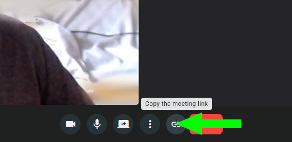

# Room Access

Every individual who joins a room does so as a **room member**, and becomes a **participant** of the meeting taking place in it. There are three kinds of room member — **users**, **identified guests** and **anonymous guests** — described in detail in the [Room Members](../room-members/overview.md) feature.

This page explains the **access links** each kind of member uses to reach a room, and the **predefined roles** that determine their permissions inside the meeting.

## Anonymous guest access { #anonymous-access }

Anonymous guests join through **shared access links** that require no OpenVidu Meet account. There is one link per role:

- The **`Moderator`** link grants the moderator role.
- The **`Speaker`** link grants the speaker role.

These links can be shared freely with anyone, unless anonymous access for that role has been disabled for the room. You can enable or disable anonymous access per role when [creating](management.md#create-rooms) or [editing](management.md#edit-rooms) a room. Before entering the meeting, each anonymous guest is asked to **provide a name**.

### Sharing the anonymous links

#### From the "Rooms" page

Users with permission to manage a room or share access links can copy and share the anonymous access link for each role from the **"Rooms"** page.

<a class="glightbox" href="../../../../assets/videos/meet/share-room-link.mp4" data-type="video" data-desc-position="bottom" data-gallery="gallery8"><video class="round-corners" src="../../../../assets/videos/meet/share-room-link.mp4" loading="lazy" defer muted playsinline autoplay loop async></video></a>

#### From an active meeting

Participants with the `canShareAccessLinks` permission can share the room access link from the active meeting view.

!!! info

    Links copied from the meeting view grant anonymous access with `Speaker` role. Participants with the `canMakeModerator` permission can promote others to `Moderator` during the meeting. See [Role Management](../meetings/role-management.md#promoting-participants-to-moderator).

#### From the REST API

The anonymous access links are available in the properties `access.anonymous.moderator.url` and `access.anonymous.speaker.url` of the [MeetRoom :fontawesome-solid-external-link:{.external-link-icon}](../../embedded/reference/api.html#/schemas/MeetRoom){:target="\_blank"} object.

## User and identified guest access { #member-access-links }

Unlike anonymous guests, **users** and **identified guests** are explicitly added to the room as members — from the **"Room Members"** tab or the [Room Members REST API](../room-members/management.md#rest-api-reference). They reach the room through different links:

- **Users** all access the room through the same **user access link** (property `access.user.url` of [MeetRoom :fontawesome-solid-external-link:{.external-link-icon}](../../embedded/reference/api.html#/schemas/MeetRoom){:target="\_blank"}). <!-- TODO(api-name): `access.user.url` inferred (was `access.registered.url`); confirm against the updated spec --> They must **log in** with their OpenVidu Meet credentials, which is how they are identified.
- **Identified guests** each receive a **unique personal access link** (property `accessUrl` of their member object) that grants access with **no login** and should be delivered privately to that person.

In addition to explicitly added users, two rules always apply:

- **Admins** and the **room owner** always have access to the room, with all permissions granted.
- If a room is configured to be **accessible to all users**, any user can join — even without being an explicit member — with `Speaker` permissions.

See the [Room Members](../room-members/overview.md) feature to add and manage users and identified guests, and the [Users](../users/overview.md) feature to manage the accounts themselves.

## Predefined roles { #predefined-roles }

Every participant joins a meeting with a role that determines their default set of permissions. The role comes from the link used (for anonymous guests) or the base role assigned to the member (for users and identified guests).

### Moderator

Grants full meeting permissions by default:

- **Meeting management**: end the meeting for all participants .
- **Recording control**: start/stop, retrieve and delete recordings.
- **Participant management**: promote other participants to moderator, share room access links, and kick participants.
- **Media publishing**: publish video, audio, and share screen.
- **Communication**: send chat messages, change virtual background.

### Speaker

Grants basic participation permissions by default:

- **Recording access**: retrieve (list, play and download) the room's recordings — but not start, stop or delete them.
- **Media publishing**: publish video, audio, and share screen.
- **Communication**: send chat messages, change virtual background.

!!! info

    The default permissions for `Moderator` and `Speaker` can be customized per room when [creating](management.md#create-rooms) or [editing](management.md#edit-rooms) it, and per member through custom permissions. For the complete list of available permissions, see the [MeetPermissions :fontawesome-solid-external-link:{.external-link-icon}](../../embedded/reference/api.html#/schemas/MeetPermissions){:target="\_blank"} schema.
