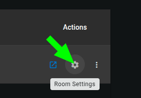
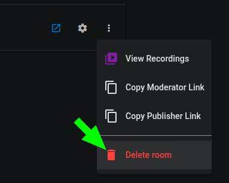

# Creation & Management

Users with permissions to create and manage rooms (admins and room managers) can create, configure, browse and delete rooms from the **"Rooms"** page of the OpenVidu Meet app. Every operation described below can also be performed through the [REST API](#rest-api-reference).

## Create a room { #create-rooms }

Create a new room from the **"Rooms"** page with the **"Create Room"** button. There are two ways to create it:

- **Basic creation**: just give the room a name and create it immediately with default settings.
- **Advanced creation**: open the configuration **wizard** to fine-tune the room before creating it.

<a class="glightbox" href="../../../../assets/videos/meet/meet-rooms-dark.mp4" data-type="video" data-desc-position="bottom" data-gallery="gallery1"><video class="round-corners" src="../../../../assets/videos/meet/meet-rooms-dark.mp4#only-dark" loading="lazy" defer muted playsinline autoplay loop async></video></a>
<a class="glightbox" href="../../../../assets/videos/meet/meet-rooms-light.mp4" data-type="video" data-desc-position="bottom" data-gallery="gallery1"><video class="round-corners" src="../../../../assets/videos/meet/meet-rooms-light.mp4#only-light" loading="lazy" defer muted playsinline autoplay loop async></video></a>

The advanced wizard guides you through the following steps:

| Step                   | What you configure                                                                                                                                                                                           |
| ---------------------- | ------------------------------------------------------------------------------------------------------------------------------------------------------------------------------------------------------------ |
| **Room Details**       | The room **name** and an optional [auto-deletion date](#room-auto-deletion).                                                                                                                                 |
| **Room Features**      | Toggle in-meeting features: **End-to-End Encryption**, **Captions**, **Chat** and **Virtual Backgrounds**.                                                                                                   |
| **Room Access**        | Enable/disable **anonymous** access per role (Moderator / Speaker), allow **all users** to join, and customize the default permissions of the `Moderator` and `Speaker` [roles](access.md#predefined-roles). |
| **Recording Settings** | Enable recording and choose whether to enable anonymous access to individual recordings.                                                                                                                     |
| **Recording Layout**   | The visual [layout](../recordings/configuration.md#recording-layouts) of the recordings.                                                                                                                     |

!!! info

    Learn more about access control and the predefined roles in [Room Access](access.md), and about who can create and manage rooms in the [Users](../users/overview.md) feature.

## Edit a room { #edit-rooms }

Reopen the configuration wizard for an existing room from the **"Rooms"** page or the [room details page](#room-details) to change its **features**, **access** settings and **recording** options, as long as no meeting is currently active.

!!! info

    The **room name** and **auto-deletion settings** cannot be modified after a room is created. To change them, delete the room and create a new one with the desired configuration.

## Room status { #room-status }

Every room has a status that controls whether it can host meetings:

- **Open**: the room is available; opening one of its [access links](access.md) starts a new meeting or joins the ongoing one.
- **Active meeting**: a meeting is currently in progress in the room.
- **Closed**: the room no longer accepts new meetings, but it is kept (along with its recordings).

Managers can **close** or **reopen** a room at any time from the **"Rooms"** page or the [room details page](#room-details).

## List & filter rooms { #list-rooms }

The **"Rooms"** page lists every room available to you, with its owner, status, creation date and auto-deletion date. From here you can:

- **Search and filter** rooms by name, status, owner, membership or whether they are open to all OpenVidu Meet users.
- **Start or join** a meeting in a room.
- Open the [room details page](#room-details).
- [Edit a room](#edit-rooms) (if no meeting is active) or [change its status](#room-status).
- [Delete rooms](#delete-rooms) individually or in bulk.
- Share [room access links](access.md).

## Room details { #room-details }

Clicking a room opens its **details page**, which shows the room information and lets managers **Join**, **Share** the access links, **Edit**, **close/reopen** or **Delete** the room. It also organizes the room's content in two tabs:

- **Recordings**: the [recordings](../recordings/overview.md) generated in this room, with play, download, share and delete actions (subject to the recording [access permissions](../recordings/overview.md#access-permissions-for-recordings)).
- **Room Members**: the [users and identified guests](../room-members/overview.md) explicitly added to the room. See [Room Members › Creation & Management](../room-members/management.md).

## Delete rooms { #delete-rooms }

Rooms can be deleted individually or in bulk from the **"Rooms"** page. Deleting a room removes it and all associated data (meetings, members and recordings).

!!! warning

    If the room has an **active meeting** or associated **recordings**, the deletion will not proceed immediately. Instead, a dialog will ask you to choose a **deletion policy** to specify how OpenVidu Meet should handle these:
    
    - For active meetings: whether to force-end the meeting and delete the room, or wait for the meeting to naturally end.
    - For recordings: whether to delete them along with the room, or close the room instead (keeping the recordings).

    If you cancel the policy dialog, the deletion is cancelled.

### Room auto-deletion

Rooms can be configured with an **auto-deletion date**. You can set this date when [creating a room](#create-rooms). This helps keeping OpenVidu Meet clean and organized, avoiding clutter from old rooms that are no longer needed.

### Room auto-deletion policies

When the auto-deletion date is reached, the room will be deleted. The **Auto-deletion policies** determine how to handle active meetings and stored recordings when attempting to delete the room:

- **Active meetings policy**
    - `Force`: the meeting will be immediately ended without waiting for participants to leave, and the room will be deleted.
    - `When meeting ends`: the room will be deleted after the active meeting ends.
- **Recordings policy**
    - `Force`: the room and all its recordings will be deleted.
    - `Close`: the room will be closed (no more meetings will be allowed in it) instead of deleted, maintaining its recordings.

!!! info

    The same policies apply when **manually deleting** rooms that have active meetings or recordings.

## Room Appearance { #room-appearance }

The visual appearance of your rooms (the color scheme of the meeting view) is configured **globally** for the whole app from the **"Configuration"** page of the OpenVidu Meet app — not per room. The color scheme you set there applies to every room.

You can set separately the color of:

- **Main background**: background color of the meeting view.
- **Main controls**: colors for the main control buttons (mic, camera, etc.)
- **Secondary elements**: colors for logos, icons, borders and subtle details.
- **Highlights & accents**: colors for active states and highlighted items.
- **Panels & dialogs**: background color for side panels and dialog boxes.

You can also choose between a `light` and a `dark` background style, to ensure the displayed text is always readable after applying your color scheme.

## REST API reference { #rest-api-reference }

All of these operations can also be performed programmatically with the [OpenVidu Meet REST API](../../embedded/reference/rest-api.md). See the [REST API specification :fontawesome-solid-external-link:{.external-link-icon}](../../embedded/reference/api.html){:target="\_blank"} for the full list of available endpoints.

| Operation                           | HTTP Method | Reference                                                                                                                                             |
| ----------------------------------- | ----------- | ----------------------------------------------------------------------------------------------------------------------------------------------------- |
| Create a room                       | POST        | [Reference :fontawesome-solid-external-link:{.external-link-icon}](../../embedded/reference/api.html#/operations/createRoom){:target="\_blank"}       |
| List rooms                          | GET         | [Reference :fontawesome-solid-external-link:{.external-link-icon}](../../embedded/reference/api.html#/operations/getRooms){:target="\_blank"}         |
| Bulk delete rooms                   | DELETE      | [Reference :fontawesome-solid-external-link:{.external-link-icon}](../../embedded/reference/api.html#/operations/bulkDeleteRooms){:target="\_blank"}  |
| Get a room                          | GET         | [Reference :fontawesome-solid-external-link:{.external-link-icon}](../../embedded/reference/api.html#/operations/getRoom){:target="\_blank"}          |
| Delete a room                       | DELETE      | [Reference :fontawesome-solid-external-link:{.external-link-icon}](../../embedded/reference/api.html#/operations/deleteRoom){:target="\_blank"}       |
| Get room config                     | GET         | [Reference :fontawesome-solid-external-link:{.external-link-icon}](../../embedded/reference/api.html#/operations/getRoomConfig){:target="\_blank"}    |
| Update room config                  | PUT         | [Reference :fontawesome-solid-external-link:{.external-link-icon}](../../embedded/reference/api.html#/operations/updateRoomConfig){:target="\_blank"} |
| Update roles permissions for a room | PUT         | [Reference :fontawesome-solid-external-link:{.external-link-icon}](../../embedded/reference/api.html#/operations/updateRoomRoles){:target="\_blank"}  |
| Update room access config           | PUT         | [Reference :fontawesome-solid-external-link:{.external-link-icon}](../../embedded/reference/api.html#/operations/updateRoomAccess){:target="\_blank"} |
| Update room status                  | PUT         | [Reference :fontawesome-solid-external-link:{.external-link-icon}](../../embedded/reference/api.html#/operations/updateRoomStatus){:target="\_blank"} |
