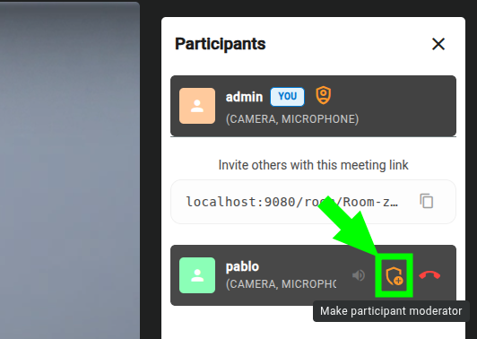
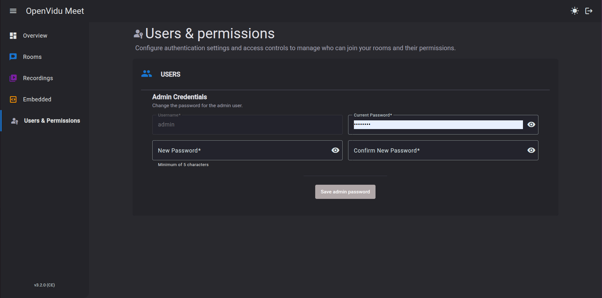
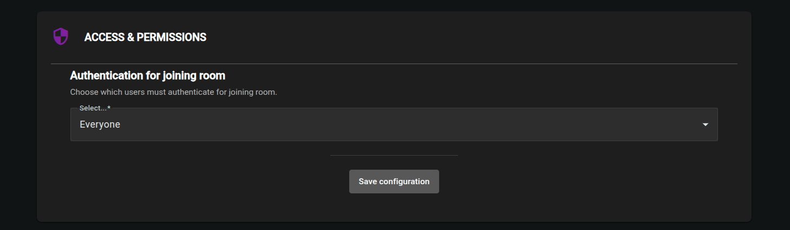

# Users and permissions

## Participant roles in a room

Participants in a room can have different roles, which grant different permissions. The role of a participant is determined by the room link used to join. See [Room links](./rooms-and-meetings.md#room-links) for more information.

Available roles are:

- **Moderator**: grants permissions to end the meeting, start/stop recordings, share room links and manage participants. Also grants permissions of `Speaker` role.
- **Speaker**: grants permissions to share their camera, microphone and screen.

### Changing participant roles during a meeting

Participants with `Moderator` role can upgrade or downgrade other participants' roles during the meeting from the "Participants" side panel:

<a class="glightbox" href="../../../assets/images/meet/users-and-permissions/upgrade-role.png" data-type="image" data-desc-position="bottom" data-gallery="gallery5"></a>

## OpenVidu Meet authentication

OpenVidu Meet is by default protected with an administrator **username and password**. These credentials will be required when accessing OpenVidu Meet console:

<a class="glightbox" href="../../../assets/images/meet/users-and-permissions/login-dark.png" data-type="image" data-desc-position="bottom" data-gallery="gallery1"></a>
<a class="glightbox" href="../../../assets/images/meet/users-and-permissions/login-light.png" data-type="image" data-desc-position="bottom" data-gallery="gallery1"></a>

The initial administrator credentials are:

- **Username**: **`admin`**
- **Password**: specified on installation time

The value of the password will be asked on installation. If left empty, a random password will be generated.
The location of the administration password depends on the environment of the deployment:

=== "Local (Demo)"

    Credentials are always username **`admin`** and password **`admin`**.

=== "On Premises"

    Credentials will be logged at the end of the installation process:

    ```
    OpenVidu Meet is available at:

        URL: https://<YOUR_DOMAIN>
        Credentials:
          - User: admin
          - Password: XXXXXXX
    ```

    !!! warning
        If you [modify the initial administrator password](#modify-openvidu-meet-authentication), this value will no longer be valid.

=== "AWS"

    In the Secrets Manager of the CloudFormation stack, in secret **`MEET_INITIAL_ADMIN_PASSWORD`**

    !!! warning
        If you [modify the initial administrator password](#modify-openvidu-meet-authentication), this value will no longer be valid.

=== "Azure"

    In the Azure Key Vault, in secret **`MEET_INITIAL_ADMIN_PASSWORD`**

    !!! warning
        If you [modify the initial administrator password](#modify-openvidu-meet-authentication), this value will no longer be valid.

### Modify OpenVidu Meet authentication

Administrator credentials can be modified from the **"User & Permissions"** view:

<a class="glightbox" href="../../../assets/images/meet/users-and-permissions/change-authentication.png" data-type="image" data-desc-position="bottom" data-gallery="gallery2"></a>

<!--## User authentication when joining a meeting

Meetings are always accessed through a **room link**. Room links are unique URLs with random segments difficult to decipher, ensuring a first layer of security: only users that know the link can access the meeting.

!!! info 
    Learn how to obtain room links to be shared here: [Room links](./rooms-and-meetings.md#room-links).

Room links provide a reasonable level of security, but it might not be enough for certain use cases. For this  reason, further authentication can be enforced for users trying to join a meeting using a valid room link. From the **"User & Permissions"** page in OpenVidu Meet, you can configure it:

- **Nobody**: no authentication is required. Anyone with a valid room link can join the meeting.
- **Only moderators**: users joining the meeting through a `Moderator` room link with must authenticate first.
- **Everybody**: all users joining the meeting must authenticate first.

<a class="glightbox" href="../../../assets/images/meet/users-and-permissions/authentication-to-join-meeting.png" data-type="image" data-desc-position="bottom" data-gallery="gallery5"></a>

!!! info
    The only authentication method currently available to enforce when joining a meeting is the OpenVidu Meet **username and password**. Other authentication methods are on the way, including multi-user credentials and OAuth.

-->